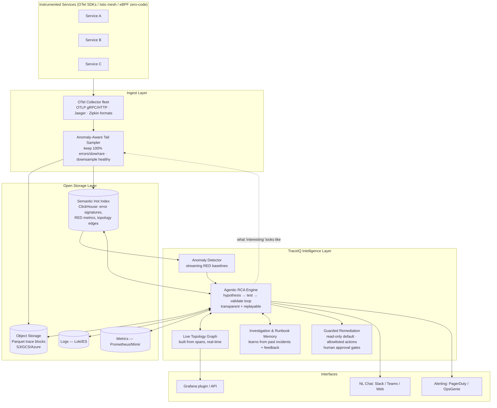

# Product Requirements Document — TraceIQ: An AI-Native Tracing Agent/Bot

**Author:** shakrath@gmail.com
**Date:** 2026-08-31
**Status:** Draft v1.0
**Working name:** TraceIQ (Tracing Bot)

---

## Introduction

Distributed tracing is the richest signal for diagnosing failures in microservice systems, yet in 2026 it remains the least automated pillar of observability. Research across current tool rankings and practitioner reports shows a consistent pattern: open-source tracing tools (Jaeger, Zipkin, Grafana Tempo) collect and display traces well but stop there — no alerting, no root-cause analysis (RCA), no natural-language access. Commercial platforms (Datadog APM, Dynatrace) automate analysis with AI, but at high and unpredictable cost, behind proprietary lock-in, and with sampling/retention limits that can discard the very traces needed during an incident.

**TraceIQ** is an AI-native tracing agent that closes this gap. It is an OpenTelemetry-native bot that sits on top of an open, cost-efficient trace store, and does what engineers currently do manually: watch traces continuously, detect anomalies, run evidence-grounded root-cause investigations, correlate traces with logs and metrics, answer questions in natural language, and propose (with human approval) safe remediations. It brings Dynatrace-class RCA and Datadog-class agentic investigation to the open-source stack — without the bill shock or lock-in.

This PRD summarizes the competitive research, identifies the feature gaps per tool, and specifies the high-level and low-level architecture of TraceIQ.

---

## List of Tools Compared

Five tools appear most consistently at the top of 2025–2026 distributed-tracing rankings (SigNoz, Dash0, Middleware, Sematext, Uptrace, OpenObserve comparisons):

| # | Tool | Type | Maintainer | Core Principle |
|---|------|------|-----------|----------------|
| 1 | **Jaeger** (v2) | Open source | CNCF community (originated at Uber) | All-in on OpenTelemetry — Jaeger v2 is literally a distribution of the OTel Collector with Jaeger storage/query on top. Head/remote/adaptive sampling; stores what it receives. New native ClickHouse backend (v2.18, 2026). |
| 2 | **Zipkin** | Open source | OpenZipkin community (originated at Twitter, based on Google Dapper) | Simplicity and self-containment: one Java binary = collector + API + UI. Battle-tested but low development velocity; now considered lightweight/legacy. OTel deprecated its Zipkin exporters in Dec 2025. |
| 3 | **Grafana Tempo** (3.0) | Open source (AGPLv3) | Grafana Labs | "Store everything, cheaply" — no sampling, no index; traces as Parquet blocks on commodity object storage (S3/GCS/Azure). Analysis via TraceQL; deep LGTM-stack (Loki/Grafana/Tempo/Mimir) integration. |
| 4 | **Datadog APM** | Commercial SaaS | Datadog, Inc. | Unified observability platform: one agent, 20+ tightly integrated products sharing tags, correlating traces/logs/metrics/RUM/profiles. Agentic AI via Watchdog + Bits AI SRE (GA Dec 2025). |
| 5 | **Dynatrace** | Commercial SaaS | Dynatrace, Inc. | AI-first "answers, not dashboards": OneAgent auto-discovery, Smartscape live topology, PurePath code-level traces, Davis deterministic causal RCA engine + Davis CoPilot/Assist generative layer on the Grail lakehouse. |

*Note: SigNoz, New Relic, and Honeycomb also appear frequently in rankings; SigNoz is the rising OSS unified alternative. The five above were selected as the consensus representatives of the OSS-tracing, OSS-scale, and commercial-AI segments.*

### Product feature summary

| Feature | Jaeger | Zipkin | Tempo | Datadog APM | Dynatrace |
|---|---|---|---|---|---|
| OTel-native ingest | ✅ (is an OTel Collector) | ✅ (OTLP added 2025) | ✅ OTLP-first | ✅ (converted internally) | ✅ (PurePath 4) |
| Sampling strategy | Head + remote + adaptive (+tail via OTel) | Client head-based only | None — store 100% | Head + retention filters | Near-lossless, adaptive at high volume |
| Storage | Cassandra/ES/ClickHouse/Badger | In-memory/Cassandra/ES/MySQL | Object storage (Parquet) | SaaS (15-min live / 15-day indexed) | Grail lakehouse (metered) |
| Trace query language | Search filters only | Search filters only | TraceQL (+ metrics GA 3.0) | Proprietary UI/queries | DQL |
| Service dependency graph | ✅ built-in | ⚠️ separate Spark batch job | ✅ via metrics-generator + Grafana | ✅ Service Map | ✅ Smartscape (real-time topology) |
| Built-in alerting | ❌ | ❌ | ❌ (via Prometheus/Grafana) | ✅ monitors/SLOs/on-call | ✅ Davis "Problems" |
| Automated RCA | ❌ (trace diff only) | ❌ | ❌ | ✅ Watchdog + Bits AI SRE | ✅ Davis causal engine |
| AI / NL interface | ❌ | ❌ | ⚠️ MCP server + LLM API (hooks only) | ✅ Bits AI agents | ✅ Davis CoPilot / Assist |
| Log/metric correlation | ❌ (traces only) | ❌ | ✅ across LGTM stack | ✅ unified tagging | ✅ via Grail + Smartscape |
| Auto-remediation | ❌ | ❌ | ❌ | ⚠️ auto-rollback workflows | ⚠️ AutomationEngine |
| Cost profile | Self-hosted infra ops | Self-hosted infra ops | Object storage (cheap) + query compute | $31–40/host/mo + span/log overages | ~$58/host/mo DPS, ingest+retain+query metered |

---

## Gap/Feature Analysis

Per-tool: the feature where it lags, and exactly how TraceIQ improves it.

### 1. Jaeger

| Lagging Feature | Evidence | How TraceIQ Makes It Better |
|---|---|---|
| **No built-in alerting or anomaly detection** | Cited as Jaeger's top gap in every comparison; alerting must be delegated to Prometheus/Grafana on spanmetrics. | TraceIQ continuously watches span streams and RED metrics it derives itself, raises anomaly-scored alerts natively, and opens an automated investigation for each alert instead of just paging a human. |
| **No automated RCA — manual trace diff only** | Jaeger offers trace comparison and critical-path highlighting; engineers still eyeball waterfalls. | TraceIQ runs an LLM-driven hypothesis loop (form hypothesis → test against real spans/logs/metrics → validate or discard) and delivers a ranked root-cause report with cited trace evidence. |
| **Traces-only; no log/metric correlation in product** | Jaeger v2 stores/queries traces; logs and metrics live elsewhere. | TraceIQ auto-joins traces to logs (trace_id injection) and metrics (exemplars) at investigation time, presenting one correlated evidence bundle. |
| **Sampling blind spots** | Head-based sampling can discard the anomalous trace you need; tail sampling via OTel Collector is operationally tricky (all spans of a trace must hit one collector). | TraceIQ ships an anomaly-aware tail-sampling tier: 100% of error/slow/rare-path traces retained, healthy traffic aggressively downsampled — managed automatically, no hand-tuned collector pipelines. |

### 2. Zipkin

| Lagging Feature | Evidence | How TraceIQ Makes It Better |
|---|---|---|
| **Feature-frozen / maintenance mode** | Volunteer-maintained, low velocity; OTel deprecated Zipkin exporters (Dec 2025); framed as "lightweight/legacy" in 2026 rankings. | TraceIQ is OTel-first by design (OTLP is the only first-class ingest path), so it rides the ecosystem's momentum instead of fighting it. Zipkin-format spans still accepted for migration. |
| **Dependency graph needs external Spark batch job** | `zipkin-dependencies` cron job pre-aggregates links; not real-time. | TraceIQ builds a live service topology graph incrementally from streaming spans — always current, no batch jobs, used directly by the RCA engine for blast-radius reasoning. |
| **Client-side head sampling only; volatile default storage** | No remote/adaptive/tail sampling; in-memory default loses all data on restart. | TraceIQ's sampling decisions are centralized, adaptive, and anomaly-aware; storage is durable object storage from day one. |
| **No alerting, analytics, RCA, or AI — basic search UI** | Same traces-only critique as Jaeger, with less development. | Full TraceIQ intelligence layer (alerting, RCA, NL chat) applies. |

### 3. Grafana Tempo

| Lagging Feature | Evidence | How TraceIQ Makes It Better |
|---|---|---|
| **Slow attribute searches at scale (no-index design)** | GitHub issues #2639, #4239, #5679, #7147: Parquet scans on span/resource attributes are slow even at modest scale; needs careful tuning. | TraceIQ maintains a lightweight semantic index (anomaly fingerprints, error signatures, topology edges) over the raw store, so investigations query a small hot index first and fall back to raw Parquet scans only for evidence retrieval. |
| **No standalone UI; Grafana-dependent; no built-in alerting/RCA** | Tempo's UI is Grafana; alerting delegated to Prometheus rules; no automated RCA in OSS. | TraceIQ is self-contained: chat-first UI (Slack/Teams/web) plus API. It also plugs into Grafana as a data source, so existing dashboards keep working. |
| **AI is hooks-only (MCP server, LLM API), not built-in intelligence** | Tempo 2.9/2.10 expose MCP/LLM-friendly APIs but ship no reasoning of their own — bring your own agent. | TraceIQ *is* the agent: it ships the reasoning loop, runbook memory, and guarded remediation on top of the store — and can itself consume Tempo's MCP server, making Tempo a supported backend rather than a competitor. |
| **"Store everything" shifts cost to query-time compute** | Massive scan volumes at query time are not free; high-cardinality metrics-generator pain. | TraceIQ's anomaly-aware retention tiers (keep 100% of interesting, downsample healthy) plus semantic index cut both storage and scan cost. |

### 4. Datadog APM

| Lagging Feature | Evidence | How TraceIQ Makes It Better |
|---|---|---|
| **Cost unpredictability / bill shock** | #1 complaint even in positive reviews: $31–40/host/mo plus $0.10/GB ingested spans, $1.70–2.50/M indexed spans, per-SKU sprawl; reports of first bills 5–10x expectations and 30–50% YoY growth. | TraceIQ is open-core and self-hostable on commodity object storage; costs are infrastructure-linear and predictable. No per-span, per-SKU, or per-seat metering. LLM spend is budget-capped per investigation. |
| **Retention limits: 15-min live search / 15-day indexed** | Unsampled/older traces are gone unless you pay to index; head sampling can miss the interesting tail. | TraceIQ keeps 100% of anomalous traces on cheap object storage with configurable long retention; the interesting tail is precisely what its sampler is designed never to drop. |
| **Vendor lock-in** | Proprietary agent, tag conventions, dashboards; OTel data converted internally with lossy semantic-convention translation; migration pain widely cited. | TraceIQ stores native OTLP with OTel semantic conventions untouched. Data is portable Parquet; leave anytime with your data intact. |
| **Alert noise out of the box** | Default monitors generate many non-actionable alerts without tuning. | TraceIQ inverts the model: anomalies open *investigations*, and only investigations that survive evidence validation page a human — alert fatigue is a design target, not a tuning exercise. |
| **Agentic AI tied to the paid platform** | Bits AI SRE (GA Dec 2025) is strong but only works on Datadog's platform and pricing; Datadog's own blog documented silent eval-quality regressions. | TraceIQ brings the same hypothesis-loop investigation pattern to the open stack, with transparent, replayable investigation logs and a published eval harness (SREBench-style) so accuracy claims are testable. |

### 5. Dynatrace

| Lagging Feature | Evidence | How TraceIQ Makes It Better |
|---|---|---|
| **Black-box AI** | Davis's deterministic RCA is opaque — users can't see or tune why it decided something; "black box problem" cited in reviews; Davis CoPilot answers get mixed marks. | TraceIQ investigations are fully transparent: every hypothesis, the query that tested it, the evidence retrieved, and the reasoning step are logged and replayable. Engineers can correct a step and re-run — the correction is stored as feedback memory. |
| **Cost and enterprise-only accessibility** | ~$58/host/mo full-stack; DPS meters ingest + retention + queries; renewal shock; inaccessible to smaller teams. | TraceIQ's open core runs on a single node for small teams and scales out; no consumption metering on your own queries. |
| **Steep learning curve (DQL, Smartscape, Gen-3 UI)** | Feature-rich environment overwhelming; requires real training investment. | TraceIQ's primary interface is natural language — "why is checkout slow since the 2pm deploy?" — no query language required to get value; TraceQL/SQL power access remains for experts. |
| **Analytical value doesn't export (lock-in)** | Despite OTel ingestion, Davis/Smartscape/Grail intelligence is proprietary; switching costs high. | TraceIQ's topology graph, investigation reports, and runbook memory are exportable artifacts (JSON/Markdown) owned by the customer. |

### Cross-cutting gaps (no compared tool solves today)

1. **Sampling loses the traces that matter** — head sampling at 0.1–2% discards the rare anomalous request; tail sampling is operationally hard. *TraceIQ: managed anomaly-aware tail sampling as a core feature.*
2. **RCA is manual on OSS, black-box or expensive on commercial** — *TraceIQ: transparent, evidence-grounded, replayable agentic RCA on the open stack.*
3. **No natural-language tracing UX on the open-source stack** — *TraceIQ: chat-first interface over open trace data.*
4. **Remediation stops at suggestion** — nearly all AI SRE tools remain copilots; no safety/scope guardrail standards exist. *TraceIQ: guarded remediation with read-only default, scoped action allowlists, human approval gates, and behavioral "action budgets" per incident.*
5. **AI agents are bounded by telemetry quality** — an agent cannot reason over a trace that was sampled away. *TraceIQ uniquely co-designs the sampler and the agent: the agent tells the sampler what "interesting" looks like.*

---

## High Level Diagram of Tracing Bot

**Flow summary:** OTel-instrumented services emit spans to a collector fleet. The anomaly-aware sampler retains all interesting traces and downsamples healthy ones into cheap object storage, while a small hot index (ClickHouse) carries error signatures, RED metrics, and topology edges. The anomaly detector watches the index; when something deviates, the agentic RCA engine investigates — pulling traces, correlated logs, and metrics as evidence — then reports via chat/paging and optionally proposes a guarded remediation. Investigation outcomes feed back into memory and into the sampler's definition of "interesting."

---

## Detailed Low Level Architecture Details

### 1. Ingest & Sampling Tier
- **Protocol support:** OTLP gRPC (4317) and HTTP (4318) first-class; Jaeger Thrift/gRPC and Zipkin v2 JSON accepted for migration. Built as OTel Collector distribution (same pattern as Jaeger v2) — reuses receivers/processors ecosystem.
- **Anomaly-aware tail sampler (the differentiator):**
  - Spans buffered per trace-ID in a consistent-hash ring (trace-ID → sampler shard) so complete traces assemble on one node; Kafka (or Redpanda) as the buffering/replay substrate (same decoupling pattern Tempo 3.0 adopted).
  - Decision policy per completed trace: **keep 100%** if (error status ∨ latency > p99 baseline ∨ rare path signature ∨ matches active-investigation predicate pushed down by the RCA engine); else probabilistic downsample to configurable floor (default 1%), with per-service RED metrics always extracted before discard so aggregate accuracy is preserved.
  - Path signatures: hash of ordered (service, operation) edges; a signature not seen in N days = rare = kept.
- **Performance budget:** decision within 30s of trace completion; sampler adds zero latency to request path (fully async).

### 2. Storage Tier
- **Cold store:** Parquet trace blocks on object storage (vParquet-style columnar layout, zstd). Retention: 30d anomalous / 7d healthy-sample by default, per-tenant configurable. 100% open format — exportable, Athena/DuckDB-queryable.
- **Hot index (ClickHouse):** span-level rollups (service, operation, duration histogram, status, key attributes), error signatures (exception type + stack fingerprint), topology edge table (caller → callee, protocol, RED counters, 10s resolution), exemplar trace-IDs per histogram bucket. Sized to ~2–5% of raw span volume. (Validated by Jaeger v2.18's ClickHouse move: 8.6x compression on 10M spans.)
- **Correlation contract:** trace_id injected into logs (via OTel log SDK / collector processor); exemplars attached to metrics; W3C traceparent as canonical propagation, B3 accepted.

### 3. Anomaly Detection Tier
- Streaming baselines per (service, operation): latency quantiles (t-digest), error rate (EWMA), throughput — seasonally adjusted (hour-of-day/day-of-week).
- Detectors: latency-shift, error-burst, new-error-signature, topology-change (new/vanished edge), and deploy-marker correlation (ArgoCD/Flux/GitHub webhook ingestion tags spans with version).
- Output = **anomaly event**, not an alert. Events are deduplicated/grouped by topology proximity (same causal neighborhood = one incident candidate) — the anti-alert-fatigue layer.

### 4. Agentic RCA Engine (the core)
- **Loop (per incident candidate):**
  1. *Contextualize:* pull topology neighborhood, recent deploys, active anomalies, similar past investigations from memory.
  2. *Hypothesize:* LLM generates ranked hypotheses (e.g., "v2 deploy of payment-svc introduced N+1 DB calls").
  3. *Test:* each hypothesis compiles to concrete queries — TraceQL-style structural trace queries, ClickHouse index queries, log searches, PromQL — executed via tool-calls against real data. **No hypothesis survives without evidence.**
  4. *Validate/iterate:* confirmed evidence promotes the hypothesis; contradicting evidence discards it; loop until confidence threshold or budget exhausted.
  5. *Report:* root-cause narrative + cited evidence (linked trace-IDs, log lines, metric charts) + blast radius (from topology) + suggested remediation.
- **Transparency contract:** every step (hypothesis, query, result, reasoning) persisted as a replayable investigation log. Engineer can mark any step wrong; correction becomes retrieval-weighted memory.
- **Budget:** per-investigation token/time/query caps (default: 5 min, configurable) — bounds both cost and blast radius of a runaway agent.
- **Model strategy:** pluggable LLM backend (Claude API default; local model option for air-gapped). Structured tool-calling only — the model never receives raw span dumps, only query results, keeping context small and cost low.
- **Eval harness:** ships with SREBench-style scenario suite (inject known faults — the Istio S01–S23 catalog pattern — measure RCA accuracy/time). Published accuracy numbers, re-runnable by customers.

### 5. Memory & Learning Tier
- Vector + structured store of: past investigations (symptom fingerprint → confirmed root cause), imported runbooks (Markdown), engineer corrections, service metadata (owners, SLOs, escalation).
- Retrieval at contextualize-step; nightly consolidation dedupes and prunes stale entries.

### 6. Guarded Remediation Tier
- **Default read-only.** Actions require: (a) action type on tenant allowlist (rollback deployment, scale replicas, restart pod, toggle feature flag, apply Istio fault-removal), (b) explicit human approval in chat (button/slash-command), (c) per-incident action budget (max N actions, then mandatory human).
- Every action: pre-state snapshot, execution via existing operators (ArgoCD rollback, kubectl via scoped ServiceAccount), post-verification (did the anomaly clear within T?), auto-report.
- Audit log immutable; scope violations self-reported as incidents.

### 7. Interface Tier
- **Chat-first:** Slack/Teams bot + web UI. NL → intent → (investigation | trace query | topology question | status). Answers include rendered mini-waterfalls and evidence links.
- **Grafana datasource plugin** (topology + investigations panels); REST/gRPC API; MCP server exposed so other agents (Claude Code, Cursor) can query TraceIQ — and TraceIQ can consume Tempo/Grafana MCC servers as backends.
- **Alert routing:** PagerDuty/OpsGenie/Slack with investigation summary attached — the page arrives *with* the RCA draft, not before it.

### 8. Deployment Model
- Single-binary dev mode (embedded ClickHouse + local disk) → Helm chart for production (collector DaemonSet/Deployment, sampler StatefulSet, Kafka, ClickHouse cluster, brain deployment, object storage external).
- Multi-tenant capable; per-tenant retention/sampling/allowlist policy.
- Works out-of-the-box on Istio/service-mesh telemetry (Envoy access logs + mesh spans enrich topology).

### Technology stack summary

| Component | Technology | Rationale |
|---|---|---|
| Ingest | OTel Collector distro (Go) | Ecosystem reuse; Jaeger v2 precedent |
| Buffer | Kafka / Redpanda | Tail-sampling assembly + replay; Tempo 3.0 precedent |
| Cold store | Parquet on S3/GCS/Azure | Tempo-proven economics; open format |
| Hot index | ClickHouse | Jaeger v2.18 precedent, 8.6x compression |
| Brain | Python/Go services + pluggable LLM (Claude API default) | Structured tool-calling agent loop |
| Memory | Postgres + pgvector | Simple, portable |
| UI | React web + Slack/Teams bots + Grafana plugin | Meet engineers where they are |

---

## How This Is Better Than Other Compared Tools

| Versus | Their Position | TraceIQ Advantage |
|---|---|---|
| **Jaeger** | Best pure-OSS trace collection/viewing; no alerting, no RCA, no log/metric correlation, manual analysis. | TraceIQ adds the entire intelligence layer Jaeger lacks (anomaly detection, agentic RCA, NL chat, correlation) while staying equally OTel-native — Jaeger users can adopt TraceIQ without re-instrumenting anything. |
| **Zipkin** | Legacy simplicity; feature-frozen, batch dependency graphs, no intelligence. | TraceIQ offers the same "single binary to start" onboarding simplicity, but with a live topology graph, durable storage, and a full AI layer — a genuine successor path (Zipkin-format ingest supported). |
| **Grafana Tempo** | Cheapest storage of 100% of traces; slow attribute search, BYO-agent AI hooks, Grafana-dependent, no RCA. | TraceIQ keeps Tempo's storage economics (Parquet on object storage) but fixes query speed with a semantic hot index and ships the agent Tempo only exposes hooks for. Can even run *on top of* Tempo as a backend. |
| **Datadog APM** | Best-in-class unified platform + Bits AI SRE; bill shock, 15-day retention, lock-in, alert noise. | TraceIQ delivers the Bits-AI-style hypothesis-loop investigation on an open, self-hosted stack: predictable infra-linear cost, native-OTLP data you own, long retention of exactly the anomalous traces Datadog's head sampling and retention windows can lose. |
| **Dynatrace** | Deepest auto-instrumentation + deterministic Davis RCA; ~$58/host/mo, black-box AI, steep learning curve, lock-in. | TraceIQ's RCA is transparent and replayable where Davis is opaque — every hypothesis and query is inspectable and correctable, and corrections make the bot smarter. NL-first UX removes the DQL/Smartscape learning curve. Exportable intelligence (topology, reports, memory) vs. non-exportable Grail value. |

**The unique wedge no compared tool holds:** TraceIQ co-designs the sampler and the AI agent. Commercial AI (Bits AI, Davis) reasons over whatever their platform retained; OSS tools retain without reasoning. TraceIQ's agent pushes "what interesting looks like" down into the sampling tier, so the traces needed for tomorrow's investigation are, by construction, the ones kept today — closing the loop between data collection and diagnosis that every 2025–2026 pain-point survey identifies as the field's core unsolved problem.

---

## ROI

Assumptions for a reference mid-size platform team: 50 microservices, ~200 hosts/pods-equivalent, 5 SREs/on-call engineers, 8 significant incidents/month, blended engineer cost $75/hr.

### Cost avoidance vs. commercial platforms (annual)

| Item | Datadog APM | Dynatrace | TraceIQ (self-hosted) |
|---|---|---|---|
| Platform/license (200 hosts) | ~$74–96k ($31–40/host/mo) | ~$139k (~$58/host/mo) | $0 (open core) |
| Span ingest/index overages | +$20–60k (typical, unpredictable) | Included but query-metered (renewal risk) | $0 |
| Infra (object storage, ClickHouse, Kafka, compute) | — | — | ~$25–40k |
| LLM API spend (capped, ~8 deep investigations/month + daily use)* | — | — | ~$7.3k (ceiling) |
| **Total annual** | **~$95–155k** | **~$140k+** | **~$32.3–47.3k** |

* LLM spend recomputed per DR-34 §34.3 (round-2 fix wave; the prior ~$6–12k line predated this and was not
recomputed against the register): `cost_per_investigation_micro_usd = (uncached_in/1e6)·pricing.input +
(cached_read/1e6)·pricing.cached_read + (cache_write/1e6)·pricing.cache_write + (out/1e6)·pricing.output`, with
`uncached_in = 97,920`, `cached_read = 541,432`, `out = 64,000` tokens per investigation (DR-17 §17.1) and
`rca.llm.pricing` defaulting to `0` in `01 §7` until an operator supplies live Anthropic rates (DR-26 rule 8). At
the reference load of 8 deep investigations/month, the `01 §10.3`-derived median (**$0.08**/investigation) to the
hard cap (`rca.budget.max_cost_micro_usd` = **$0.50**/investigation) is ≤ $48/year — negligible next to the
binding annual ceiling, the per-tenant daily cap `rca.budget.max_cost_micro_usd_per_tenant_per_day` = **$20/day**
× 365 = **$7,300/year** (DR-17 §17.4), which is the figure carried above.

**Direct savings: roughly $63–108k/year** at this scale, and the gap widens super-linearly with host count (their pricing scales per-host/per-span; TraceIQ scales with infra only).

### MTTR reduction

- Industry data: automatic trace-log-metric correlation alone yields ~70% faster RCA; agentic investigation (Bits AI-class) turns 30–60 min manual triage into 3–4 min machine investigation.
- Conservative claim for TraceIQ: **MTTR −50%.** At 8 incidents/month × avg 90 engineer-minutes of diagnosis × 3 engineers involved: ~36 hrs/month → 18 hrs/month saved ≈ **$16k/year** in engineer time — plus the (usually much larger) avoided downtime cost, which at even $5k/hr of degraded revenue ≈ **$360k/year** at 50% reduction of 12 hrs/yr degradation.

### Soft ROI

- **Alert-fatigue reduction:** investigation-gated paging cuts non-actionable pages; retained on-call sanity and reduced attrition.
- **No lock-in insurance:** open Parquet + OTLP data means zero future migration cost (Datadog/Dynatrace migrations routinely consume engineer-quarters).
- **Learning flywheel:** every corrected investigation improves the memory — ROI compounds; commercial black-box AI captures that learning for the vendor, not for you.

**Payback estimate:** with ~1 engineer-quarter of deployment effort (~$45k), payback < 6 months against either commercial alternative, or against the pure engineer-time cost of running blind OSS tracing.

---

## Conclusion

The 2026 tracing landscape splits cleanly: open-source tools (Jaeger, Zipkin, Tempo) that collect traces economically but leave alerting, correlation, and root-cause analysis entirely to humans — and commercial platforms (Datadog, Dynatrace) that automate the analysis but charge unpredictably for it, cap retention, obscure their AI's reasoning, and lock the resulting intelligence into their platforms. Meanwhile, the new wave of AI SRE agents proves the demand for automated investigation but sits atop those same expensive proprietary platforms and stops short of trusted remediation.

TraceIQ occupies the empty intersection: **an OpenTelemetry-native tracing bot that owns the full loop — anomaly-aware collection, cheap open storage, transparent evidence-grounded agentic RCA, natural-language access, and guarded remediation — on infrastructure you control at infrastructure prices.** Its defining innovation is closing the loop between the agent and the sampler, guaranteeing the traces that matter are the traces that exist when the investigation starts.

Recommended next steps:
1. **Phase 1 (MVP, ~1 quarter):** OTLP ingest + anomaly-aware tail sampler + Parquet/ClickHouse store + anomaly detection + Slack NL query bot.
2. **Phase 2:** agentic RCA loop with replayable investigations + trace-log-metric correlation + Grafana plugin.
3. **Phase 3:** guarded remediation + runbook memory/learning + eval harness publication.
4. Validate Phase 1–2 against the existing Istio transaction-lab failure-scenario catalog (S01–S23) as the internal SREBench.
