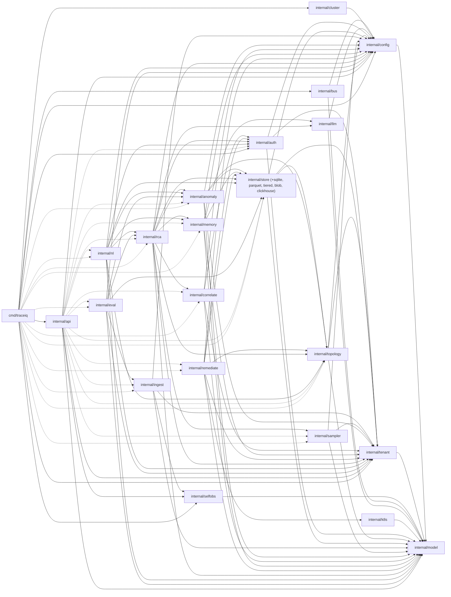

# 02 — TraceIQ Class and Package Diagrams

> Revision 2 — 2026-09-15 — applies decision register DR-0, DR-2, DR-3, DR-4, DR-5, DR-6, DR-7, DR-8, DR-9, DR-10, DR-11, DR-12, DR-13, DR-14, DR-15, DR-16, DR-17, DR-18, DR-19, DR-20, DR-21, DR-22, DR-23, DR-24, DR-25, DR-26, DR-27, DR-28, DR-29, DR-31, DR-34, DR-35, DR-36, DR-37, DR-38, DR-39 (round-1 fixes)

Companion to [`01-system-architecture.md`](./01-system-architecture.md). Types and interface names are fixed by [`00-feature-catalog.md`](./00-feature-catalog.md) and, where they conflict, by [`06-decision-register.md`](./06-decision-register.md) (DR-0): the register wins.

Per-package interfaces are owned by the register and mirrored here (DR-0's fact-ownership table); `00` lists names only and feature docs cite this document.

## Reading these diagrams

| Convention | Meaning |
|------------|---------|
| `pkg_Type` | Go type `Type` in package `internal/pkg` (e.g. `store_HotIndex` is `store.HotIndex`). The prefix exists only to disambiguate identically named types across packages. |
| `List~T~` | Go `[]T` |
| `Map~K,V~` | Go `map[K]V` |
| `Chan~T~` | Go `<-chan T` |
| Return type shown | The **value** return. Every method that can fail also returns a trailing `error`, omitted here for readability. |
| `ctx` parameter | Every I/O-performing method takes `ctx context.Context` first; omitted here for readability. |
| `tid` parameter | `model.TenantID`, second positional parameter on every tenant-scoped method (DR-5) — shown explicitly because it is load-bearing, unlike `ctx`. |
| `..|>` | implements |
| `-->` | uses / depends on |
| `*--` | composes / owns lifecycle |
| `o--` | aggregates / holds a reference |

Concurrency annotations in the notes matter: a type marked *single-goroutine* must never be shared; a type marked *goroutine-safe* guards its own state.

Shared `model.*` types (`Span`, `Trace`, `TenantID`, `KeepReason`, `Window`, `Quantiles`, `REDSample`, `AnomalyEvent`, `Incident`, `Investigation`, `Step`, `Hypothesis`, `Evidence`, `ActionProposal`, `Action`, `Record`, `Clock`, …) are declared **once**, in `01 §4`, and are not re-declared as package-local types anywhere in this document — they appear here only as parameter/return types.

---

## 1. Ingest, Sampler, Store (F01, F02, F03)

```mermaid
classDiagram
    direction LR

    class ingest_Receiver {
        <<interface>>
        +Name() string
        +Protocol() string
        +Start() void
        +Stop() void
    }
    class ingest_OTLPGRPCReceiver {
        -endpoint string
        -server grpc_Server
        -sink ingest_SpanSink
        +Export(req ExportTraceServiceRequest) ExportTraceServiceResponse
    }
    class ingest_OTLPHTTPReceiver {
        -endpoint string
        -path string
        +ServeHTTP(w ResponseWriter, r Request) void
    }
    class ingest_JaegerReceiver {
        -grpcEndpoint string
        -thriftEndpoint string
    }
    class ingest_ZipkinReceiver {
        -endpoint string
    }
    class ingest_Normalizer {
        <<goroutine-safe>>
        -interner ingest_KeyInterner
        +FromOTLP(rs List~ResourceSpans~, tenant model_TenantID) List~model_Span~
        +FromJaegerProto(batch JaegerBatch, tenant model_TenantID) List~model_Span~
        +FromZipkinV2(spans List~ZipkinSpan~, tenant model_TenantID) List~model_Span~
        +ErrorSignature(s model_Span) string
    }
    class ingest_KeyInterner {
        <<goroutine-safe>>
        -shards List~Map_string_string~
        -maxKeys int
        +Intern(key string) string
    }
    class ingest_Validator {
        -limits ingest_Limits
        +Validate(s model_Span) void
        +ApplyLimits(s model_Span) model_Span
    }
    class ingest_Limits {
        +MaxSpanBytes int
        +MaxAttributesPerSpan int
        +MaxAttributeValueBytes int
        +OversizeAttrPolicy string
        +MaxEventsPerSpan int
        +MaxLinksPerSpan int
        +MaxSpansPerBatch int
        +MaxSpanAge Duration
        +ClockSkewFuture Duration
    }
    class ingest_SpanSink {
        <<interface>>
        +Consume(tid model_TenantID, spans List~model_Span~) void
    }
    class ingest_REDAccumulator {
        <<goroutine-safe>>
        +Extract(s model_Span) void
        +Flush() List~model_REDSample~
    }
    class ingest_Router {
        -batchCh Chan~List_model_Span~
        -workers int
        -redAccum ingest_REDAccumulator
        -shardFor func_Ring_TraceID_int
        -sink ingest_SpanSink
        +Emit(spans List~model_Span~) void
        +Run() void
    }

    ingest_OTLPGRPCReceiver ..|> ingest_Receiver
    ingest_OTLPHTTPReceiver ..|> ingest_Receiver
    ingest_JaegerReceiver ..|> ingest_Receiver
    ingest_ZipkinReceiver ..|> ingest_Receiver
    ingest_Receiver --> ingest_Normalizer
    ingest_Receiver --> auth_RateLimiter
    ingest_Normalizer *-- ingest_KeyInterner
    ingest_Normalizer --> ingest_Validator
    ingest_Validator *-- ingest_Limits
    ingest_Receiver --> ingest_Router
    ingest_Router *-- ingest_REDAccumulator
    ingest_Router o-- ingest_SpanSink

    class sampler_Sampler {
        <<interface>>
        +Consume(tid model_TenantID, spans List~model_Span~) void
        +SetInterestPredicate(tid model_TenantID, p sampler_InterestPredicate) string
        +RemoveInterestPredicate(tid model_TenantID, id string) void
        +ListInterestPredicates(tid model_TenantID) List~sampler_InterestPredicate~
        +AdjustFloor(tid model_TenantID, floor float64) void
        +Decisions() Chan~sampler_Decision~
        +Traces() Chan~model_Trace~
        +REDSamples() Chan~model_REDSample~
        +FlushAll() void
        +ReplayWAL() sampler_ReplayReport
        +Stats() sampler_Stats
    }
    class sampler_ShardedSampler {
        <<goroutine-safe>>
        -shards List~sampler_Shard~
        -ring sampler_Ring
        -policy sampler_Policy
        -predicates sampler_PredicateSet
        -baselines sampler_BaselineSource
        -wal sampler_WAL
        +Consume(tid model_TenantID, spans List~model_Span~) void
    }
    class sampler_Ring {
        +Epoch uint64
        +Members List~string~
        +State sampler_RingState
    }
    class sampler_Shard {
        <<single-goroutine>>
        -id int
        -open Map~model_TraceID,sampler_partialTrace~
        -inCh Chan~model_Span~
        -wheel sampler_TimerWheel
        -wal sampler_WAL
        -bytesHeld int64
        +run() void
        -dedupe(spanID model_SpanID) bool
        -complete(pt sampler_partialTrace, reason model_KeepReason) void
        -shed() void
    }
    class sampler_WAL {
        -dir string
        +Append(spanBytes Bytes) void
        +Truncate(traceID model_TraceID) void
        +Replay() sampler_ReplayReport
    }
    class sampler_partialTrace {
        +TraceID model_TraceID
        +Spans List~model_Span~
        +SeenSpanIDs Map~model_SpanID,struct~
        +FirstSeenNano uint64
        +LastSeenNano uint64
        +RootSeen bool
        +Bytes int
        +Assemble() model_Trace
    }
    class sampler_TimerWheel {
        -slots List~bucket~
        +Schedule(id model_TraceID, deadline uint64) void
        +Expire(now uint64) List~model_TraceID~
    }
    class sampler_Policy {
        +KeepErrors bool
        +SlowQuantile float64
        +SlowMinDuration Duration
        +RarePathLookbackDays int
        +RarePathKeepsPerMin int
        +MaxPathSignatureCardinality int
        +BaselineMinSamples int
        +HealthySampleRate float64
        +FloorTracesPerMinPerService int
        +MaxKeepRate float64
        +Evaluate(t model_Trace, b sampler_KeyBaseline, m sampler_InterestMatch, g sampler_Governor) sampler_Decision
    }
    class sampler_Decision {
        +TraceID model_TraceID
        +Keep bool
        +Reason model_KeepReason
        +MatchedPredicateID string
        +SecondaryReasons uint16
        +PolicyID string
        +Tier model_StorageTier
        +DecisionLatencyNs uint64
    }
    class sampler_InterestPredicate {
        +ID string
        +Tenant model_TenantID
        +Scope sampler_PredicateScope
        +Source string
        +Services List~string~
        +Operations List~string~
        +AttrEquals Map~string,string~
        +ErrorSigIDs List~string~
        +PathSigs List~uint64~
        +TraceIDs Map~model_TraceID,struct~
        +MinDuration Duration
        +ErrorsOnly bool
        +NarrowLevel uint8
        +Hits uint64
        +ExpiresAt Time
    }
    class sampler_PredicateSet {
        <<goroutine-safe>>
        -byService Map~string,List_string~
        -byErrorSig Map~string,List_string~
        -byPathSig Map~uint64,List_string~
        -byAttrKey Map~string,List_string~
        +Add(p sampler_InterestPredicate) string
        +Remove(id string) void
        +Match(t model_Trace) sampler_InterestMatch
        +ExpireDue(now Time) int
        +Narrow(level int) int
    }
    class sampler_InterestMatch {
        +Matched bool
        +PredicateID string
        +Scope sampler_PredicateScope
    }
    class sampler_BaselineSource {
        <<interface>>
        +Quantile(tid model_TenantID, service string, op string, q float64) uint64
        +LoadSnapshot(tid model_TenantID) sampler_BaselineSnapshot
        +PathSeen(tid model_TenantID, sig uint64, lookback Duration) Time
        +CallRate(tid model_TenantID, service string) float64
    }
    class sampler_BaselineSnapshot {
        +At Time
        +ByKey Map~sampler_ServiceOp,sampler_KeyBaseline~
    }
    class sampler_KeyBaseline {
        +P95Nanos uint64
        +P99Nanos uint64
        +Warmed bool
        +Samples uint32
    }
    class sampler_Stats {
        +Shards List~sampler_ShardStats~
        +BytesInFlight int64
        +OpenTraces int64
        +KeepRate60s float64
        +KeepRateByReason Map~model_KeepReason,float64~
        +PredicatesActive int
        +TracesLostTotal int64
        +RebalanceSplits int64
        +RingEpoch uint64
    }

    sampler_ShardedSampler ..|> sampler_Sampler
    sampler_ShardedSampler ..|> ingest_SpanSink
    sampler_ShardedSampler *-- sampler_Shard
    sampler_ShardedSampler *-- sampler_Ring
    sampler_ShardedSampler *-- sampler_Policy
    sampler_ShardedSampler *-- sampler_PredicateSet
    sampler_ShardedSampler o-- sampler_BaselineSource
    sampler_Shard *-- sampler_partialTrace
    sampler_Shard *-- sampler_TimerWheel
    sampler_Shard *-- sampler_WAL
    sampler_Policy --> sampler_Decision
    sampler_PredicateSet *-- sampler_InterestPredicate
    sampler_BaselineSource --> sampler_BaselineSnapshot
    sampler_BaselineSnapshot *-- sampler_KeyBaseline

    class store_HotIndex {
        <<interface>>
        +WriteBatch(tid model_TenantID, b store_HotBatch) store_BatchReceipt
        +BindColdBlock(tid model_TenantID, walSegment string, m store_BlockManifest) int
        +GetTrace(tid model_TenantID, id model_TraceID) store_TraceIndex
        +SearchSpans(tid model_TenantID, q store_SpanQuery) store_SpanPage
        +SearchTraces(tid model_TenantID, q store_TraceQuery) store_TracePage
        +QueryRED(tid model_TenantID, service string, op string, w model_Window) store_REDSeries
        +QueryEdges(tid model_TenantID, w model_Window) List~topology_Edge~
        +QueryErrorSignatures(tid model_TenantID, service string, w model_Window) List~store_ErrorSignature~
        +ExemplarsFor(tid model_TenantID, service string, op string, w model_Window, n int) List~store_Exemplar~
        +PathSeen(tid model_TenantID, sig uint64, lookback Duration) Time
        +IngestedBytes(tid model_TenantID, w model_Window) int64
        +PendingColdRows(tid model_TenantID, olderThan Time) List~store_PendingCold~
        +ExpireBefore(tid model_TenantID, tbl store_TableID, cutoff Time) store_Expired
        +CascadeRED(tid model_TenantID, from store_Resolution, to store_Resolution, before Time) int
        +DiskUsage() store_DiskReport
        +Capabilities() store_HotCapabilities
        +Health() store_HealthReport
        +Close() void
    }
    class store_HotBatch {
        +Traces List~store_TraceIndex~
        +Spans List~store_SpanIndex~
        +AttrRows List~store_AttrIndexRow~
        +AttrDict List~store_AttrDictRow~
        +FTSRows List~store_FTSRow~
        +RED List~model_REDSample~
        +Edges List~topology_Edge~
        +EdgeOps List~store_EdgeOpRow~
        +ErrorSigs List~store_ErrorSignature~
        +PathSigs List~store_PathSigRow~
        +Exemplars List~store_Exemplar~
        +Resources List~store_ResourceRow~
    }
    class store_HotCapabilities {
        +ReadYourWrites bool
        +RowLevelDelete bool
        +FullTextSearch bool
        +MaxKeptSpansPerSec int
    }
    class store_SQLiteHotIndex {
        <<goroutine-safe>>
        -writeDB sqlDB
        -readPool sqlDB
        -batcher store_TraceBatcher
        +Migrate(m store_Migrator) void
    }
    class store_ClickHouseHotIndex {
        <<goroutine-safe P2>>
        -dsn string
        -conn chConn
    }
    class store_ColdStore {
        <<interface>>
        +Append(tid model_TenantID, t model_Trace, tier store_ColdTier) store_WALRef
        +Seal(blockID string) store_BlockManifest
        +SealDue(now Time) List~string~
        +ReadTrace(tid model_TenantID, id model_TraceID, loc store_TraceLoc) model_Trace
        +ReadFromWAL(tid model_TenantID, id model_TraceID, ref store_WALRef) model_Trace
        +ReplayWAL() store_ReplayReport
        +ExpireBlocks(before Time, tier store_ColdTier) List~string~
        +Tombstone(tid model_TenantID, ids List~model_TraceID~, reason string) void
        +Compact(level int, b store_CompactBudget) store_CompactReport
        +Health() store_HealthReport
    }
    class store_ParquetColdStore {
        <<goroutine-safe>>
        -openBlocks List~store_BlockWriter~
        -manifest store_ManifestIndex
        -objstore store_ObjectStore
        -wal store_ColdWAL
        -tombstones store_TombstoneIndex
    }
    class store_WALRef {
        +Segment string
        +Offset int64
        +Length int32
        +CRC32C uint32
    }
    class store_TraceLoc {
        +BlockID string
        +RowGroup int32
        +RowOffset int64
        +ColdState uint8
        +WAL store_WALRef
    }
    class store_BlockWriter {
        -blockID string
        -spanWriter parquetWriter
        -traceWriter parquetWriter
        -bytes int64
        +Append(t model_Trace) void
        +Seal() store_BlockManifest
    }
    class store_BlockManifest {
        +BlockID string
        +Tier store_ColdTier
        +URI string
        +MinStartUnixNano int64
        +MaxStartUnixNano int64
        +TraceCount int64
        +SpanCount int64
        +SizeBytes int64
        +ChecksumSHA256 string
        +ExpiresAt Time
    }
    class store_TraceBatcher {
        <<single-goroutine>>
        -pending List~model_Trace~
        -maxTraces int
        -maxInterval Duration
        +Add(t model_Trace) void
        +FlushNow() int
    }
    class store_TieredStore {
        -hot store_HotIndex
        -cold store_ColdStore
        +WriteTrace(tid model_TenantID, t model_Trace, tier model_StorageTier) void
        +GetTrace(tid model_TenantID, id model_TraceID) model_Trace
        +Signals() Chan~store_CostSignal~
    }
    class store_CostSignal {
        +Tenant model_TenantID
        +ObservedBytesPerSec float64
        +BudgetBytesPerSec float64
        +CurrentFloor float64
        +RecommendedFloor float64
        +DiskUsedRatio float64
        +Watermark store_Watermark
    }
    class store_RetentionPolicy {
        +Tenant model_TenantID
        +HotSpanRows Duration
        +HotTraceRows Duration
        +HotRollups Duration
        +ColdAnomalous Duration
        +ColdSampled Duration
        +REDRollups Duration
        +Investigations Duration
        +Audit Duration
        +MaxDiskBytes int64
        +HighWatermark float64
        +ActionOnFull string
        +ByteBudgetBytes int64
    }
    class store_Compactor {
        <<single-goroutine, leader-only>>
        +RunOnce(p store_RetentionPolicy) store_RetentionReport
        -cascadeRED() void
        -expireBlocks() void
        -enforceDiskBudget() void
        -compactLevels() void
    }
    class store_Migrator {
        +Current() int
        +Target() int
        +Up() void
    }
    class store_ObjectStore {
        <<interface>>
        +Put(key string, r Reader, size int64) store_ObjectInfo
        +Get(key string) ReadCloser
        +GetRange(key string, offset int64, length int64) ReadCloser
        +Delete(keys List~string~) void
        +List(prefix string, after string, limit int) List~store_ObjectInfo~
        +Kind() string
    }

    store_SQLiteHotIndex ..|> store_HotIndex
    store_ClickHouseHotIndex ..|> store_HotIndex
    store_SQLiteHotIndex ..|> sampler_BaselineSource
    store_ParquetColdStore ..|> store_ColdStore
    store_TieredStore o-- store_HotIndex
    store_TieredStore o-- store_ColdStore
    store_SQLiteHotIndex *-- store_TraceBatcher
    store_SQLiteHotIndex *-- store_Migrator
    store_ParquetColdStore *-- store_BlockWriter
    store_ParquetColdStore o-- store_ObjectStore
    store_BlockWriter --> store_BlockManifest
    store_Compactor --> store_HotIndex
    store_Compactor --> store_ColdStore
    store_Compactor --> store_RetentionPolicy
    store_TieredStore --> store_CostSignal
    sampler_ShardedSampler --> store_TieredStore
    ingest_Router o-- ingest_SpanSink
```



**Notes.**
- `ingest.SpanSink.Consume(tid, spans)` mentions only `model` types (DR-2's structural rule), so `sampler.ShardedSampler` and `topology.LiveGraph` both satisfy it **without importing `ingest`**. `ingest.Router` never imports `sampler`: the `shardFor` routing function and the `sink` are both injected by `cmd/traceiq` as narrow, model-typed values.
- `sampler.ShardFor(ring, traceID)` (DR-8) is the **only** routing function in the system — rendezvous (HRW) hashing, not `fnv64a mod N`. It is a package-level pure function, not a method.
- RED extraction happens in `ingest.REDAccumulator`, **before** the shard send (DR-9) — this is what makes a `shard_full` drop RED-safe.
- `store.SQLiteHotIndex` also implements `sampler.BaselineSource`; the sampler decision path never issues a live SQLite read (DR-10 — `BaselineSnapshot` is cached and refreshed on an interval).
- `store.TieredStore` composes `store.HotIndex` (two SQLite files, `traceiq.db` + `control.db`, DR-6) and `store.ColdStore` (WAL-journaled Parquet blocks, DR-7) and emits `store.CostSignal` on `Signals()` for the sampler's cost controller (DR-12) — `store` never imports `sampler`; `cmd/traceiq` wires the channel to `sampler.AdjustFloor`.
- `store.ObjectStore` (not `BlobStore`) is also where `rca` stores evidence/reasoner bodies (`§3`) — never inline in SQLite.

---

## 2. Topology and Anomaly (F04, F05)

```mermaid
classDiagram
    direction LR

    class topology_Graph {
        <<interface>>
        +Consume(tid model_TenantID, spans List~model_Span~) void
        +Neighbors(tid model_TenantID, service string, hops int, dir topology_Direction) topology_Neighborhood
        +Distance(tid model_TenantID, a string, b string, maxHops int) int
        +Edges(tid model_TenantID, w model_Window) List~topology_Edge~
        +EdgeOps(tid model_TenantID, edgeID string, w model_Window, topN int) List~topology_EdgeOp~
        +Snapshot(tid model_TenantID) topology_Snapshot
        +Export(tid model_TenantID, w Writer, f topology_ExportFormat) void
        +Changes() Chan~topology_ChangeEvent~
        +Flush() void
        +Stats() topology_Stats
    }
    class topology_LiveGraph {
        <<goroutine-safe>>
        -buckets Map~int64,topology_bucketSet~
        -meta Map~string,topology_EdgeMeta~
        -adjacency Map~string,List_string~
        -maxEdges int
        -sink topology_EdgeSink
        -source topology_EdgeSource
        +Consume(tid model_TenantID, spans List~model_Span~) void
        -edgeID(caller string, callee string, protocol string) string
        -evictLRU(now Time) int
    }
    class topology_EdgeSink {
        <<interface>>
        +WriteEdges(tid model_TenantID, edges List~topology_Edge~) void
    }
    class topology_EdgeSource {
        <<interface>>
        +LoadEdges(tid model_TenantID, w model_Window) List~topology_Edge~
    }
    class topology_EdgeMetaReader {
        <<interface>>
        +NewEdgesSince(tid model_TenantID, since Time) List~topology_Edge~
    }
    class topology_Edge {
        +ID string
        +Tenant model_TenantID
        +Caller string
        +Callee string
        +Protocol string
        +BucketStart Time
        +Resolution topology_Resolution
        +Calls uint64
        +Errors uint64
        +DurationSumNanos uint64
        +Hist model_LatencyHist
        +ExemplarTraceIDs List~model_TraceID~
        +FirstSeen Time
        +LastSeen Time
        +IsNew bool
        +IsVanished bool
    }
    class topology_EdgeOp {
        +EdgeID string
        +CalleeOperation string
        +BucketStart Time
        +Calls uint64
        +Errors uint64
        +P99Nanos uint64
    }
    class topology_EdgeMeta {
        +EdgeID string
        +FirstSeen Time
        +LastSeen Time
        +TotalCalls uint64
        +IsNew bool
    }
    class topology_Neighborhood {
        +Root string
        +Upstream List~string~
        +Downstream List~string~
        +Edges List~topology_Edge~
        +HopOf Map~string,int~
    }
    class topology_Snapshot {
        +Tenant model_TenantID
        +At Time
        +Nodes List~topology_Node~
        +Edges List~topology_Edge~
    }
    class topology_Node {
        +Service string
        +Versions List~string~
        +Calls uint64
        +Errors uint64
        +P99Nanos uint64
    }
    class topology_ChangeEvent {
        +Edge topology_Edge
        +Kind string
    }

    topology_LiveGraph ..|> topology_Graph
    topology_LiveGraph ..|> ingest_SpanSink
    topology_LiveGraph *-- topology_EdgeMeta
    topology_LiveGraph --> topology_Edge
    topology_LiveGraph o-- topology_EdgeSink
    topology_LiveGraph o-- topology_EdgeSource
    store_SQLiteHotIndex ..|> topology_EdgeSink
    store_SQLiteHotIndex ..|> topology_EdgeSource
    store_SQLiteHotIndex ..|> topology_EdgeMetaReader
    topology_Graph --> topology_Neighborhood
    topology_Graph --> topology_Snapshot
    topology_Graph --> topology_ChangeEvent
    topology_Snapshot *-- topology_Node

    class anomaly_Detector {
        <<interface>>
        +Kind() anomaly_Kind
        +Evaluate(tid model_TenantID, in anomaly_EvalInput) List~model_AnomalyEvent~
    }
    class anomaly_EvalInput {
        +Now Time
        +Window model_Window
        +Samples List~model_REDSample~
        +ErrorSigs List~store_ErrorSignature~
        +Baselines anomaly_BaselineReader
        +Topology anomaly_TopologyReader
        +Deploys anomaly_DeployIndex
    }
    class anomaly_TopologyReader {
        <<interface>>
        +Neighbors(tid model_TenantID, service string, hops int, dir uint8) List~string~
        +Has(tid model_TenantID, service string) bool
    }
    class anomaly_LatencyShiftDetector {
        -ratio float64
        -absDelta Duration
        -minCalls int
    }
    class anomaly_ErrorBurstDetector {
        -rateDelta float64
        -burstRatio float64
        -minCalls int
    }
    class anomaly_NewErrorSignatureDetector {
        -lookback Duration
        -minCalls int
    }
    class anomaly_ThroughputDropDetector {
        -ratio float64
        -minRPS float64
    }
    class anomaly_TopologyChangeDetector {
        -graph anomaly_TopologyReader
        -metaReader topology_EdgeMetaReader
        +drainChanges() void
    }
    class anomaly_BaselineReader {
        <<interface>>
        +Get(tid model_TenantID, service string, op string, at Time) anomaly_Baseline
    }
    class anomaly_Baseline {
        +Service string
        +Operation string
        +Bucket uint8
        +Q model_Quantiles
        +ErrorEWMA float64
        +RPSEWMA float64
        +Samples uint32
        +Warmed bool
        +Provisional bool
    }
    class anomaly_BaselineStore {
        <<goroutine-safe>>
        -estimators Map~string,anomaly_SeasonalBaseline~
        -maxKeys int
        +Observe(tid model_TenantID, s model_REDSample) void
        +Reader() anomaly_BaselineReader
        +Checkpoint() anomaly_CheckpointReport
        +Load(tid model_TenantID) int
        +Stats() anomaly_BaselineStats
    }
    class anomaly_SeasonalBaseline {
        -season List~anomaly_P2Estimator~
        -global anomaly_TDigest
    }
    class anomaly_QuantileEstimator {
        <<interface>>
        +Add(v float64) void
        +Quantile(q float64) float64
        +Merge(other anomaly_QuantileEstimator) void
        +SizeBytes() int
    }
    class anomaly_P2Estimator {
        -markers List~float64~
    }
    class anomaly_TDigest {
        -compression int
    }
    class anomaly_Grouper {
        <<interface>>
        +Add(tid model_TenantID, e model_AnomalyEvent) model_Incident
        +ActiveIncidents(tid model_TenantID) List~model_Incident~
        +Suppress(tid model_TenantID, id string, reason string, ttl Duration) void
        +Tick(now Time) List~model_Incident~
        +Stats() anomaly_GrouperStats
    }
    class anomaly_ShardedGrouper {
        <<single-goroutine, leader-only>>
        -byService Map~string,List_string~
        -neighborCache LRUCache
        -open Map~string,model_Incident~
        -maxOpenIncidents int
    }
    class anomaly_GrouperStats {
        +OpenIncidents int
        +LastTickAt Time
        +NeighborCacheHitRatio float64
    }
    class anomaly_DeployIndex {
        <<interface>>
        +Near(tid model_TenantID, service string, at Time, window Duration) List~model_DeployMarker~
        +PrePostSplit(tid model_TenantID, m model_DeployMarker) model_Window2
        +Record(tid model_TenantID, m model_DeployMarker) void
        +ListWindow(tid model_TenantID, w model_Window) List~model_DeployMarker~
    }
    class anomaly_DeployIndexImpl {
        <<goroutine-safe>>
        -byService Map~string,List_model_DeployMarker~
    }
    %% anomaly_Engine removed (N2-4 fix): it named no DR (DR-14 §14.1 defines
    %% only Detector/Grouper/BaselineStore/DeployIndex, no unifying struct)
    %% and internal/anomaly declares no Engine type. Callers hold the
    %% constituent interfaces directly — see api_Deps's Anomaly/Baselines/
    %% Deploys fields below.

    anomaly_LatencyShiftDetector ..|> anomaly_Detector
    anomaly_ErrorBurstDetector ..|> anomaly_Detector
    anomaly_NewErrorSignatureDetector ..|> anomaly_Detector
    anomaly_ThroughputDropDetector ..|> anomaly_Detector
    anomaly_TopologyChangeDetector ..|> anomaly_Detector
    anomaly_ShardedGrouper ..|> anomaly_Grouper
    anomaly_DeployIndexImpl ..|> anomaly_DeployIndex
    anomaly_BaselineStore *-- anomaly_SeasonalBaseline
    anomaly_SeasonalBaseline *-- anomaly_P2Estimator
    anomaly_SeasonalBaseline *-- anomaly_TDigest
    anomaly_P2Estimator ..|> anomaly_QuantileEstimator
    anomaly_TDigest ..|> anomaly_QuantileEstimator
    anomaly_BaselineStore --> store_SQLiteHotIndex
    anomaly_LatencyShiftDetector o-- anomaly_BaselineReader
    anomaly_TopologyChangeDetector o-- topology_LiveGraph
    anomaly_ShardedGrouper o-- topology_Graph
    anomaly_Detector --> anomaly_EvalInput
    anomaly_Grouper --> model_AnomalyEvent
    anomaly_Grouper --> model_Incident
```



**Notes.**
- `anomaly.Event` and `anomaly.Incident` are **deleted** as package-local types (DR-4): the canonical types are `model.AnomalyEvent` and `model.Incident`, declared once in `01 §4.3`. `anomaly.Grouper.ActiveIncidents` (new — DR-14 §14.1) gives `nl`'s `IntentIncidentStatus` a declared method to call (DR-35).
- `anomaly.SeasonalTDigest` is **renamed** `anomaly.SeasonalBaseline` and holds 31 `P2Estimator` triples (24 hour-of-day + 7 weekday slots) plus one `TDigest` for the global slot only (DR-14 §14.1) — seasonality drops from 168 hour-of-week buckets to 31 slots.
- `topology.Edge` drops `CalleeOperation` (combinatorial cardinality); per-operation visibility survives at bounded cardinality in `topology.EdgeOp`, an hourly top-N table (DR-13). `P50/P95/P99Nanos` fields are replaced by a single `model.LatencyHist` (16 fixed log-spaced buckets, DR-39); quantiles are interpolated at read time.
- `topology` imports only `model`; persistence goes through `topology.EdgeSink` / `topology.EdgeSource` / `topology.EdgeMetaReader`, interfaces declared in `topology` and satisfied by `store` — the only edge between the two packages is `store → topology` (§5). `topology.LiveGraph` also satisfies `ingest.SpanSink` structurally and **consumes the pre-sampling ingest fan-out**, independent of the sampling decision (DR-13) — `01`'s old `RED --> TG` edge is deleted.
- `anomaly.BaselineStore.Load` rebuilds seasonal state from `anomaly_baseline` on startup (31-slot shape), so a restart does not reset detection for hours; checkpointing is incremental (≤ 2 000 dirty rows / 60 s), never a full sweep.
- Detectors never format alert text: `Event.Explanation` (on `model.AnomalyEvent`) is produced by deterministic templates, keeping detection LLM-free and testable. `deploy_regression` is **not** a sixth `anomaly.Kind` — it is a `Score += 0.10` tag applied by `anomaly.DeployIndex.PrePostSplit` correlation (DR-14 §14.6).

---

## 3. RCA, Memory, LLM, Correlate, Remediate, K8s (F06, F07, F08, F09)

```mermaid
classDiagram
    direction TB

    class rca_Engine {
        <<interface>>
        +Investigate(tid model_TenantID, inc model_Incident) model_Investigation
        +Get(tid model_TenantID, id string) model_Investigation
        +Replay(tid model_TenantID, investigationID string, mode rca_ReplayMode) model_Investigation
        +Correct(tid model_TenantID, investigationID string, stepID string, c model_Correction) model_Investigation
        +Abort(tid model_TenantID, investigationID string, reason string) void
        +Stats() rca_Stats
    }
    class rca_Dispatcher {
        <<goroutine-safe>>
        -inflight Map~string,string~
        -sem semaphore
        -queueDepth int
    }
    class rca_LoopEngine {
        <<goroutine-safe>>
        -dispatcher rca_Dispatcher
        -reasoner rca_Reasoner
        -tools rca_ToolRegistry
        -budget rca_Budget
        -ctxb rca_Contextualizer
        -schemaValidator rca_SchemaValidator
        -sanitizer rca_Sanitizer
        -val rca_Validator
        -rep rca_Reporter
        -journal rca_Journal
        -mem memory_Store
        -sampler sampler_Sampler
        +Investigate(tid model_TenantID, inc model_Incident) model_Investigation
        -loop(inv model_Investigation) void
        -pushInterest(inv model_Investigation, scope sampler_PredicateScope) void
    }
    class rca_Reasoner {
        <<interface>>
        +Kind() model_ReasonerKind
        +NextStep(tid model_TenantID, s rca_State) rca_Proposal
        +Conclude(tid model_TenantID, s rca_State) model_Conclusion
    }
    class rca_Proposal {
        +Phase model_Phase
        +Hypotheses List~model_Hypothesis~
        +Call rca_ToolArgs
        +Done bool
        +Rationale string
    }
    class rca_LLMReasoner {
        -client llm_Client
        -promptVersion string
        -schemaValidator rca_SchemaValidator
        -sanitizer rca_Sanitizer
        +NextStep(tid model_TenantID, s rca_State) rca_Proposal
    }
    class rca_RulesReasoner {
        -rules List~rca_Rule~
        +NextStep(tid model_TenantID, s rca_State) rca_Proposal
    }
    class rca_Rule {
        +Name() string
        +Applies(c rca_Context) bool
        +Hypothesis(c rca_Context) model_Hypothesis
        +Probe(h model_Hypothesis) rca_ToolArgs
        +Judge(h model_Hypothesis, ev List~model_Evidence~) rca_Outcome
    }
    class rca_Sanitizer {
        <<interface>>
        +Wrap(k model_UntrustedKind, s string) string
        +Canary() string
        +CheckEcho(modelOutput string) void
    }
    class rca_SchemaValidator {
        <<interface>>
        +ValidateReasonerOutput(raw Bytes) rca_Proposal
        +ValidateToolArgs(a rca_ToolArgs, inc model_Incident, topo rca_TopologyReader) void
    }
    class rca_TopologyReader {
        <<interface>>
        +Has(tid model_TenantID, service string) bool
    }
    class rca_ToolArgs {
        +TenantID model_TenantID
        +Tool model_ToolName
        +Trace rca_TraceQueryArgs
        +Log rca_LogQueryArgs
        +Metric rca_MetricQueryArgs
        +Topology rca_TopologyQueryArgs
        +Memory rca_MemoryQueryArgs
    }
    class rca_TraceQueryArgs {
        +Service string
        +Operation string
        +MinDurationMillis uint32
        +Status model_StatusFilter
        +AttrEquals List~rca_AttrEqual~
        +ErrorSigID string
        +PathSignature uint64
        +Start Time
        +End Time
        +Limit int
        +Project List~string~
    }
    class rca_LogQueryArgs {
        +TraceID model_TraceID
        +Service string
        +Start Time
        +End Time
        +Contains string
        +Limit int
    }
    class rca_MetricQueryArgs {
        +TemplateID string
        +Params Map~string,string~
        +RED rca_REDQuery
        +Start Time
        +End Time
        +StepSeconds int
    }
    class rca_TopologyQueryArgs {
        +Service string
        +Hops int
        +Direction topology_Direction
        +Start Time
        +End Time
        +Limit int
    }
    class rca_MemoryQueryArgs {
        +Fingerprint string
        +Text string
        +TopK int
    }
    class rca_Tool {
        <<interface>>
        +Name() model_ToolName
        +Schema() rca_ArgSchema
        +Invoke(tid model_TenantID, a rca_ToolArgs) model_ToolResult
        +Cost() rca_ToolCost
    }
    class rca_TraceQueryTool {
        -st store_HotIndex
    }
    class rca_LogQueryTool {
        -cor correlate_Correlator
    }
    class rca_MetricQueryTool {
        -cor correlate_Correlator
        -st store_HotIndex
    }
    class rca_TopologyQueryTool {
        -g topology_Graph
    }
    class rca_MemoryQueryTool {
        -mem memory_Store
    }
    class rca_ToolRegistry {
        <<interface>>
        +Get(n model_ToolName) rca_Tool
        +Names() List~model_ToolName~
        +Dispatch(tid model_TenantID, a rca_ToolArgs) model_ToolResult
    }
    class rca_Contextualizer {
        -st store_HotIndex
        -g topology_Graph
        -mem memory_Store
        -deploys anomaly_DeployIndex
        +Build(inc model_Incident) rca_Context
    }
    class rca_Context {
        +Incident model_Incident
        +Neighborhood topology_Neighborhood
        +REDSeries List~store_REDSeries~
        +Deploys List~model_DeployMarker~
        +MemoryHits List~model_Record~
        +ExemplarTraces List~model_Trace~
    }
    class rca_Budget {
        <<interface>>
        +Charge(tid model_TenantID, invID string, d rca_Charge) void
        +Remaining(invID string) model_Spend
        +Terminated(invID string) model_TerminationReason
    }
    class rca_Charge {
        +TokensIn int64
        +CachedTokensIn int64
        +TokensOut int64
        +CostMicroUSD int64
    }
    class rca_Validator {
        +Judge(h model_Hypothesis, ev List~model_Evidence~) rca_Outcome
        +Confidence(hs List~model_Hypothesis~) float64
    }
    class rca_Reporter {
        +Render(inv model_Investigation) string
        +BlastRadius(inv model_Investigation, g topology_Graph) List~string~
        +Proposals(inv model_Investigation) List~model_ActionProposal~
    }
    class rca_Journal {
        <<interface>>
        +Create(tid model_TenantID, inv model_Investigation) void
        +AppendStep(tid model_TenantID, invID string, st model_Step) void
        +AppendEvidence(tid model_TenantID, invID string, ev List~model_Evidence~) void
        +Steps(tid model_TenantID, invID string) List~model_Step~
        +SetStatus(tid model_TenantID, invID string, st model_InvestigationStatus, at Time) void
        +ListRunning() List~model_Investigation~
    }

    rca_LoopEngine ..|> rca_Engine
    rca_LLMReasoner ..|> rca_Reasoner
    rca_RulesReasoner ..|> rca_Reasoner
    rca_RulesReasoner *-- rca_Rule
    rca_LLMReasoner o-- llm_Client
    rca_LLMReasoner *-- rca_Sanitizer
    rca_TraceQueryTool ..|> rca_Tool
    rca_LogQueryTool ..|> rca_Tool
    rca_MetricQueryTool ..|> rca_Tool
    rca_TopologyQueryTool ..|> rca_Tool
    rca_MemoryQueryTool ..|> rca_Tool
    rca_ToolRegistry *-- rca_Tool
    rca_LoopEngine *-- rca_Dispatcher
    rca_LoopEngine *-- rca_ToolRegistry
    rca_LoopEngine *-- rca_Budget
    rca_LoopEngine *-- rca_Contextualizer
    rca_LoopEngine *-- rca_SchemaValidator
    rca_LoopEngine *-- rca_Sanitizer
    rca_LoopEngine *-- rca_Validator
    rca_LoopEngine *-- rca_Reporter
    rca_LoopEngine *-- rca_Journal
    rca_LoopEngine o-- rca_Reasoner
    rca_LoopEngine o-- sampler_Sampler
    rca_LoopEngine o-- memory_Store
    rca_Contextualizer --> rca_Context
    rca_Tool --> model_ToolResult
    rca_Journal --> store_TieredStore

    class llm_Client {
        <<goroutine-safe>>
        -baseURL string
        -apiKeyRef string
        -timeout Duration
        -maxRetries int
        -pricing llm_Pricing
        +Messages(req llm_Request) llm_Response
        +CostMicroUSD(in int64, cachedIn int64, cacheWrite int64, out int64) int64
    }
    class llm_Request {
        +Model string
        +Thinking string
        +Effort string
        +Tools List~rca_ArgSchema~
        +System string
    }
    class llm_Response {
        +StopReason string
        +Usage llm_Usage
        +Content Bytes
    }
    class llm_Usage {
        +InputTokens int64
        +CachedInputTokens int64
        +CacheWriteTokens int64
        +OutputTokens int64
    }

    class correlate_Correlator {
        <<interface>>
        +LogsForTrace(tid model_TenantID, traceID model_TraceID, w model_Window, limit int) model_LogBundle
        +MetricsForSpan(tid model_TenantID, s model_Span, w model_Window) model_MetricBundle
        +Stats() correlate_Stats
    }
    class correlate_MultiCorrelator {
        -logs correlate_LogAdapter
        -metrics correlate_MetricAdapter
        -dialer auth_EgressDialer
        -breaker correlate_Breaker
        -cache LRUCache
        -sem semaphore
    }
    class correlate_LogAdapter {
        <<interface>>
        +Name() string
        +LogsForTrace(tid model_TenantID, traceID model_TraceID, w model_Window, limit int) List~model_LogLine~
        +QueryByServiceWindow(tid model_TenantID, service string, w model_Window, contains string, limit int) List~model_LogLine~
        +Capabilities() correlate_LogCapabilities
        +Health() model_HealthReport
        +Close() void
    }
    class correlate_LogCapabilities {
        +TenantScoped bool
        +TraceIDIndexed bool
        +MaxLookback Duration
    }
    class correlate_LokiAdapter {
        -url string
        -tenantMode string
    }
    class correlate_ElasticAdapter {
        -url string
        -index string
        -tenantMode string
    }
    class correlate_FileAdapter {
        -path string
    }
    class correlate_MetricAdapter {
        <<interface>>
        +Name() string
        +Range(tid model_TenantID, templateID string, params Map~string,string~, w model_Window, stepSeconds int) model_Series
        +ExemplarsFor(tid model_TenantID, service string, op string, w model_Window) List~model_Exemplar~
        +Capabilities() correlate_MetricCapabilities
        +Health() model_HealthReport
        +Close() void
    }
    class correlate_MetricCapabilities {
        +TenantScoped bool
        +MaxLookback Duration
    }
    class correlate_PrometheusAdapter {
        -url string
        -step Duration
        -templates List~string~
        -tenantMode string
    }
    class correlate_FileMetricAdapter {
        -path string
    }

    correlate_MultiCorrelator ..|> correlate_Correlator
    correlate_LokiAdapter ..|> correlate_LogAdapter
    correlate_ElasticAdapter ..|> correlate_LogAdapter
    correlate_FileAdapter ..|> correlate_LogAdapter
    correlate_PrometheusAdapter ..|> correlate_MetricAdapter
    correlate_FileMetricAdapter ..|> correlate_MetricAdapter
    correlate_MultiCorrelator o-- correlate_LogAdapter
    correlate_MultiCorrelator o-- correlate_MetricAdapter
    correlate_MultiCorrelator o-- auth_EgressDialer
    rca_LogQueryTool o-- correlate_Correlator
    rca_MetricQueryTool o-- correlate_Correlator

    class memory_Store {
        <<interface>>
        +Record(tid model_TenantID, rec model_InvestigationRecord) void
        +Similar(tid model_TenantID, fp memory_Fingerprint, topK int) List~model_Record~
        +Search(tid model_TenantID, text string, topK int) List~model_Record~
        +Get(tid model_TenantID, id string) model_Record
        +Correct(tid model_TenantID, c model_Correction) model_Record
        +Confirm(tid model_TenantID, id string, by string) void
        +Delete(tid model_TenantID, id string, by string) void
        +Import(tid model_TenantID, r Reader, f memory_ExportFormat, by string) memory_ImportReport
        +Export(tid model_TenantID, w Writer, f memory_ExportFormat) void
        +Consolidate(now Time) memory_ConsolidateReport
        +Stats() memory_Stats
    }
    class memory_HybridStore {
        <<goroutine-safe>>
        -st store_TieredStore
        -tokenIndex memory_TokenIndex
        -scorer memory_SimilarityScorer
        -embed memory_Embedder
        -decayHalfLife Duration
        -minSimilarity float64
        +Similar(tid model_TenantID, fp memory_Fingerprint, topK int) List~model_Record~
        -candidateGen(fp memory_Fingerprint) List~memory_Candidate~
    }
    class memory_TokenIndex {
        +PostingList(tid model_TenantID, token string) List~string~
        +DF(tid model_TenantID, token string) int
    }
    class memory_SimilarityScorer {
        <<interface>>
        +Name() string
        +Score(tid model_TenantID, q memory_Query, cand List~memory_Candidate~) List~memory_Scored~
    }
    class memory_Embedder {
        <<interface>>
        +Embed(tid model_TenantID, texts List~string~) List~List_float32~
        +Dim() int
        +Name() string
    }
    class memory_HashedEmbedder {
        -dim int
    }
    class memory_EmbedderLLM {
        -client llm_Client
    }
    class memory_Fingerprint {
        +TenantID model_TenantID
        +Tokens List~string~
        +Hash string
    }
    class memory_RunbookImporter {
        <<interface>>
        +Import(tid model_TenantID, markdown Bytes, by string) List~model_Record~
    }
    class memory_Consolidator {
        <<single-goroutine, leader-only>>
        +RunOnce(now Time) memory_ConsolidateReport
        -bandedMinHashLSH() int
        -decayWeights() int
        -prune() int
    }

    memory_HybridStore ..|> memory_Store
    memory_HashedEmbedder ..|> memory_Embedder
    memory_EmbedderLLM ..|> memory_Embedder
    memory_EmbedderLLM o-- llm_Client
    memory_HybridStore o-- memory_Embedder
    memory_HybridStore *-- memory_SimilarityScorer
    memory_HybridStore *-- memory_TokenIndex
    memory_HybridStore --> store_TieredStore
    memory_Consolidator --> memory_Store
    rca_MemoryQueryTool o-- memory_Store
    rca_LoopEngine o-- memory_Store

    class remediate_Guard {
        <<interface>>
        +Propose(tid model_TenantID, p model_ActionProposal, by auth_Subject, idem string) model_Action
        +Approve(tid model_TenantID, id string, by auth_Subject, req remediate_ApprovalRequest) model_Action
        +Reject(tid model_TenantID, id string, by auth_Subject, reason string) model_Action
        +Execute(tid model_TenantID, id string, by auth_Subject, idem string) model_Action
        +Verify(tid model_TenantID, id string) model_VerifyResult
        +Rollback(tid model_TenantID, id string, by auth_Subject, reason string) model_Action
        +Get(tid model_TenantID, id string) model_Action
        +List(tid model_TenantID, f remediate_ActionFilter) List~model_Action~
        +ExpireDue(now Time) int
        +Stats() remediate_Stats
    }
    class remediate_ApprovalRequest {
        +Comment string
        +OverrideJustification string
        +RequestBudgetOverride bool
    }
    class remediate_RecoverySignal {
        +Service string
        +Operation string
        +Window model_Window
        +ErrorRateBefore float64
        +ErrorRateAfter float64
        +P99BeforeNanos uint64
        +P99AfterNanos uint64
        +OpenIncidents int
    }
    class remediate_Verifier {
        <<interface>>
        +Verify(tid model_TenantID, a model_Action, s remediate_RecoverySignal) model_VerifyResult
    }
    class remediate_GuardImpl {
        <<goroutine-safe>>
        -exec k8s_Executor
        -graph topology_Graph
        -st store_TieredStore
        -audit auth_AuditSink
        +Propose(tid model_TenantID, p model_ActionProposal, by auth_Subject, idem string) model_Action
        -resolveTarget(tid model_TenantID, t model_ActionTarget) void
        -buildPayload(p model_ActionProposal, snap model_Snapshot) Bytes
        -checkBudget(incidentID string) void
    }

    class k8s_Executor {
        <<interface>>
        +Do(r k8s_Request) k8s_Result
        +Kind() string
    }
    class k8s_KubectlExecutor {
        -binary string
        -env List~string~
    }
    class k8s_DryRunExecutor {
    }
    class k8s_Request {
        +Verb k8s_Verb
        +Namespace string
        +Kind model_TargetKind
        +Name string
        +Argv List~string~
        +StdinJSON Bytes
        +DryRun bool
        +Timeout Duration
    }

    remediate_GuardImpl ..|> remediate_Guard
    k8s_KubectlExecutor ..|> k8s_Executor
    k8s_DryRunExecutor ..|> k8s_Executor
    remediate_GuardImpl o-- k8s_Executor
    remediate_GuardImpl o-- topology_Graph
    remediate_GuardImpl *-- remediate_Verifier
    remediate_GuardImpl --> model_Action
    remediate_Verifier --> store_TieredStore
    rca_Reporter --> remediate_Guard
```

**Notes.**
- `rca` never imports `remediate`: `rca.Reporter` emits `model.ActionProposal` values (typed specs only, no free-form patch — DR-22), and only the API/orchestration layer hands them to `remediate.Guard.Propose`. This keeps the dependency graph acyclic and makes remediation removable.
- `rca` never imports `anomaly`'s writer side, only its value types (`model.Incident`, `model.AnomalyEvent`), and `memory` never imports `rca` — `memory.Store.Record` takes `model.InvestigationRecord`. Both cycles are broken in `model` (DR-2).
- The Anthropic HTTP client lives in **`internal/llm`**, a new package importing only `model` + `config`. `rca.LLMReasoner` and `memory.EmbedderLLM` both hold `llm.Client`; neither imports the other. This kills `memory_AnthropicEmbedder --> rca_AnthropicClient` (DR-2, DR-34).
- `remediate.Guard.Approve` takes `auth.Subject`, never a bare string (`02`'s old `Approve(id, approver string)` is **deleted** — SR-2d); a CI grep gate fails the build on any non-`auth.Subject` approver parameter. The 9-state machine (`Proposed..Expired`) is declared once, in `01 §4.5` (DR-23 §23.2).
- `remediate.RecoverySignal` is declared **in `remediate`**, not `anomaly` — `remediate` never imports `anomaly` (DR-2, DR-23 §23.1).
- **`internal/k8s`** (new, imports only `model`) replaces `remediate.KubectlExecutor{-client k8sClient}` with `k8s.Executor`; `k8s.BuildArgv` is the only argv constructor in the system — no shell, no client-go (DR-24).
- `memory.Similar` is bounded to ≤ `memory.retrieval.max_candidates` (500) scored records regardless of corpus size, via `memory.TokenIndex`'s inverted posting lists (DR-19 §19.2) — the FTS index is free-text search, not the fingerprint prefilter.
- `correlate.EgressGuard` is **deleted**; every adapter obtains its HTTP client from `auth.EgressDialer.HTTPClient` — the single outbound dialer in the system (DR-20 §20.3). No adapter constructs its own `http.Client`.

---

## 4. NL, API, Auth, Tenant, Eval (F10, F12, X-SEC, F11)

```mermaid
classDiagram
    direction LR

    class tenant_Policy {
        +TenantID model_TenantID
        +DisplayName string
        +RetentionAnomalousDays int
        +RetentionHealthyDays int
        +RetentionHotSpanHours int
        +ByteBudgetBytes int64
        +SamplingFloor float64
        +MaxKeepRate float64
        +LLMCostMicroUSDPerDay int64
        +RemediationAllowlist List~model_ActionType~
        +NamespaceAllowlist List~string~
        +TargetAllowlist List~string~
        +ActionBudgetPerIncident int
        +AutoExecuteAllowed bool
        +FeatureFlags Map~string,List_string~
        +RBACBindings Map~string,List_string~
        +ChatBindings List~tenant_ChatBinding~
        +Version int64
    }
    class tenant_ChatBinding {
        +Platform string
        +WorkspaceID string
        +ChannelIDs List~string~
    }
    class tenant_Resolver {
        <<interface>>
        +FromSubject(subjectTenant model_TenantID) model_TenantID
        +FromDevDefault() model_TenantID
    }
    class tenant_PolicyStore {
        <<interface>>
        +Get(tid model_TenantID) tenant_Policy
        +Set(p tenant_Policy, by string) tenant_Policy
        +List() List~tenant_Policy~
        +Watch(tid model_TenantID) Chan~tenant_Policy~
    }

    tenant_PolicyStore --> tenant_Policy
    tenant_Policy *-- tenant_ChatBinding

    class nl_Interpreter {
        <<interface>>
        +Kind() string
        +Interpret(tid model_TenantID, q nl_Question, cc nl_ConversationContext) nl_Intent
    }
    class nl_RulesInterpreter {
        -patterns List~nl_Pattern~
    }
    class nl_LLMInterpreter {
        -client llm_Client
        -fallback nl_RulesInterpreter
    }
    class nl_Question {
        +Text string
        +Subject auth_Subject
        +Chat nl_ChatContext
        +AskedAt Time
    }
    class nl_ConversationKey {
        +Tenant model_TenantID
        +Platform string
        +WorkspaceID string
        +ChannelID string
        +ThreadID string
    }
    class nl_ConversationContext {
        +TenantID model_TenantID
        +Key nl_ConversationKey
        +Turns List~nl_Turn~
        +Focus nl_Focus
    }
    class nl_Intent {
        +Kind nl_IntentKind
        +Args rca_ToolArgs
        +Raw string
        +Confidence float64
    }
    class nl_Answerer {
        <<interface>>
        +Answer(tid model_TenantID, in nl_Intent, cc nl_ConversationContext) nl_Answer
    }
    class nl_AnswererImpl {
        -tools rca_ToolRegistry
        -grouper anomaly_Grouper
        -eng rca_Engine
        -evidenceLimit int
        +Answer(tid model_TenantID, in nl_Intent, cc nl_ConversationContext) nl_Answer
    }
    class nl_Answer {
        +Text string
        +Markdown string
        +Evidence List~model_Evidence~
        +Links List~string~
        +FollowUps List~string~
    }
    class nl_ChatAdapter {
        <<interface>>
        +Kind() string
        +Verify(r Request) nl_ChatContext
        +Post(c nl_ChatContext, a nl_Answer) void
        +PostApproval(c nl_ChatContext, a model_Action) void
    }
    class nl_SlackAdapter {
        -signingSecretRef string
        -botTokenRef string
    }
    class nl_TeamsAdapter {
        -secretRef string
    }
    class nl_WebAdapter {
    }
    class nl_ChatContext {
        +Platform string
        +WorkspaceID string
        +ChannelID string
        +ThreadID string
        +UserID string
    }

    nl_RulesInterpreter ..|> nl_Interpreter
    nl_LLMInterpreter ..|> nl_Interpreter
    nl_LLMInterpreter o-- nl_RulesInterpreter
    nl_LLMInterpreter o-- llm_Client
    nl_AnswererImpl ..|> nl_Answerer
    nl_SlackAdapter ..|> nl_ChatAdapter
    nl_TeamsAdapter ..|> nl_ChatAdapter
    nl_WebAdapter ..|> nl_ChatAdapter
    nl_Interpreter --> nl_Intent
    nl_AnswererImpl --> nl_Answer
    nl_AnswererImpl o-- rca_ToolRegistry
    nl_AnswererImpl o-- rca_Engine
    nl_AnswererImpl o-- anomaly_Grouper
    nl_Intent *-- rca_ToolArgs
    nl_ChatAdapter --> nl_ChatContext

    class api_Server {
        <<interface>>
        +Start() void
        +Stop() void
        +Handler() Handler
        +Ready() bool
    }
    class api_HTTPServer {
        -mux Router
        -deps api_Deps
        -mw List~api_Middleware~
        -ui api_UIHandler
        -mcp api_MCPServer
        -graf api_GrafanaHandler
        -alert api_AlertRouter
        -webhook api_WebhookReceiver
        +Start() void
    }
    %% api_Deps (N2-4 fix): reconciled against the scaffold's internal/api.Deps,
    %% which is itself derived field-by-field from DR-29's route/MCP tables and
    %% DR-30's screen list (see internal/api/api.go doc comments). This shape,
    %% not the pre-DR-6/DR-7/DR-14 shape below, is now normative; the two
    %% interface splits (Store -> HotIndex+ColdStore per DR-6/DR-7; Anomaly ->
    %% Grouper+BaselineReader+DeployIndex per DR-14; Tenant -> Resolver+
    %% PolicyStore per DR-3) postdate the original diagram. The missing
    %% `Interpreter` field is restored: DR-35 §35.2 keeps Interpreter and
    %% Answerer as two interfaces (Answerer.Answer takes the Intent that only
    %% Interpreter.Interpret produces), so a handler needs both.
    class api_Deps {
        +Config config_Config
        +SelfObs selfobs_Registry
        +Cluster cluster_Elector
        +Auth auth_Authenticator
        +Authorizer auth_Authorizer
        +RateLimit auth_RateLimiter
        +Audit auth_AuditSink
        +Identities auth_IdentityStore
        +Tenants tenant_Resolver
        +Policies tenant_PolicyStore
        +Topology topology_Graph
        +Remediate remediate_Guard
        +Interpreter nl_Interpreter
        +Answerer nl_Answerer
        +Eval eval_Runner
        +Investigations rca_Engine
        +Memory memory_Store
        +Correlate correlate_Correlator
        +Anomaly anomaly_Grouper
        +Baselines anomaly_BaselineReader
        +Deploys anomaly_DeployIndex
        +Sampler sampler_Sampler
        +Store store_HotIndex
        +Cold store_ColdStore
        +K8s k8s_Executor
    }
    class api_Middleware {
        <<interface>>
        +Wrap(next Handler) Handler
    }
    class api_AuthMiddleware {
        -authn auth_Authenticator
        -authz auth_Authorizer
        -tenant tenant_Resolver
    }
    class api_RateLimitMiddleware {
        -limiter auth_RateLimiter
    }
    class api_AuditMiddleware {
        -log auth_AuditSink
    }
    class api_UIHandler {
        -fs embedFS
        +ServeHTTP(w ResponseWriter, r Request) void
    }
    class api_MCPServer {
        -tools Map~string,api_MCPTool~
        +ListTools() List~api_MCPTool~
        +CallTool(name string, args Bytes, s auth_Subject) Bytes
    }
    class api_MCPTool {
        +Name string
        +Schema rca_ArgSchema
        +MinRole auth_Role
        +Handler func
    }
    class api_GrafanaHandler {
        +Search(q Bytes) Bytes
        +Query(q Bytes) Bytes
        +Annotations(q Bytes) Bytes
    }
    class api_AlertRouter {
        -routes List~api_AlertRoute~
        -minSeverity model_Severity
        +Route(inc model_Incident, inv model_Investigation) List~api_AlertDelivery~
    }
    class api_AlertSink {
        <<interface>>
        +Kind() string
        +Send(p api_AlertPayload) void
    }
    class api_PagerDutySink {
        -routingKeyRef string
    }
    class api_OpsGenieSink {
        -apiKeyRef string
    }
    class api_SlackSink {
        -channel string
    }
    class api_WebhookReceiver {
        -hmacSecretRef string
        -skew Duration
        +Deploy(r Request) model_DeployMarker
    }
    class api_DeadmanWatchdog {
        +Check(now Time) void
    }

    api_HTTPServer ..|> api_Server
    api_HTTPServer *-- api_Deps
    api_HTTPServer *-- api_Middleware
    api_HTTPServer *-- api_UIHandler
    api_HTTPServer *-- api_MCPServer
    api_HTTPServer *-- api_GrafanaHandler
    api_HTTPServer *-- api_AlertRouter
    api_HTTPServer *-- api_WebhookReceiver
    api_HTTPServer *-- api_DeadmanWatchdog
    api_AuthMiddleware ..|> api_Middleware
    api_RateLimitMiddleware ..|> api_Middleware
    api_AuditMiddleware ..|> api_Middleware
    api_MCPServer *-- api_MCPTool
    api_PagerDutySink ..|> api_AlertSink
    api_OpsGenieSink ..|> api_AlertSink
    api_SlackSink ..|> api_AlertSink
    api_AlertRouter o-- api_AlertSink
    api_Deps o-- nl_Interpreter
    api_Deps o-- nl_Answerer
    api_Deps o-- rca_Engine
    api_Deps o-- remediate_Guard
    api_Deps o-- store_HotIndex
    api_Deps o-- store_ColdStore
    api_Deps o-- tenant_Resolver
    api_Deps o-- tenant_PolicyStore
    api_Deps o-- anomaly_Grouper
    api_Deps o-- anomaly_BaselineReader
    api_Deps o-- anomaly_DeployIndex
    api_Deps o-- k8s_Executor

    class auth_Authenticator {
        <<interface>>
        +Authenticate(r Request) auth_Subject
        +AuthenticateChat(p auth_ChatRequest) auth_Subject
        +Close() void
    }
    class auth_TokenAuthenticator {
        -hasher auth_Hasher
        +Issue(name string, roles List~auth_Role~, tenant model_TenantID) string
        +Revoke(id string) void
    }
    class auth_MTLSAuthenticator {
        -caPool CertPool
    }
    class auth_OIDCAuthenticator {
        -issuer string
        -audience string
        -roleClaim string
    }
    class auth_Authorizer {
        <<interface>>
        +Can(s auth_Subject, c auth_Capability, res auth_ResourceRef) void
        +SeparationOfDuty(proposer string, approver string) void
        +Roles(s auth_Subject) List~auth_Role~
    }
    class auth_Subject {
        +ID string
        +Tenant model_TenantID
        +Roles List~auth_Role~
        +Scopes List~string~
        +Kind auth_SubjectKind
        +ChatRef auth_ChatIdentity
        +IssuedAt Time
        +ExpiresAt Time
    }
    class auth_ChatIdentity {
        +Platform string
        +WorkspaceID string
        +PlatformUserID string
    }
    class auth_IdentityBinding {
        +Platform string
        +WorkspaceID string
        +PlatformUserID string
        +SubjectID string
        +Tenant model_TenantID
        +Disabled bool
    }
    class auth_IdentityStore {
        <<interface>>
        +Resolve(platform string, workspaceID string, platformUserID string) auth_Subject
        +Put(b auth_IdentityBinding, by auth_Subject) void
        +List(tid model_TenantID) List~auth_IdentityBinding~
        +Delete(tid model_TenantID, platform string, workspaceID string, platformUserID string, by auth_Subject) void
    }
    class auth_RateLimiter {
        <<interface, goroutine-safe>>
        +Allow(k auth_Key) auth_Decision
        +Close() void
    }
    class auth_Key {
        +Tenant model_TenantID
        +Subject string
        +Class auth_LimitClass
    }
    class auth_AuditSink {
        <<interface>>
        +Append(e auth_Event) auth_Receipt
        +Query(tid model_TenantID, f auth_Filter) List~auth_Event~
        +VerifyChain(tid model_TenantID, from int64, to int64) auth_VerifyReport
        +Anchor(tid model_TenantID) auth_Anchor
    }
    class auth_HashChainAudit {
        -appenderRole string
        -hash string
        -anchorInterval Duration
    }
    class auth_SecretSource {
        <<interface>>
        +Get(ref string) Bytes
        +Watch(ref string) Chan~Bytes~
    }
    class auth_EgressDialer {
        <<interface>>
        +DialContext(network string, addr string) Conn
        +HTTPClient(timeout Duration) HTTPClient
    }
    class auth_Scrubber {
        -patterns List~Regexp~
        +Scrub(b Bytes) Bytes
        +ScrubString(s string) string
    }

    auth_TokenAuthenticator ..|> auth_Authenticator
    auth_MTLSAuthenticator ..|> auth_Authenticator
    auth_OIDCAuthenticator ..|> auth_Authenticator
    auth_HashChainAudit ..|> auth_AuditSink
    auth_Authenticator --> auth_Subject
    auth_Authorizer --> auth_Subject
    auth_HashChainAudit --> store_TieredStore
    api_AuthMiddleware o-- auth_Authenticator
    api_AuthMiddleware o-- auth_Authorizer
    api_AuditMiddleware o-- auth_AuditSink
    correlate_MultiCorrelator o-- auth_EgressDialer
    rca_Sanitizer o-- auth_Scrubber
    tenant_PolicyStore --> store_TieredStore

    class eval_Runner {
        <<interface>>
        +Run(opts eval_RunOptions) eval_Report
        +List(dir string) List~eval_ScenarioSpec~
        +Stats() eval_Stats
    }
    class eval_RunOptions {
        +Tenant model_TenantID
        +Mode eval_Mode
        +Isolation eval_Isolation
        +Parallelism int
        +Seed int64
        +Clock model_Clock
        +Reasoner model_ReasonerKind
        +RegressionBaseline string
        +FailOnRegression bool
    }
    class eval_HarnessRunner {
        -receiver ingest_Receiver
        -clock model_Clock
        -scorer eval_Scorer
        +Run(opts eval_RunOptions) eval_Report
    }
    class eval_ScenarioSpec {
        +ID string
        +Tenant model_TenantID
        +Fixture eval_FixtureRef
        +BaselineWarmup eval_FixtureRef
        +Clock eval_ClockSpec
        +Faults List~eval_FaultSpec~
        +Expect eval_Expectation
    }
    class eval_Expectation {
        +IncidentWithin Duration
        +EpicenterService string
        +RootCauseCategory model_HypothesisCategory
        +RootCauseComponent string
        +ExpectedEvidence List~eval_EvidenceCategory~
        +MaxCostMicroUSD int64
        +MustNotPage bool
    }
    class eval_Scorer {
        +Score(spec eval_ScenarioSpec, inv model_Investigation) eval_Result
    }
    class eval_Result {
        +ScenarioID string
        +Top1 bool
        +Top3 bool
        +PartialCredit float64
        +EvidencePrecision float64
        +EvidenceRecall float64
        +DetectLatencyMillis int64
        +TimeToRCAMillis int64
        +CostMicroUSD int64
        +ReasonerKind model_ReasonerKind
    }
    class eval_Report {
        +RunID string
        +Results List~eval_Result~
        +Accuracy float64
        +MedianCostMicroUSD int64
        +ToMarkdown() string
    }

    eval_HarnessRunner ..|> eval_Runner
    eval_HarnessRunner o-- ingest_Receiver
    eval_HarnessRunner *-- eval_Scorer
    eval_HarnessRunner o-- rca_Engine
    eval_HarnessRunner o-- anomaly_Grouper
    eval_HarnessRunner o-- remediate_Guard
    eval_Runner --> eval_Report
    eval_Report *-- eval_Result
    eval_ScenarioSpec *-- eval_Expectation
```



**Notes.**
- **`internal/tenant`** (new — DR-3) is the canonical home for `tenant.Policy`, `tenant.Resolver` and `tenant.PolicyStore`, imports only `model`, and replaces `ops.TenantResolver`, `ops.TenantPolicy`, `remediate.TenantPolicy` and `ops.PolicyStore` — **`internal/ops` never existed and must not be created** (CC-8, PD-31, DR-38 §38.1). `tenant.Resolver.FromSubject` is the **sole** production tenant-resolution path; `FromDevDefault` is legal only on `server.profile: dev` + loopback + `auth.mode: none`.
- `nl.Answerer` reuses `rca.ToolRegistry` rather than defining a second query path, so an NL answer and an RCA step cite identical evidence objects (D-X3). `nl.Intent.Args` is literally `rca.ToolArgs` — the same typed structure the RCA loop validates (DR-16, DR-35 §35.3). The `tenant` field is deleted from the NL query body (DR-5); tenancy flows only through `auth.Subject`.
- `api.Deps` is the single wiring struct built by `cmd/traceiq`; handlers receive it by value and never construct dependencies themselves, which is what makes `server.mode: api` possible without the brain components.
- **N2-4 reconciliation (round 2 fix wave).** `§4`'s `api_Deps` previously printed a fifteen-field shape that predated DR-6/DR-7 (`store` split into `HotIndex`+`ColdStore`), DR-14 (`anomaly` split into `Grouper`+`BaselineReader`+`DeployIndex`) and DR-3 (`tenant` split into `Resolver`+`PolicyStore`), and it referenced `anomaly_Engine`, a type declared in no DR and in no Go package (`internal/anomaly` has `Detector`/`Grouper`/`BaselineStore`/`DeployIndex`, never an `Engine`). Per DR-0 ("per-package interfaces: this register, then mirrored into `02`"), the register's later, more granular interfaces win: `§4`'s `api_Deps` is corrected to the scaffold's `internal/api.Deps` shape, and `§2`'s orphan `anomaly_Engine` class and its edges are removed outright (not replaced) rather than re-declared. One genuine gap ran the other way: `nl.Answerer.Answer` takes the `Intent` that only `nl.Interpreter.Interpret` produces (DR-35 §35.2), so a handler needs both — `internal/api/api.go`'s `Deps` struct is corrected to add the missing `Interpreter nl.Interpreter` field alongside `Answerer nl.Answerer` (it previously held only `Answerer`, under the field name `NL`).
- `api.HTTPServer` (not a bare `api.Server` struct — CC-24, DR-30) implements the `api.Server` interface; `api.AlertRouter.Route` fires **only** under the three P1/P2/P3 conditions (DR-21 §21.1) — there is no severity- or `model.ServiceMeta.Tier`-derived bypass, and `alerting.gate: immediate` no longer exists. `api.DeadmanWatchdog` is owned by the `api` role, never `brain`, so a wedged or crashed brain cannot silence it (DR-21 §21.3).
- `auth.Principal` (`X-SEC`'s old alias) becomes `type Principal = Subject` for one release, then is deleted. The RBAC matrix (`01 §8.2`) is a **capability matrix, not a hierarchy** — `admin ⊇ approver ⊇ operator ⊇ viewer` is deleted (DR-25 §25.2). `auth.IdentityStore` (new) resolves chat identities to a provisioned `Subject`; an HMAC signature is authenticity only, never authorization (DR-25 §25.4). `auth.RateLimiter` folds in what was `ingest.RateLimiter` (DR-26 §26.5).
- `auth.HashChainAudit`'s hash is domain-separated and length-prefixed (`X-SEC §4.2`, DR-27 §27.1) and is anchored externally every `auth.audit.anchor_interval` (5 m) — an unkeyed on-disk chain alone is a corruption detector, not an anti-tamper one.
- `eval.HarnessRunner` drives fixtures through the **real** `ingest.Receiver` — there is no bypass path (`F11`'s old `FIX → RCA` edge is deleted), so published accuracy numbers (D-D5) measure shipped behavior (DR-36 §36.2). Live-mode faults go through `remediate.Guard` + `k8s.Executor`, the same write path as production (DR-36 §36.7) — `eval.FaultInjector`'s direct `istioctl` path is deleted (DR-24).

---

## 5. Package adjacency (DR-2 — sole owner per DR-0)

This section replaces the prior `02 §5` graph and both tables wholesale (DR-2). `internal/archtest` asserts the adjacency list below exactly; any edge not listed fails CI. The structural rule that keeps this acyclic: every fan-out, sink, source or callback interface is **declared in the consumer package**, and its method signatures may reference only `model`, `tenant`, and stdlib types — an implementor then satisfies it structurally, without importing the declaring package, so no import edge is created (e.g. `topology` implementing `ingest.SpanSink` does **not** create `topology → ingest`).



**Adjacency table (verbatim, DR-2):**

| Package | May import (internal only) |
|---|---|
| `internal/model` | — (leaf; stdlib only) |
| `internal/config` | `model` |
| `internal/tenant` | `model` |
| `internal/selfobs` | `model` |
| `internal/bus` | `model`, `config` |
| `internal/cluster` | `config` |
| `internal/llm` | `model`, `config` |
| `internal/k8s` | `model` |
| `internal/auth` | `model`, `config`, `tenant` |
| `internal/topology` | `model`, `config`, `tenant` |
| `internal/store` (+ `store/sqlite`, `store/parquet`, `store/tiered`, `store/blob`, `store/clickhouse`) | `model`, `config`, `tenant`, `topology` |
| `internal/ingest` | `model`, `config`, `tenant`, `selfobs` |
| `internal/sampler` | `model`, `config`, `tenant` |
| `internal/anomaly` | `model`, `config`, `tenant`, `topology`, `store` |
| `internal/correlate` | `model`, `config`, `tenant`, `auth` |
| `internal/memory` | `model`, `config`, `tenant`, `store`, `llm` |
| `internal/remediate` | `model`, `config`, `tenant`, `store`, `topology`, `auth`, `k8s` |
| `internal/rca` | `model`, `config`, `tenant`, `store`, `topology`, `anomaly`, `correlate`, `memory`, `sampler`, `auth`, `llm` |
| `internal/nl` | `model`, `config`, `tenant`, `store`, `topology`, `anomaly`, `rca`, `memory`, `auth` |
| `internal/eval` | `model`, `config`, `tenant`, `ingest`, `store`, `anomaly`, `rca` |
| `internal/api` | all feature packages, `auth`, `tenant`, `config`, `selfobs`, `web` |
| `cmd/traceiq` | `api`, `cluster`, `bus`, `selfobs`, `config`, `tenant`, `auth`, all feature constructors |

**Changes versus the prior `02 §5`:**

| Change | Why |
|---|---|
| **`sampler` no longer imports `store`** | The sampler emits through channels (DR-10) and reads baselines through the consumer-declared `sampler.BaselineSource`. `cmd/traceiq` wires `store/sqlite` in. This removes the `store ↔ sampler` pressure at the root (PD-10a, CC-1a) |
| **`correlate` no longer imports `store`** | The caller passes `model.Window` and the trace; `correlate` never calls `store.GetTrace` (PD-15(6)) |
| **`remediate` does not import `anomaly`** | `remediate.Verifier` takes the locally declared `remediate.RecoverySignal` (DR-23) |
| **`memory` does not import `rca`** | `memory.Store.Record` takes `model.InvestigationRecord` (CC-1b) |
| **new `internal/llm`** | Houses the Anthropic HTTP client. `rca` and `memory` both import `llm`; neither imports the other. Kills `memory.AnthropicEmbedder{-client rca.AnthropicClient}` (PD-15(3)) |
| **new `internal/tenant`** | See DR-3 |
| **new `internal/k8s`** | See DR-24 |
| **`internal/ops` never existed and must not be created** | CC-8, PD-31 |
| `store → topology` retained | Single direction, for the `topology.Edge` value type in `EdgeSink`/`EdgeSource` implementations |

**Cycle-break table (verbatim, DR-2):**

| Would-be cycle | Break |
|---|---|
| `rca ↔ memory` | `memory.Store.Record(ctx, tid, model.InvestigationRecord)`. `rca.Investigation` has `Summary() model.InvestigationRecord` |
| `rca ↔ memory` via the embedder | The Anthropic client lives in `internal/llm`; `memory.EmbedderLLM` and `rca.LLMReasoner` both hold `llm.Client` |
| `rca ↔ remediate` | `rca.Investigation.SuggestedActions []model.ActionProposal`; `api` bridges to `remediate.Guard.Propose` |
| `store ↔ sampler` | `store.Trace` carries `model.StorageTier` + `model.KeepReason`. `sampler.Reason` is **deleted** (DR-4) |
| `sampler ↔ store` (baselines) | `sampler.BaselineSource`, declared in `sampler`, satisfied by `store/sqlite` |
| `topology ↔ store` | `topology.EdgeSink` / `topology.EdgeSource`, declared in `topology`, satisfied by `store/sqlite` and `store/clickhouse`; injected by `cmd/traceiq`. **`topology` never imports `store`** |
| `topology ↔ ingest` | `ingest.SpanSink.Consume(ctx, model.TenantID, []model.Span) error` mentions only `model`; `topology.LiveGraph` satisfies it structurally, no import |
| `remediate ↔ anomaly` | `remediate.RecoverySignal`, declared in `remediate` |
| `correlate ↔ store` | Caller supplies `model.Window`; `correlate` returns lines/series only |

**Fact ownership note (DR-0):** this section is the sole owner of package adjacency; `01 §1.2` lists the packages narratively but does not restate the import table, and every feature doc's `§4.x` package-diagram fragment must not draw an edge absent from the table above.

**Mechanical enforcement (DR-38 §38.4(5)):** `internal/archtest` enforces, in one place, the DR-2 adjacency list above, the DR-5 tenant-parameter rule, the DR-31 time/rand ban (no direct `time.Now`/`math/rand` outside `model.Clock`/`model.Ticker`/`model.Timer`/`model.Barrier`), and the DR-20 egress-client ban (no bare `http.Client`/`net.Dial` outside `auth.EgressDialer`).

**Istio/service-mesh adapter (DR-38 §38.1):** the Envoy access-log → `topology.Edge` adapter (FR-F04-10, `topology.envoy_access_logs.enabled: false`) is declared in `topology` and consumes OTLP logs; it does not create a new package or import edge beyond `topology`'s existing `model`/`config`/`tenant` set.
