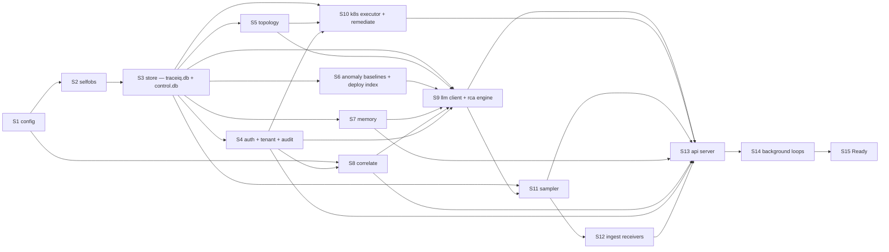

# 04 — TraceIQ Execution Flow

> Revision 2 — 2026-09-15 — applies decision register DR-2, DR-3, DR-5, DR-6, DR-7, DR-8, DR-9, DR-10, DR-11, DR-12, DR-13, DR-14, DR-15, DR-17, DR-18, DR-19, DR-20, DR-21, DR-23, DR-24, DR-25, DR-26, DR-27, DR-28, DR-29, DR-31, DR-33, DR-34, DR-37, DR-39 (round-1 fixes)

Companion to [`01-system-architecture.md`](./01-system-architecture.md), [`02-class-diagram.md`](./02-class-diagram.md), [`03-sequence-diagrams.md`](./03-sequence-diagrams.md). This document is bound by [`06-decision-register.md`](./06-decision-register.md) (DR-0): where it disagrees with the register, the register wins.

Scope: the lifecycle of the `cmd/traceiq` process — from `main()` through steady state to a clean exit — plus the concurrency contract every component must honour.

---

## 1. End-to-end execution flow

```mermaid
flowchart TD
    START(["main() — cmd/traceiq"]) --> S0

    subgraph STARTUP["Startup — strictly ordered, fail-fast"]
        direction TB
        S0["S0 parse flags, construct model.Clock RealClock,<br/>resolve config path, install signal handlers SIGINT SIGTERM"]
        S1["S1 config.Load<br/>defaults then YAML then TRACEIQ_ env then flags"]
        S1V{"S1v validate<br/>unknown key? invalid combination? 10 startup rules — 01 §7"}
        S2["S2 selfobs.Init<br/>slog logger, Prometheus registry,<br/>optional pprof, optional OTLP self-export"]
        S3["S3 store.Open<br/>mkdir data_dir, open hot/traceiq.db + control/control.db<br/>with their own PRAGMAs, Migrator.Up both files,<br/>ColdStore.ReplayWAL then HotIndex.BindColdBlock reconciliation"]
        S4["S4 auth.Init + tenant.Init<br/>load tokens, identity bindings, bootstrap admin token,<br/>TLS certs, tenant.PolicyStore open, audit log open + VerifyChain against last anchor"]
        S5["S5 topology.LiveGraph.Rehydrate<br/>load edges via topology.EdgeSource for topology.window"]
        S6["S6 anomaly.BaselineStore.Load<br/>seasonal baselines from anomaly_baseline (31 slots),<br/>DeployIndex from deploy_marker"]
        S7["S7 memory.Store.Open<br/>build memory_fp_token inverted index, load embeddings"]
        S8["S8 correlate adapters construct<br/>auth.EgressDialer allowlist, non-blocking health probe,<br/>refuse construction if TenantScoped=false and tenancy.enabled"]
        S9["S9 llm.Client + rca.Engine build<br/>select reasoner (rules default, llm on a successful probe),<br/>register 5 tools, reconcile rca.budget.max_cost_micro_usd (§17.1),<br/>rca.Journal.ListRunning aborts orphaned investigations"]
        S10["S10 k8s.Executor + remediate.Guard build<br/>validate allowlists, Guard.ExpireDue expires stale approvals (cleanup only)"]
        S11["S11 sampler build<br/>N shards, sampler.ReplayWAL re-assembles undecided traces,<br/>restore sampler_interest, drop expired predicates — runs BEFORE receivers bind"]
        S12["S12 ingest receivers bind<br/>4317 gRPC, 4318 HTTP, optional 14250/14268/9411"]
        S13["S13 api.Server build<br/>Deps wiring, middleware, embedded SPA,<br/>MCP /v1/mcp, Grafana, bind api.endpoint 127.0.0.1:8443"]
        S14["S14 start background loops<br/>see section 4"]
        S15["S15 mark Ready, /readyz returns 200"]

        S0 --> S1 --> S1V
        S1V -- invalid --> FAILCFG["log fatal, exit 2<br/>nothing was opened, names the offending key(s)"]
        S1V -- valid --> S2 --> S3
        S3 --> S4 --> S5 --> S6 --> S7 --> S8 --> S9 --> S10 --> S11 --> S12 --> S13 --> S14 --> S15
    end

    S15 --> STEADY

    subgraph STEADY["Steady state — concurrent loops, all owned by one errgroup"]
        direction TB

        subgraph L1["Ingest loop — per receiver"]
            I1["accept OTLP batch"] --> I2["auth.RateLimiter.Allow tenant, LimitIngest class"]
            I2 --> I3["Normalizer + Validator, semconv verbatim, KeyInterner"]
            I3 --> I4{"spanBatchCh has room within 100ms?<br/>bound: min(1024 batches, 256 MiB)"}
            I4 -- no --> I5["429 / RESOURCE_EXHAUSTED + Retry-After: 1"] --> I1
            I4 -- yes --> I6["ack immediately, enqueue"] --> I1
        end

        subgraph L2["Decode and route loop — GOMAXPROCS workers"]
            D1["pull batch"] --> D2["per span: RED-extract into the router-owned<br/>per-tenant,service,operation,10s-bucket accumulator<br/>— BEFORE the shard send, closes the shard_full RED hole"]
            D2 --> D3["shard = sampler.ShardFor ring, TraceID — rendezvous HRW hashing"]
            D3 --> D4["send to shardCh with 50ms timeout"]
            D4 -- timeout --> D5["drop span body, traceiq_ingest_spans_dropped_total reason shard_full<br/>RED contribution already recorded at D2"] --> D1
            D4 -- sent --> D1
        end

        subgraph L3["Assembly and decision loop — one goroutine per shard"]
            A0["append span bytes to the shard's spill WAL segment<br/>group fsync every sampler.wal.flush_interval 1s"] --> A1
            A1["dedupe on model.SpanID, drop duplicate before assembly,<br/>append to partialTrace"] --> A2["TimerWheel.Schedule — 256 slots x 250ms tick, two levels"]
            A2 --> A3{"GLOBAL memory watermark 512MiB crossed?<br/>one atomic counter across all shards"}
            A3 -- yes --> A4["shed oldest, KeepReason = KeepShed"] --> A5
            A3 -- no --> A5{"trace expired or root complete?"}
            A5 -- no --> A1
            A5 -- yes --> A6["Assemble model.Trace<br/>PathSignature = pre-order DFS edge hash"]
            A6 --> A7["stamp Kept + exemplar TraceIDs onto the router's RED accumulator<br/>— additive only, counts already recorded at D2"]
            A7 --> A8["sampler.PredicateSet.Match — bounded, inverted indexes<br/>byService/byErrorSig/byPathSig/byAttrKey"]
            A8 --> A9["Policy.Evaluate against the cached BaselineSnapshot<br/>— zero SQLite reads — six keep classes, then max_keep_rate 0.25 hard cap"]
            A9 --> A10["emit Decision, Trace, REDSamples; truncate WAL segment on decision"] --> A1
        end

        subgraph L4["Write loop — two writers, two files (DR-6)"]
            W1["telemetry writer: TraceBatcher accumulate<br/>200 traces or 250ms"] --> W2["traceiq.db single transaction:<br/>trace row committed cold_state=0 pending, wal_segment set<br/>— this is what makes the trace searchable at ack, never a 404"]
            W2 --> WC["control writer (control.db, separate goroutine):<br/>tenant/action/investigation/audit rows,<br/>p99 append <= 15ms independent of the telemetry batch_interval"]
            W2 --> W3{"tier = TierFull?"}
            W3 -- yes --> W4["ColdStore.Append — cold WAL group fsync<br/>250ms or 4MiB, CRC32C per record"] --> W5{"block sealed?<br/>32MiB row group / 128MiB block / 5m — max_open_blocks 2"}
            W5 -- yes --> W6["Seal, checksum, upload, insert block_manifest row,<br/>THEN HotIndex.BindColdBlock ranged UPDATE cold_state=1"] --> W1
            W5 -- no --> W1
            W3 -- no --> W1
        end

        subgraph L5["Topology loop"]
            T1["Consume span — on the PRE-SAMPLING ingest fan-out (post-LIM),<br/>independent of the sampling decision — DR-13, freshness < 1s"] --> T2["flush 10s edge buckets to EdgeSink every 10s;<br/>every NewEdge durably recorded, topology_edge_meta.is_new=1"]
            T2 --> T3["evict LRU by Calls over max_edges 20000 dev"] --> T1
        end

        subgraph L6["Detection loop — ticker 30s, eval_window 90s, debounce 2 ticks"]
            N1["Detector.Evaluate over Res10s REDSample buckets and baselines"] --> N2["DeployIndex.Near attaches deploy markers within 30m;<br/>deploy_regression is a Score+0.10 tag, not a 6th Kind"]
            N2 --> N3["drop events below min_event_score 0.55"] --> N4["Grouper.Add — O(1) amortized, neighborCache LRU 4096 TTL 60s,<br/>dedupe by Fingerprint within dedupe_ttl 30m"]
            N4 --> N5{"incident score at or above min_incident_score 0.6?"}
            N5 -- yes --> N6["enqueue on incidentCh; over max_open_incidents 200<br/>force-close lowest-score with Status=Expired"] --> N1
            N5 -- no --> N7["persist as Candidate only, no page"] --> N1
        end

        subgraph L7["Investigation loop — worker pool, 2 concurrent"]
            R1["dequeue incident; Dispatcher dedupes on open Fingerprint<br/>— a hit attaches, no second investigation starts"] --> R2["Contextualize — deterministic"]
            R2 --> R3["push ScopeInvestigation InterestPredicate — phase A, scope_ttl 30m"]
            R3 --> R4["Hypothesize via Reasoner llm or rules"] --> R5["Test via 5 tools, typed args, semantic validation"]
            R5 --> R6["Validate"]
            R6 --> R7{"confidence at or above 0.75, or wall_clock 5m /<br/>max_steps 24 / max_tool_calls 40 / tokens / cost exhausted?"}
            R7 -- no --> R5
            R7 -- yes --> R8["Report, Journal.Finish — TerminationReason recorded"] --> R9["memory.Store.Record InvestigationRecord"]
            R9 --> R10["remove ScopeInvestigation predicate;<br/>on Concluded and Confidence>=threshold push ScopeRecurrence — phase B"]
            R10 --> R11["AlertRouter — pages ONLY under P1/P2/P3 (01 §7, §9) — never on Concluded alone"] --> R1
        end

        subgraph L8["Serving loop — API, UI, MCP, chat, webhooks"]
            P1["accept request"] --> P2["auth.Authenticator, tenant.Resolver.FromSubject,<br/>RBAC capability check, auth.RateLimiter, audit"]
            P2 --> P3["dispatch handler, read-only against store"] --> P1
        end

        subgraph L9["Maintenance loops"]
            M1["Compactor — hourly: cascade RED 10s to 5m to 1h,<br/>expire whole blocks by manifest, L0 to L1 to L2 compaction,<br/>disk-budget escalation ladder Warn 0.80 / High 0.85 / Critical 0.95"]
            M2["memory consolidation — nightly 03:00: banded MinHash LSH dedupe,<br/>decay, prune at 400d"]
            M3["sampler.PredicateSet narrowing + ExpireDue — level 1..4 on keep-rate breach"]
            M4["SQLite WAL checkpoint — 60s each, traceiq.db and control.db independently"]
            M5["remediate.Guard.ExpireDue poller — 30s, DISPLAY/METRICS ONLY;<br/>the real expiry check is in-transaction at Execute"]
            M6["selfobs heartbeat and watchdog — 10s"]
            M7["auth.audit anchor writer — every auth.audit.anchor_interval 5m<br/>and at shutdown; signed checkpoint to a destination TraceIQ cannot rewrite"]
            M8["anomaly.BaselineStore.Checkpoint — incremental, <= 2000 dirty rows / 60s"]
        end
    end

    STEADY --> SIG{"SIGTERM or SIGINT"}

    subgraph SHUTDOWN["Graceful shutdown — reverse dependency order, budget ops.shutdown_grace 45s"]
        direction TB
        X1["X1 /readyz starts failing, 5s drain window for load balancers"]
        X2["X2 receivers stop accepting; in-flight requests finish within api.write_timeout"]
        X3["X3 close spanBatchCh; decode workers drain and exit"]
        X4["X4 sampler.FlushAll — force-complete every open trace with<br/>KeepReason=KeepShed, emit Decisions+RED; truncate sampler WAL segments"]
        X5["X5 topology.Flush — flush open edge buckets through EdgeSink"]
        X6["X6 anomaly.BaselineStore.Checkpoint — final dirty-key checkpoint"]
        X7["X7 rca — abort in-flight investigations Status=Aborted reason=shutdown;<br/>every completed step is already journalled"]
        X8["X8 remediate — no new transitions; an in-flight Executing action<br/>is LEFT for restart reconciliation, never cancelled mid-apply"]
        X9["X9 cold store — seal open blocks or spill to store.cold.wal_dir;<br/>run HotIndex.BindColdBlock for anything sealed"]
        X10["X10 control writer drains, then telemetry writer drains;<br/>wal_checkpoint TRUNCATE on both files"]
        X11["X11 audit process.shutdown appended; FINAL ANCHOR WRITTEN; chain closed"]
        X12["X12 listeners closed; exit 0"]

        X1 --> X2 --> X3 --> X4 --> X5 --> X6 --> X7 --> X8 --> X9 --> X10 --> X11 --> X12
    end

    SIG --> X1
    X12 --> EXIT0(["exit 0"])

    SIG -. "grace exceeded" .-> FORCE["force path: spill open Parquet buffers to cold WAL,<br/>one 5s checkpoint attempt, log shutdown_forced naming the stalled stage"] --> EXIT1(["exit 1"])
```

**Startup reconciliation (the mirror image of shutdown, DR-33 §33.2):** `rca.Journal.ListRunning` aborts investigations orphaned by a crash (S9); `Guard.ExpireDue` expires stale approvals (S10); `ColdStore.ReplayWAL` and `HotIndex.BindColdBlock` run before receivers bind (S3); `sampler.ReplayWAL` runs before receivers bind (S11).

---

## 2. Startup order and dependency graph

Each stage may only depend on stages before it. `cmd/traceiq` builds components in this order and registers each in a `lifecycle.Registry` that records the reverse order for shutdown. `model.Clock` (`NewRealClock()`) is constructed at S0 and injected into every component built from S3 onward — no component under `internal/*` except `internal/model` and `cmd/traceiq` may call `time.Now`/`time.Since`/`time.After`/`time.Tick`/`time.NewTimer`/`time.NewTicker` directly (`internal/archtest`, DR-31).

**Mode gating.** `server.mode` decides which stages run (`server.profile: dev|prod` is a separate, orthogonal safety axis — DR-26 §26.1):

| Stage | `single` | `gateway` | `sampler` | `brain` | `api` |
|-------|:--------:|:---------:|:---------:|:-------:|:-----:|
| S1–S4 config, selfobs, store, auth+tenant | ✅ | ✅ (store = manifest read only) | ✅ | ✅ | ✅ |
| S5 topology | ✅ | — | ✅ (observe only) | ✅ | ✅ (read) |
| S6 anomaly baselines | ✅ | — | — | ✅ | — |
| S7 memory | ✅ | — | — | ✅ | ✅ (read) |
| S8 correlate | ✅ | — | — | ✅ | ✅ |
| S9 llm + rca | ✅ | — | — | ✅ | — (proxies to brain) |
| S10 k8s + remediate | ✅ | — | — | ✅ | ✅ (API surface) |
| S11 sampler | ✅ | — | ✅ | — | — |
| S12 receivers | ✅ | ✅ | — (consumes bus) | — | — |
| S13 api | ✅ | ✅ (health only) | ✅ (health only) | ✅ (internal) | ✅ |

**Reasoner selection at S9** (`rca.reasoner: auto`): resolve `rca.llm.api_key_env` / `api_key_file`; if a key exists, issue a 1-token probe request against `claude-opus-5` with a 25 s timeout (`rca.llm.timeout`). Probe success → `llm`; probe failure or no key → `rules`, logged once at `WARN` with the reason. The selection is recorded on every `rca.Investigation.ReasonerKind`, so a degraded run is never mistaken for a normal one. Re-probing happens every 15 minutes while degraded. Startup also reconciles the worst-case cost of `rca.budget.max_tool_calls` (40) against `rca.budget.max_cost_micro_usd` using `rca.llm.pricing`; if it does not fit, `max_tool_calls` is reduced at startup to the largest value that does, logged at `WARN` and exposed as `rca.budget.effective_max_tool_calls` (DR-17 §17.1).

**Orphan recovery at S9**: any `investigation` row with `status = Running` and no live goroutine is set to `Aborted` with `error = "process restarted"` via `rca.Journal.ListRunning` (DR-15); its incident returns to `Candidate` so it is re-queued if it still scores above threshold.

---

## 3. Health and readiness semantics

**The rule (DR-33 §33.1), stated once and cited: a probe that can fail on all replicas at once must not gate Service membership.**

| Probe | Path | Returns 200 when | Returns 503 when | K8s use |
|-------|------|------------------|------------------|---------|
| Liveness | `/healthz` | Process is running, config is loaded, and the watchdog has seen a heartbeat from every registered loop within 60 s | A registered loop has missed 3 consecutive heartbeats (deadlock or wedged goroutine) | `livenessProbe`, `failureThreshold: 3`, `periodSeconds: 10` → restart |
| Readiness | `/readyz` | ALL of: (1) every stage required by `server.mode` reached `Ready`; (2) migrations applied on both files; (3) receivers bound (in modes that receive); (4) a write probe on BOTH `traceiq.db` AND `control.db` succeeded within the last 30 s; (5) disk below `store.budget.high_watermark` — ONLY when `action_on_full: stop_ingest`; (6) shutdown has not begun | Any of the six fails | `readinessProbe`, `periodSeconds: 5` → remove from Service endpoints |
| Startup | `/readyz` with `initialDelaySeconds: 0`, `failureThreshold: 60` | Same as readiness | Same as readiness | `startupProbe` — covers long migrations and baseline rehydration on large stores |

`/readyz` **never** probes object storage, Kafka lag, the hot-index cluster, the LLM, or the log/metric adapters — an S3 partial outage failing every gateway pod's readiness simultaneously would pull ingest out of rotation cluster-wide while the cold store is, by design, only WAL-spilling and non-blocking (§5.2). Those dependencies surface only on `/readyz?verbose=true` and as `traceiq_component_degraded{component=...}` gauges.

`/healthz` = process up and config loaded, and is unaffected by a hot-store write failure, so Kubernetes does not restart a pod that would fail identically (`AC-XOPS-11`, `AC-XOPS-12`).

---

## 4. Concurrency model

`N = sampler.shards` (default `GOMAXPROCS`); `W = ingest.decode_workers` (default `GOMAXPROCS`).

| Component | Goroutines | Channel / buffer | Backpressure behaviour |
|-----------|-----------|------------------|------------------------|
| `ingest.OTLPGRPCReceiver` | 1 acceptor + 1 per stream, capped by `max_concurrent_streams` 256 | writes `spanBatchCh` (1024 batches, hard-bound `max_bytes` 256 MiB) | 100 ms enqueue timeout → `RESOURCE_EXHAUSTED` + `Retry-After: 1`; the collector retries, TraceIQ never grows unbounded |
| `ingest.OTLPHTTPReceiver` | `net/http` pool, bounded by API body limits and listener backlog | same `spanBatchCh` | 100 ms timeout → HTTP 429 + `Retry-After: 1` |
| `ingest.JaegerReceiver` / `ZipkinReceiver` | 1 acceptor each, only when enabled | same `spanBatchCh` | same as OTLP |
| decode/route workers | `W` (default 8) | reads `spanBatchCh`; extracts RED per span into the router accumulator; writes `shardCh[i]` (4096 spans each) | 50 ms send timeout → drop span body, increment `traceiq_ingest_spans_dropped_total{reason="shard_full"}` — RED already recorded before the send attempt (DR-9) |
| `sampler.Shard` | `N` (default 8), one goroutine each, **never shared** | owns `shardCh[i]`; appends to its own spill-WAL segment; writes `Decisions()` (512, block), `Traces()` (512, block), `REDSamples()` (8192, drop-oldest+counter) | `Decisions`/`Traces` block (correct — the writer is the real bottleneck); `REDSamples` drops oldest with a counter; on panic the shard restarts and `ReplayWAL` re-assembles every undecided trace from its own WAL segment before rebinding — loss is bounded to one `sampler.wal.flush_interval` (1 s), not the whole shard |
| `sampler.TimerWheel` | none (driven by the shard goroutine) | 256 slots × 250 ms tick, two levels, 64 s span | — |
| `sampler.PredicateSet` | none; read via atomic snapshot pointer, rebuilt on add/remove | inverted indexes `byService`/`byErrorSig`/`byPathSig`/`byAttrKey` | Writers take a mutex and swap a new snapshot; readers are lock-free |
| RED dedupe ring (rebalance) | none, owned by the telemetry writer merge step | in-memory ring, `sampler.red.dedupe_window` 200 000 entries, TTL `2 × assembly.hard_timeout` | keyed `(tenant, epoch, trace_id, service, operation, bucket_start)`; a duplicate key is a merge no-op — a split trace contributes to RED exactly once (DR-8) |
| `store` telemetry writer (`traceiq.db`) | **exactly 1** | reads `Traces()`/`REDSamples()` via `TraceBatcher`; batches 200 traces / 250 ms | Target ≥ 2 000 committed rows/s, ≥ 20 tx/s, p99 commit ≤ 120 ms. Slow disk → batcher backs up → shard goroutines block → `shardCh` fills → receivers 429. Backpressure is end-to-end and visible |
| `store` control writer (`control.db`) | **exactly 1**, separate goroutine from the telemetry writer | tenant/action/investigation/evidence/audit rows | Target ≥ 200 tx/s, p99 audit append ≤ 15 ms, **independent of** the telemetry `batch_interval` — this is the fix for an audit write queued behind a 250 ms trace batch (DR-6 §6.2) |
| `store` hot-index readers | `store.hot.sqlite.max_read_conns` 8, pooled | — | Reader pool exhaustion → request waits up to the API read timeout then 503 |
| `store` Parquet writer | 1 per open block, `max_open_blocks` **2** (was 4) | internal column buffers, `row_group_bytes` 32 MiB | Object-store failure → spill to `store.cold.wal_dir`, exponential backoff 1 s→60 s, `traceiq_component_degraded{component="cold_store"}` = 1; hot index keeps working, the trace stays queryable via `ReadFromWAL` |
| `topology.LiveGraph` | 1 flusher; `Consume` is called inline on the pre-sampling ingest fan-out and guarded by sharded mutexes | `edgeFlushCh` (256) | Over `topology.max_edges` **20 000** (dev) → evict lowest-`Calls` edge, increment `traceiq_topology_edges_evicted_total`; every `NewEdge` is additionally recorded durably so drop-oldest can delay but never lose a detection |
| `anomaly.Engine` | 1 ticker + 1 goroutine per detector (5) | `eventCh` (1024) | Full → drop with `WARN` and counter; detectors are idempotent and the next 30 s tick re-derives; `eval_window` 90 s, `debounce_ticks` 2 |
| `anomaly.Grouper` | **1** (leader-only in K8s) | reads `eventCh`, writes `incidentCh` (64) | Blocks when RCA is saturated — intentional, prevents incident floods; `max_open_incidents` 200 force-closes the lowest-score incident over cap |
| `rca.Engine` | dispatcher 1 + worker pool `rca.max_concurrent_investigations` **2**, guarded by `semaphore.Weighted` | reads `incidentCh`; queue depth surfaced as `traceiq_rca_queue_depth` | Queue depth over 32 → `traceiq_rca_queue_saturated`, new investigations downgrade to the `rules` reasoner (DR-17 §17.3) |
| `rca` tool calls | at most 1 in flight per investigation (sequential by design, for replayability) | — | Per-tool timeout 15 s; `correlate` timeout 10 s; failures become `Verdict = unavailable` steps, never panics; a validation failure counts against `max_tool_calls` too (DR-16 §16.3) |
| `llm.Client` | 1 request at a time per investigation | — | `timeout` 25 s (was 60 s), `max_retries` 2 (was 3) per attempt; 429/5xx exponential backoff with jitter honouring `Retry-After`; the reasoner swaps to `rules` mid-loop on any of six triggers (transport ×3, refusal ×2, daily cap, saturation, schema ×2, canary ×2) and never swaps back (DR-34 §34.4) |
| `correlate` adapters | bounded by `correlate.max_inflight` (4 per tenant) and `max_inflight_global` (16); breaker opens after `breaker_failures` 5 for `breaker_open` 30 s | — | All outbound calls go through `auth.EgressDialer.HTTPClient`; hard 10 s timeout; a cache (LRU 2048, per-tenant partitioned) absorbs repeats |
| `memory.Store` | read-mostly; writes serialized through the control writer | — | `Similar()` scores ≤ `memory.retrieval.max_candidates` 500 regardless of corpus size; nightly consolidation (banded MinHash LSH) takes the write lock in bounded chunks |
| memory consolidation | 1 (leader-only in K8s), nightly 03:00 | — | Skips the run if a prior run is still active; published to complete within `memory.consolidation.max_duration` 15 m at 100k records |
| `remediate.Guard` | 1 verify-poller (30 s, display/metrics only) + 1 goroutine per executing action, hard cap 4 | — | `remediate.exec_timeout` 30 s per executor call; expiry is enforced **inside the same transaction** as the `Approved → Executing` compare-and-set (DR-23 §23.3), not by the poller; a hung executor marks the action `Failed` and triggers rollback from the pre-snapshot unless the live `resourceVersion` has changed (then `Failed, reason=concurrent_modification` + immediate page) |
| `api.HTTPServer` | `net/http` goroutine per connection | — | Per-class limits from `01 §8.4`: API 100 rps/burst 200, ingest 20 000 spans/s/token, NL 20/min, webhook 5 rps, chat 1 rps/user, MCP 10 rps |
| `api.MCPServer` (`/v1/mcp`) | shares the HTTP pool | — | Same limits as REST; per-tool `MinRole` check before dispatch (12 tools, DR-29 §29.2) |
| `nl.Answerer` | 1 per request | — | Over the NL rate limit → 429; every data access goes through `rca.ToolRegistry.Dispatch` — no second query path |
| `store.Compactor` | 1 (leader-only in K8s), hourly | — | Runs in 5 000-row batches with a short sleep between batches so it never starves the write path; disk-budget escalation ladder (Warn 0.80 / High 0.85 / Critical 0.95) applies here |
| `auth.AuditSink` anchor writer | 1 (leader-only in K8s) | — | Every `auth.audit.anchor_interval` 5 m and at shutdown, writes a signed checkpoint to a destination TraceIQ cannot rewrite (DR-27 §27.3) |
| `selfobs` watchdog | 1, 10 s tick | heartbeat map | 3 missed heartbeats from any loop → `/healthz` 503 → K8s restarts the pod |
| `cluster` leader election | 1 (K8s only) | — | Lease lost → singleton loops (grouper, compactor, consolidator, audit appender) stop within 2 s; a non-leader `api` replica forwards audit appends over the internal control channel or, if unavailable, **refuses the operation** fail-closed (DR-27 §27.2) |

**Total steady-state goroutine count, single mode, defaults, 8 cores:** ~8 (decode) + 8 (shards) + 2 (SQLite writers: telemetry + control) + 2 (Parquet, `max_open_blocks: 2`) + 1 (topology flush) + 6 (anomaly) + 1 (grouper) + 3 (RCA) + 1 (audit anchor) + 6 (maintenance) + `net/http` pool ≈ **38 + connection goroutines**.

---

## 5. Failure handling per stage

### 5.1 Startup failures

| Stage | Failure | Behaviour |
|-------|---------|-----------|
| S1 config | Any of the ten startup validation rules in `01 §7` fails (e.g. a non-loopback listener without TLS+auth, `alerting.gate: immediate`, a network correlate driver with `tenant_mode: none`, `remediate.mode: execute` on `server.profile: dev`) | `exit 2` with the offending key path(s). Nothing has been opened, so there is nothing to clean up. |
| S3 store | `data_dir` not writable | `exit 3`. |
| S3 store | Either SQLite file corrupt | Attempt `PRAGMA integrity_check`; on failure rename to `<file>.corrupt.<ts>`, create a fresh file, rebuild what is rebuildable from Parquet blocks (`traceiq.db`) or refuse to start (`control.db` — irreplaceable), log `CRITICAL store_rebuilt`. |
| S3 store | Migration fails midway on either file | Migrations run inside one transaction each; a failed migration rolls back and `exit 3` with the file and version number. No partial schema. |
| S3 store | Cold WAL replay finds a torn block | Torn segment is quarantined to `cold/wal/quarantine/`, replay continues, `traceiq_cold_wal_quarantined_total` incremented. |
| S4 auth | Audit hash chain diverges from the last anchor | Startup continues, but a `Critical` incident `audit_chain_broken` is raised immediately and `/readyz?verbose` reports it. Refusing to start would destroy the evidence. |
| S4 auth | `auth.mode: token` with no tokens and no bootstrap env var | Generate a one-time admin token, print it to stderr **once**, store only its `argon2id` hash, log that it will not be shown again. |
| S6 baselines | `anomaly_baseline` empty (first run) | Detectors stay Cold until `warmup_samples` 200 (global slot); no events fire. This is normal, not an error. |
| S8 correlate | Backend unreachable, or `Capabilities().TenantScoped == false` with `tenancy.enabled: true` | Unreachable: non-fatal, adapter marked degraded, tools return `unavailable`, investigations name the missing-evidence class. Tenant-scope violation: construction refused, `exit 2`. |
| S9 rca | LLM probe fails | Fall back to `rules`, log once, re-probe every 15 min. Never fatal. |
| S9 rca | Worst-case cost at `max_tool_calls: 40` exceeds `rca.budget.max_cost_micro_usd` | `max_tool_calls` is reduced to the largest reachable value, logged at `WARN`, exposed as `rca.budget.effective_max_tool_calls`. Never silently vacuous. |
| S11 sampler | Restored predicate references an unknown service | Predicate is dropped with a counter; a stale predicate must not widen retention silently. |
| S12 receivers | Port already bound | `exit 4` naming the port. Binding happens before `Ready`, so a half-started process never appears healthy. |

### 5.2 Steady-state failures

| Failure | Detection | Behaviour |
|---------|-----------|-----------|
| **Telemetry writer fails** (`traceiq.db`; disk full, I/O error) | Transaction error from the writer goroutine | Retry 3× with 50/200/800 ms backoff. Still failing → writer enters `degraded`: the batcher stops draining, backpressure reaches receivers (429), `/readyz` fails, `/healthz` stays 200. RED continues to an in-memory ring buffer (60 s) and replays on recovery. |
| **Control writer fails** (`control.db`) | Transaction error | Same retry; still failing → **fail-closed**: any operation whose audit row cannot be written is refused, per the invariant in §6. `/readyz` fails. |
| **Cold store write fails** (object storage down) | `Append`/`Seal` error | Spill to `store.cold.wal_dir` group-fsynced; the hot index already made the trace searchable via `ReadFromWAL`, so search and RCA keep working. `traceiq_component_degraded{component="cold_store"}` = 1. Ingest is **not** stopped. |
| **Disk budget exceeded** | Compactor check each hour + fast check | Escalation ladder (DR-12): `Warn` 0.80 — controller lowers the sampling floor within `max_step`; `High` 0.85 — floor at its minimum and still over budget raises `max_keep_rate` down 0.05/interval to a 0.05 hard floor, AND `action_on_full: shed_sampled` (default) deletes T3 `sampled` blocks oldest-first, then T0 span rows oldest-first — anomalous blocks are the last thing deleted, ever; `Critical` 0.95 — `stop_ingest` (receivers 429, `/readyz` fails) or keep shedding and raise a `Critical` incident. |
| **LLM unavailable / timeout / 429** | `llm.Client` retry exhaustion (`max_retries` 2) | 3 consecutive transport failures swap the running investigation to `rules` mid-loop (one of six swap triggers, DR-34 §34.4); already-completed steps keep their original `ReasonerKind`; confidence is capped at `confidence_threshold − 0.01` for the rest of the investigation; there is no swap back. No investigation ever fails solely because the LLM is down (P7). |
| **LLM returns malformed or off-schema output** | `rca.SchemaValidator` strict validation | Step recorded `Verdict = schema_error`. Two consecutive schema failures on the same step, or two canary violations in one investigation, trip a reasoner swap to `rules` (DR-34 §34.4, DR-37 §37.1(3)). |
| **Investigation budget exhausted** | `rca.Budget.Terminated()` | Loop stops deterministically on whichever dimension bound first (`model.TerminationReason`), partial report is written with the hypotheses tested so far and their evidence, and the incident is routed under paging condition **P2** (partial RCA attached) rather than silently dropped. |
| **Tool call has invalid args** | `SchemaValidator.ValidateToolArgs` | No tool is invoked; the step is recorded `Verdict = invalid_args` and **counts against `max_tool_calls`**, so an injected loop of malformed calls terminates on budget rather than spinning (DR-16 §16.3). |
| **Tool returns more rows than the cap** | `ToolRegistry` | Result truncated to `max_rows_per_tool_call` (500), `ToolResult.Clamped = true`, visible to the reasoner and in the report. |
| **RCA queue saturated** | `traceiq_rca_queue_depth` over 32 | New investigations downgrade to the `rules` reasoner, `traceiq_rca_queue_saturated` emitted. Incidents are never dropped — they stay `Candidate` and remain visible. |
| **Brain unavailable / RCA saturated** | deadman + `anomaly.Grouper.Stats().LastTickAt` | Detection and paging **continue**: every page in the window carries `custom_details.rca_state = "partial"` or `"none"`, `traceiq_component_degraded{component="rca"} = 1`, `/readyz` is unaffected (DR-21 §21.3). |
| **No detection tick for `alerting.deadman.interval` (10 m)** | `api`-owned deadman goroutine, no dependency on `brain` | Pages directly through the configured sinks, `traceiq_deadman_fired_total`, `custom_details.reason = "no detection tick"`. |
| **Anomaly detector panics** | `recover()` in the detector goroutine | Detector is quarantined for 5 minutes, others continue, `traceiq_detector_panics_total` incremented, stack logged. |
| **Shard goroutine panics** | `recover()` in the shard runner | Shard restarts with an empty assembly map; `ReplayWAL` re-assembles every undecided trace from the shard's own spill-WAL segment **before** the shard rebinds — loss is bounded to one `flush_interval` (1 s), counted exactly in `traceiq_sampler_traces_lost_total{reason="shard_panic"}`. Other shards are unaffected. |
| **Correlation backend slow or failing** | 10 s adapter timeout; breaker opens after 5 consecutive failures for 30 s | Step recorded `Verdict = unavailable`, named missing-evidence class in the report; while the breaker is open, calls fail fast (`traceiq_component_degraded{component="log_adapter"} = 1`); `/readyz` is unaffected. |
| **Remediation executor hangs** | 30 s executor timeout | Action → `Failed`; rollback runs from `PreSnapshotJSON` **unless** the live `resourceVersion` differs from the snapshot, in which case rollback is refused (`Failed, reason=concurrent_modification`), a `Critical` incident is raised, and the tenant's approval channels are paged immediately regardless of `alerting.min_severity` (DR-23 §23.9). |
| **Kubernetes RBAC denies an action** | API 403 | Action → `Failed, reason=scope_violation`; a `Critical` incident is raised and audited. |
| **Approval expires** | `Execute` re-checks `now < ExpiresAt` **inside the same transaction** as the `Approved → Executing` compare-and-set; the 30 s poller is display/metrics cleanup only | `409 action_expired`, audit row, **zero** executor calls. `approval_ttl` 15 m (was 30 m); `proposal_ttl` 60 m. |
| **Audit write fails** | Insert error | The originating operation is **refused** (fail-closed). An action that cannot be audited does not happen. Reads are unaffected. |
| **Leader lease lost** (K8s) | Lease renewal failure | Grouper, compactor, consolidator, and audit anchor writer stop within 2 s. All are idempotent; the new leader re-runs the current iteration. |
| **Kafka consumer lag** [P2] | Lag metric | Only relevant when `cluster.bus.driver: kafka` — the in-process ring stays the default in every mode, including Kubernetes (DR-32 §32.3). Sampler pods scale via HPA on lag; offsets commit only after the trace decision is written. |
| **Clock jumps backwards** | Monotonic vs. wall comparison, via the injected `model.Clock` | Timer wheel uses monotonic time; only bucket labels use wall time. A backward jump delays flushes but cannot drop traces. |

### 5.3 Shutdown failures

| Failure | Behaviour |
|---------|-----------|
| `ops.shutdown_grace` (45 s) exceeded | Force path: open Parquet buffers spill to `store.cold.wal_dir`, one SQLite WAL checkpoint attempt with a 5 s timeout on each file, `shutdown_forced` is logged naming the stage that stalled, `exit 1`. |
| Open traces remain at X4 | They are force-completed and written with `KeepReason = KeepShed`; nothing is discarded during shutdown without a recorded reason. |
| Running investigation at X7 | Context cancelled; the journal writes `Status = Aborted` with all steps completed so far, so the partial reasoning is preserved and replayable. |
| Parquet block cannot be sealed at X9 | Buffer is written to `store.cold.wal_dir` as a replayable segment with a checksum; the next start replays it. |
| SQLite checkpoint fails at X10 | The WAL file is left in place; the next start replays it. This is safe by design — WAL is the durability mechanism, not an optimization. |
| Audit anchor cannot be written at X11 | Shutdown still completes (`process.shutdown` is appended to the chain regardless); the missing final anchor is detected by the next `VerifyChain` and raises `audit_chain_broken` on the following start. |

---

## 6. Steady-state invariants

1. **One writer per file.** Exactly one goroutine writes `traceiq.db` (telemetry) and exactly one, separate, goroutine writes `control.db` (control plane) — DR-6. Every write path funnels through the matching batcher; there is no second write connection to either file.
2. **Bounded everything.** Every channel has a fixed capacity and a defined full-behaviour (block, drop-with-counter, or reject-upstream); the ingest queue's binding bound is bytes (`ingest.queue.max_bytes` 256 MiB), not batch count. No unbounded queue, slice-append buffer, or goroutine-per-item pattern exists on the hot path.
3. **Backpressure is end-to-end and visible.** Slow disk propagates to a 429 at the receiver within one channel depth, and every hop increments a labelled counter.
4. **The LLM is never load-bearing.** Every LLM branch has a deterministic fallback reachable within one step; a mid-loop reasoner swap preserves the investigation's ID, steps and evidence and never swaps back.
5. **Nothing is lost silently.** Every drop, shed, truncation, eviction, clamp, and quarantine increments a named metric and, where it affects a user-visible result, is stated in the artifact (report, answer, or decision reason).
6. **Idempotent singletons.** Grouper, compactor, consolidator, and the audit anchor writer can be killed at any point and re-run from the top without duplicating or corrupting state.
7. **Fail-closed on audit.** Any operation that cannot write its audit row does not proceed; a non-leader `api` replica that cannot forward an append to the leader refuses the operation rather than writing an unchained row.
