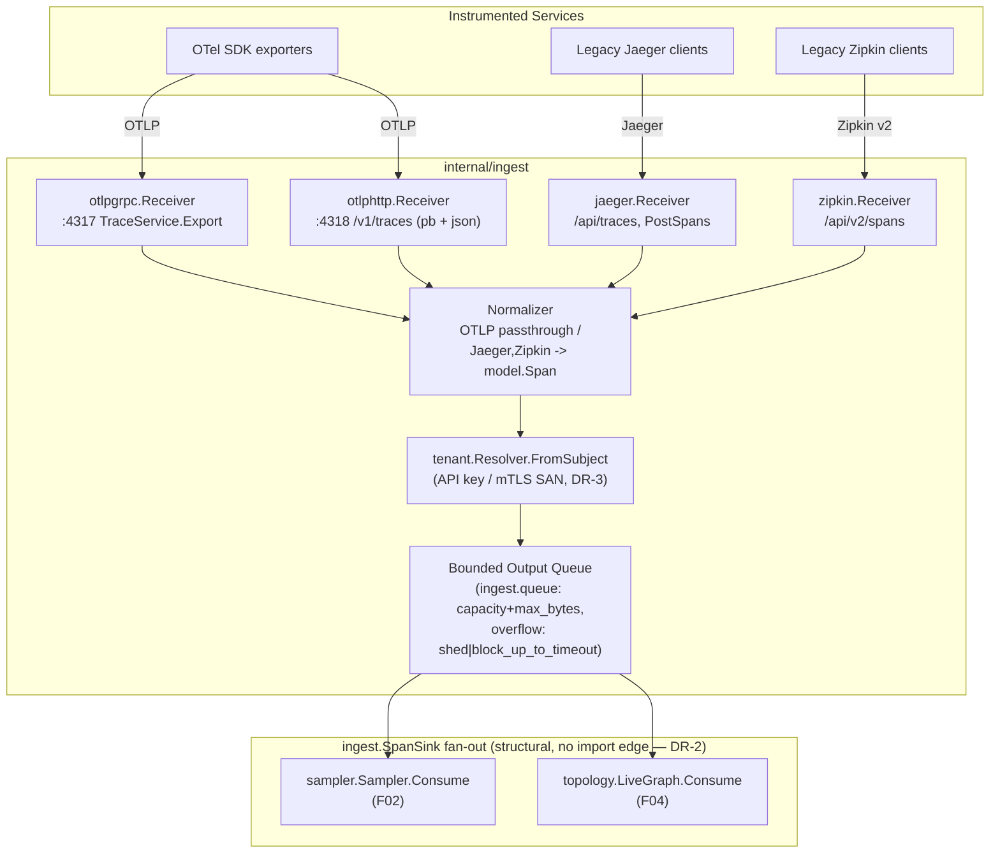
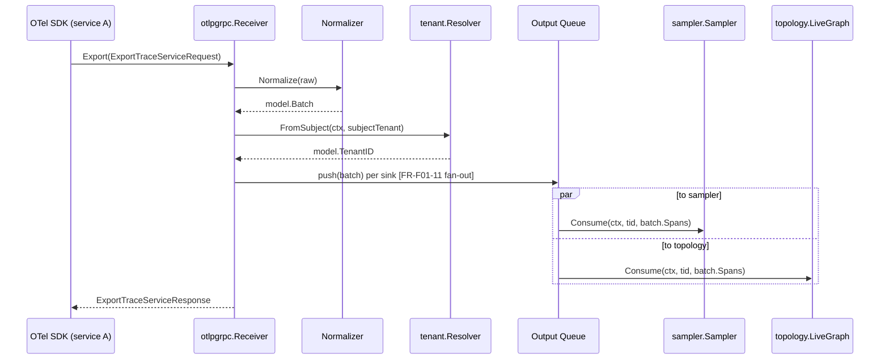

# F01 — Multi-format OTel-native ingest

> Revision 2 — 2026-09-15 — applies DR-0, DR-2, DR-3, DR-4, DR-9, DR-26, DR-28, DR-31 (round-1 fixes)

**Go package:** `internal/ingest` · **Catalog interface:** `ingest.Receiver` · **Drawbacks addressed:** D-Z1, D-D3

## 1. Purpose

`internal/ingest` is the single entry point through which every span reaches TraceIQ. It terminates
OTLP gRPC, OTLP HTTP/protobuf, and OTLP HTTP/JSON as first-class, always-on protocols, and terminates
Jaeger (Thrift/gRPC) and Zipkin v2 JSON as migration-only protocols that are normalized into the same
canonical model. The canonical model is the OTLP resource/span schema itself — not a TraceIQ-proprietary
shape — so ingest never performs a lossy semantic-convention translation, and every non-OTLP protocol
is an *adapter into* OTLP, never a second first-class citizen. Normalized `model.Span` batches are then
fanned out to every downstream consumer that needs the full, pre-sampling-decision stream: the tail
sampler (`internal/sampler`, F02) for trace assembly and retention decisions, and the topology builder
(`internal/topology`, F04) for real-time edge derivation, which must see 100% of traffic — including
traffic the sampler will later downsample — to keep the dependency graph accurate. Ingest is stateless
and horizontally scalable; it holds no trace-level state (that lives in the sampler).

**Fact ownership (DR-0):** this document owns no shared type, no DDL, no endpoint table and no config
default of its own. `model.*` types are owned by `01 §4`; every config key path here cites `01 §7`;
security limits cite `01 §8.4`. Where this doc previously re-declared a value, it now cites the owning
section and states none.

**Package adjacency (DR-2, normative in `02 §5`):** `internal/ingest` may import only `model`, `config`,
`tenant`, `selfobs`. It does **not** import `internal/sampler` or `internal/topology`. `ingest.SpanSink`
is declared *in this package* with a signature that mentions only `model`/`tenant`/stdlib types;
`sampler.Sampler.Consume` and `topology.LiveGraph.Consume` satisfy it **structurally** — no import edge
from `sampler`/`topology` back into `ingest`, and none from `ingest` into either of them.

## 2. Compared-tool drawbacks addressed

| Drawback ID | Tool | Lagging feature | How TraceIQ fixes it (concrete mechanism in this feature) |
|---|---|---|---|
| D-Z1 | Zipkin | Feature-frozen; OTel deprecated Zipkin exporters (Dec 2025) | OTLP gRPC/HTTP is the only first-class, always-on ingest path (`internal/ingest/otlpgrpc`, `internal/ingest/otlphttp`), built directly against `go.opentelemetry.io/proto/otlp`. `internal/ingest/zipkin` exists solely as a bounded migration adapter (`ProtocolZipkin`) that converts v2 JSON + B3 headers into `model.Span`/W3C `traceparent` and is disabled by default in new deployments (`ingest.zipkin_http.endpoint: ""`, DR-26 §26.5 canonical key) — TraceIQ never depends on Zipkin's own ecosystem momentum. |
| D-D3 | Datadog | Vendor lock-in; lossy OTel semantic-convention translation | The canonical `model.Span` struct (§4.2, `01 §4.1`) is a 1:1 field-for-field mirror of the OTLP resource/span/attribute schema. FR-F01-7 mandates byte-for-byte preservation of every OTel attribute key and value type (no renaming, no type coercion) on the OTLP path, within the `01 §8.4` limits table's caps — an over-cap attribute is truncated and flagged (`Span.Truncated`, `DroppedAttrsCount`), never silently altered (DR-26 §26.4). Because storage (F03) persists this same schema to open Parquet, a customer's data is never translated into a proprietary internal representation at any point in the pipeline — it can be read back with vanilla OTel semantics by any external tool. |

## 3. Requirements

### 3.1 Functional (testable)

| ID | Statement |
|---|---|
| FR-F01-1 | Ingest MUST accept OTLP/gRPC on a configurable port (default 4317) implementing `TraceService.Export` per `opentelemetry-proto`, and MUST return `ExportTraceServiceResponse` within 100ms p99 at 10,000 spans/sec sustained load. |
| FR-F01-2 | Ingest MUST accept OTLP/HTTP protobuf on `POST /v1/traces` (default port 4318, `Content-Type: application/x-protobuf`). |
| FR-F01-3 | Ingest MUST accept OTLP/HTTP JSON on the same path with `Content-Type: application/json`, decoding per the OTLP JSON encoding specification. |
| FR-F01-4 | Ingest MUST accept Jaeger batches (Thrift-over-HTTP `POST /api/traces` and Jaeger proto gRPC `PostSpans`) and convert them to `model.Span` with ≤ 1% field loss measured against a reference fixture set of ≥ 50 distinct span/attribute fields (`internal/ingest/jaeger/testdata/golden/*.json`). |
| FR-F01-5 | Ingest MUST accept Zipkin v2 JSON on `POST /api/v2/spans`, converting B3 single/multi-header propagation into the equivalent W3C `traceparent` fields on `model.Span`. |
| FR-F01-6 | *(rewritten, DR-28)* Every `Receiver` MUST publish normalized batches to a per-sink `ingest.queue` bounded in **both** batches and bytes (`capacity: 1024` batches, `max_bytes: 268435456` = 256 MiB — the hard, binding bound; `enqueue_timeout: 100ms`). No receiver goroutine may block unboundedly: every send is `select { case ch<-b: ; case <-clock.After(enqueue_timeout): ; case <-ctx.Done(): }`. On timeout, ingest applies `overflow_policy: shed` (default — return gRPC `RESOURCE_EXHAUSTED` / HTTP `429` with `Retry-After: 1`) or `block_up_to_timeout` (block at most `enqueue_timeout`, then shed). `overflow_policy: block` (unbounded) is **deleted**. |
| FR-F01-7 | For the OTLP path, ingest MUST preserve every resource attribute and span attribute key, value, and value type unchanged (no rename, no drop, no type coercion), verified by a round-trip fixture test comparing input OTLP bytes to output `model.Span` fields. |
| FR-F01-8 | A malformed batch (schema violation, missing required field, oversize attribute) MUST be rejected with `INVALID_ARGUMENT` (gRPC) / `400` (HTTP) scoped to that batch only; it MUST NOT crash the receiver process or block/delay any other in-flight batch. |
| FR-F01-9 | Ingest MUST export Prometheus-style metrics: `ingest_spans_received_total{protocol,tenant}`, `ingest_spans_rejected_total{protocol,reason}`, `ingest_batches_received_total{protocol}`, `ingest_latency_seconds{protocol}` (histogram). |
| FR-F01-10 | *(DR-3/DR-5)* Ingest MUST resolve `model.TenantID` via `tenant.Resolver.FromSubject(ctx, subjectTenant)` — the tenant is a property of the authenticated principal (API key or mTLS certificate SAN), **never** a header, body or query parameter — and stamp it onto every span in the batch before handoff to any sink; a batch with no resolvable principal is rejected `UNAUTHENTICATED`/`401`, except under `tenant.Resolver.FromDevDefault` (`server.profile: dev` **and** loopback **and** `auth.mode: none` only, DR-3/DR-26). |
| FR-F01-11 | Ingest MUST fan out every accepted, normalized batch to all registered `ingest.SpanSink`s (sampler, topology) independently — a slow or backpressured sink MUST NOT block delivery to other sinks beyond the configured per-sink `ingest.queue` capacity. |

### 3.2 Non-functional

| Category | Target |
|---|---|
| Throughput | Single ingest process sustains ≥ 50,000 spans/sec across all enabled protocols combined, < 200MB RSS attributable to receivers at that load. |
| Latency | p99 receive-to-fan-out latency < 50ms, excluding downstream sink processing. |
| Reliability | At-least-once delivery to sinks; duplicate spans (same `trace_id`+`span_id` redelivered after a client retry) are **not** deduplicated in ingest itself. Safety is provided downstream: `sampler.partialTrace` holds a `map[model.SpanID]struct{}` and drops a duplicate `SpanID` before both assembly and RED extraction, counted in `traceiq_ingest_spans_duplicate_total` (DR-9 §9, "RED before every discard" — this is the mechanism that makes ingest's at-least-once claim safe, not a claim ingest itself enforces). |
| Security | TLS **1.3** minimum on every listener (`auth.tls.min_version` / per-protocol `tls.min_version`, DR-26 §26.5); 1.2 is permitted only via an explicit per-listener override, logged at `WARN`. Every HTTP/gRPC endpoint requires a resolvable principal (`ingest.auth.mode: token \| mtls`) unless `ingest.auth.mode: none`, which is refused outside `server.profile: dev` **and** a loopback listener (DR-26 §26.3 rule 1/3). Limits (batch size, span size, attribute counts/sizes, rates) are owned by `01 §8.4` and cited, not restated here (DR-0). |
| Portability | Identical `Receiver` implementations run as embedded goroutines in single-binary mode (`server.mode: single`) and as a `gateway`-mode `Deployment` behind a `Service` in the Helm chart — no code fork between modes. |
| Cost | *(rewritten, DR-28 §28.2)* "Zero allocation-per-span" is not credible against a per-span map plus a pointer per attribute and is **deleted**. Replaced by a measured, CI-enforced budget (`01 §10.1`): OTLP protobuf → `model.Span` ≤ **6 allocs/span, ≤ 512 B/span**; Jaeger gRPC → `model.Span` ≤ **8 allocs/span, ≤ 640 B/span**; Zipkin JSON → `model.Span` ≤ **14 allocs/span, ≤ 1 024 B/span** — gated by `go test -bench -benchmem`, CI fails at +10% regression, `allocs/span`/`bytes/span` published per protocol on every commit. Mechanism: `ingest.KeyInterner` (sharded `map[string]string`, `max_keys: 4096`, LRU) interns repeated attribute keys once per process; `Span.AttrSorted() []model.KV` is drawn from a `sync.Pool`; `Span.Attrs` (`AttrMap`) is materialised lazily, only when a control-plane caller asks for it. |

## 4. Design

### 4.1 Component diagram



### 4.2 Data model

**Deleted per DR-4.** `model.Span`, `model.Resource`, `model.AttributeValue` and `model.Batch` are
declared exactly once, in `01 §4.1`; this document cites them and declares none of its own. Fields
`01 §4.1` carries that earlier drafts of this doc dropped, and that ingest MUST populate: `Span.Scope`,
`Span.Flags`, `Span.TraceState`, `Span.SourceFormat`, `Span.ReceivedUnixNano`, `Span.SizeBytes`,
`Span.DroppedAttrsCount`/`EventsCount`/`LinksCount`, and the helpers `Service()`, `DurationNanos()`,
`IsError()`, `IsRoot()`. `TenantID` on `Span` is `model.TenantID` (DR-3/DR-5), stamped by the `AUTH`
stage, empty until then.

The canonical ingest unit is `model.Batch` (`01 §4.1`, DR-4):

```go
type Batch struct {                            // model.Batch — canonical, 01 §4.1
    Tenant           TenantID
    Spans            []Span
    SourceFormat     SourceFormat
    ReceivedUnixNano uint64
    SourceAddr       string
    SizeBytes        uint32
}
```

**Attribute hot path (DR-4 PD-19):** `Span.Attrs` stays `AttrMap` on the control plane; the OTLP decode
hot path builds a sorted `[]KV` with interned keys and converts lazily:

```go
type KV struct { Key string; Val AttrValue }   // Key interned via ingest.KeyInterner
func (s *Span) AttrSorted() []KV               // allocation-free view, §3.2
```

The "zero allocation per span" NFR is deleted and replaced by the measured budget in §3.2.

### 4.3 Interfaces & APIs

```go
package ingest

type Protocol string

const (
    ProtocolOTLPGRPC Protocol = "otlp-grpc"
    ProtocolOTLPHTTP Protocol = "otlp-http"
    ProtocolJaeger    Protocol = "jaeger"
    ProtocolZipkin    Protocol = "zipkin"
)

// Receiver is the catalog-fixed interface: accepts spans in any supported
// format, emits model.Span batches (via its configured SpanSink).
type Receiver interface {
    Start(ctx context.Context) error
    Stop(ctx context.Context) error
    Protocol() Protocol
}

// SpanSink receives normalized, tenant-stamped span batches. Declared in
// this package per DR-2's structural-interface rule: the signature mentions
// only model/tenant/stdlib types, so sampler.Sampler.Consume and
// topology.LiveGraph.Consume satisfy it WITHOUT internal/ingest importing
// internal/sampler or internal/topology, and without either of them
// importing internal/ingest. Multiple sinks are registered; ingest fans out
// to all of them independently (FR-F01-11).
type SpanSink interface {
    Consume(ctx context.Context, tid model.TenantID, spans []model.Span) error
}

// Normalizer converts a protocol-specific wire object into model.Batch.
// otlpgrpc/otlphttp implementations are near-identity transforms;
// jaeger/zipkin implementations perform field mapping.
type Normalizer interface {
    Normalize(raw any) (model.Batch, error)
}

// Tenant resolution uses tenant.Resolver (internal/tenant, DR-3) directly —
// ingest declares no resolver interface of its own. ingest.TenantResolver
// is DELETED (DR-3): FromSubject(ctx, subjectTenant) is the sole production
// path; FromDevDefault is legal only under server.profile: dev + loopback +
// ingest.auth.mode: none (DR-3 §3, DR-26 §26.3 rule 3).

// New constructs a Receiver set with an injected clock (DR-31): every
// timeout in this package (enqueue_timeout, TLS reload debounce) reads
// model.Clock rather than calling time.Now/time.After directly, so
// internal/archtest's time-ban check passes and the eval harness's
// VirtualClock can drive ingest deterministically.
func New(cfg Config, clock model.Clock, resolver tenant.Resolver, sinks []SpanSink) (*Server, error)
```

**REST/gRPC surface exposed by this feature** — filtered view; defined in `01 §6.1` (DR-0).

| Endpoint | Protocol | Notes |
|---|---|---|
| `TraceService.Export` | gRPC, port 4317 | OTLP gRPC, per `opentelemetry-proto/collector/trace/v1` |
| `POST /v1/traces` | HTTP, port 4318 | OTLP HTTP, protobuf or JSON by `Content-Type` |
| `POST /api/traces` | HTTP, port 14268 (Jaeger-compatible) | Jaeger Thrift-over-HTTP, migration only |
| `PostSpans` | gRPC, Jaeger collector proto | Jaeger gRPC, migration only |
| `POST /api/v2/spans` | HTTP, port 9411 (Zipkin-compatible) | Zipkin v2 JSON, migration only |
| `GET /healthz`, `GET /readyz` | HTTP | Liveness/readiness for K8s probes |

**Config keys** — owned by `01 §7`; this section cites key paths only, never defaults (DR-0):

- `ingest.otlp_grpc.endpoint`, `ingest.otlp_grpc.tls.*` — **not** `ingest.otlp.grpc.port` (DR-26 §26.5 canonical name)
- `ingest.otlp_http.endpoint`, `ingest.otlp_http.tls.*`
- `ingest.jaeger_grpc.endpoint`, `ingest.zipkin_http.endpoint` — empty string disables the migration protocol
- `ingest.auth.mode: none | token | mtls`, `ingest.auth.tokens_file`, `ingest.auth.client_ca_file` — **not** `ingest.auth.disabled` (DR-26 §26.2); `mode: none` refused outside `server.profile: dev` + loopback (DR-26 §26.3 rule 1/3)
- `ingest.queue.capacity` (batches), `ingest.queue.max_bytes`, `ingest.queue.enqueue_timeout` — the bounded per-sink queue of FR-F01-6 (DR-28); `ingest.queue.overflow_policy: shed | block_up_to_timeout` — unbounded `block` no longer exists
- `ingest.limits.*` (batch/span/attribute size and count caps, `oversize_attr: truncate|reject`) — owned by `01 §8.4`'s single limits table (DR-26 §26.4), cited here and nowhere restated

### 4.4 Algorithms / decision logic

```
function HandleInbound(rawBatch, protocol, ctx):
    batch, err = normalizerFor(protocol).Normalize(rawBatch)
    if err != nil:
        metrics.Inc(spans_rejected_total{protocol, reason="malformed"})
        return ERROR(INVALID_ARGUMENT, err)          # FR-F01-8: batch-scoped, no crash

    if sizeOf(batch) > ingest.limits.max_batch_bytes:   # 01 §8.4, DR-26 — cited, not a local constant
        metrics.Inc(spans_rejected_total{protocol, reason="oversize"})
        return ERROR(INVALID_ARGUMENT, "batch too large")

    # FR-F01-10 (DR-3/DR-5): tenancy resolves from the authenticated principal only.
    if server.profile == "dev" and listener.isLoopback() and ingest.auth.mode == "none":
        tenantID, err = tenant.Resolver.FromDevDefault(ctx)
    else:
        subjectTenant = principal.Tenant                # from mTLS SAN or bearer token, never header/body/query
        tenantID, err = tenant.Resolver.FromSubject(ctx, subjectTenant)
    if err != nil:
        metrics.Inc(spans_rejected_total{protocol, reason="unauthenticated"})
        return ERROR(UNAUTHENTICATED, err)

    for span in batch.Spans:
        span.TenantID = tenantID

    for sink in registeredSinks:                       # FR-F01-11: independent fan-out, each its own queue
        select:
            case outputQueue[sink].push(batch):
                metrics.Inc(spans_received_total{protocol, tenant=tenantID}, len(batch.Spans))
            case <-clock.After(ingest.queue.enqueue_timeout):   # FR-F01-6 (DR-28): bounded wait, never unbounded block
                if ingest.queue.overflow_policy == "block_up_to_timeout":
                    metrics.Inc(spans_rejected_total{protocol, reason="queue_full_after_wait"})
                else:   # "shed" — the default
                    metrics.Inc(spans_rejected_total{protocol, reason="queue_full"})
                return ERROR(RESOURCE_EXHAUSTED, "sink queue full", retry_after=1s)
            case <-ctx.Done():
                return ERROR(CANCELLED, ctx.Err())

    return OK(ExportTraceServiceResponse{})

# One drain goroutine per sink queue, started at Receiver.Start:
function drainLoop(sink SpanSink, q outputQueue):
    for batch in q:
        sink.Consume(ctx, batch.Tenant, batch.Spans)    # ingest.SpanSink — DR-2, structural, no import edge
```

Jaeger/Zipkin normalization is a pure field-mapping function driven by a static table (span kind,
status, B3→traceparent, tag type coercion) validated against golden fixtures per FR-F01-4/5; no
runtime branching beyond table lookup, keeping it O(1) per span.

### 4.5 Sequence diagram



## 5. Failure modes & mitigations

| Failure | Detection | Mitigation |
|---|---|---|
| Receiver port fails to bind (conflict, permission) | Startup error, process exits non-zero | Fail fast with actionable log; Helm readiness probe never passes, K8s restarts with backoff; single-binary mode prints port-conflict hint. |
| Malformed batch from a misbehaving client | Normalizer returns error | Reject that batch only (FR-F01-8); increment `spans_rejected_total`; client retries or is logged for operator triage. |
| Downstream sink (sampler/topology) backpressures | Output queue depth metric crosses threshold | *(Corrected, DR-28)* `block_up_to_timeout` bounds backpressure to the gRPC/HTTP caller by at most `ingest.queue.enqueue_timeout` (standard OTLP client retry/backoff handles the shed that follows); `shed` (default) sheds load immediately with `429`/`RESOURCE_EXHAUSTED` + `Retry-After: 1`. Unbounded `block` no longer exists — no policy can grow the queue past `capacity`/`max_bytes`. |
| Duplicate delivery after client-side retry | Same `trace_id`+`span_id` seen twice | Not deduplicated in ingest (stateless by design); `sampler.partialTrace`'s `map[model.SpanID]struct{}` drops the duplicate before both assembly and RED extraction (DR-9 §9), so duplicates are harmless downstream. |
| TLS certificate expiry | TLS handshake failures spike in metrics | Cert rotation via K8s secret mount + SIGHUP-triggered reload (no restart required); alert on `ingest_tls_handshake_failures_total`. |
| Clock skew between instrumented services | Span `StartUnixNano`/`EndUnixNano` inconsistent with ingest receive time | Ingest stamps and preserves `Span.ReceivedUnixNano` (`01 §4.1`) alongside span self-reported timestamps so downstream consumers (sampler idle timers, topology 10s buckets) can choose ingest-local time as the canonical ordering clock when needed. |
| Oversized single span (huge attribute blob) | Batch size check | Reject batch with `oversize` reason (FR-F01-8) against the `01 §8.4` batch-size limit; a single oversize *attribute* within an otherwise valid batch is truncated and flagged per §6 below, not rejected. |

## 6. Security considerations

- **Transport:** *(Corrected, DR-26 §26.5)* TLS **1.3 minimum** on every listener; 1.2 is permitted only
  via an explicit per-listener `min_version: "1.2"` override, logged at `WARN` and surfaced on
  `GET /v1/config`. mTLS supported on gRPC receivers for service-to-service identity (also used as the
  tenant-resolution source, FR-F01-10).
- **AuthN/Z:** API-key or mTLS-SAN based tenant resolution via `tenant.Resolver.FromSubject`; requests
  with no resolvable principal are rejected `401` in every mode. *(Corrected, DR-26 §26.1/§26.3)*
  `ingest.auth.mode: none` — **not** `ingest.auth.disabled` — is legal only under `server.profile: dev`
  **and** a loopback listener; `server.profile: prod` with any `auth.mode: none` is a startup **exit 2**
  (rule 2). `deploy.mode` does not exist in `01 §7`'s schema and is deleted from every document (DR-26 §26.1).
- **Input validation:** batch size cap, per-span attribute count/size caps — all values owned by `01 §8.4`'s
  single limits table (DR-26 §26.4), cited here and stated nowhere in this document. *(Corrected, DR-26
  §26.4)* The default over-limit behaviour for an oversize attribute value is **truncate, never silently**:
  `Span.Truncated` and `DroppedAttrsCount` are set and the UI renders the flag. `ingest.limits.oversize_attr:
  reject` is available as a **per-tenant strict option** for tenants that would rather drop the span than
  receive truncated evidence. D-D3's evidence-fidelity claim is therefore "flagged, never silent" rather
  than "never truncated." Structural validation of Jaeger/Zipkin wire formats happens before either path
  ever reaches the normalizer's field-mapping table, closing a class of malformed-input DoS/parser-exploit
  vectors.
- **Rate limiting:** per-tenant, per-protocol ingest rate limiting is `auth.RateLimiter`'s `LimitIngest`
  class (`01 §8.4`: 20 000 spans/s per token, burst 2×); `ingest.RateLimiter` as a separate type is
  **deleted** — it is folded into `auth.RateLimiter` (DR-26). The limiter sits in front of the output
  queue, independent of `ingest.queue.overflow_policy`, so one noisy tenant cannot starve others' queue
  capacity.
- **Audit:** rejected-batch events (reason, tenant, source address, protocol) are logged at `WARN` and
  counted; a sustained spike is itself a topology/anomaly-worthy signal (surfaced to F05 via metrics,
  not a direct code dependency).

## 7. Test strategy & acceptance criteria

**Unit tests**
- Per-protocol normalizer conformance: OTLP passthrough round-trip, Jaeger golden-fixture mapping,
  Zipkin golden-fixture mapping, B3→traceparent conversion table.
- Tenant resolver: API key valid/invalid/missing, mTLS SAN extraction, auth-disabled bypass.
- Overflow policy: `shed` vs `block_up_to_timeout` behavior under a full queue (fake clock, synthetic
  queue) — `block` and `reject` no longer exist as policy values (DR-28 §28.1).
- Attribute preservation: property-based test generating random OTLP `AnyValue` trees, asserting
  identity after `Normalize`.

**Integration tests**
- Real `otel-go` SDK exporter against a live `otlpgrpc.Receiver` and `otlphttp.Receiver` (both protobuf
  and JSON content types), asserting spans arrive at a test `SpanSink` unchanged.
- Real Jaeger client library and Zipkin client library against their respective receivers.
- Multi-sink fan-out test: one sink artificially slow, asserting the other sink is not delayed beyond
  its own queue capacity.
- Load test (vegeta/ghz-style) driving the ingest queue to 2× its configured capacity for 5 minutes,
  asserting the AC-F01-9 criteria (DR-28 §28.1): `429`s rise, RSS stays under `01 §10.2`'s ceiling,
  goroutine count stays bounded, and a goroutine-dump assertion shows zero handlers blocked longer than
  `enqueue_timeout`.

**Acceptance criteria**

| AC ID | Maps to | Criterion |
|---|---|---|
| AC-F01-1 | FR-F01-1..3 | All three OTLP variants accept a reference 10-span batch and it appears at the test sink with zero field diffs. |
| AC-F01-2 | FR-F01-4 | Golden Jaeger fixture set converts with ≤ 1% field loss (automated diff against expected `model.Span` JSON). |
| AC-F01-3 | FR-F01-5 | Golden Zipkin fixture set converts with correct B3→traceparent mapping for single- and multi-header B3. |
| AC-F01-4 | FR-F01-6 | Under injected backpressure at queue capacity (DR-28 §28.1): `shed` policy sheds immediately, `traceiq_ingest_spans_dropped_total{reason="shard_full"}` rises, and zero unbounded queue growth occurs; `block_up_to_timeout` policy blocks for at most `enqueue_timeout` and then sheds, with zero sends blocked longer than `enqueue_timeout`. |
| AC-F01-5 | FR-F01-7 | Property-based attribute round-trip test passes 10,000 random cases with zero mismatches. |
| AC-F01-6 | FR-F01-8 | Fuzzed malformed-batch corpus causes zero process crashes across 1M fuzz iterations (go-fuzz/native fuzzing). |
| AC-F01-7 | FR-F01-9 | All four metrics are present and correctly labeled after a mixed-protocol test run. |
| AC-F01-8 | FR-F01-10 | Multi-tenant test with two API keys shows correct `tenant_id` stamping and rejection of unauthenticated requests. |
| AC-F01-9 | FR-F01-6 | Load at 2× ingest capacity causes `429`s to rise, RSS stays under `01 §10.2`'s ceiling, goroutine count stays bounded, and a goroutine-dump assertion shows zero handlers blocked longer than `enqueue_timeout` (DR-28 §28.1, verbatim). |

## 8. Open questions / risks

- **eBPF zero-code ingest** (mentioned in the PRD for Istio-mesh/zero-code scenarios) is out of scope
  for F01's MVP; it would land as an additional `Receiver` implementation (e.g., `internal/ingest/ebpf`)
  consuming a kernel-agent's span-shaped output, not a protocol change to this design.
- **Envoy access-log ingestion** for mesh enrichment is **resolved (DR-38 §38.1)**: it is a topology-layer
  concern (F04 FR-F04-10, `topology.envoy_access_logs.enabled`), not an ingest protocol — access logs are
  not spans and are normalized into `topology.Edge` directly, bypassing `model.Span`. This ingest doc adds
  no receiver for them.
- **Exactly-once vs at-least-once**: this design commits to at-least-once delivery with idempotent
  downstream handling (F02/F03) rather than ingest-side deduplication, to keep ingest stateless and
  horizontally scalable. If a future requirement demands ingest-side dedup, it would need a shared
  dedup cache (e.g., bounded LRU keyed on span ID) with cross-replica coordination cost — deliberately
  deferred.
- **`ingest.SpanSink` and `ingest.Normalizer` beyond the catalog's `ingest.Receiver`** are **resolved**:
  DR-2 fixes `SpanSink` as the consumer-declared, structurally-satisfied fan-out interface (§4.3); no
  further alignment is needed.
