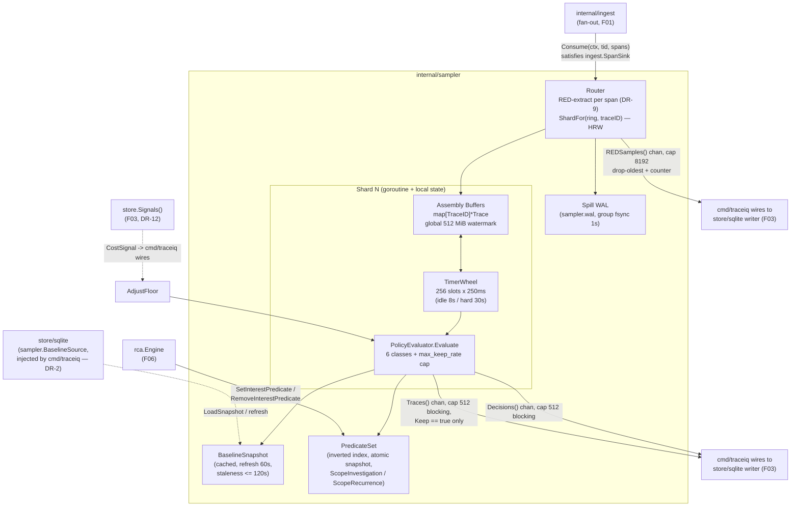
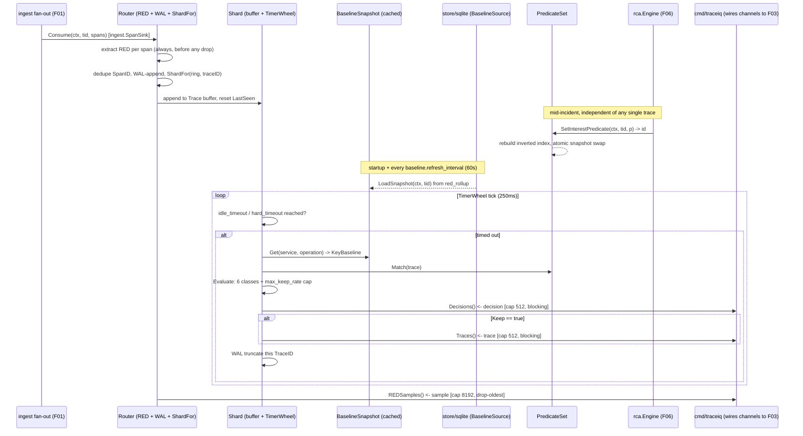

# F02 — Anomaly-aware tail sampler

> Revision 2 — 2026-09-15 — applies DR-0, DR-3, DR-4, DR-8, DR-9, DR-10, DR-11, DR-12, DR-31, DR-32, DR-39 (round-1 fixes)

**Go package:** `internal/sampler` · **Catalog interface:** `sampler.Sampler` · **Drawbacks addressed:** D-J4, D-Z3, D-D2, D-T4, D-X1, D-X5

## 1. Purpose

`internal/sampler` is TraceIQ's core differentiator: a centralized, rendezvous-hash-sharded tail
sampler that buffers spans per trace-ID until a trace is complete (or times out), then applies a
keep-100%-of-interesting policy — error status, latency outlier against a cached baseline, rare path
signature, or an active-investigation predicate pushed down live by the RCA engine (F06) — and falls
back to a configurable probabilistic floor for everything else, all under a hard rolling-window cap on
total keep rate. Every completed trace, kept or dropped, has its RED (rate/error/duration) contribution
extracted **at the router, before assembly** — so aggregate metrics never lose accuracy even when 99% of
healthy traffic is downsampled and even when a span is dropped for backpressure reasons before assembly
ever sees it. The sampler is the mechanism that lets TraceIQ co-design "what interesting looks like"
between the storage/cost layer and the AI agent: the RCA engine can, mid-investigation, tell the sampler
to retain every trace matching a hypothesis under test, closing the loop between diagnosis and data
collection.

**Fact ownership (DR-0):** this document owns no shared type, no DDL, no endpoint table and no config
default of its own. `model.*` types (`model.KeepReason`, `model.REDSample`, `model.TenantID`) are owned
by `01 §4`; every config key path here cites `01 §7`; performance/accuracy gates cite `01 §10`. Where
this doc previously re-declared a value, it now cites the owning section and states none.

**Package adjacency (DR-2, normative in `02 §5`):** `internal/sampler` may import only `model`, `config`,
`tenant`. It does **not** import `internal/store`: `sampler.Consume` satisfies `ingest.SpanSink`
structurally (DR-2) — no import edge from `sampler` back into `ingest` — and baselines are read through
the consumer-declared `sampler.BaselineSource` interface (§4.3), satisfied by `store/sqlite` and wired in
by `cmd/traceiq`. This is what removes the `store ↔ sampler` import-cycle pressure at the root (DR-2,
PD-10a, CC-1a). `sampler.Trace.KeepReason` is `model.KeepReason` (DR-4), never a package-local type.

## 2. Compared-tool drawbacks addressed

| Drawback ID | Tool | Lagging feature | How TraceIQ fixes it (concrete mechanism in this feature) |
|---|---|---|---|
| D-J4 | Jaeger | Head-sampling blind spots; tail sampling operationally hard (all spans of a trace must hit one collector) | Rendezvous (HRW) hashing routes every span of a trace to the same shard's assembly buffer via `sampler.ShardFor(ring, traceID)` (§4.4, DR-8) — the **only** routing function in the system — without any manual collector-pipeline topology. During a shard-count change, an already-open trace's ownership never moves (drain-then-move protocol, §4.4); this is the "operationally hard" part of tail sampling that TraceIQ automates away. |
| D-Z3 | Zipkin | Client-side head sampling only; volatile in-memory default storage | Sampling is fully server-side and centralized in `internal/sampler`, decoupled from client instrumentation entirely (clients always export 100%; TraceIQ decides retention). A crash-safe spill WAL (`sampler.wal`, DR-9) durably journals raw span bytes before assembly, closing D-Z3's own volatility complaint at the sampler layer, not just at F03's durable tiered store. |
| D-D2 | Datadog | Retention limits: 15-min live search / 15-day indexed | The keep-100% policy (§4.4) is evaluated per-trace at completion time, independent of any live-search window, so an anomalous trace from hours or days ago that later matters is never unavailable — retention length is a storage-tier policy (F03), not a sampling-time cutoff. |
| D-T4 | Tempo | "Store everything" shifts cost to query-time compute; high-cardinality pain | The probabilistic floor (default `healthy_sample_rate: 0.01`, DR-10) bounds healthy-traffic volume up front instead of storing 100% and paying at query time; RED extraction at the router before any discard (DR-9) means aggregate accuracy is preserved even though raw span volume is cut, and a global `max_keep_rate: 0.25` hard cap (DR-10) bounds the worst case regardless of how many keep classes fire. |
| D-X1 | All | Sampling loses the traces that matter | The six-class keep-100% policy (§4.4, DR-10) is the direct fix: error status is never shed; slow, rare-path, and interest-matched traces are kept ahead of the probabilistic floor and the per-service traffic floor. |
| D-X5 | All | AI agents bounded by telemetry quality (cannot reason over sampled-away traces) | `SetInterestPredicate` (DR-11) is a live, two-phase feedback channel from `rca.Engine` into the sampler: `ScopeInvestigation` retains data for the running investigation's next step, `ScopeRecurrence` retains data for the *next occurrence* of a concluded, high-confidence incident — so the agent's next query, and the next time the same failure recurs, are never blocked by data that was never kept. |

## 3. Requirements

### 3.1 Functional (testable)

| ID | Statement |
|---|---|
| FR-F02-1 | *(rewritten, DR-8)* The sampler MUST route every span to a shard via `sampler.ShardFor(ring, traceID)` — rendezvous (HRW) hashing, `argmax_i xxh3(Members[i] \|\| id[:])` — the only routing function in the system (`fnv64a(TraceID) mod N` is **deleted**). In a 100,000-trace multi-shard test, 0 traces are decided twice across a shard-count change: an already-open `TraceID` routes to its epoch-`e` owner regardless of `ShardFor(e+1, id)` until that owner reports `openUnderEpoch(e) == 0` or `assembly.hard_timeout` elapses, whichever is first (drain-then-move, §4.4). |
| FR-F02-2 | *(rewritten, DR-9)* A trace buffer MUST finalize (produce a `Decision`) after `sampler.assembly.idle_timeout` (canonical default **8s** — F02's prior 10s is **deleted**) with no new span, or `sampler.assembly.hard_timeout` (canonical default **30s** — F02's prior 60s is **deleted**) from first-span-seen, whichever occurs first. Finalization is driven by `sampler.TimerWheel` (256 slots × 250ms tick, two levels to cover `hard_timeout`) — the periodic full-scan `FinalizeTick` is **deleted**; the wheel tick is the only periodic work on the shard goroutine. |
| FR-F02-3 | *(rewritten, DR-10)* The keep-100% policy MUST evaluate, in this exact order, all six classes: (1) **Error** — any span with `Status.Code == Error` or `error.type` present, **never shed**; (2) **Slow** — `duration > baseline.P99` **and** `duration > sampler.policy.slow_min_duration` (mandatory floor, default **250ms**) **and** `baseline.Warmed`; (3) **Rare** — path signature unseen in `rare_path_lookback_days` (7) **and** the per-tenant `rare_path_keeps_per_min` (60) token bucket has a token **and** `path_signature` cardinality is under `max_path_signature_cardinality` (200,000) — overflow is `KeepDropped` + `traceiq_sampler_rare_overflow_total`, not a silent miss; (4) **Interest** — an active `InterestPredicate` match (DR-11, §4.3); (5) **Floor** — `floor_traces_per_min_per_service` (6); (6) **Probabilistic** — `healthy_sample_rate` (default 0.01), adjusted by `AdjustFloor`. `max_keep_rate` (default **0.25**) is then applied as a **hard cap** over the rolling-60s window: keeps shed in the fixed order `Probabilistic → Floor → Interest(Recurrence) → Rare → Slow` and no other; `Error` is never shed. Each shed increments `traceiq_sampler_shed_total{class=...}`; the trace still records RED (FR-F02-13, new). |
| FR-F02-4 | The probabilistic class (FR-F02-3 class 6) MUST select deterministically from `trace_id` (`hash(trace_id) mod 10000 < floor*10000`) so the same trace-ID always yields the same keep/drop outcome across shard restarts and replay, at the tenant's current `healthy_sample_rate` as overridden by `AdjustFloor`. |
| FR-F02-5 | *(rewritten, DR-9 "RED before every discard")* RED MUST be extracted **per span at the router, before `shardCh`**, into a per-`(tenant, service, operation, 10s bucket)` accumulator owned by the decode worker — not at trace finalization. This closes three holes: (a) a span dropped on `shard_full` has already contributed calls/errors/duration before the drop; (b) spans beyond `max_spans_per_trace` are still RED-extracted at the router even though their bodies are dropped (`Trace.Truncated = true`, `KeepReason = KeepTruncated`); (c) a duplicate `SpanID` (tracked in `partialTrace`'s `map[model.SpanID]struct{}`, ≈8B/span) is dropped before both assembly and RED, counted in `traceiq_ingest_spans_duplicate_total`. Verified by an aggregate-accuracy test showing < 0.5% relative error between router-extracted RED and a 100%-capture ground-truth run, including forced `shard_full` drops, an over-cap trace, and 10% duplicated spans. |
| FR-F02-6 | *(rewritten, DR-11)* `SetInterestPredicate(ctx, tid, p InterestPredicate) (string, error)` MUST accept both `ScopeInvestigation` (phase A: pushed at Contextualize, `ExpiresAt = now + sampler.interest.scope_ttl` default 30m, removed on any terminal `Investigation.Status` or expiry, whichever is first) and `ScopeRecurrence` (phase B: pushed only on `Status == Concluded && Confidence >= rca.confidence_threshold`, scoped by `ErrorSigIDs`/`PathSigs` only — never by service alone, `ExpiresAt = now + sampler.interest.recurrence_ttl` default 24h). Matching is bounded: `PredicateSet` maintains inverted indexes (`byService`, `byErrorSig`, `byPathSig`, `byAttrKey`) rebuilt on add/remove and read through an atomic snapshot pointer; `Match(t)` evaluates only the candidate predicates for the trace's ≤ 20 distinct services, error signatures and path signature — published worst case ≤ 32 candidates × O(1) lookups ≈ 150µs p99, inside the 2ms p50 decision budget. |
| FR-F02-7 | 100% of `Decision`s MUST be emitted within `sampler.assembly.hard_timeout` (30s, FR-F02-2) of trace completion, per the PRD performance budget. |
| FR-F02-8 | *(rewritten, DR-2/DR-10)* `Consume(ctx context.Context, tid model.TenantID, spans []model.Span) error` satisfies `ingest.SpanSink` structurally (DR-2) and MUST NOT add latency to the request path — fire-and-forget from ingest's perspective, no synchronous round trip back to the instrumented service. Decisions, kept traces and RED samples are exposed only as channels — `Decisions() <-chan Decision` (cap 512, blocking send), `Traces() <-chan model.Trace` (cap 512, blocking send), `REDSamples() <-chan model.REDSample` (cap 8192, drop-oldest + counter) — never a direct `store.WriteTrace` call, because `sampler` does not import `store` (DR-2). |
| FR-F02-9 | *(rewritten, DR-9)* On graceful shutdown, in-flight trace loss MUST be **0**: `sampler.FlushAll` force-completes every open trace with `KeepReason = KeepShed`, emits its decision and RED, then truncates the WAL segments. On crash, loss MUST be bounded to at most one `sampler.wal.flush_interval` (default **1s** — not the prior 60s bound) and MUST be counted exactly in `traceiq_sampler_traces_lost_total`. Mechanism: on `Consume`, raw span bytes are appended to the shard's WAL segment with a group fsync every `flush_interval`; on decision emit, the trace's WAL records are logically truncated; on start, `sampler.ReplayWAL` re-assembles every undecided trace **before receivers bind**. A shard panic no longer loses the shard's traces: the restarted shard replays its segment. |
| FR-F02-10 | *(binding rename, DR-10)* `RemoveInterestPredicate` replaces `ClearInterestPredicate`; `ListInterestPredicates(ctx, tid) ([]InterestPredicate, error)` is added. A predicate MUST auto-expire at `ExpiresAt` even if never explicitly removed; eviction at `max_predicates` removes the lowest-`Hits`, soonest-expiring predicate and **refuses** with `429 predicate_limit` if that would evict a `ScopeInvestigation` predicate belonging to a running investigation (DR-11). |
| FR-F02-13 | *(new, DR-10)* `max_keep_rate` (default 0.25) MUST be enforced as a hard cap in `Policy.Evaluate`, applied **after** all six keep classes fire, shedding in the fixed order `Probabilistic → Floor → Interest(Recurrence) → Rare → Slow`; `Error` is never shed regardless of rolling-60s keep rate. |
| FR-F02-14 | *(new, DR-11; most literal reading — the register introduces this as "the `03` diagram-6 circuit breaker, absent from F02" without assigning it an FR number of its own, and Appendix C reserves exactly one new FR slot beyond FR-F02-13, so it is applied here)* When the rolling-60s keep rate exceeds `sampler.interest.narrow_at_keep_rate` (== `max_keep_rate`, 0.25), `PredicateSet.Narrow(level)` MUST escalate: level 1 raises `MinDuration` to the epicenter's p99; level 2 sets `ErrorsOnly = true`; level 3 reduces `Services` to the epicenter only; level 4 expires the lowest-`Hits` `ScopeRecurrence` predicate. Each level sets `NarrowLevel`, increments `traceiq_sampler_predicate_narrowed_total`, and is visible in `GET /v1/sampler/interest`. |

### 3.2 Non-functional

| Category | Target |
|---|---|
| Throughput | Each shard sustains ≥ 20,000 spans/sec; horizontal scale-out by adding shards, target ≥ 200,000 spans/sec cluster-wide at 10 shards (per-shard assembly rate 20,000, `01 §10.1` DR-32 §32.4). |
| Memory | *(rewritten, DR-9)* The assembly byte budget is **global and centrally enforced** as one atomic counter — `sampler.buffer.max_bytes_per_shard` is **deleted**. `sampler.assembly.memory_high_watermark_bytes` (default **536,870,912 = 512 MiB, GLOBAL across all shards**) and `sampler.assembly.max_open_traces_per_shard` (default 50,000) bound growth; breach forces early finalization of the oldest buffers (§5), never unbounded growth. This 512 MiB line is one line item in `01 §10.2`'s published ≤ 1.5 GiB RSS derivation (DR-9 §9) — changing it requires re-publishing that sum. |
| Rebalance | *(corrected NFR, DR-8)* During a membership change the fraction of the trace-ID key space whose owner changes is `1/(N+1)` — at N = 10, ~9%, **not the prior "< 0.1%" claim**. The drain protocol (§4.4) makes the fraction of traces **decided twice** exactly **0**, and the fraction force-finalized across the transition (`sampler_rebalance_splits_total`) ≤ **0.01%** of traces over the transition window. Aggregate RED after a resize is within **0.5%** of a single-shard reference run. |
| Determinism | Replaying an identical span stream against an identical `BaselineSnapshot` MUST produce identical `Decision`s, required for the F11 eval harness's reproducibility guarantee (DR-36). This requires `model.Clock` injection (DR-31, §4.3): no `time.Now`/`time.After` calls inside `internal/sampler` outside the allowlisted exceptions. |
| Latency | Decision-to-emit p99 ≤ `hard_timeout` (30s, FR-F02-7); predicate matching ≈150µs p99 inside the 2ms p50 decision budget (FR-F02-6); `Evaluate` benchmarked at p50 ≤ 2ms / p99 ≤ 25ms on both a 10-span and a 10,000-span trace, asserting **zero SQLite reads inside `Evaluate`** (AC-F02-12, DR-10). |

## 4. Design

### 4.1 Component diagram



### 4.2 Data model

**Deleted per DR-4/DR-39.** `sampler.Reason` (string enum) is deleted; `model.KeepReason` (`01 §4.1`) is
the sole persisted value, with `ReasonForcedFlush` mapped to `KeepShed`. `sampler.REDSample` is deleted;
`model.REDSample` (`01 §4.1`, DR-39) is the sole RED type, carrying `Hist model.LatencyHist` (16
fixed-boundary buckets, mergeable, 64B), `Q model.Quantiles` (interpolated at read time), `TraceID` and
`ShardEpoch` (dedupe key components, DR-8), and `ExemplarTraceIDs []TraceID` (≤ 4, first-wins reservoir,
ties by lowest `TraceID`). `TraceBuffer.ServiceOps map[ServiceOp]struct{}` is deleted — path signatures
are an ordered edge list (§4.4), not an unordered set.

```go
package sampler

// Trace is the shard-local assembly state for one TraceID. model.KeepReason
// (01 §4.1) is stamped at finalize; there is no package-local Reason type.
type Trace struct {
    TraceID    model.TraceID
    Tenant     model.TenantID
    Spans      []model.Span
    FirstSeen  time.Time
    LastSeen   time.Time
    ByteSize   int
    Truncated  bool             // set by the router's span-cap rule (DR-9)
    ShardEpoch uint64           // stamped at open, for RED dedupe (DR-8)
}

// Decision matches the catalog's sampler.Decision, extended with the DR-11
// fields that make Hits accurate independent of which class won.
type Decision struct {
    TraceID            model.TraceID
    Tenant             model.TenantID
    Keep               bool
    Reason             model.KeepReason
    MatchedPredicateID string           // set whenever a predicate matched, regardless of winning Reason
    SecondaryReasons   uint16           // bitmask of model.KeepReason — every other class that also fired
    DecidedAt          time.Time
    ShardEpoch         uint64
}

// Stats / ShardStats — DR-10 binding rename of Snapshot() -> Stats().
type Stats struct {
    Shards           []ShardStats
    BytesInFlight    int64
    OpenTraces       int64
    KeepRate60s      float64
    KeepRateByReason map[model.KeepReason]float64
    PredicatesActive int
    TracesLostTotal  int64
    RebalanceSplits  int64
    RingEpoch        uint64
}
type ShardStats struct { ShardID int; OpenTraces int; BytesInFlight int64; WALSegment string }

// InterestPredicate — DR-11 §4.2, replaces the four-field struct in full.
type PredicateScope uint8
const (
    ScopeInvestigation PredicateScope = 1 // phase A: data for THIS investigation's next step
    ScopeRecurrence    PredicateScope = 2 // phase B: data for the NEXT occurrence
)

type InterestPredicate struct {
    ID          string
    Tenant      model.TenantID
    Scope       PredicateScope
    Source      string                     // "rca:<investigationID>" | "user:<subjectID>"
    Services    []string                   // <= 32
    Operations  []string                   // <= 32
    AttrEquals  map[string]string          // <= 8; every key MUST be in store.hot.indexed_attribute_keys
    ErrorSigIDs []string                   // <= 8
    PathSigs    []uint64                   // <= 8
    TraceIDs    map[model.TraceID]struct{} // <= 1024, a SET (never a slice)
    MinDuration time.Duration
    ErrorsOnly  bool
    NarrowLevel uint8                      // 0 = as pushed; 1..4 progressively narrowed
    Hits        uint64
    CreatedAt   time.Time
    ExpiresAt   time.Time
}

// PathSignature — DR-10, an ordered edge list, not the deleted
// ServiceOps map[ServiceOp]struct{}.
// PathSignature = xxh3(concat over edges of (caller_service, caller_operation,
// callee_service, callee_operation)), edges enumerated by pre-order DFS from
// the root, children sorted by (StartUnixNano, SpanID); orphan subtrees are
// appended after the rooted tree, ordered by their own root's
// (StartUnixNano, SpanID).
```

**Config (assembly, replaces `Policy{IdleTimeout, MaxTimeout, ...}` — copied verbatim from `01 §7`, DR-9):**

```yaml
sampler:
  shards: 0                          # 0 = GOMAXPROCS
  shard_queue_size: 4096
  assembly:
    idle_timeout: 8s                 # canonical; F02's 10s is deleted
    hard_timeout: 30s                # canonical; F02's 60s is deleted
    max_open_traces_per_shard: 50000
    memory_high_watermark_bytes: 536870912   # 512 MiB GLOBAL across all shards
    wheel_tick: 250ms
  wal:
    enabled: true
    dir: ${data_dir}/sampler/wal
    flush_interval: 1s
    max_segment_bytes: 67108864      # 64 MiB
```

**Config (policy and baseline cache, DR-10):**

```yaml
sampler:
  policy:
    keep_errors: true
    slow_quantile: 0.99                     # closed enum: 0.95 | 0.99 (DR-39)
    slow_min_duration: 250ms                # MANDATORY floor
    rare_path_lookback_days: 7
    rare_path_keeps_per_min: 60             # per-tenant token bucket
    max_path_signature_cardinality: 200000  # over cap, new signatures count as healthy
    baseline_min_samples: 200
    healthy_sample_rate: 0.01
    floor_traces_per_min_per_service: 6
    max_keep_rate: 0.25                     # HARD CAP applied after every keep class
  baseline:
    refresh_interval: 60s
```

**Config (interest predicates, DR-11):**

```yaml
sampler:
  interest:
    enabled: true
    max_predicates: 32                  # per tenant, both scopes combined
    max_recurrence_predicates: 8        # per tenant, subset of the above
    max_trace_ids_per_predicate: 1024
    scope_ttl: 30m                      # phase A
    recurrence_ttl: 24h                 # phase B
    narrow_at_keep_rate: 0.25           # == sampler.policy.max_keep_rate
    persist: true                       # control.db sampler_interest
```

**Bus/transport (DR-32 §32.3):** the shard fan-out transport is `cluster.bus.driver`, default **`none`
in every mode, including Kubernetes** — an in-process ring, never `sampler`-local config. `kafka` /
`redpanda` are alternatives, enabled only when one of `05 D-5`'s three triggers holds; `sampler.shards <=
cluster.bus.partitions` (fixed at 32), and a partition-count resize never happens — only partition
*reassignment* between consumers. `sampler.transport.backend` as a package-local key is **deleted**.

### 4.3 Interfaces & APIs

```go
package sampler

// Sampler is the canonical interface (DR-10), replacing the catalog's
// Observe/SetInterestPredicate/ClearInterestPredicate/Snapshot set in full.
type Sampler interface {
    // Consume satisfies ingest.SpanSink structurally (DR-2).
    Consume(ctx context.Context, tid model.TenantID, spans []model.Span) error

    SetInterestPredicate(ctx context.Context, tid model.TenantID, p InterestPredicate) (string, error)
    RemoveInterestPredicate(ctx context.Context, tid model.TenantID, id string) error
    ListInterestPredicates(ctx context.Context, tid model.TenantID) ([]InterestPredicate, error)

    AdjustFloor(ctx context.Context, tid model.TenantID, floor float64) error

    Decisions() <-chan Decision            // cap 512, blocking send
    Traces() <-chan model.Trace            // cap 512, blocking send
    REDSamples() <-chan model.REDSample    // cap 8192, drop-oldest + counter

    FlushAll(ctx context.Context) error    // shutdown step 04 §X4
    ReplayWAL(ctx context.Context) (ReplayReport, error)
    Stats() Stats
}

// PolicyEvaluator is the evaluation strategy applied to a finalized buffer.
type PolicyEvaluator interface {
    Evaluate(ctx context.Context, tid model.TenantID, t *model.Trace, b KeyBaseline, m InterestMatch, g Governor) Decision
}

// BaselineSource is the consumer-declared read interface (renamed from
// F02's BaselineLookup) satisfied by store/sqlite and injected by
// cmd/traceiq. It is NEVER called from the decision path — Evaluate reads
// only the cached BaselineSnapshot below (DR-10).
type BaselineSource interface {
    Quantile(ctx context.Context, tid model.TenantID, service, operation string, q float64) (uint64, bool, error)
    LoadSnapshot(ctx context.Context, tid model.TenantID) (BaselineSnapshot, error)
    PathSeen(ctx context.Context, tid model.TenantID, sig uint64, lookback time.Duration) (time.Time, bool, error)
    CallRate(ctx context.Context, tid model.TenantID, service string) (float64, error)
}

type ServiceOp        struct { Service, Operation string }
type KeyBaseline      struct { P95Nanos, P99Nanos uint64; Warmed bool; Samples uint32 }
type BaselineSnapshot struct { At time.Time; ByKey map[ServiceOp]KeyBaseline } // immutable, swapped atomically

// PredicateSet is the bounded-matching structure behind SetInterestPredicate
// (renamed from F02's Matches-only PredicateSet, DR-11).
type PredicateSet interface {
    Match(t *model.Trace) InterestMatch
    Add(p InterestPredicate) (string, error)
    Remove(id string) error
    ExpireDue(now time.Time) int
    Narrow(level int) int
}
type InterestMatch struct { Matched bool; PredicateID string; Scope PredicateScope }

// Ring / ShardFor — DR-8, the sole routing contract, stated once in 01 §3.2
// and cited everywhere else including this document.
type MemberID string
type RingState uint8
const ( RingStable RingState = 1; RingDraining RingState = 2 )

type Ring struct {
    Epoch   uint64
    Members []MemberID // sorted, immutable; len == shard count
    State   RingState
}
func ShardFor(r Ring, id model.TraceID) int   // argmax_i xxh3(Members[i] || id[:])

// New constructs a shard set with an injected clock (DR-31): idle/hard
// timeouts, the TimerWheel tick, WAL flush_interval, and the rare-path
// token bucket all read model.Clock, never time.Now/time.After directly,
// so internal/archtest's time-ban passes and eval.VirtualClock can drive
// the sampler deterministically.
func New(cfg Config, clock model.Clock, baselines BaselineSource, resolver tenant.Resolver) (*Sampler, error)
```

**REST surface** — filtered view; defined in `01 §6.1` (DR-0). This package exposes no endpoint of its
own; the API layer (`internal/api`, not `internal/sampler`) calls `Sampler.SetInterestPredicate` /
`RemoveInterestPredicate` / `ListInterestPredicates` / `Stats`. The prior `/internal/v1/sampler/interest`
mTLS-only service-to-service path is **superseded** — role-gated public routes are `01 §6.1`'s concern,
not this document's.

### 4.4 Algorithms / decision logic

**Routing — rendezvous (HRW) hashing (DR-8), the only routing function in the system:**

```
function ShardFor(ring, traceID) -> shardIndex:
    bestShard, bestScore = -1, -1
    for i, member in ring.Members:
        score = xxh3(member || traceID[:])
        if score > bestScore:
            bestShard, bestScore = i, score
    return bestShard
```

**Resize protocol — drain, do not re-route (DR-8):**

| Step | Rule |
|---|---|
| 1 | Coordinator publishes `Ring{Epoch: e+1, State: RingDraining}`. Both rings are live |
| 2 | A span whose `TraceID` is **already open** routes to its epoch-`e` owner, regardless of `ShardFor(e+1, id)`. Ownership of an open trace never moves |
| 3 | A span whose `TraceID` is **not open anywhere** routes under epoch `e+1` |
| 4 | Epoch `e` retires when every member reports `openUnderEpoch(e) == 0`, or after `assembly.hard_timeout` (30s), whichever is first; then `State: RingStable` |
| 5 | A trace surviving step 4 is force-finalized by its epoch-`e` owner with `KeepReason = KeepShed`, counted in `traceiq_sampler_rebalance_splits_total` |

**Router — RED before every discard (DR-9):**

```
function RouterHandle(batch model.Batch):           # called from Consume; runs before shardCh
    for span in batch.Spans:
        if span.SpanID in partialTrace[span.TraceID].seenSpanIDs:   # ~8B/span, <= 4 MiB at 50k open/shard
            metrics.Inc(traceiq_ingest_spans_duplicate_total)
            continue                                  # dropped before assembly AND before RED
        partialTrace[span.TraceID].seenSpanIDs.add(span.SpanID)
        redAccumulator[tenant, span.Service(), span.Name, bucket10s(span)].add(span)   # always, even on later drop

        shard = ShardFor(currentRing(span.TraceID), span.TraceID)   # epoch-aware, see resize protocol
        wal[shard].append(span)                        # group fsync every sampler.wal.flush_interval

        buf = buffers[shard][span.TraceID]
        if len(buf.Spans) >= policy.max_spans_per_trace:
            buf.Truncated = true                        # body dropped; RED already extracted above
            continue
        select:
            case shardCh[shard] <- span:
            case shardQueueFull:
                metrics.Inc(shard_full_total)            # RED already extracted above — no data lost from RED
```

**Per-shard TimerWheel finalize (DR-9) — replaces the deleted full-scan `FinalizeTick`:**

```
function OnWheelTick(now):        # 256 slots x 250ms, two levels; only periodic work on the shard goroutine
    for trace in slot.dueTraces(now):
        decision = evaluator.Evaluate(ctx, trace.Tenant, trace, baselineSnapshot.Get(trace), predicateSet.Match(trace), governor)
        decisionsCh <- decision                          # cap 512, blocking
        if decision.Keep:
            tracesCh <- trace.toModelTrace(decision)      # cap 512, blocking
        wal[trace.Shard].truncate(trace.TraceID)          # decision emitted; WAL record no longer needed
        delete(buffers[trace.Shard], trace.TraceID)
```

**Policy evaluation — six classes, fixed order, `max_keep_rate` hard cap (DR-10):**

```
function Evaluate(ctx, tid, t, baseline, predMatch, governor) -> Decision:
    if any(span.Status.Code == Error or span.error.type != "" for span in t.Spans):
        d = Decision{Keep: true, Reason: KeepError}                       # 1. Error — NEVER shed
    else:
        maxDurByKey = distinctMaxDuration(t.Spans)                        # one map lookup per DISTINCT (svc,op)
        if any(baseline.Warmed(k) and dur > baseline.P99(k) and dur > policy.slow_min_duration
               for k, dur in maxDurByKey):
            d = Decision{Keep: true, Reason: KeepSlow}                    # 2. Slow
        else:
            sig = pathSignature(t)                                       # ordered edge list, see §4.2
            lastSeen, known = baseline.PathSeen(sig, policy.rare_path_lookback_days)
            if (not known or now()-lastSeen > lookback) and rareTokenBucket[tid].take() and cardinality(sig) < policy.max_path_signature_cardinality:
                d = Decision{Keep: true, Reason: KeepRare}                # 3. Rare
            elif predMatch.Matched:
                d = Decision{Keep: true, Reason: KeepInterest, MatchedPredicateID: predMatch.PredicateID}  # 4. Interest
            elif floorTokenBucket[tid, t.RootService()].take():
                d = Decision{Keep: true, Reason: KeepFloor}               # 5. Floor
            elif hash64(t.TraceID) mod 10000 < governor.CurrentFloor(tid)*10000:
                d = Decision{Keep: true, Reason: KeepProbabilistic}       # 6. Probabilistic
            else:
                d = Decision{Keep: false, Reason: KeepDropped}

    if predMatch.Matched and d.MatchedPredicateID == "":                  # Hits accurate independent of winner (DR-11)
        d.MatchedPredicateID = predMatch.PredicateID
    d.SecondaryReasons = otherFiredClasses(t, baseline, predMatch)        # bitmask, every other class that also fired

    if d.Keep and d.Reason != KeepError and rollingKeepRate60s(tid) > policy.max_keep_rate:
        for class in [KeepProbabilistic, KeepFloor, KeepInterest /* Recurrence only */, KeepRare, KeepSlow]:
            if d.Reason == class:
                d = Decision{Keep: false, Reason: KeepShed}
                metrics.Inc(traceiq_sampler_shed_total, class=class)
                break
    return d
```

**Interest-predicate matching and narrowing (DR-11):**

```
function Match(t) -> InterestMatch:
    candidates = union(byService[t.services (<=20)], byErrorSig[t.errorSigs], byPathSig[t.pathSig])   # atomic snapshot read
    for p in candidates:                                    # <= 32 published worst case
        if p.MinDuration <= t.MaxDuration and (not p.ErrorsOnly or t.HasError):
            p.Hits++                                        # fires whenever matched, independent of Decision.Reason
            return InterestMatch{Matched: true, PredicateID: p.ID, Scope: p.Scope}
    return InterestMatch{}

function Narrow(level):        # rolling-60s keep rate > narrow_at_keep_rate
    switch level:
        case 1: MinDuration = epicenter.P99
        case 2: ErrorsOnly = true
        case 3: Services = [epicenter]
        case 4: expireLowestHits(ScopeRecurrence)
    metrics.Inc(traceiq_sampler_predicate_narrowed_total)
```

### 4.5 Sequence diagram



## 5. Failure modes & mitigations

| Failure | Detection | Mitigation |
|---|---|---|
| Shard memory pressure (global watermark or per-shard trace-count budget) | `bufferBytesInFlight` (global) or `OpenTraces` (per shard) crosses `sampler.assembly.memory_high_watermark_bytes` / `max_open_traces_per_shard` | Forced early finalization of the oldest buffers (`KeepShed`), counted separately from natural timeouts; the trace still gets a `Decision` and its RED was already extracted at the router. |
| Span cap exceeded (pathological fan-out, e.g. a retry storm on one `trace_id`) | `max_spans_per_trace` exceeded at the router | Excess spans are still RED-extracted at the router before their bodies are dropped (DR-9); `Trace.Truncated = true`, `KeepReason = KeepTruncated`; trace still finalizes and is evaluated on the spans it did capture. |
| Shard crash/restart | Process supervisor detects exit; K8s restarts pod | *(rewritten, DR-9)* In-flight buffers are recovered, not lost: `sampler.ReplayWAL` re-assembles every undecided trace from the shard's WAL segment **before receivers bind**; loss is bounded to one `wal.flush_interval` (default 1s) on an actual crash-before-fsync and is counted exactly in `traceiq_sampler_traces_lost_total`. Baseline state is a cached `BaselineSnapshot`, reloaded from `store.BaselineSource.LoadSnapshot` on restart. |
| Predicate propagation | `PredicateSet` rebuild on add/remove | Matching reads an atomically-swapped snapshot pointer (DR-11 §PD-26), so a newly added predicate is visible to the next `Match` call with no polling interval to tune; `AC-F02-15` benchmarks the bounded-candidate-set cost, not a propagation SLA. |
| Baseline not yet warmed at cold start | `KeyBaseline.Warmed == false` | The Slow class is skipped (not force-kept) until the key's `red_rollup`-derived quantile has `>= baseline_min_samples` (200); `BaselineSnapshot` staleness tolerance is ≤ 120s against a 60s refresh interval (DR-10) — the slow-trace rule tolerates a stale p99 far better than a synchronous read, which is why the decision path never queries SQLite directly. |
| Rebalance during shard scale-out/in | Ring epoch change detected | *(corrected, DR-8)* An open trace's ownership never moves mid-assembly (drain-then-move, §4.4); a trace surviving the drain window is force-finalized (`KeepShed`) by its original owner and counted in `traceiq_sampler_rebalance_splits_total`, target ≤ 0.01% of traces over the transition — **not** the prior "< 0.1% split" framing, which described the wrong quantity (§3.2). |
| Rare-path signature cardinality overflow | `path_signature` distinct count crosses `max_path_signature_cardinality` (200,000) | New signatures are answered as healthy (`KeepDropped`), counted in `traceiq_sampler_rare_overflow_total`, rather than force-kept — this closes a randomised-operation-name amplification attack (DR-10). |
| Clock skew causing premature/late idle timeout | Cross-service span timestamps disagree | `TimerWheel` ages buffers off `model.Clock` (DR-31) using ingest-local `Span.ReceivedUnixNano`, not span self-reported `StartUnixNano`, as the canonical ordering clock. |

## 6. Security considerations

- **Predicate-push is a cost/DoS surface**: a caller who can invoke `SetInterestPredicate` can force
  100% retention for arbitrary traffic, inflating storage cost and query load. The RCA engine's own path
  writes are authenticated as the `rca.Engine` service identity; an operator's `user:<subjectID>`-sourced
  predicate goes through `internal/api`'s normal RBAC (`01 §6.1`, out of scope here per DR-0), not a
  bespoke sampler-local auth mechanism. Every predicate write is audit-logged with `Source`.
- **Predicate matching is bounded**: `AttrEquals` is exact-match only (no regex/glob) specifically to
  avoid a ReDoS-class vector in the hot evaluation path, and every `AttrEquals` key MUST already be in
  `store.hot.indexed_attribute_keys`' 8-key allowlist (DR-11, DR-6); `TraceIDs` is capped at
  `max_trace_ids_per_predicate` (1024, **not** the prior 10,000) and is a hash set, never a slice.
- **Rate limiting**: predicate pushes are rate-limited per source investigation to prevent a runaway
  RCA loop (F06 budget failure) from cascading into a sampler cost incident; `max_predicates` (32 per
  tenant, both scopes) and `max_recurrence_predicates` (8) bound standing retention pressure even from a
  well-behaved caller.
- **Tenant isolation**: `Policy.Evaluate`, `InterestPredicate` and the `BaselineSnapshot` cache are always
  keyed by `model.TenantID` as the second parameter (DR-5); a predicate or floor adjustment for tenant A
  MUST NOT affect tenant B's buffers, verified by a cross-tenant isolation test and by
  `internal/archtest`'s AST check that every exported tenant-scoped method's second parameter is
  `model.TenantID` (DR-5 §5.1/§5.4).

## 7. Test strategy & acceptance criteria

**Unit tests**
- `Evaluate` branch coverage: all six classes including the `max_keep_rate` shed order, Error-never-shed,
  and `SecondaryReasons`/`MatchedPredicateID` accuracy independent of the winning class (DR-11).
- Determinism: same `trace_id` + same floor ⇒ same probabilistic outcome across 10,000 repeated
  evaluations and across simulated process restarts, driven by `eval.VirtualClock` (DR-31/DR-36).
- `ShardFor` rendezvous-hash remap ratio test: adding one shard to N remaps `1/(N+1)` of a 100,000-trace
  sample, with **0** traces decided twice under the drain protocol.
- `PathSignature` ordering test (`AC-F02-14`): two traces over the same service set with different call
  orders produce different signatures.
- WAL replay test: kill -9 mid-assembly, restart, assert every span acked more than one flush interval
  before the kill appears in a decision, and `traceiq_sampler_traces_lost_total` equals the measured loss
  exactly (`AC-F02-11`).

**Integration tests**
- End-to-end: synthetic span generator → ingest → sampler → fake store, asserting keep/drop ratios match
  expected policy outcomes for a crafted traffic mix (X% error, Y% slow, Z% rare-path, rest healthy).
- RED-accuracy test (`AC-F02-5`, extended): the base traffic-mix case, **plus** three adversarial cases —
  forced `shard_full` drops, an over-cap (`Truncated`) trace, and 10% duplicated spans — all staying
  inside 0.5% relative error on calls/errors and 2% on p99.
- Mid-flight resize test (`AC-F02-1`, extended): a shard-count change during sustained load, asserting 0
  traces decided twice and ≤ 0.01% force-finalized.
- Predicate matching benchmark (`AC-F02-15`): 32 predicates × 1,024 trace IDs × a 1,000-span trace against
  `01 §10.1`'s decision-latency budget.
- Kafka-backed `cluster.bus.driver: kafka` variant integration test for the [P2] K8s scale-out trigger
  case (DR-32 §32.3), verifying identical decision output to `driver: none`.

**Acceptance criteria**

| AC ID | Maps to | Criterion |
|---|---|---|
| AC-F02-1 | FR-F02-1 | 100,000-trace multi-shard test shows 0 traces decided twice across a shard-count change; a mid-flight resize under sustained load force-finalizes ≤ 0.01% of traces. |
| AC-F02-2 | FR-F02-2 | Synthetic trace with an 8.5s gap between spans finalizes at `idle_timeout` (8s), not `hard_timeout`; a trace with continuous spans past 30s finalizes at `hard_timeout`. |
| AC-F02-3 | FR-F02-3 | Crafted fixtures for each of the six classes are all kept with the correct `model.KeepReason`; a fixture matching none is `KeepDropped`; a fixture exceeding `max_keep_rate` over a rolling 60s window is shed in the documented order with `KeepShed`. |
| AC-F02-4 | FR-F02-4 | 1M simulated trace-IDs at `healthy_sample_rate=0.01` keep between 0.9%-1.1% (statistical tolerance), and repeat runs are bit-identical. |
| AC-F02-5 | FR-F02-5 | RED-accuracy test shows < 0.5% relative error vs. a 100%-capture baseline under the base mix **and** the three adversarial cases (forced `shard_full`, over-cap trace, 10% duplicates). |
| AC-F02-6 | FR-F02-6 | Push-then-match test: a `ScopeInvestigation` predicate pushed at Contextualize matches the next qualifying trace; a `ScopeRecurrence` predicate pushed only on `Concluded` + confidence threshold matches by `ErrorSigIDs`/`PathSigs`, never by service alone. |
| AC-F02-7 | FR-F02-7 | Decision-emit latency p99 ≤ 30s under sustained 20k spans/sec/shard load. |
| AC-F02-8 | FR-F02-9 | Graceful shutdown loses 0 in-flight traces (`FlushAll` emits every open trace as `KeepShed`); `kill -9` mid-assembly loses only spans within one `wal.flush_interval` (1s), correctly counted in `traceiq_sampler_traces_lost_total`. |
| AC-F02-11 | FR-F02-9 | `kill -9` mid-assembly, restart, assert every span acked more than one flush interval before the kill appears in a decision, and that `traceiq_sampler_traces_lost_total` equals the measured loss exactly. |
| AC-F02-12 | FR-F02-6/§3.2 | `Evaluate` benchmarked on a 10-span and a 10,000-span trace, both meeting `01 §10.1` (p50 ≤ 2ms, p99 ≤ 25ms), asserting zero SQLite reads inside `Evaluate`. |
| AC-F02-13 | FR-F02-13 | Over the rolling-60s `max_keep_rate` cap, keeps shed in exactly the order `Probabilistic → Floor → Interest(Recurrence) → Rare → Slow`; `Error` is never shed; each shed increments `traceiq_sampler_shed_total{class=...}` and the trace's RED is still recorded. |
| AC-F02-14 | FR-F02-3 (Rare) | Two traces over the same service set with different call orders produce different `PathSignature`s. |
| AC-F02-15 | FR-F02-6 | Benchmark 32 predicates × 1,024 trace IDs × a 1,000-span trace against `01 §10.1`'s decision-latency budget. |
| AC-F02-16 | FR-F02-6 | A trace that has an error *and* matches an open investigation's predicate records `Reason = KeepError`, `MatchedPredicateID = <id>`, and `Hits++` on the matched predicate — `Hits` is accurate independent of which class won. |

## 8. Open questions / risks

- **Transport backend default — Decided (round 1, DR-8 §8 / DR-32 §32.3).** `cluster.bus.driver: none` (an
  in-process ring) is the default in **every** mode, including Kubernetes. `kafka`/`redpanda` is enabled
  only when one of `05 D-5`'s three triggers holds — Kafka is never mandatory because the deployment is
  Kubernetes (closes CC-33(1)). When Kafka is enabled, a custom partitioner computes
  `partition = ShardFor(ring, traceID) mod partitions`; `cluster.bus.partitions` is fixed at 32,
  `sampler.shards <= cluster.bus.partitions`, and a resize reassigns partitions between consumers without
  ever changing the partition count — `ShardFor` and the partitioner therefore agree on 100% of
  assignments at equal counts.
- **Rendezvous vs. jump-consistent hashing — Decided (round 1, DR-8).** Rendezvous (HRW) is normative:
  `ShardFor` is the **only** routing function in the system, chosen for arbitrary shard add/remove without
  a strict power-of-two or ordered-ring constraint. Jump hashing would be more memory-efficient at very
  large shard counts (>1000) but does not matter at TraceIQ's target scale (tens of shards).
- **`AdjustFloor` and the store→sampler cost-control channel — resolved (DR-12).** `store` never imports
  `sampler`: `store.Signals() <-chan store.CostSignal` is emitted by `store/tiered`, and `cmd/traceiq`
  wires it to `Sampler.AdjustFloor`. This is a one-directional, `cmd`-mediated channel, not a direct
  dependency in either direction — the "beyond catalog" caveat from the prior revision no longer applies.
- **`PolicyEvaluator`, `BaselineSource` (renamed from `BaselineLookup`), and `PredicateSet` — resolved
  (DR-10, DR-11).** All three are now canonical, catalog-extending interfaces with DR-assigned method
  sets; none remain open design questions. `BaselineSource` is explicitly barred from the decision path
  (§4.3) — `Evaluate` reads only the cached `BaselineSnapshot`.
