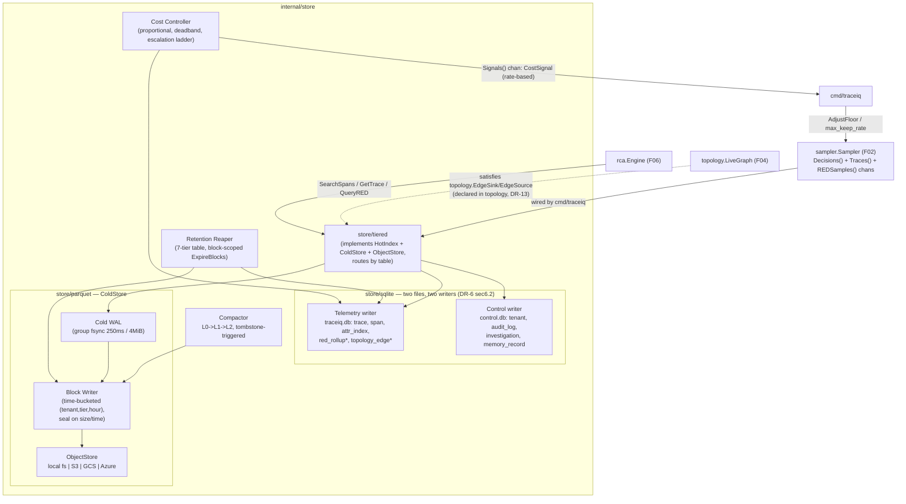
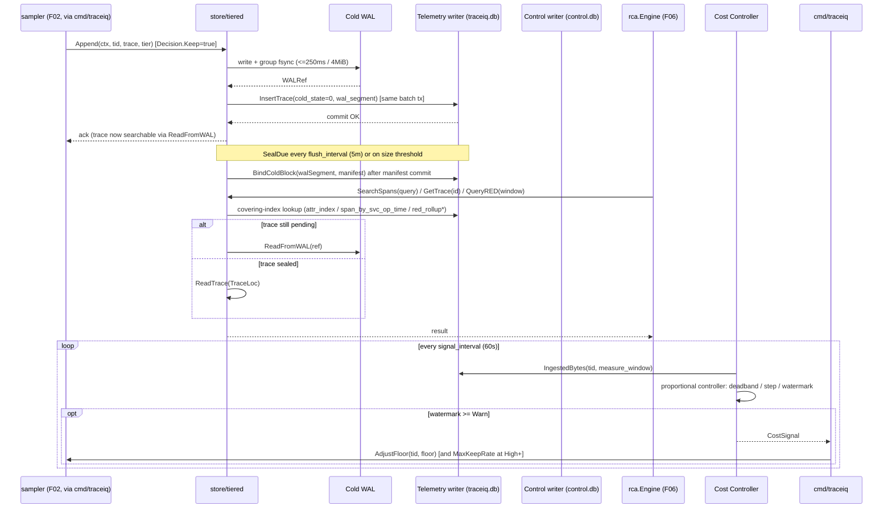

# F03 — Open tiered storage

> Revision 2 — 2026-09-15 — applies DR-0, DR-2, DR-3, DR-4, DR-5, DR-6, DR-7, DR-12, DR-13, DR-31, DR-33, DR-39 (round-1 fixes)

**Go package:** `internal/store` · **Catalog interface:** `store.HotIndex` / `store.ColdStore` / `store.ObjectStore` · **Drawbacks addressed:** D-J5, D-T1, D-T4, D-D1, D-D2, D-D3, D-Y2, D-Y4

## 1. Purpose

`internal/store` persists what the sampler (F02) decides to keep, across **two SQLite files and one
Parquet cold tier** (DR-6, DR-7): `${data_dir}/hot/traceiq.db` (span rows, an attribute index, RED and
topology-edge rollups — one telemetry writer goroutine) and `${data_dir}/control/control.db` (tenants,
audit, investigations, memory, actions — one control writer goroutine, `synchronous=FULL`), so a
fail-closed audit write is never queued behind a 250ms trace batch. Cold storage is **time-bucketed
blocks** of appended Parquet rows (`(tenant, tier, hour)`), never a per-trace row group — a trace is
searchable immediately after `Append` through a write-ahead journal, before its block ever seals.
`store/tiered` composes the hot index, cold store and object store behind three narrow, catalog-fixed
interfaces so callers never know which tier answered a query. A background reaper enforces the seven-tier
retention table (§4.2), a compactor bounds write amplification and honours per-trace erasure tombstones,
and a cost controller with a published escalation ladder tracks per-tenant byte budgets, driving
`sampler.AdjustFloor` and, if pressure persists, `sampler.Policy.max_keep_rate` itself — turning
"unpredictable bill shock" into a bounded, observable, self-correcting control loop that never touches
`Error`-class data first.

**Fact ownership (DR-0):** this document owns no shared type, no DDL and no config default of its own.
`model.*` types are owned by `01 §4`; the two-file schema and PRAGMAs are owned by `01 §5.1`/`§5.2`/`§5.3`
(this doc cites table names only); every config key path cites `01 §7`; performance/accuracy gates cite
`01 §10`. Where this doc previously re-declared a value, it now cites the owning section and states none.

**Package adjacency (DR-2, normative in `02 §5`):** `internal/store` (+ `store/sqlite`, `store/parquet`,
`store/tiered`, `store/blob`, `store/clickhouse`) may import `model`, `config`, `tenant`, `topology`.
`store` never imports `sampler`: cost-control feedback is a one-directional channel (`store.Signals()`)
wired to `sampler.AdjustFloor` by `cmd/traceiq` (DR-12). `store` satisfies `topology.EdgeSink` /
`topology.EdgeSource` (declared **in** `topology`, DR-13) — `store` never imports `ingest`, and
`topology` never imports `store`.

## 2. Compared-tool drawbacks addressed

| Drawback ID | Tool | Lagging feature | How TraceIQ fixes it (concrete mechanism in this feature) |
|---|---|---|---|
| D-J5 | Jaeger | Self-operated Cassandra/ES storage burden; basic trace-centric UI | `store/sqlite` (`modernc.org/sqlite`, pure Go, no CGO) is the default hot-index backend across **two files** (`traceiq.db`, `control.db`, DR-6 §6.2) — single-binary mode requires zero externally-operated database. ClickHouse [P2] remains available for scale-out behind the same `HotIndex` contract, but is **required, not optional**, only above `store.hot.max_kept_spans_per_sec` (DR-6 §6.4) — never mandatory below it. |
| D-T1 | Tempo | Slow attribute searches at scale (no index; Parquet scans) | `SearchSpans` answers from `attr_index`'s PK covering index (`(tenant_id, key_id, value_hash, bucket)`, returns `trace_id, span_id` with no table access) for the 8-key allowlist (DR-6 §6.3); a query on a key outside the allowlist is answered from the cold tier and is explicitly outside the 250ms gate, not a silent slow path. |
| D-T4 | Tempo | "Store everything" shifts cost to query-time compute; high-cardinality pain | The seven-tier retention table (§4.2, DR-7) and the cost controller's escalation ladder (§4.4, DR-12) bound stored bytes proactively; `QueryRED` is answered from pre-aggregated `red_rollup` at 10s/5m/1h resolution (DR-39), never a scan, so query-time compute is bounded regardless of raw trace volume. |
| D-D1 | Datadog | Cost unpredictability / bill shock | `store.CostSignal` (a 5-minute **rate**, not a 24h cumulative, DR-12) drives a proportional controller with a deadband and a symmetric recovery ramp; above `High` watermark the controller gains authority over `max_keep_rate` itself, not just the probabilistic floor — the only lever that can bound error/slow/rare-dominated cost. Anomalous blocks are the last thing ever deleted under pressure. |
| D-D2 | Datadog | Retention limits: 15-min live search / 15-day indexed | Dev-profile retention (DR-7 §7 table): hot span rows 24h, hot trace rows 7d, cold anomalous traces **30 days**, cold healthy-sampled traces **7 days** — applied to exactly the traces the sampler guaranteed were kept, an order of magnitude longer than Datadog's indexed window for the anomalous tier. |
| D-D3 | Datadog | Vendor lock-in; lossy OTel semantic-convention translation | Cold storage is open Parquet with OTel schema fields preserved verbatim (continuing F01's guarantee), readable by DuckDB/Athena without TraceIQ-proprietary metadata for span/attribute columns — the customer's data is never captive, even though the write path is now block-appended rather than per-trace row groups. |
| D-Y2 | Dynatrace | Cost (~$58/host/mo), metered queries, enterprise-only | No query metering: `QueryRED`/`SearchSpans`/`GetTrace` cost is infra-linear (CPU/IO on data you already store), not billed per call; the byte-budget model (DR-12) is the only cost lever, and it is operator-owned. |
| D-Y4 | Dynatrace | Analytical value (topology/RCA/memory) not exportable | Both tiers are open formats: Parquet blocks (cold) and a SQLite file or ClickHouse table (hot), both independently readable outside TraceIQ; `topology.Graph.Export` (DR-13) closes the topology half of this drawback directly. |

## 3. Requirements

### 3.1 Functional (testable)

| ID | Statement |
|---|---|
| FR-F03-1 | *(rewritten, DR-7)* `ColdStore.Append` MUST write the trace's spans to the cold write-ahead journal and return only after a group fsync (`cold.wal_fsync_interval: 250ms` or `cold.wal_fsync_bytes: 4MiB`, whichever first) with a CRC32C per record; the hot-index `trace` row MUST be committed **in the same batch transaction** with `cold_state = 0 (pending)` and `wal_segment` set — this is what makes the trace searchable immediately via `ReadFromWAL`, never a 404. The receiver acks only after both steps. Achievable durability: *"Span bodies are durable once `Append` returns: loss is bounded by one cold-WAL group commit (≤ 250ms) on power loss, and is **zero** on process kill."* |
| FR-F03-2 | *(rewritten, DR-6/DR-7)* `HotIndex.GetTrace(ctx, tid, id)` MUST resolve a `trace` row (PK scan) and its spans (`span(tenant_id, trace_id, *)` prefix) without a full Parquet scan. A `pending` trace (no `block_id` yet) resolves via `ColdStore.ReadFromWAL(ctx, tid, id, ref)`; a sealed trace resolves via `TraceLoc{BlockID, RowGroup, RowOffset}`. `store.ColdPointer` is **deleted** — there is no separate pointer type. |
| FR-F03-3 | `HotIndex.SearchSpans(ctx, tid, q)` MUST answer structural/attribute queries from the covering indexes in DR-6 §6.3 (`attr_index` PK for the 8-key allowlist, `span_by_svc_op_time`, `span_by_errsig`, `span_text_fts` for anomalous-trace free text); a query on an attribute key outside `store.hot.indexed_attribute_keys` MUST be answered from the cold tier and is explicitly outside the 250ms gate, not silently slow. |
| FR-F03-4 | `HotIndex.QueryRED(ctx, tid, service, operation, w)` MUST be answered entirely from `red_rollup`/`red_rollup_5m`/`red_rollup_1h` (PK-covering prefix scan, DR-6 §6.3), zero cold-store reads, at whichever of the three resolutions the window `w` selects (DR-39). |
| FR-F03-5 | *(rewritten, DR-7)* `ExpireBlocks(ctx, before, tier)` MUST delete whole sealed blocks whose `expires_at = sealed_at + retention(tier)` has passed — expiry is **block-scoped**, never per-trace, because a block is written per `(tenant, tier, hour)` so it never mixes tiers. Per-trace erasure (right-to-erasure) instead uses `Tombstone(ctx, tid, ids, reason)`, which writes `cold_tombstone`, deletes the hot `trace`/`span`/`attr_index`/FTS rows immediately, and is reconciled by the compactor within `store.cold.compaction.max_tombstone_age` (24h) or at a `tombstone_ratio` ≥ 0.02 — **erasure SLA ≤ 24h**, reported by `GET /v1/tenants/{id}/erasure`. |
| FR-F03-6 | *(rewritten, DR-12)* The store MUST emit `store.CostSignal` every `store.cost.signal_interval` (60s) from a `store.cost.measure_window` (5m) **rate**, not a 24h cumulative (`IngestedBytes24h` is **deleted**); a proportional controller with a 0.15 deadband and a 0.5×/2× per-interval step recommends a new floor, consumed by `cmd/traceiq` via `sampler.AdjustFloor` — `store` never calls `sampler` directly (DR-2). Above the `High` (0.85) watermark with the floor already at `adaptive_floor_min`, the controller instead lowers `sampler.Policy.max_keep_rate` by 0.05/interval to a hard floor of 0.05 — the only lever with authority over error/slow/rare keeps. |
| FR-F03-7 | Hot-index size MUST stay within the published band, verified by `store_hot_index_ratio = hot_bytes_on_disk / raw_ingested_span_bytes` over the same window (denominator is **raw ingested**, not kept) — defined once in `01 §10.2` and cited here; at the dev profile this is **~2.4% over a 24h window** (DR-6 §6.4), inside the published 2–5% band. |
| FR-F03-8 | `store/sqlite` MUST run with zero CGO (via `modernc.org/sqlite`) and function identically embedded in single-binary mode as two standalone files (`traceiq.db`, `control.db`, DR-6 §6.2). |
| FR-F03-9 | `store/parquet` MUST write zstd-compressed, columnar files via `github.com/parquet-go/parquet-go`, readable by DuckDB/Athena without TraceIQ-proprietary metadata for span/attribute columns, verified by an external-tool round-trip test — unaffected by the block-vs-row-group change (DR-7). |
| FR-F03-10 | `store/tiered` MUST implement `HotIndex` + `ColdStore` + `ObjectStore` by routing every write to the correct file/tier by table (`store/tiered` routes by table, DR-6 §6.2) and every read to the cheapest tier able to answer, with zero caller-visible difference from using either tier directly for supported operations. |
| FR-F03-11 | A shared conformance test suite MUST pass identically against both the `store/sqlite` and a ClickHouse-backed `HotIndex` implementation (`HotCapabilities` declares the divergence explicitly: `ReadYourWrites`, `RowLevelDelete`, `FullTextSearch`, `MaxKeptSpansPerSec` — DR-6 §6.1), proving interchangeability behind the catalog interfaces. |
| FR-F03-14 | *(new, DR-7, closes CC-33(3))* Orphaned cold objects MUST stay under 0.1% of sealed blocks; every orphan MUST be deleted within one `reaper_interval`, found via **manifest-driven reconciliation over a bounded window** (`store.cold.orphan_grace`, 2h) — never a full prefix listing (`ReconcileOrphans`'s `List(prefix="")` is **deleted**). |
| FR-F03-15 | *(new, DR-12)* The disk budget belongs to F03: `store.budget.max_disk_bytes` (dev default 25 GiB, `high_watermark: 0.85`) triggers the escalation ladder (§4.4) with `action_on_full: shed_sampled` (default, deletes T3 `sampled` blocks oldest-first then T0 span rows oldest-first — **anomalous blocks are the last thing deleted, ever**) or `stop_ingest`. `tenancy.enabled: true` with `store.cost.byte_budget_per_tenant_gb: 0` and more than one tenant is a startup **exit 2** — an unbounded per-tenant budget in a multi-tenant deployment is a cross-tenant denial of service. |

### 3.2 Non-functional

| Category | Target |
|---|---|
| Durability | *(rewritten, DR-6 §6.5/DR-33 §33.3)* "Durable across process crash (`kill -9`). Up to one WAL group-commit may be lost on OS crash or power loss on `traceiq.db` (`synchronous=NORMAL`); `control.db` is durable across power loss (`synchronous=FULL`)." The prior "WAL mode with fsync" wording is deleted as imprecise — the two files have different PRAGMAs and different guarantees (`01 §5.1`). Backup: `VACUUM INTO` snapshots (`control.db` every 5m, `traceiq.db` every 6h) plus continuous cold-WAL shipping; RPO ≤ 5 min (`control.db`) / ≤ 6h (`traceiq.db`, gap covered by cold-WAL replay) — the prior "< 10% storage overhead via incremental WAL shipping" claim is deleted, since `wal_autocheckpoint` makes naive WAL shipping unsound. |
| Throughput | *(rewritten, DR-6 §6.2)* Telemetry writer: ≥ 2,000 committed rows/s, ≥ 20 tx/s, p99 commit ≤ 120ms at the dev reference load (FU-3). Control writer: ≥ 200 tx/s, **p99 audit append ≤ 15ms, independent of `store.hot.sqlite.batch_interval`** (AC-XSEC-13) — this is the fix for "a fail-closed audit write queued behind a 250ms trace batch," achieved by giving audit its own file and writer goroutine, not a priority queue. |
| Cost | Hot index within the `store_hot_index_ratio` band (FR-F03-7); `store.budget.max_disk_bytes` (25 GiB dev default) with `high_watermark: 0.85` (FR-F03-15, DR-12); no default cap only when `tenancy.enabled: false`. |
| Portability | Single-binary mode: local filesystem for both tiers, `store.hot.driver: sqlite`. K8s [P2] mode: S3/GCS/Azure-compatible object storage for cold tier via `ObjectStore`; hot index requires `store.hot.driver: clickhouse` above `store.hot.max_kept_spans_per_sec` (DR-6 §6.4) — ClickHouse is **required above a stated, measured line**, not "promoted to default." |
| Reconciliation | Orphaned cold objects (write succeeded, manifest commit failed) MUST be garbage-collected within one `reaper_interval` via bounded manifest-driven reconciliation, < 0.1% of sealed blocks (FR-F03-14). |
| Determinism | Retention sweeps, seal timers, the cost-signal interval and backup cadence all read `model.Clock` (DR-31) — no `time.Now`/`time.After` inside `internal/store` outside the allowlisted exceptions, so `eval.VirtualClock` can drive retention and sealing deterministically. |

## 4. Design

### 4.1 Component diagram



### 4.2 Data model

**Deleted per DR-4/DR-6/DR-7/DR-39.** `store.ColdPointer`, `store.SpanRollup`, `store.REDResult`,
`store.REDBucket`, `store.TopologyEdgeRow` (→ `topology.Edge`, DR-13) and `store.TimeWindow`/`Window`
(→ `model.Window`) are all deleted; `sampler.Reason` on `Trace.KeptReason` is replaced by
`model.KeepReason`. `store.BlobStore` is **renamed `store.ObjectStore`**.

```go
package store

// HotBatch — the unit WriteBatch accepts; exactly one call per flush, never per row.
type HotBatch struct {
    Traces    []TraceIndex
    Spans     []SpanIndex
    AttrRows  []AttrIndexRow
    AttrDict  []AttrDictRow
    FTSRows   []FTSRow        // only for traces whose KeepReason is Error/Slow/Rare/Interest
    RED       []model.REDSample
    Edges     []topology.Edge
    EdgeOps   []EdgeOpRow
    ErrorSigs []ErrorSignature
    PathSigs  []PathSigRow
    Exemplars []Exemplar
    Resources []ResourceRow
}
type BatchReceipt struct { Rows int; Bytes int64; CommitMillis int64; WALSegments []string }

// HotCapabilities — lets store/tiered state per-backend semantics instead of assuming SQLite.
type HotCapabilities struct {
    ReadYourWrites     bool   // sqlite: true; clickhouse ReplacingMergeTree: false
    RowLevelDelete     bool   // sqlite: true; clickhouse: false (partition drop only)
    FullTextSearch     bool   // sqlite fts5: true
    MaxKeptSpansPerSec int    // sqlite (dev box): 1200; clickhouse [P2]: 60000
}

// ColdTier / WALRef / TraceLoc — DR-7, replace ColdPointer.
type ColdTier uint8
const ( ColdAnomalous ColdTier = 1; ColdSampled ColdTier = 2 )

type WALRef struct { Segment string; Offset int64; Length int32; CRC32C uint32 }

// TraceLoc is resolved from the hot index; never returned synchronously by Append.
type TraceLoc struct { BlockID string; RowGroup int32; RowOffset int64; ColdState uint8; WAL WALRef }

// CostSignal — DR-12; a 5-minute RATE, not a 24h cumulative.
type Watermark uint8
const ( WMNormal Watermark = 0; WMWarn Watermark = 1; WMHigh Watermark = 2; WMCritical Watermark = 3 )

type CostSignal struct {
    Tenant              model.TenantID
    ObservedBytesPerSec float64
    BudgetBytesPerSec   float64
    CurrentFloor        float64
    RecommendedFloor    float64
    DiskUsedRatio       float64
    Watermark           Watermark
    EmittedAt           time.Time
}

// RetentionPolicy — DR-12, the disk budget belongs to F03.
type RetentionPolicy struct {
    Tenant          model.TenantID
    HotSpanRows     time.Duration
    HotTraceRows    time.Duration
    HotRollups      time.Duration
    ColdAnomalous   time.Duration
    ColdSampled     time.Duration
    REDRollups      time.Duration
    Investigations  time.Duration
    Audit           time.Duration
    MaxDiskBytes    int64
    HighWatermark   float64    // default 0.85
    ActionOnFull    string     // "shed_sampled" | "stop_ingest"
    ByteBudgetBytes int64      // per-tenant, from tenant.Policy
}
```

**Retention tiers (dev defaults; replaces the two-tier `AnomalousDays`/`HealthyDays` model, DR-7):**

| Tier | What | Where | dev | prod [P2] | Key |
|---|---|---|---|---|---|
| T0 | Span rows + `attr_index` + FTS | `traceiq.db` | **24 h** | 72 h | `store.retention.hot_span_rows` |
| T0b | Trace index rows | `traceiq.db` | **7 d** | 30 d | `store.retention.hot_trace_rows` |
| T1 | Error/path signatures, edge metadata | `traceiq.db` | 30 d | 30 d | `store.retention.hot_rollups` |
| T2 | Anomalous trace bodies | Parquet `anomalous` | 30 d | 30 d | `store.retention.cold_anomalous` |
| T3 | Healthy sampled bodies | Parquet `sampled` | 7 d | 7 d | `store.retention.cold_sampled` |
| T4 | RED 10s / 5m / 1h | `traceiq.db` | **48 h / 14 d / 400 d** | same | `store.retention.red_10s`, `red_5m`, `red_rollups` |
| T4b | Topology 10s / 5m / 1h | `traceiq.db` | **6 h / 7 d / 30 d** | same | `store.retention.topology_10s`, `topology_5m`, `topology_1h` |
| T5 | Incidents, investigations, steps, evidence, memory | `control.db` | 400 d | 400 d | `store.retention.investigations` |
| T6 | Audit | `control.db` + NDJSON | 2555 d | 2555 d | `store.retention.audit` |

**DDL** — owned by `01 §5.1`; cited here, table names only. Two SQLite files, two writer goroutines
(DR-6 §6.2): `traceiq.db` (`trace`, `span`, `attr_index`, `attr_dict`, `span_text_fts`, `resource`,
`red_rollup{,_5m,_1h}`, `error_signature`, `topology_edge{,_op,_meta}`, `path_signature`,
`block_manifest`, `cold_tombstone`, `anomaly_baseline`) and `control.db` (`tenant`, `api_token`,
`identity_binding`, `audit_log`, `audit_anchor`, `action`, `investigation{,_step}`, `evidence`,
`memory_record`, `memory_fp_token`, `memory_fts`, `anomaly_event`, `incident`, `deploy_marker`,
`sampler_interest`, `eval_run`, `eval_result`, `idempotency`). Cross-file references
(`incident.investigation_id`, `trace.block_id`) are plain columns with application-level integrity,
**not** SQL foreign keys. `cold_tombstone(tenant_id, trace_id, block_id, requested_at, requested_by,
reason, purged_at)` — DDL owned by `01 §5.1` (DR-7 §7).

### 4.3 Interfaces & APIs

```go
package store

// HotIndex — canonical interface (DR-6 §6.1). Batch-oriented, insert-only, append-only rollups with
// read-time aggregation, implementable on SQLite now and ClickHouse in Phase 2.
type HotIndex interface {
    // --- writes: exactly one batch call per flush, never per row ---
    WriteBatch(ctx context.Context, tid model.TenantID, b HotBatch) (BatchReceipt, error)
    BindColdBlock(ctx context.Context, tid model.TenantID, walSegment string, m BlockManifest) (rowsBound int, err error)

    // --- reads ---
    GetTrace(ctx context.Context, tid model.TenantID, id model.TraceID) (TraceIndex, error)
    SearchSpans(ctx context.Context, tid model.TenantID, q SpanQuery) (SpanPage, error)
    SearchTraces(ctx context.Context, tid model.TenantID, q TraceQuery) (TracePage, error)
    QueryRED(ctx context.Context, tid model.TenantID, service, operation string, w model.Window) (REDSeries, error)
    QueryEdges(ctx context.Context, tid model.TenantID, w model.Window) ([]topology.Edge, error)
    QueryErrorSignatures(ctx context.Context, tid model.TenantID, service string, w model.Window) ([]ErrorSignature, error)
    ExemplarsFor(ctx context.Context, tid model.TenantID, service, operation string, w model.Window, n int) ([]Exemplar, error)
    PathSeen(ctx context.Context, tid model.TenantID, sig uint64, lookback time.Duration) (time.Time, bool, error)
    IngestedBytes(ctx context.Context, tid model.TenantID, w model.Window) (int64, error)
    PendingColdRows(ctx context.Context, tid model.TenantID, olderThan time.Time) ([]PendingCold, error)

    // --- retention ---
    ExpireBefore(ctx context.Context, tid model.TenantID, tbl TableID, cutoff time.Time) (Expired, error)
    CascadeRED(ctx context.Context, tid model.TenantID, from, to Resolution, before time.Time) (int, error)
    DiskUsage(ctx context.Context) (DiskReport, error)

    Capabilities() HotCapabilities
    Health(ctx context.Context) HealthReport
    Close() error
}
```

`UpsertRollup`, `UpsertErrorSignature`, `UpsertTopologyEdge`, `RecordExemplar`, `PutColdPointer`,
`SearchAttributes`, `LookupColdPointer`, `IngestedBytes24h`, `PointersExpiredBefore`, `HasPointerFor` are
**all deleted** from the prior revision.

```go
// ColdStore — canonical interface (DR-7). Per-trace Parquet rows are appended to time-bucketed
// blocks that seal on size or time; there is no per-trace row group and no ColdPointer.
type ColdStore interface {
    Append(ctx context.Context, tid model.TenantID, t model.Trace, tier ColdTier) (WALRef, error)
    Seal(ctx context.Context, blockID string) (BlockManifest, error)
    SealDue(ctx context.Context, now time.Time) ([]string, error)
    ReadTrace(ctx context.Context, tid model.TenantID, id model.TraceID, loc TraceLoc) (model.Trace, error)
    ReadFromWAL(ctx context.Context, tid model.TenantID, id model.TraceID, ref WALRef) (model.Trace, error)
    ReplayWAL(ctx context.Context) (ReplayReport, error)
    ExpireBlocks(ctx context.Context, before time.Time, tier ColdTier) ([]string, error)
    Tombstone(ctx context.Context, tid model.TenantID, ids []model.TraceID, reason string) error
    Compact(ctx context.Context, level int, b CompactBudget) (CompactReport, error)
    Health(ctx context.Context) HealthReport
}

// ObjectStore — renamed from BlobStore (02's name, F03's method set, DR-6 §6.1).
type ObjectStore interface {
    Put(ctx context.Context, key string, r io.Reader, size int64) (ObjectInfo, error)
    Get(ctx context.Context, key string) (io.ReadCloser, error)
    GetRange(ctx context.Context, key string, offset, length int64) (io.ReadCloser, error)
    Delete(ctx context.Context, keys []string) error
    List(ctx context.Context, prefix string, after string, limit int) ([]ObjectInfo, string, error)
    Kind() string
}

// Signals — DR-12; store never imports sampler, cmd/traceiq wires this to sampler.AdjustFloor.
func (s *TieredStore) Signals() <-chan CostSignal
```

**Topology persistence (DR-13):** `topology.EdgeSink` / `topology.EdgeSource` are declared **in**
`internal/topology`, not here. `store/sqlite` satisfies both; `cmd/traceiq` injects it into F04's
`topology.LiveGraph`. `store` never calls into `topology`'s live graph and `topology` never imports
`store` — the dependency runs one way, `store → topology`, for the `topology.Edge` value type only.

**New constructor with injected clock (DR-31):** retention sweeps, seal timers, the cost-signal interval
and backup cadence all read `model.Clock` rather than `time.Now`/`time.After`, so `internal/archtest`'s
time-ban check passes and `eval.VirtualClock` can drive sealing/retention deterministically.

```go
func NewTieredStore(cfg Config, clock model.Clock, objStore ObjectStore) (*TieredStore, error)
```

**Config keys** — owned by `01 §7`, copied here verbatim per the DRs that assign this doc's `§4.3`
(DR-6, DR-7, DR-12; this section states nothing `01 §7` does not already own):

```yaml
store:
  hot:
    driver: sqlite                   # sqlite | clickhouse [P2] — required above max_kept_spans_per_sec
    indexed_attribute_keys:          # exactly 8; key_id is the list index, order is schema
      - http.response.status_code    # 0
      - http.route                   # 1
      - error.type                   # 2
      - rpc.method                   # 3
      - db.system.name               # 4
      - peer.service                 # 5
      - k8s.pod.name                 # 6
      - service.version              # 7
    index_attrs_for_kinds: [2, 5]    # Server, Consumer — plus every span with IsError()
    max_indexed_attr_value_bytes: 128
    max_path_signatures: 200000      # LRU evict, counter on evict
    max_kept_spans_per_sec: 1200     # startup error if the sampler's derived rate exceeds it, driver: sqlite
  cold:
    driver: parquet_local             # parquet_local | parquet_s3
    wal_dir: ${data_dir}/cold/wal
    wal_fsync_interval: 250ms
    wal_fsync_bytes: 4194304          # 4 MiB
    wal_retain: 10m
    row_group_bytes: 33554432         # 32 MiB (dev; DR-9's RSS derivation)
    target_block_bytes: 134217728     # 128 MiB
    flush_interval: 5m
    max_open_blocks: 2                # dev (DR-9's RSS derivation)
    orphan_grace: 2h
    compaction:
      tombstone_ratio: 0.02
      max_tombstone_age: 24h
      max_bytes_per_hour: 0           # 0 = unbounded
  retention:
    hot_span_rows: 24h
    hot_trace_rows: 168h              # 7d
    hot_rollups: 720h                 # 30d
    cold_anomalous: 720h              # 30d
    cold_sampled: 168h                # 7d
    red_10s: 48h
    red_5m: 336h                      # 14d
    red_rollups: 9600h                # 400d
    topology_10s: 6h
    topology_5m: 168h                 # 7d
    topology_1h: 720h                 # 30d
    investigations: 9600h             # 400d
    audit: 61320h                     # 2555d
  budget:
    max_disk_bytes: 26843545600       # 25 GiB dev default
    high_watermark: 0.85
    action_on_full: shed_sampled      # shed_sampled | stop_ingest
  cost:
    signal_interval: 60s
    measure_window: 5m                # a RATE; IngestedBytes24h is deleted
    deadband: 0.15
    max_step: 0.5
    recovery_ramp: 1.25
    adaptive_floor_min: 0.0001
    adaptive_floor_max: 1.0
    settling_target: 30m
    byte_budget_per_tenant_gb: 0      # 0 = unbounded; legal ONLY when tenancy.enabled: false
```

### 4.4 Algorithms / decision logic

**`Append` / ordering invariant (DR-7) — the fix for "a trace queried immediately after ack resolves via WAL/open block, not a 404":**

```
function Append(ctx, tid, trace, tier):
    ref = coldWAL.write(spanBytes(trace))              # group fsync every wal_fsync_interval / wal_fsync_bytes
    tx = telemetryWriter.BeginTx(ctx)                   # SAME batch transaction as the WAL ack
    tx.InsertTrace(trace, cold_state=0 /*pending*/, wal_segment=ref.Segment, block_id=NULL)
    tx.Commit()                                          # only now does Append return — trace is searchable
    return ref

function SealDue(ctx, now):                              # row_group_bytes / target_block_bytes / flush_interval
    for block in openBlocks.dueForSeal(now):
        manifest = writeObjects(block)                    # spans.parquet / traces.parquet / meta.json + checksum
        blockManifestTable.commit(manifest)               # manifest row committed FIRST
        rowsBound = hotIndex.BindColdBlock(ctx, block.tenant, block.walSegment, manifest)
        # single ranged UPDATE trace SET block_id=?, row_group=?, row_offset=?, cold_state=1
        #   WHERE tenant_id=? AND cold_state=0 AND wal_segment=?  (served by trace_by_coldstate)
        coldWAL.retainUntil(block.sealedAt + wal_retain)   # default 10m
```

> **Invariant, stated once in `01 §5.2`, cited here:** a hot-index trace row may be `pending` and
> reference only a WAL segment; it may never carry a `block_id` for a manifest row that does not exist,
> and a manifest row may never exist for an object that is absent or checksum-mismatched.

**Crash matrix (DR-7), which `AC-F03-1` exercises in both a process-kill and a power-loss variant:**

| Kill point | On restart |
|---|---|
| After WAL fsync, before hot commit | `ReplayWAL` finds records with no `trace` row, re-appends to a new open block; the trace becomes searchable. `traceiq_cold_wal_replayed_total` |
| After hot commit, before seal | `trace` rows are `pending` with a live WAL segment; `ReplayWAL` re-appends, re-seals, `BindColdBlock` back-fills. **Zero** rows point at a missing block |
| Mid-block (partial object) | Object has no manifest row, deleted as an orphan by manifest-driven reconciliation (FR-F03-14). WAL segment still present, replayed |
| After seal object write, before manifest commit | Orphan object, no pointer. Reconciled within one `reaper_interval` |
| After manifest commit, before `BindColdBlock` | Manifest exists, rows still `pending` with a live WAL segment; `BindColdBlock` is idempotent and re-runs on startup |
| Manifest row exists, object missing or corrupt | Manifest marked `state='orphaned'`; dependent rows revert to `pending` if the WAL segment survives, else `cold_state=3 (lost)` + `traceiq_cold_bodies_lost_total` + a `Critical` incident |

**Orphan reconciliation (FR-F03-14) — manifest-driven, bounded window, never a full prefix listing:**

```
function ReconcileOrphans(ctx, now):
    for obj in objectStore.List(prefix=sealedWithin(store.cold.orphan_grace))   # bounded window, NOT List(prefix="")
        if not blockManifest.hasEntryFor(obj):
            objectStore.Delete(ctx, [obj.key])
            metrics.Inc(traceiq_cold_orphans_reconciled_total)
```

**Retention reaper — block-scoped, not per-trace (FR-F03-5):**

```
function Retention(ctx, now):
    for tier, retention in tierTable:                       # 01 §5.3 (DR-7 §7), this doc cites table names only
        for blockID in blockManifest.expiredBefore(now, retention):
            coldStore.ExpireBlocks(ctx, before=now, tier=tier)   # whole-block delete; a block never mixes tiers
        hotIndex.ExpireBefore(ctx, tid, tbl, cutoff)             # per-table time-column ranged DELETE, 5000-row batches
```

**Erasure via tombstone (right-to-erasure, distinct from tiered retention):**

```
function Tombstone(ctx, tid, ids, reason):
    coldTombstoneTable.insert(tid, ids, reason, requested_at=now())
    hotIndex.deleteRows(tid, ids)                            # trace/span/attr_index/FTS rows deleted immediately
    # ReadTrace filters tombstoned IDs; compactor rewrites a block once
    #   unpurged_tombstones/trace_count >= 0.02 OR oldest unpurged tombstone age >= 24h
```

**Cost controller — proportional, deadband, escalation ladder (DR-12):**

```
function CostControllerTick(ctx, now):                        # every store.cost.signal_interval (60s)
    for tid in activeTenants:
        observed = rate(hotIndex.IngestedBytes(ctx, tid, w=store.cost.measure_window))   # a RATE
        budget   = tenant.Policy(tid).ByteBudgetBytes / retentionHorizon
        ratio    = observed / budget
        if abs(ratio - 1) < store.cost.deadband:               # 0.15 — no change
            watermark = WMNormal
        else:
            newFloor = clamp(currentFloor * stepWithin(max_step=0.5), adaptive_floor_min, adaptive_floor_max)
            watermark = watermarkFor(diskUsedRatio)             # Warn 0.80 / High 0.85 / Critical 0.95
            if watermark == WMHigh and currentFloor == adaptive_floor_min and ratio > 1:
                sampler.MaxKeepRateDelta -= 0.05                # floor exhausted; only lever left for error/slow/rare
            if watermark >= WMHigh:
                shedOldestFirst(tier=ColdSampled)                # T3 first, then T0 span rows; T2 anomalous NEVER
            if watermark == WMCritical and store.budget.action_on_full == "stop_ingest":
                signalReceiversStopIngest()                      # /readyz fails ONLY under stop_ingest
        signalsCh <- CostSignal{tid, observed, budget, currentFloor, newFloor, diskUsedRatio, watermark, now}
        # consumed by cmd/traceiq: AdjustFloor(tid, newFloor) and, at High+, MaxKeepRateDelta -> sampler.Policy
```

### 4.5 Sequence diagram



## 5. Failure modes & mitigations

| Failure | Detection | Mitigation |
|---|---|---|
| Kill between WAL fsync and hot commit | `ReplayWAL` on restart | Records with no `trace` row are re-appended to a new open block; the trace becomes searchable (DR-7 crash matrix row 1). |
| Kill between hot commit and seal | `trace` rows `pending` with a live WAL segment | `ReplayWAL` re-appends and re-seals; `BindColdBlock` back-fills. Zero rows ever point at a missing block. |
| Object storage eventual consistency / partial outage | `traceiq_component_degraded{component="cold_store"}` gauge | *(rewritten, DR-33)* `/readyz` never probes object storage (DR-33 §33.1) — the cold store spills to WAL and ingest continues; only a hot-store write failure fails `/readyz`. |
| SQLite single-writer contention under high concurrency | Write latency/queue depth metric | Two files, two dedicated writer goroutines (telemetry vs. control, DR-6 §6.2) means a slow trace batch never queues behind (or blocks) a fail-closed audit write, and vice versa. |
| Disk full / budget pressure | `Watermark` crosses `Warn`/`High`/`Critical` | Escalation ladder (§4.4, DR-12): floor lowered within `max_step`, then `max_keep_rate` itself lowered at `High` with the floor exhausted, then `shed_sampled` (T3 then T0, anomalous never) at `High`, then `stop_ingest` or a `Critical` incident at 0.95. |
| ClickHouse [P2] backend network partition | Write/read errors, circuit breaker trips | Circuit breaker with bounded local retry buffer; `HotCapabilities.ReadYourWrites=false` on ClickHouse is a documented, tested divergence, not a surprise (DR-6 §6.1). |
| Retention reaper races a live read | Read returns not-found immediately after a successful `GetTrace` elsewhere | Retention is block-scoped and day-scale (§4.2); a block sealing or expiring is never concurrent with a plausible in-flight read at that time granularity. |
| Manifest row exists, object missing or corrupt | Checksum verification at `Seal` / periodic audit | Manifest marked `state='orphaned'`; dependent rows revert to `pending` if the WAL segment survives, else `cold_state=3 (lost)` + `traceiq_cold_bodies_lost_total` + a `Critical` incident (DR-7 crash matrix row 6). |
| Compaction backlog from a tombstone burst | `unpurged_tombstones / trace_count` crosses 0.02 or oldest tombstone age crosses 24h | Compactor rewrites the affected block; erasure SLA is tracked and reported at `GET /v1/tenants/{id}/erasure`, target ≤ 24h. |

## 6. Security considerations

- **Tenant isolation**: every `HotIndex`, `ColdStore` and `ObjectStore` method takes `ctx, tid
  model.TenantID` as its first two parameters in that exact order (DR-5 §5.1); `internal/archtest` fails
  the build on any exported method in this package whose second parameter is not `model.TenantID`
  (allowlist: `Health`, `Close`, `Start`, `Stop`, `Kind`, `Name`, `Schema`, `Stats`). Cross-tenant leakage
  is covered by DR-5's mandatory 100%-of-methods contract test, not a hand-picked subset.
- **Erasure**: `Tombstone` is the only per-trace deletion path from an immutable Parquet block — targeted
  right-to-erasure requests never attempt an in-place Parquet rewrite; the SLA (≤ 24h, FR-F03-5) is
  reported per tenant, not just logged.
- **Encryption at rest**: delegated to the filesystem/object-storage layer (LUKS/dm-crypt for local disk,
  SSE-S3/CMEK for object storage) — documented as an operator responsibility, not re-implemented in-app.
- **SQL injection**: `store/sqlite` and `store/clickhouse` use parameterized queries exclusively for all
  `SpanQuery`/`TraceQuery`/attribute-equality fields; attribute keys/values from spans (attacker-influenced,
  since they originate from instrumented application code) are never string-concatenated into SQL.
- **Input bounds**: query size, `Limit`, and the 8-key `indexed_attribute_keys` allowlist bound the cost of
  a single query so it cannot degrade `QueryRED`'s shared-resource latency budget for other tenants.
- **Object store credentials**: `ObjectStore` S3/GCS/Azure credentials are read from the standard
  cloud-provider credential chain (IAM role / workload identity), never embedded in TraceIQ config files.

## 7. Test strategy & acceptance criteria

**Unit tests**
- `HotIndex` conformance suite (table-driven) run against both `store/sqlite` and `store/clickhouse` —
  identical test cases, identical expected outputs modulo `HotCapabilities` divergence (FR-F03-11).
- `WriteBatch` idempotency (the same batch written twice yields the same aggregate state, supporting F01's
  at-least-once delivery).
- Retention cutoff boundary tests, per tier of the seven-tier table (exactly-at-cutoff, one-second-before,
  one-second-after).
- Cost controller: deadband, step-rate limiting, recovery ramp, and the `High`-watermark `max_keep_rate`
  authority transfer, all as pure functions over synthetic `CostSignal` inputs.
- Tombstone/compaction trigger tests: `tombstone_ratio >= 0.02` and `max_tombstone_age >= 24h`, each
  independently triggering a rewrite.

**Integration tests**
- Parquet round-trip: write via `store/parquet`, read the resulting block with the DuckDB CLI (external
  process), assert column names/types/values match OTel semantics (FR-F03-9).
- Crash-recovery test, split into two cases per `AC-F03-1`: **process-kill** (`kill -9`, asserts zero
  loss) and **power-loss** (simulated, asserts loss bounded to one `cold.wal_fsync_interval`).
- `SearchSpans`/`GetTrace`/`QueryRED` benchmarks against `01 §10.1`'s gates, driven from the DR-6 §6.3
  covering-index table.
- Orphan reconciliation test (`AC-F03-14`): fault-inject a kill at each of the DR-7 crash-matrix's six
  points, assert the correct row/manifest/WAL state and that any orphan is GC'd within one
  `reaper_interval`, staying under 0.1% of sealed blocks.
- Cross-tenant isolation test across `SearchSpans`, `QueryRED`, `GetTrace`, `Tombstone`.
- Cost-signal end-to-end test: synthetic over-budget tenant, assert `CostSignal` fires with the correct
  `Watermark`, and — wired through `cmd/traceiq` — the sampler's floor (and, at `High`, `max_keep_rate`)
  changes within `signal_interval`.
- Erasure SLA test: `Tombstone` a trace, assert it is unreadable immediately and the owning block is
  recompacted within 24h.

**Acceptance criteria**

| AC ID | Maps to | Criterion |
|---|---|---|
| AC-F03-1 | FR-F03-1 | *(split, DR-7)* **Process-kill case:** 1,000-trace write burst, `kill -9` immediately after each acked `Append`, 100% durable on restart via `ReplayWAL`. **Power-loss case:** simulated power loss, loss bounded to ≤ one `cold.wal_fsync_interval` (250ms) worth of the most recent writes. |
| AC-F03-2 | FR-F03-2 | `GetTrace` resolves a `pending` trace via `ReadFromWAL` and a sealed trace via `TraceLoc`, both within the p99 target published in `01 §10.1`. |
| AC-F03-3 | FR-F03-3 | `SearchSpans` correctly answers from the covering-index set for all 8 allowlisted attribute keys and correctly falls back to the cold tier (with the 250ms gate explicitly not applying) for a key outside the allowlist. |
| AC-F03-4 | FR-F03-4 | `QueryRED` answered entirely from `red_rollup`/`red_rollup_5m`/`red_rollup_1h`, zero cold-store reads, across all three resolutions. |
| AC-F03-5 | FR-F03-5 | *(rewritten to block granularity, DR-7)* A block is deleted in full exactly when `now >= sealed_at + retention(tier)`, in a fake-clock test, zero partial-block or per-trace deletions; a `Tombstone`d trace is unreadable immediately regardless of block expiry. |
| AC-F03-6 | FR-F03-6 | Over-budget synthetic tenant produces a `CostSignal` with `RecommendedFloor < CurrentFloor` within one `signal_interval`; a tenant still over budget at `adaptive_floor_min` produces a `max_keep_rate` reduction instead. |
| AC-F03-7 | FR-F03-7 | `store_hot_index_ratio` stays within the published 2–5% band across a mixed 24h synthetic workload at the dev profile's stated assumptions (DR-6 §6.4). |
| AC-F03-8 | FR-F03-9 | DuckDB CLI reads a TraceIQ-written Parquet block and returns correct span/attribute values with zero TraceIQ-specific tooling. |
| AC-F03-9 | FR-F03-11 | Shared `HotIndex` conformance suite passes 100% identically on both sqlite and clickhouse backends, modulo the documented `HotCapabilities` divergence. |
| AC-F03-14 | FR-F03-14 | Fault-inject a kill at each of the six DR-7 crash-matrix points; every orphan is deleted within one `reaper_interval`, and orphaned objects stay under 0.1% of sealed blocks across the run. |
| AC-F03-15 | FR-F03-15 | At `High` watermark with the floor at `adaptive_floor_min`, `shed_sampled` deletes T3 blocks oldest-first then T0 span rows, and never deletes a T2 (anomalous) block; a two-tenant config with `byte_budget_per_tenant_gb: 0` and `tenancy.enabled: true` fails startup with exit 2. |

## 8. Open questions / risks

- **`HotIndex`, `ColdStore`, `ObjectStore` and `Signals()`/`CostSignal` — resolved (DR-6, DR-7, DR-12).**
  All four are now canonical, DR-assigned interfaces with fixed method sets and a stated capability
  divergence for ClickHouse (`HotCapabilities`). `sampler.AdjustFloor` and, at `High` watermark,
  `sampler.Policy.max_keep_rate` are the corresponding receiving-side additions (F02, DR-10/DR-12). The
  two packages still do not import each other; wiring lives in `cmd/traceiq` (DR-2).
- **Two-phase commit is now a stated, normative ordering, not "best-effort" — resolved (DR-7).** Cold-WAL
  fsync, then a hot-index commit **in the same batch transaction** with `cold_state=0`, is what makes a
  trace searchable at ack; a block's `block_id` pointer is written only after its manifest row commits.
  This is stronger than the prior revision's "cold-then-hot ordering plus reconciliation" description —
  the invariant in `01 §5.2` is now the contract, not a simplification chosen over 2PC.
- **Exemplar selection policy — substantially resolved via DR-39 (applied to this doc).** `model.REDSample.
  ExemplarTraceIDs` is `<= 4`, **first-wins with a per-window reservoir of 4**, ties broken by the lowest
  `TraceID` — matching `red_rollup.exemplar_trace_ids <= 4` (`01 §5.1`). The fuller rationale for this
  rule (per-`(service, operation, bucket)` selection) is recorded against DR-38 §38.2, whose own
  "Docs to change" line does not name F03; this document applies only the exemplar-field shape DR-39
  itself carries and does not restate DR-38's independent reasoning.
- **Object storage abstraction library**: `ObjectStore` is specified as an internal interface; the
  concrete S3/GCS/Azure SDK choice (AWS SDK v2, `cloud.google.com/go/storage`,
  `github.com/Azure/azure-sdk-for-go`) remains left to the implementation phase — not fixed by any DR in
  this register.
- **ClickHouse [P2] schema/migration strategy** (DDL versioning, `clickhouse-migrate` vs. hand-rolled)
  remains undecided; it is gated behind `store.hot.driver: clickhouse`, itself gated behind exceeding
  `store.hot.max_kept_spans_per_sec` (DR-6 §6.4) — a Phase 2 concern, not required for FR-F03-11's
  conformance suite to exist, only to run against a real ClickHouse instance in CI.
