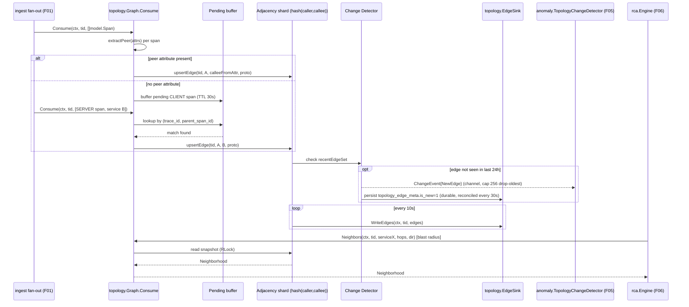

# F04 — Live topology graph

**Go package:** `internal/topology` · **Catalog interface:** `topology.Graph` · **Drawbacks addressed:** D-Z2, D-J5

**DRs applied:** DR-0, DR-2, DR-5, DR-13, DR-29, DR-31, DR-38, DR-39

## 1. Purpose

`internal/topology` builds the service dependency graph incrementally, in real time, directly from the
pre-sampling-decision ingest fan-out (F01) — not from a batch job and not only from sampled/retained
traffic — so the graph reflects 100% of observed traffic even though the sampler later downsamples most
of it for storage (DR-13). `topology.LiveGraph` satisfies `ingest.SpanSink` **structurally**: `Consume(ctx,
tid model.TenantID, spans []model.Span) error` mentions only `model` types, so `topology` never imports
`ingest` (DR-2). `01 §2`'s old `RED --> TG` edge is deleted; the wiring is `LIM --> TG` alongside `LIM -->
ROUTE`, and `03` diagram 1's per-span `SH->>TOPO: Observe each span` step is deleted — the fan-out delivers
batches, not single spans.

Each consumed batch incrementally updates a sharded in-memory adjacency structure (services as nodes,
caller→callee as edges, RED counters and a mergeable latency histogram per edge), periodically flushed
through the feature-declared `EdgeSink` interface — never by calling `store.HotIndex` directly (DR-13,
DR-2) — for durability, restart warm-start (via `EdgeSource`), and time-windowed querying. `store/sqlite`
(and `store/clickhouse`) satisfy both interfaces; `cmd/traceiq` injects them, so `topology` never imports
`store`. The graph also emits change events — new or vanished edges — consumed by the anomaly detector
(F05) as a distinct anomaly signal, and serves `Neighbors`/`Distance`/`Snapshot` queries used by the RCA
engine (F06) for blast-radius reasoning and by the Web UI/Grafana plugin (F12) for visualization, plus a
graph `Export` (closing the topology half of D-Y4).

## 2. Compared-tool drawbacks addressed

| Drawback ID | Tool | Lagging feature | How TraceIQ fixes it (concrete mechanism in this feature) |
|---|---|---|---|
| D-Z2 | Zipkin | Dependency graph needs external Spark batch job (`zipkin-dependencies`), not real-time | `topology.Graph.Consume` updates the adjacency structure synchronously as span batches arrive (FR-F04-1, ≤ 1s freshness) off the pre-sampling ingest fan-out, with no offline batch job of any kind — the graph is queryable the same second traffic occurs (DR-13). |
| D-J5 | Jaeger | Self-operated Cassandra/ES storage burden; basic trace-centric UI | Topology state lives primarily in-process memory; persistence flows through the feature-declared `EdgeSink`/`EdgeSource` interfaces, satisfied by F03's already-embedded hot index (`store/sqlite`, no external system) — `topology` never imports `store` (DR-2), so no separate graph database or additional operated infrastructure is introduced to get a dependency graph, unlike Jaeger deployments that bolt on a separate service-graph pipeline (DR-2, DR-13). |

## 3. Requirements

### 3.1 Functional (testable)

| ID | Statement |
|---|---|
| FR-F04-1 | `Consume(ctx, tid, spans)` MUST update the in-memory graph within **1s p99** of span ingestion, deriving caller→callee edges from cross-service parent-child span relationships — no batch job, no scheduled recomputation. |
| FR-F04-2 | Edge protocol MUST be derived from OTel semantic-convention attributes (`rpc.system`, `http.request.method`/`http.method`, `db.system`, `messaging.system`) into the closed set `http \| grpc \| db \| messaging \| internal \| unknown` (DR-13), with `"unknown"` used only when none are present, verified against a fixture table covering ≥ 6 protocol families. |
| FR-F04-3 | `Neighbors(ctx, tid, service, hops, dir)` MUST return upstream and/or downstream edges up to `hops` hops for the given service and `Direction`, p99 < 20ms at the `topology.max_edges` cap (20,000 edges). |
| FR-F04-4 | `Edges(ctx, tid, w)` MUST return `Edge` rows (RED counters + `model.LatencyHist`) at the requested `Resolution`, backed by `EdgeSource`'s read of F03's hot-index rollups. |
| FR-F04-5 | `Snapshot(ctx, tid)` MUST return a consistent point-in-time full graph for the tenant, generation completing in < 500ms at the `topology.max_edges` cap. |
| FR-F04-6 | The graph MUST emit a `ChangeEvent{Type: NewEdge}` when an edge is observed that was not seen in the prior rolling **24h** window (configurable), and a `ChangeEvent{Type: VanishedEdge}` when a previously-active edge has not been observed for more than **1h** (configurable), delivered on the `Changes()` channel within 5s of detection. `NewEdge` is additionally lossless via the durable `topology_edge_meta.is_new` reconciliation path (DR-13 §"Changes() is lossless"); `VanishedEdge` stays channel-only, best-effort, and re-derivable from `last_seen`. |
| FR-F04-7 | On process restart, the graph MUST warm-start via `EdgeSource.LoadEdges`, reaching parity with pre-restart `Neighbors`/`Edges` query results within **30s**. |
| FR-F04-8 | `Consume` MUST correctly pair a `CLIENT`/`PRODUCER` span with its callee service either directly (via a semantic-convention peer-identifying attribute, e.g. `peer.service`, `server.address`, `db.system`, `messaging.destination.name`) or, when absent, by joining to the matching `SERVER`/`CONSUMER` span within a bounded correlation window (default 30s), with unmatched `SERVER` spans past that window recorded as an "external/unattributed caller" edge rather than silently dropped. |
| FR-F04-9 | `EdgeOps(ctx, tid, edgeID, w, topN)` MUST return the top `topN` (default, per-edge cap `topology.max_operations_per_edge`, default 20) callee operations by call count from the hourly `topology_edge_op` rollup, for per-operation visibility at bounded cardinality (DR-13). |
| FR-F04-10 | An Envoy access-log → `topology.Edge` adapter MUST consume OTLP logs carrying `envoy.*` semantic conventions and derive edges from them, behind `topology.envoy_access_logs.enabled` (default `false`), closing the PRD's "works out-of-the-box on Istio / service-mesh telemetry" promise (DR-38 §38.1). |

### 3.2 Non-functional

Performance/accuracy gates are owned by `01 §10.2`; this table cites them rather than restating (DR-0).

| Category | Target |
|---|---|
| Memory | ≈ **80 MiB** at the `topology.max_edges` (20,000) cap: ~6 MiB of `LatencyHist` (2 open buckets/edge) plus adjacency, meta, and the pending-client-span join table — the figure used in DR-9's RSS derivation. Supersedes the earlier <200MB/50,000-edge figure (DR-13). |
| Consistency | Eventual/approximate real-time is acceptable — the graph reflects spans observed up to the latest `Consume` call; no global span-ordering guarantee is required or assumed. |
| Availability | Full functional recovery (warm-start) from `EdgeSource` after a cold start, per FR-F04-7. |
| Throughput | `Consume` sustains ≥ 50,000 spans/sec cluster-wide (matching F01's ingest NFR, since topology sees 100% of traffic); see `01 §10.1` for the headline rate. |
| Query isolation | `Neighbors`/`Edges`/`Snapshot` reads MUST NOT block concurrent `Consume` writes beyond a bounded, low-latency lock window (copy-on-read snapshot per shard, not a global write lock). |
| Cardinality | `topology.max_edges` = **20,000** (dev baseline ~600 edges, 33× headroom), LRU eviction by `Calls`, `traceiq_topology_edges_evicted_total` on eviction (DR-13). |

## 4. Design

### 4.1 Component diagram

```mermaid
flowchart TB
    ING["internal/ingest fan-out\n(F01, pre-sampling-decision, LIM -> TG)"] -->|Consume(ctx, tid, []model.Span)| CONS

    subgraph TopoPkg["internal/topology (implements ingest.SpanSink structurally — no import)"]
        CONS["Consume(ctx, tid, spans)"]
        PEND["Pending CLIENT-span buffer\n(TTL 30s, for SERVER-span join)"]
        SHARD["Sharded Adjacency Store\nhash(caller, callee) -> shard (DR-13 Decided round 1)\nServiceNode + Edge + callee reverse index"]
        CHG["Change Detector\nnew-edge (channel + durable is_new reconciliation) / vanished-edge (channel, best-effort)"]
        FLUSH["Periodic Flush (10s)"]

        CONS --> PEND
        CONS --> SHARD
        SHARD --> CHG
        SHARD --> FLUSH
    end

    FLUSH -->|EdgeSink.WriteEdges| SINK["topology.EdgeSink\n(feature-declared interface)"]
    SINK -.satisfied by.-> STOREIMPL["store/sqlite, store/clickhouse\n(wired by cmd/traceiq)"]
    SRC["topology.EdgeSource\n(feature-declared interface)"] -.satisfied by.-> STOREIMPL
    SRC -->|warm-start on boot: LoadEdges| SHARD

    CHG -->|Changes() channel, cap 256 drop-oldest| ANOM["anomaly.TopologyChangeDetector (F05)\nreconciles topology_edge_meta.is_new every 30s tick"]
    API_Q["Neighbors / Distance / Edges / EdgeOps / Snapshot / Export"] --> SHARD
    RCA["rca.Engine (F06) blast-radius"] --> API_Q
    UI["Web UI / Grafana plugin (F12)"] --> API_Q
```

**Note:** `topology` never imports `store` or `ingest` (DR-2). The only import edges from `internal/topology`
are `model`, `config`, `tenant`.

### 4.2 Data model

`model.LatencyHist` (16 fixed log-spaced boundaries, 1ms–32s, 64B, mergeable by addition),
`model.Quantiles` and `model.Resolution` (DR-39 §39.1 — the ONLY RED type) are owned by `01 §4.1`;
cited here, not redeclared (DR-0, DR-39).

```go
package topology

// Edge is the sole edge record (topology.EdgeRED is DELETED — DR-39 §39.2, DR-13).
// No stored p90: the quantile set is {p50, p95, p99, max}, interpolated from Hist at read time.
type Edge struct {
    ID          string            // xxh3(caller "\x00" callee "\x00" protocol)
    Tenant      model.TenantID
    Caller      string            // "" for ingress
    Callee      string
    Protocol    string            // http | grpc | db | messaging | internal | unknown
    BucketStart time.Time
    Resolution  model.Resolution
    Calls       uint64
    Errors      uint64
    DurationSumNanos uint64
    Hist        model.LatencyHist // fixed-boundary, mergeable, 16 buckets, 64 bytes
    ExemplarTraceIDs []model.TraceID // <= 2
    FirstSeen, LastSeen time.Time
    IsNew, IsVanished   bool
}

type ServiceNode struct {
    Tenant     model.TenantID
    Name       string
    Attributes map[string]string // e.g. deploy version, language, team owner (from resource attrs)
    FirstSeen  time.Time
    LastSeen   time.Time
}

type Direction uint8 // 1 Upstream, 2 Downstream, 3 Both

type ChangeType string
const (
    ChangeNewEdge      ChangeType = "new_edge"
    ChangeVanishedEdge ChangeType = "vanished_edge"
)

type ChangeEvent struct {
    Type       ChangeType
    Edge       Edge
    TenantID   model.TenantID
    DetectedAt time.Time
}

// Neighborhood replaces the earlier caller/callee-Edge-list shape (DR-13's restored Graph interface).
type Neighborhood struct {
    Root string
    Upstream, Downstream []string
    Edges  []Edge
    HopOf  map[string]int
}

// pendingClientSpan is the correlation-buffer entry used by FR-F04-8's join.
type pendingClientSpan struct {
    TraceID   model.TraceID
    SpanID    model.SpanID
    Service   string
    Protocol  string
    Timestamp time.Time
}
```

Per-callee-operation visibility survives at **bounded** cardinality in a separate hourly rollup table,
`topology_edge_op` (DDL owned by `01 §5.1`; cited here by name only — DR-0). It carries
`(tenant_id, edge_id, callee_operation, bucket_start[1h], calls, errors, p99_nanos)`, top
`topology.max_operations_per_edge` (default 20) operations by call count per edge per hour.

```go
// EdgeOp is the read shape backing EdgeOps(); its fields mirror topology_edge_op's columns.
// Not spelled out verbatim by DR-13 — flagged in §8 for lead-architect confirmation.
type EdgeOp struct {
    EdgeID          string
    CalleeOperation string
    BucketStart     time.Time // 1h bucket
    Calls, Errors   uint64
    P99Nanos        uint64
}

// Snapshot is the tenant-scoped point-in-time read (replaces the earlier GraphSnapshot name).
// Field shape inferred from §1/§4.1 and the pre-DR-13 GraphSnapshot; not fixed verbatim by the
// register — flagged in §8.
type Snapshot struct {
    Tenant      model.TenantID
    Services    []ServiceNode
    Edges       []Edge
    GeneratedAt time.Time
    Warming     bool // true until warm-start (FR-F04-7) completes
}

// Stats and ExportFormat shapes are not specified by the register text; flagged in §8.
type Stats struct {
    Edges, Services int
    MemoryBytes     int64
    Warming         bool
}

type ExportFormat uint8 // closes the topology half of D-Y4; enum values not yet fixed — see §8
```

### 4.3 Interfaces & APIs

Every exported method that touches tenant-scoped data takes `(ctx context.Context, tid model.TenantID,
...)` in that exact order (DR-5 signature rule); `internal/archtest` enforces it.

```go
package topology

// Graph is the catalog-fixed interface, restored to its full ten-method shape by DR-13
// (Changes() is native to the interface, not "beyond catalog").
type Graph interface {
    Consume(ctx context.Context, tid model.TenantID, spans []model.Span) error   // ingest.SpanSink
    Neighbors(ctx context.Context, tid model.TenantID, service string, hops int, dir Direction) (Neighborhood, error)
    Distance(ctx context.Context, tid model.TenantID, a, b string, maxHops int) (int, bool, error)
    Edges(ctx context.Context, tid model.TenantID, w model.Window) ([]Edge, error)
    EdgeOps(ctx context.Context, tid model.TenantID, edgeID string, w model.Window, topN int) ([]EdgeOp, error)
    Snapshot(ctx context.Context, tid model.TenantID) (Snapshot, error)
    Export(ctx context.Context, tid model.TenantID, w io.Writer, f ExportFormat) error  // D-Y4
    Changes() <-chan ChangeEvent
    Flush(ctx context.Context) error        // shutdown step, 04 §X6
    Stats() Stats
}

// EdgeSink/EdgeSource are declared here (consumer package), satisfied structurally by
// store/sqlite and store/clickhouse; topology never imports store (DR-2, DR-13).
// store.HotIndex.UpsertTopologyEdge/QueryTopologyEdges are DELETED.
type EdgeSink   interface { WriteEdges(ctx context.Context, tid model.TenantID, edges []Edge) error }
type EdgeSource interface { LoadEdges(ctx context.Context, tid model.TenantID, w model.Window) ([]Edge, error) }
```

**Constructor** (Clock injection, DR-31 — `topology` reads time for bucket boundaries and `vanished_after`):

```go
func NewLiveGraph(ctx context.Context, tid model.TenantID, cfg Config, sink EdgeSink, source EdgeSource, clock model.Clock) (*LiveGraph, error)
```

**REST/MCP surface** — defined in `01 §6.1`/`§6.2` (DR-29); this is a filtered view, F04 declares no path
of its own (the earlier `/api/v1/topology/*` paths are deleted):

| Method | Path | Backing call | Role |
|---|---|---|---|
| GET | `/v1/topology/neighbors/{service}` | `Neighbors` | viewer |
| GET | `/v1/topology/edges` | `Edges` | viewer |
| GET | `/v1/topology/snapshot` | `Snapshot` | viewer |

| MCP tool | Backing call | MinRole |
|---|---|---|
| `traceiq_topology_neighbors` | `topology.Neighbors` | viewer |
| `traceiq_topology_edges` | `topology.Edges` | viewer |

**Config keys** (authoritative values owned by `01 §7`; cited here per the existing feature-doc convention — DR-0):

```yaml
topology:
  shard_count: 8                    # hash(caller, callee) -> shard (DR-13 Decided round 1)
  max_edges: 20000                  # LRU eviction by Calls beyond this cap (DR-13)
  max_operations_per_edge: 20       # topology_edge_op top-N per edge per hour (DR-13)
  pending_client_span_ttl: 30s      # FR-F04-8 join window
  change_detection:
    new_edge_window: 24h
    vanish_window: 1h
    sweep_interval: 1m
  flush_interval: 10s                # matches F03 hot-index resolution
  warm_start_timeout: 30s            # FR-F04-7
  envoy_access_logs:
    enabled: false                    # FR-F04-10 (DR-38 §38.1)
```

### 4.4 Algorithms / decision logic

**Edge derivation on `Consume`** — each span in the batch unilaterally encodes its own edge when it is a
`CLIENT`/`PRODUCER` span carrying a peer-identifying attribute (the common case, needs no join); only when
that attribute is absent does the graph fall back to a bounded correlation-buffer join against the
matching `SERVER`/`CONSUMER` span:

```
function Consume(ctx, tid, spans):
    for span in spans:
        service = span.Resource.ServiceName
        ensureNode(tid, service, span)                      # updates ServiceNode.LastSeen

        if span.Kind in {CLIENT, PRODUCER}:
            callee, protocol = extractPeer(span.Attributes)   # FR-F04-2 semconv table
            if callee != "":
                upsertEdge(tid, service, callee, protocol, arrivalTime(span))
                continue
            # no direct peer attribute: wait for the matching SERVER/CONSUMER span
            pending.put(key(span.TraceID, span.SpanID), pendingClientSpan{service, protocol, now()})
            continue

        if span.Kind in {SERVER, CONSUMER}:
            if entry, ok = pending.get(key(span.TraceID, span.ParentSpanID)); ok:
                upsertEdge(tid, entry.Service, service, entry.Protocol, arrivalTime(span))
                pending.delete(key(...))
            else:
                recordUnattributedInbound(tid, service, span)   # external/uninstrumented caller, counted not dropped
            continue
        # INTERNAL spans: node presence only, no edge

function extractPeer(attrs) -> (callee, protocol):
    if attrs["peer.service"] present:              return attrs["peer.service"], protocolOf(attrs)
    if attrs["server.address"] present:             return attrs["server.address"], protocolOf(attrs)
    if attrs["db.system"] present:                  return "db:" + attrs["db.system"], "db"
    if attrs["messaging.destination.name"] present: return attrs["messaging.destination.name"], "messaging"
    return "", "unknown"

function protocolOf(attrs) -> string:
    if attrs["rpc.system"] present:   return "grpc"
    if attrs["http.request.method"] or attrs["http.method"] present: return "http"
    return "unknown"
```

**Correlation-buffer sweep** (bounds `pending` growth for FR-F04-8's uninstrumented/lost-server-span case):

```
function SweepPending():   # runs every pending_client_span_ttl / 2
    for key, entry in pending:
        if now() - entry.Timestamp > pendingClientSpanTTL:
            metrics.Inc(topology_unmatched_client_spans_total)
            pending.delete(key)
```

**Upsert + change detection** — edges are sharded by `hash(caller, callee)`, not `caller` alone, per §8's
**Decided (round 1)**, and each shard maintains a `callee -> []caller` reverse index so `Neighbors` never
needs a full cluster fan-out:

```
function upsertEdge(tid, caller, callee, protocol, ts):
    key = (tid, caller, callee, protocol)
    bucket = floor(ts, 10s)
    shard = shardFor(caller, callee)   # hash(caller, callee) -> shard
    shard.edges[key][bucket].Calls++
    shard.edges[key][bucket].Hist.Add(duration)   # if duration available
    shard.revIndex[callee].add(caller)

    if not shard.recentEdgeSet.contains(key):           # FR-F04-6 new-edge detection
        emit ChangeEvent{NewEdge, edgeFor(key), tid, now()}
        persist topology_edge_meta.is_new = 1, first_seen = ts   # DR-13 lossless-NewEdge path
    shard.recentEdgeSet.addWithTTL(key, newEdgeWindow)   # default 24h
    shard.lastSeen[key] = ts

function VanishSweep():   # runs every change_detection.sweep_interval (1m)
    for shard in shards:
        for key, last := range shard.lastSeen:
            if now() - last > vanishWindow and not shard.markedVanished[key]:
                emit ChangeEvent{VanishedEdge, edgeFor(key), tid, now()}   # channel-only, best-effort
                shard.markedVanished[key] = true

function ReconcileNewEdges():   # anomaly.TopologyChangeDetector, every 30s tick (F05 side, cited here for completeness)
    for row in queryTopologyEdgeMeta(is_new = 1, since = lastReconcileAt):
        ensureAnomalyEventFor(row)   # catches any NewEdge dropped by the channel's drop-oldest policy
```

**Snapshot** — copy-on-read across shards to avoid a global write lock (§3.2 query-isolation NFR):

```
function Snapshot(tid) -> Snapshot:
    services = []
    edges = []
    for shard in shards:                 # each shard snapshot is a fast RLock, not a global lock
        services.append(shard.nodesSnapshot(tid))
        edges.append(shard.edgesSnapshot(tid))
    return Snapshot{tid, services, edges, now(), warming=!warmStartComplete}
```

### 4.5 Sequence diagram



## 5. Failure modes & mitigations

| Failure | Detection | Mitigation |
|---|---|---|
| Pending-buffer growth from uninstrumented/external callers whose `SERVER` span never matches | `topology_unmatched_client_spans_total` rising | TTL-based sweep (§4.4) bounds buffer size; unmatched entries are counted, not silently dropped, and surfaced as an "external caller" signal an operator can act on. |
| Hot-shard skew (a central service like an API gateway dominates edge volume) | Per-shard `Consume` latency/queue metrics diverge | Edges are sharded by `hash(caller, callee)` (§8 **Decided, round 1**), which spreads a high-fanout caller's edges across shards instead of concentrating them on one, at a small cross-shard read cost in `Neighbors` — mitigated by the per-shard callee reverse index. |
| Process restart loses in-memory graph | Empty `Snapshot()` immediately post-restart | Warm-start via `EdgeSource.LoadEdges` (FR-F04-7); until warm-start completes (≤ 30s), `Neighbors`/`Snapshot` return partial results labeled `Warming: true` rather than blocking. |
| Clock skew across services affecting 10s bucket assignment | Bucketed counts inconsistent with wall-clock expectations | Buckets use `model.Clock`-sourced ingest-local arrival time, injected once at construction (DR-31), not span self-reported timestamps — documented as approximate by design, not a correctness bug. |
| `Changes()` consumer (F05) slow or not draining | Channel send blocks / buffer fills | `Changes()` is a bounded (cap 256), non-blocking-send, drop-oldest channel; `NewEdge` cannot be permanently lost because `anomaly.TopologyChangeDetector` reconciles from the durable `topology_edge_meta.is_new` table every 30s tick (DR-13). `VanishedEdge` remains channel-only/best-effort, re-derivable from `last_seen`. `topology_change_events_dropped_total` increments on drop. |
| Cross-shard edge visibility for `Neighbors(service)` | Test asserting a service's *upstream* edges (where it's the callee, owned by other shards' caller/callee-pair hashes) are still found | Each shard maintains a `callee -> []caller` reverse index updated at upsert time so a single-shard `Neighbors` call doesn't require a full cluster fan-out. |

## 6. Security considerations

- **Topology is sensitive data**: the full service dependency map (who calls whom, at what rate) is a
  security-relevant artifact (attack-surface/blast-radius map). `Neighbors`, `Edges`, `EdgeOps`,
  `Snapshot`, and `Export` MUST be tenant-scoped (every method takes `model.TenantID`, DR-5) and
  RBAC-gated per `01 §6.1`/`§6.2`'s table (F12/X-SEC) — no cross-tenant topology visibility, verified by
  an isolation test analogous to F03's.
- **Attribute-derived service names are attacker-influenced**: `extractPeer` reads span attributes
  that originate from instrumented application code (or an external caller's declared identity);
  values are treated as opaque labels only — never interpolated into a query string, log format
  string, or executed — closing an injection vector into the graph itself.
- **Bounded correlation buffer**: `pending`'s TTL and per-shard size cap (config-bounded) prevent an
  attacker from exhausting memory via a flood of unmatched `CLIENT` spans.
- **Change-event channel**: `Changes()` is in-process only (not network-exposed); F05 consumes it
  within the same trust boundary, so no additional authentication is required at this interface.

## 7. Test strategy & acceptance criteria

**Unit tests**
- `extractPeer`/`protocolOf` coverage across the ≥ 6 semantic-convention protocol families (FR-F04-2).
- `Consume` CLIENT/SERVER pairing: direct-attribute case, join-via-pending case, TTL-expiry
  unattributed case (FR-F04-8).
- Change detection: new-edge emission on first sight, no re-emission within the window, vanish
  emission after the absence window, no double-vanish emission.
- `Neighbors` reverse-index correctness (edges visible from both hash(caller,callee)-owning shard and
  callee-side query).
- Warm-start reconstruction from a fixture set of `EdgeSource.LoadEdges` rows.
- `EdgeOps` top-N selection against a fixture `topology_edge_op` rollup (FR-F04-9).

**Integration tests**
- Synthetic 20-service, multi-protocol trace fixture fed through ingest → topology, asserting the
  exact resulting edge set and protocols (golden-graph test).
- Load test: 50,000 spans/sec sustained for 5 minutes, asserting the 1s `Consume` freshness (FR-F04-1)
  and ≈ 80 MiB memory (§3.2) at the `topology.max_edges` (20,000) cap.
- Restart test: populate graph, kill process, restart, assert `Neighbors`/`Edges` parity with
  pre-restart state within 30s (FR-F04-7).
- `Changes()` backpressure test: slow consumer, assert bounded drop with correct metric, no goroutine
  leak or unbounded memory growth, and zero `NewEdge` loss via the reconciliation path (FR-F04-6, AC-F04-9).
- End-to-end with F05: inject a genuinely new edge, assert an `anomaly.Event`-eligible `ChangeEvent`
  is observed on the shared channel within the 5s bound.
- Envoy access-log adapter over a recorded Istio bundle: OTLP logs carrying `envoy.*` attributes produce
  the expected edges with `topology.envoy_access_logs.enabled: true` (FR-F04-10, AC-F04-10).

**Acceptance criteria**

| AC ID | Maps to | Criterion |
|---|---|---|
| AC-F04-1 | FR-F04-1 | Synthetic span burst shows graph state reflecting 99th-percentile span within 1s of ingestion. |
| AC-F04-2 | FR-F04-2 | Fixture table of 6+ protocol families all resolve to the correct non-"unknown" protocol from the closed set. |
| AC-F04-3 | FR-F04-3 | `Neighbors` p99 < 20ms at the `topology.max_edges` (20,000) cap over 10,000 query trials. |
| AC-F04-4 | FR-F04-4 | `Edges(window)` returns `Edge` rows matching `EdgeSource`'s rollups exactly for a fixed test window, at each `Resolution`. |
| AC-F04-5 | FR-F04-5 | `Snapshot()` completes in < 500ms at the same cap, 100 trials. |
| AC-F04-6 | FR-F04-6 | Injected new/vanished edges produce `ChangeEvent`s within 5s in ≥ 99% of 1,000 trials. |
| AC-F04-7 | FR-F04-7 | Post-restart `Neighbors`/`Edges` results match pre-restart snapshot within 30s, zero missing edges older than the last flush interval. |
| AC-F04-8 | FR-F04-8 | Golden 20-service multi-protocol fixture produces the exact expected edge set, including the unattributed-inbound case. |
| AC-F04-9 | FR-F04-6 | A deliberately stalled `Changes()` consumer misses **zero** `NewEdge` detections (reconciled via `topology_edge_meta.is_new` on the next 30s tick). |
| AC-F04-10 | FR-F04-10 | The Envoy access-log adapter run over a recorded Istio bundle produces the expected edge set with `topology.envoy_access_logs.enabled: true`. |

## 8. Open questions / risks

- **Edge ownership/sharding key — Decided (round 1, DR-13 §8):** shard by `hash(caller, callee)`, and
  keep the callee reverse index. This resolves the previously-open question about a hot API-gateway-style
  caller skewing a single shard under a `hash(caller)`-only scheme; §4.4/§5 reflect the decided design.
- **`Changes() <-chan ChangeEvent` superseded framing:** earlier drafts flagged this as "a new method
  beyond the catalog's four." DR-13 restores a full ten-method `Graph` interface in which `Changes()` is
  native, so this is resolved, not open — `Changes()` is part of the catalog-fixed interface as of DR-13.
- **`EdgeOp`, `Snapshot`, `Stats`, `ExportFormat` shapes (§4.2)** are inferred from `topology_edge_op`'s
  columns and the pre-DR-13 design, not spelled out verbatim by the register text. Flagged for
  lead-architect confirmation before implementation; not a re-decision of anything DR-13 fixed.
- **Very large service counts (> 10,000)**: the in-memory sharded-map design is targeted at the
  PRD's reference scale (~50-200 services per the ROI section); beyond roughly 10k services/100k+
  edges, an external graph store (or spilling cold rollups more aggressively) may be needed — flagged
  as a future scaling risk, not addressed in this design.
- **Semantic-convention attribute precedence table** (`extractPeer`) will need ongoing maintenance as
  OTel semantic conventions evolve (e.g., `net.peer.name` deprecation history); should be table-driven
  and versioned rather than hardcoded, to keep pace without a code change per convention revision.
