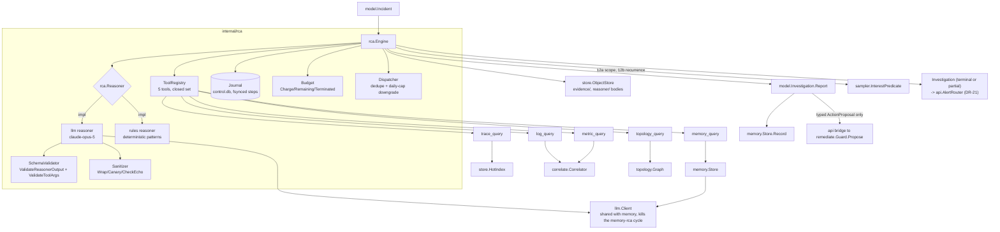

# F06 — Agentic RCA Engine

> Revision 2 — 2026-09-15 — applies DR-0, DR-4, DR-5, DR-11, DR-14, DR-15, DR-16, DR-17, DR-18, DR-19, DR-22, DR-29, DR-31, DR-34, DR-37, DR-38 (round-1 fixes)

## 1. Purpose

`internal/rca` turns a `model.Incident` candidate into a transparent, evidence-grounded
`model.Investigation` by running a Contextualize → Hypothesize → Test → Validate → Report loop
(`model.Phase`). `rca.Engine` orchestrates the loop; `rca.Reasoner` decides what to try next (two
implementations — `llm`, backed by the Anthropic Messages API (`claude-opus-5`, DR-34) with structured
tool-calling, and `rules`, a fully offline deterministic pattern matcher); `rca.Tool` executes each
hypothesis test against real data (traces, logs, metrics, topology, memory) through a **closed set of
five** typed, semantically-validated tools (DR-16). No hypothesis survives without query evidence.
Every step — hypothesis, tool call, result hash+ref, verdict, reasoning — is persisted through
`rca.Journal` and fsynced before the loop advances, so an investigation is fully replayable
(`Engine.Replay`, two modes, DR-18) and individually correctable. This is the mechanism that lets F05's
incidents become pageable under DR-21's three-condition rule, feeds F08's memory, and pushes a
two-phase interest predicate down to F02's sampler (DR-11).

## 2. Compared-tool drawbacks addressed

| Drawback ID | Tool | Lagging feature | How TraceIQ fixes it (concrete mechanism in F06) |
|---|---|---|---|
| D-J2 | Jaeger | No automated RCA — trace comparison/waterfall diff only; engineers eyeball it manually. | `rca.Engine.Investigate` runs the full hypothesize/test/validate loop automatically and returns a cited `Report` — no manual waterfall inspection required to get a root-cause narrative. |
| D-Z4 | Zipkin | No alerting, analytics, RCA, or AI. | F06 is the RCA layer entirely absent from Zipkin; `rules` reasoner alone gives even an offline/no-LLM deployment automated root-cause detection for 6 common failure patterns. |
| D-T3 | Tempo | AI is hooks-only (MCP server, LLM API) — Tempo ships no reasoning of its own. | F06 ships the reasoning loop itself; Tempo (or its MCP server) can be plugged in as a `TraceQuery`/`TopologyQuery` tool *backend*, making Tempo a supported store rather than requiring the operator to bring their own agent. The "consume Tempo/Grafana MCP" clause of the PRD is an explicit Phase 3 deferral (DR-38 §38.1); this does not weaken D-T3's primary claim. |
| D-D5 | Datadog | Agentic AI (Bits AI SRE) tied to the paid platform; Datadog's own blog documented silent eval-quality regressions. | F06 runs self-hosted against any configured LLM or fully offline via `rules`; every `Step` is persisted with a content hash and a `ToolResultRef` and is byte-reproducibly replayable in `ReplayRecorded` mode (FR-F06-19) or re-dispatchable with drift detection in `ReplayLiveDiff` mode (FR-F06-20, DR-18) — accuracy regressions are independently detectable by re-running recorded investigations against a new reasoner version, not trusted to a vendor black box. |
| D-Y1 | Dynatrace | Davis's deterministic RCA is opaque; users cannot see or tune why it decided something. | The replay contract (DR-18) is the concrete mechanism: `ReplayRecorded(ctx, tid, id)` re-derives the report from cached, hash-verified results with **zero** tool calls and **zero** LLM tokens and is byte-identical across runs (AC-F06-15); `ReplayLiveDiff` re-dispatches every tool step with the stored arguments and annotates each step `none \| data_drifted \| schema_changed` (AC-F06-16), which is what distinguishes a reasoning error from changed data. Every hypothesis, tool call, result hash, and verdict is inspectable, and correctable via `memory.Store.Correct` (FR-F06-11). |
| D-X2 | All (cross-cutting) | RCA is manual on OSS tools, or black-box/expensive on commercial platforms. | F06 is the direct resolution: open-source, transparent, evidence-grounded, replayable, and runnable with zero external API cost via the `rules` reasoner. |

## 3. Requirements

### 3.1 Functional

| ID | Statement |
|---|---|
| FR-F06-1 | `rca.Engine.Investigate(ctx, tid, inc)` SHALL execute the Contextualize→Hypothesize→Test→Validate→Report loop and return a `model.Investigation` containing ≥ 1 `Step` for every hypothesis considered, even if the investigation ends inconclusive. |
| FR-F06-2 | Each `Step` SHALL be written through `rca.Journal.AppendStep` and **fsynced before the loop may advance**, so a crash mid-investigation leaves a replayable partial log (retained verbatim from round 0; underpins DR-18's replay contract). |
| FR-F06-3 | `rca.Reasoner` SHALL have exactly two config-selectable implementations, `llm` and `rules`; `rules` SHALL produce a complete `Investigation` with zero network calls for at least the 6 patterns in FR-F06-9, and its rule catalogue populates `Hypothesis.Category`/`Component` deterministically for every rule it fires, making it scorable by the same metric as the `llm` reasoner (DR-15). |
| FR-F06-4 | The `llm` reasoner SHALL NEVER place raw span/log/metric payloads in the model prompt; only `model.ToolResult` projections that have passed the per-tool field allowlist (`Project`, DR-16 §16.2) and the digest formatter (§4.4) are eligible for inclusion, and every such string is wrapped as an `<untrusted k="{class}" c="{canary}">…</untrusted>` region per `01 §8.6` (DR-37 §37.1). |
| FR-F06-5 | Model output SHALL be validated by `rca.SchemaValidator.ValidateReasonerOutput`, which rejects any unknown field or extra key (strict schema, no best-effort parse) before execution; a schema-invalid response SHALL be rejected and retried up to `R=2` times, after which the step is marked with `Verdict = schema_error` and the loop proceeds to termination handling. |
| FR-F06-6 | `rca.Tool` invocation SHALL be restricted to the **closed set of exactly five** tools — `trace_query`, `log_query`, `metric_query`, `topology_query`, `memory_query` (DR-16 §16.1). Adding a sixth tool is an architecture change (a new DR), never a config value; the reasoner is structurally unable to invoke anything outside `rca.ToolRegistry.Names()`. |
| FR-F06-7 | Every tool call SHALL be bounded server-side, independent of what the reasoner requests: `TraceQueryArgs`/`TopologyQueryArgs` rows clamped to `rca.budget.max_rows_per_tool_call` (500 / 500 edges), `LogQueryArgs` lines clamped to 200, `MetricQueryArgs` points clamped to 1000, and the per-step evidence digest capped at `rca.budget.max_evidence_bytes` (8192 B — the `D` term in §4.4's token arithmetic). A clamp sets `ToolResult.Clamped = true` (DR-16 §16.3). |
| FR-F06-8 | The investigation SHALL terminate on the first of: `Hypothesis` confidence ≥ `rca.confidence_threshold` (**0.75**, canonical); `rca.budget.wall_clock` (5 m) elapsed; `rca.budget.max_steps` (24) or `max_tool_calls` (**40**, reachable per §4.4's worked arithmetic — not 20) exceeded; `max_tokens_in` (120 000 uncached) or `max_cached_tokens_in` (600 000, charged as its own dimension) or `max_tokens_out` (64 000) exceeded (`llm` only); `max_cost_micro_usd` (500 000 = $0.50) exceeded. The terminating dimension is recorded on `model.Investigation.TerminationReason` (`model.TerminationReason`, DR-15/DR-17 §17.1–§17.2). |
| FR-F06-9 | The `rules` reasoner SHALL implement, as independently unit-testable functions: `error-signature-new-after-deploy` (calling the shared `anomaly.DeployIndex`, DR-14 §14.6 — not a private pre/post split), `downstream-latency-propagation`, `n-plus-one-span-pattern`, `connection-pool-exhaustion`, `retry-storm`, `timeout-mismatch`. |
| FR-F06-10 | `model.Investigation.Report` (formerly a local `rca.Report`, now `01 §4.4`, DR-15) SHALL include root-cause narrative, cited `[]model.Evidence` (trace IDs, log-line pointers, metric query+window — each carrying `Query` and `ToolResultHash` so an NL answer over the same window cites identical evidence, DR-35 §35.3), blast radius (`[]string` from `TopologyQuery`), a confidence score, and `Remediation []model.ActionProposal` — **typed proposals only** (DR-22 §22.1); there is no free-form remediation string, ever. |
| FR-F06-11 | An engineer correction on any `Step` SHALL be persisted via `memory.Store.Correct(ctx, tid, c model.Correction)` (DR-19 §19.3) scoped to the step (`POST /v1/investigations/{id}/steps/{stepID}/correct`, DR-29 §29.1 — there is no investigation-level `/correct`) and SHALL be available for retrieval-weighting on future `Similar()` queries per DR-19 §19.4's correction arithmetic. |
| FR-F06-12a | *(Was FR-F06-12; split per DR-11 §11.)* **Scope predicate (phase A).** At **Contextualize**, before the first Hypothesize step, `rca.Engine` SHALL push a `sampler.InterestPredicate{Scope: ScopeInvestigation}` scoped to `{Incident.EpicenterService} ∪ Incident.BlastRadius` (≤ 32 services), `MinDuration = baseline.P95(epicenter, rootOperation)`, `ExpiresAt = now + sampler.interest.scope_ttl` (30 m). It is removed on any terminal `Investigation.Status` (in the same code path that writes the terminal status) or on TTL, whichever is first. |
| FR-F06-12b | *(New — DR-11 §11.)* **Recurrence predicate (phase B).** Only on `Status == Concluded && Confidence >= rca.confidence_threshold`, `rca.Engine` SHALL push a `sampler.InterestPredicate{Scope: ScopeRecurrence}` scoped by `ErrorSigIDs`/`PathSigs` **only** — never by service alone — with `ExpiresAt = now + sampler.interest.recurrence_ttl` (24 h), so the next occurrence of the confirmed signature is not sampled away. Removed on TTL, on operator `DELETE`, or superseded by a later investigation concluding on the same `Incident.Fingerprint`. |
| FR-F06-13 | Prompt-injection defense: **every string not authored by TraceIQ's own code** — not only telemetry — is wrapped as a delimited, canary-bearing `<untrusted>` region per `01 §8.6` (DR-37 §37.1's widened scope); the system prompt instructs the model that such content can never redefine its instructions, tools, or output schema; a canary appearing outside a legal output position is `Verdict = schema_error` and, after two violations in one investigation, swaps the reasoner to `rules` (DR-34 §34.4). Any model output attempting to invoke a tool outside the five-tool allowlist or emit non-conforming JSON is rejected by `rca.SchemaValidator`, never executed. |
| FR-F06-18 | *(New — DR-18 §18.1, Appendix C.)* Every `Step` SHALL persist `ToolArgsJSON` (canonical RFC 8785 JSON, `TenantID` elided), `ToolArgsHash`, `ToolResultHash`, `ToolResultRef`, `ReasonerOutputRef`, `ReasonerOutputHash`, `PromptHash`, `Verdict`, and the four spend counters (`TokensIn`, `CachedTokensIn`, `TokensOut`, `CostMicroUSD`), fsynced before the loop advances. Bodies live in `store.ObjectStore` under `evidence/`/`reasoner/`, **never inline** in `investigation_step`. |
| FR-F06-19 | *(New — DR-18 §18.2, Appendix C.)* `Engine.Replay(ctx, tid, id, ReplayRecorded)` SHALL re-derive the report from cached, hash-verified results, issue **zero** tool calls and **zero** LLM tokens, and be byte-reproducible: two `ReplayRecorded` runs produce byte-identical investigation JSON after erasing `ID`/timestamps. The result is a **new** `Investigation` (`ReplayOf`/`ParentID` set); the original is immutable. |
| FR-F06-20 | *(New — DR-18 §18.2, Appendix C.)* `Engine.Replay(ctx, tid, id, ReplayLiveDiff)` SHALL re-dispatch every tool step with the exact stored `ToolArgsJSON` and annotate each step `none \| data_drifted \| schema_changed` by comparing `sha256(newResult)` against the stored `ToolResultHash`. The reasoner is **not** re-invoked in either replay mode — a third mode `ReplayReReason` is an explicit Phase 3 deferral. |
| FR-F06-21 | *(New — DR-16 §16.3, Appendix C.)* Before every tool dispatch, `rca.SchemaValidator.ValidateToolArgs` SHALL perform semantic validation: service/component existence against `topology.Graph.Snapshot`, window containment (`[Incident.StartedAt−2h, Incident.LastSeenAt+2h]`, `≤ rca.tools.max_window` 6h, clamped not rejected), attribute-key/field/template allowlists, and tenant equality re-checked **inside** `Tool.Invoke`. A failure is recorded as a real `Step` with `Verdict = invalid_args`, dispatches no tool, and **counts against `max_tool_calls`** — an injected loop of malformed calls terminates on budget, not free. |
| FR-F06-22 | *(New — DR-17 §17.3, Appendix C.)* Before dispatch, `rca.Dispatcher` SHALL check an in-flight fingerprint map and the `investigation` table for an existing row sharing `Incident.Fingerprint` with `ended_at > now − anomaly.grouping.dedupe_ttl`; on a hit, **no second investigation starts** — the incident is written with `SuppressedBy` and appended to the existing `Investigation.IncidentIDs`. |
| FR-F06-23 | *(New — DR-17 §17.4, Appendix C.)* On exhausting `rca.budget.max_cost_micro_usd_per_tenant_per_day` (default = `tenant.Policy.LLMCostMicroUSDPerDay`, $20/day) or the global daily cap ($100/day), the engine SHALL **downgrade to `rules`** rather than stop investigating; `Investigation.ReasonerKind = rules`, the downgrade is recorded in `ReasonerSwaps` and stated in the report. |
| FR-F06-24 | *(New — DR-18 §18.3, Appendix C.)* A `ToolResultHash` mismatch during `ReplayLiveDiff` (or any replay's evidence load) SHALL abort the replay with `ErrEvidenceCorrupt` and raise a `Critical` incident — never a silent re-fetch. |

### 3.2 Non-functional

| Category | Target |
|---|---|
| Latency | p95 investigation wall-clock < `rca.budget.wall_clock` (5 min); reachable step count is `min(max_steps, max_tool_calls, floor(wall_clock/observed_step_latency))` — **40** steps at the p50 step-latency target (3.5 s), **25** at p99 (12 s). Wall clock, not tokens, is the binding dimension in the common case (DR-17 §17.2). Owning gate: `01 §10.3`. |
| Cost | **$0.50 hard cap per investigation** (`rca.budget.max_cost_micro_usd`), reconciled at startup against the worked token arithmetic (§4.4) — if unreachable, `max_tool_calls` is reduced at boot and the effective value exposed on `GET /v1/config`, never silently vacuous. Per-tenant daily cap $20, global daily cap $100 (DR-17 §17.4); formula and pricing owned by `01 §10.3`/`01 §7 rca.llm.pricing` (DR-34 §34.3). |
| Resilience | `llm → rules` mid-loop fallback on any of six triggers — 3 consecutive transport failures, 2 refusals, daily-cap exhaustion, `traceiq_rca_queue_saturated`, 2 same-step schema failures, 2 canary violations — swappable **only between steps**, **never back**, with prior steps/evidence preserved and `Confidence` capped at `confidence_threshold − 0.01` for the remainder (DR-34 §34.4). |
| Concurrency | **`rca.max_concurrent_investigations: 2` is canonical** (not "≥ 20" — 20 × 96 MiB would exceed the whole-process ceiling); 2 × 96 MiB = **192 MiB**, the figure in DR-9's RSS derivation. Excess incidents queue at `Status = Candidate`; depth > 32 downgrades new investigations to `rules` (DR-17 §17.3). |
| Determinism | `rules` reasoner is fully deterministic; `Investigation.ReplaySeed` (from `crypto/rand` at creation) seeds every tie-break in the rules reasoner and the memory scorer so behavior is reproducible under replay (DR-18, DR-31). |
| Auditability | 100% of steps persisted through `rca.Journal`, fsynced before the loop advances; bodies stored as content-hashed refs in `store.ObjectStore`, never inline (DR-18 §18.1) — this is what keeps the control writer inside DR-6's 200 tx/s budget. Investigation log immutable once terminal; corrections append via `memory.Store.Correct`, they do not mutate history. |

## 4. Design

### 4.1 Component diagram



### 4.2 Data model

`model.Investigation`, `model.Step`, and `model.Hypothesis` are canonical in `01 §4.4` (DR-15) and are
**not** re-declared here (DR-0, DR-4); the local `rca.Investigation`/`rca.Step`/`rca.Hypothesis` types
and the `rca_investigations`/`rca_steps` tables are deleted in favour of `01 §5.1`'s
`investigation`/`investigation_step`/`evidence` (DR-4, DR-15). The additions DR-15 makes to `01 §4.4`
(reproduced here because F06 is their primary consumer):

```go
package model

type Phase uint8
const ( PhaseContextualize Phase = 1; PhaseHypothesize Phase = 2; PhaseTest Phase = 3; PhaseValidate Phase = 4; PhaseReport Phase = 5 )

type HypothesisCategory uint8   // CLOSED — machine-scorable regardless of reasoner
const (
    CatUnknown            HypothesisCategory = 0
    CatSaturation         HypothesisCategory = 1
    CatDependencyFailure  HypothesisCategory = 2
    CatDeployRegression   HypothesisCategory = 3
    CatConfigChange       HypothesisCategory = 4
    CatResourceExhaustion HypothesisCategory = 5
    CatNetwork            HypothesisCategory = 6
    CatDataSkew           HypothesisCategory = 7
    CatExternalProvider   HypothesisCategory = 8
)

type Hypothesis struct {
    ID, Statement string
    Category  HypothesisCategory
    Component string            // MUST resolve in topology at validation time, or be ""
    PriorScore, PostScore float64
    Status    HypothesisStatus  // proposed | testing | supported | refuted | inconclusive
    Source    HypothesisSource  // detector | memory | rule | llm
}

type TerminationReason uint8
const (
    TermConcluded TerminationReason = 1; TermSteps = 2; TermToolCalls = 3; TermTokens = 4
    TermCachedTokens = 5; TermCost = 6; TermWallClock = 7; TermAborted = 8; TermFailed = 9
)

type ReasonerSwap struct { AtStep int; From, To ReasonerKind; Reason string; At time.Time }
```

`model.Investigation` additionally carries `Phase`, `ReasonerKind`, `ReasonerSwaps []ReasonerSwap`,
`TerminationReason`, `IncidentIDs []string` (dedupe attaches extra incidents, DR-17 §17.3),
`ReplaySeed int64`, `PromptVersion string`, `ModelID string`, `ParentID string`, `ReplayOf string`,
`ReplayMode` (DR-18).

**`model.Step`, the persisted shape (DR-18 §18.1)** — the fields FR-F06-18 requires:

```go
package model

type Step struct {
    ID, InvestigationID string
    Tenant   TenantID
    Seq      int
    Phase    Phase
    Tool     ToolName          // "" for a pure-reasoning step

    ToolArgsJSON       string  // canonical (RFC 8785) JSON of the typed ToolArgs, TenantID elided
    ToolArgsHash       string  // "sha256:" + hex

    ToolResultHash     string  // "sha256:" + hex over the canonical result bytes
    ToolResultRef      string  // "evidence/<tenant>/<invID>/<seq>.json.zst" in store.ObjectStore
    ToolResultBytes    int64
    Truncated, Clamped, FromCache bool

    ReasonerOutputRef  string  // "reasoner/<tenant>/<invID>/<seq>.json.zst"
    ReasonerOutputHash string
    PromptHash         string  // sha256 of the exact rendered prompt

    Verdict   StepVerdict      // ok | invalid_args | unavailable | refused | schema_error
    StartedAt, EndedAt time.Time
    LatencyMillis int64
    TokensIn, CachedTokensIn, TokensOut int64
    CostMicroUSD  int64
}
```

Bodies live in `store.ObjectStore` (dev: `${data_dir}/evidence`, `${data_dir}/reasoner`), **never
inline** in SQLite — `investigation_step` carries refs and hashes only, which is what keeps the control
writer inside DR-6's 200 tx/s budget.

**`Investigation.Report` and remediation (DR-15, DR-22 §22.1):**

```go
type Report struct {
    RootCause    string
    Evidence     []model.Evidence   // trace IDs, log-line pointers, metric query+window; carries Query + ToolResultHash
    BlastRadius  []string           // service names, from TopologyQuery
    Confidence   float64
    Remediation  []model.ActionProposal   // TYPED ONLY — no free-form string, ever (DR-22)
}
```

**Budget and spend (DR-17 §17.1, `01 §4.4` verbatim):**

```go
type Budget struct {
    WallClock            time.Duration // 5m
    MaxStepWallClock     time.Duration // 45s — NEW, per-step context.WithTimeout
    MaxSteps             int           // 24
    MaxToolCalls         int           // 40
    MaxTokensIn          int64         // 120000, UNCACHED
    MaxCachedTokensIn    int64         // 600000 — NEW, cache reads charged separately
    MaxTokensOut         int64         // 64000
    MaxCostMicroUSD      int64         // 500000
    MaxCostMicroUSDPerTenantPerDay int64 // 20000000 — NEW
    MaxCostMicroUSDGlobalPerDay    int64 // 100000000 — NEW
}

type Spend struct {
    TokensIn, CachedTokensIn, TokensOut int64
    CostMicroUSD  int64
    ToolCalls, Steps int
    WallClockMillis  int64
}
```

### 4.3 Interfaces & APIs

**Canonical interfaces (DR-15 §15, replaces this section wholesale):**

```go
package rca

type Engine interface {
    Investigate(ctx context.Context, tid model.TenantID, inc model.Incident) (model.Investigation, error)
    Get(ctx context.Context, tid model.TenantID, id string) (model.Investigation, error)
    Replay(ctx context.Context, tid model.TenantID, investigationID string, mode ReplayMode) (model.Investigation, error)  // DR-18
    Correct(ctx context.Context, tid model.TenantID, investigationID, stepID string, c model.Correction) (model.Investigation, error)
    Abort(ctx context.Context, tid model.TenantID, investigationID, reason string) error
    Stats() Stats
}

type Reasoner interface {
    Kind() model.ReasonerKind                      // "llm" | "rules"
    NextStep(ctx context.Context, tid model.TenantID, s State) (Proposal, error)
    Conclude(ctx context.Context, tid model.TenantID, s State) (model.Conclusion, error)
}

type Proposal struct {
    Phase      model.Phase
    Hypotheses []model.Hypothesis // additions or score updates only
    Call       *ToolArgs          // nil when the step is pure reasoning
    Done       bool
    Rationale  string             // <= 2000 bytes, DISPLAY ONLY, never reaches a tool or the cluster
}

type Tool interface {
    Name() model.ToolName
    Schema() ArgSchema                              // rendered into the model's tool list; also the validator's source
    Invoke(ctx context.Context, tid model.TenantID, a ToolArgs) (model.ToolResult, error)
    Cost() ToolCost                                 // declared row/byte/time ceilings, clamped server-side
}

type ToolRegistry interface {
    Get(n model.ToolName) (Tool, bool)
    Names() []model.ToolName                        // exactly the five of DR-16
    Dispatch(ctx context.Context, tid model.TenantID, a ToolArgs) (model.ToolResult, error)
}

// Journal — renamed from StepStore (02's name; one component, one name).
type Journal interface {
    Create(ctx context.Context, tid model.TenantID, inv model.Investigation) error
    AppendStep(ctx context.Context, tid model.TenantID, invID string, st model.Step) error   // fsynced before the loop advances
    AppendEvidence(ctx context.Context, tid model.TenantID, invID string, ev []model.Evidence) error
    Steps(ctx context.Context, tid model.TenantID, invID string) ([]model.Step, error)
    SetStatus(ctx context.Context, tid model.TenantID, invID string, st model.InvestigationStatus, at time.Time) error
    ListRunning(ctx context.Context) ([]model.Investigation, error)   // startup reconciliation (04 §S9)
}

type SchemaValidator interface {
    ValidateReasonerOutput(raw []byte) (Proposal, error)              // strict: an unknown field is an error
    ValidateToolArgs(a ToolArgs, inc model.Incident, topo TopologyReader) error   // DR-16 §16.3
}

type Sanitizer interface {
    Wrap(k model.UntrustedKind, s string) string
    Canary() string
    CheckEcho(modelOutput string) error
}

type Budget interface {
    Charge(ctx context.Context, tid model.TenantID, invID string, d Charge) error
    Remaining(invID string) model.Spend
    Terminated(invID string) (model.TerminationReason, bool)
}

type TopologyReader interface {   // consumer-declared; topology.LiveGraph satisfies it
    Has(ctx context.Context, tid model.TenantID, service string) bool
}
```

`internal/archtest` fails the build on any exported method above whose second parameter is not
`ctx, model.TenantID` in that order, outside the genuine-global allowlist (DR-5).

**Typed tool arguments — the closed five-tool set (DR-16 §16.1–§16.2).** `ToolArgs.Query` (free-form
string) and `ToolArgs.Extra` (`map[string]any`) are **deleted**. Exactly one pointer field is non-nil
and MUST match `Tool`:

```go
type ToolArgs struct {
    TenantID model.TenantID        // DR-5: mandatory, re-checked inside every Tool.Invoke
    Tool     model.ToolName
    Trace    *TraceQueryArgs
    Log      *LogQueryArgs
    Metric   *MetricQueryArgs
    Topology *TopologyQueryArgs
    Memory   *MemoryQueryArgs
}

type TraceQueryArgs struct {
    Service, Operation string
    MinDurationMillis  uint32
    Status             model.StatusFilter   // any | ok | error
    AttrEquals         []AttrEqual          // <= 4; every Key MUST be in store.hot.indexed_attribute_keys
    ErrorSigID         string
    PathSignature      uint64
    Start, End         time.Time
    Limit              int                  // clamped to rca.budget.max_rows_per_tool_call (500)
    Project            []string             // closed field allowlist, <= 12 names
}
type AttrEqual struct { Key, Value string }  // Value <= 128 bytes, matched as a LITERAL, never a pattern

type LogQueryArgs struct {
    TraceID    model.TraceID   // either this ...
    Service    string          // ... or (Service, Start, End)
    Start, End time.Time
    Contains   string          // <= 64 bytes; matched as a LITERAL substring SERVER-SIDE after retrieval,
                               // never interpolated into LogQL/ES DSL/any backend query language (F07)
    Limit      int             // clamped to 200 lines
}

type MetricQueryArgs struct {
    TemplateID  string              // MUST be a registered template id — free PromQL is not representable
    Params      map[string]string   // keys fixed by the template; each value validated by its declared param type
    RED         *REDQuery           // alternative shape: red(service, operation, window)
    Start, End  time.Time
    StepSeconds int                 // clamped to [10, 300]; points clamped to 1000
}
type REDQuery struct { Service, Operation string }

type TopologyQueryArgs struct {
    Service    string
    Hops       int                  // 1..3
    Direction  topology.Direction
    Start, End time.Time
    Limit      int                  // clamped to 500 edges
}

type MemoryQueryArgs struct {
    Fingerprint string   // supplied from the incident by the Engine; the reasoner may NOT author one
    Text        string   // <= 256 bytes
    TopK        int      // clamped to memory.retrieval.top_k (8)
}
```

`Params` is the single surviving `map[string]string` in the whole design, safe because both its keys
and its value grammar are fixed by the named template (§16.4 below).

**Semantic validation, before every dispatch (DR-16 §16.3):**

1. **Existence.** `Service` (and `Hypothesis.Component`) must resolve in `topology.Graph.Snapshot(tenant)`; a name the model invented that no telemetry ever produced fails `ErrToolArgsUnresolvable`.
2. **Window.** `[Start, End] ⊆ [Incident.StartedAt − 2h, Incident.LastSeenAt + 2h]`, `End − Start <= rca.tools.max_window` (6 h). Out-of-range values are **clamped**, not rejected.
3. **Allowlists.** Every `AttrEquals.Key` in the closed 8-key `store.hot.indexed_attribute_keys`; every `Project` name in the per-tool field allowlist; `TemplateID` registered.
4. **Limits.** Every limit clamped server-side; `ToolResult.Clamped = true` when a clamp occurred.
5. **Tenant.** `ToolArgs.TenantID` equals the investigation's tenant, re-checked **inside** `Tool.Invoke`, not only at the registry.

A failure is a real `Step` with `Verdict = invalid_args`; **no tool is called**, and it **counts against
`max_tool_calls`**. Three and only three tool-call outcomes exist: `ok`, `invalid_args`, `unavailable`
(`ErrAdapterUnavailable` → `unavailable`, surfaced as a named missing-evidence class, never a silent
gap).

**The PromQL template allowlist (v1, complete, owned by `01 §6.3`, cited here in full because F06 is
the sole caller — DR-16 §16.4):**

| Template ID | Query | Params |
|---|---|---|
| `cpu_throttle` | `rate(container_cpu_cfs_throttled_seconds_total{namespace="$ns",pod=~"$pod"}[$window])` | `ns`, `pod`, `window` |
| `cpu_usage` | `rate(container_cpu_usage_seconds_total{namespace="$ns",pod=~"$pod"}[$window])` | `ns`, `pod`, `window` |
| `mem_working_set` | `container_memory_working_set_bytes{namespace="$ns",pod=~"$pod"}` | `ns`, `pod` |
| `pod_restarts` | `increase(kube_pod_container_status_restarts_total{namespace="$ns",pod=~"$pod"}[$window])` | `ns`, `pod`, `window` |
| `pod_ready` | `kube_pod_status_ready{namespace="$ns",pod=~"$pod",condition="true"}` | `ns`, `pod` |
| `http_server_rate` | `sum(rate(http_server_request_duration_seconds_count{service_name="$service"}[$window]))` | `service`, `window` |
| `http_server_error_ratio` | `sum(rate(http_server_request_duration_seconds_count{service_name="$service",http_response_status_code=~"5.."}[$window])) / sum(rate(http_server_request_duration_seconds_count{service_name="$service"}[$window]))` | `service`, `window` |
| `db_pool_saturation` | `db_client_connection_count{service_name="$service",state="used"} / db_client_connection_max{service_name="$service"}` | `service` |
| `queue_depth` | `messaging_client_consumed_messages_lag{service_name="$service"}` | `service` |
| `gc_pause` | `rate(process_runtime_gc_duration_seconds_sum{service_name="$service"}[$window])` | `service`, `window` |

Params are validated before rendering, rendered by `text/template` with an escaping function — never
string concatenation. `ns`/`pod`/`service` are validated against a DNS-1123 grammar (`pod` allows one
trailing `*` expanded to `.*` only) and, for `ns`, membership in `tenant.Policy.NamespaceAllowlist`;
`window` is a closed enum `{5m, 15m, 1h, 6h, 24h}`. An unregistered `TemplateID`, unknown param key,
missing required param, or grammar failure is `invalid_args` **before any egress**.

**Replay (DR-18 §18.2):**

```go
type ReplayMode uint8
const (
    ReplayRecorded ReplayMode = 1   // zero tool calls, zero LLM calls, zero spend
    ReplayLiveDiff ReplayMode = 2   // re-dispatch each tool with the STORED args; diff hashes
)
func (e *engine) Replay(ctx context.Context, tid model.TenantID, investigationID string, mode ReplayMode) (model.Investigation, error)
```

**REST/config surface.** F06 renders no path of its own — every endpoint is a **filtered view** of
`01 §6.1`, headed "defined in `01 §6.1`" (DR-29 §29.1):

| Method | Path | Purpose | Role |
|---|---|---|---|
| GET | `/v1/investigations/{id}` | Full replayable log | viewer |
| GET | `/v1/investigations?incident_id=` | List | viewer |
| POST | `/v1/investigations/{id}/replay?mode=recorded\|live-diff` | Returns 202 + new investigation ID; unknown `mode` is 400 (DR-18 §18.3) | operator |
| POST | `/v1/investigations/{id}/steps/{stepID}/correct` | Engineer correction (scoped to a step, not the investigation) | operator |

MCP: `traceiq_start_investigation` (backing `rca.Engine.Investigate`, MinRole **operator**),
`traceiq_get_investigation`, `traceiq_list_incidents` (both viewer) — the full twelve-tool table with
per-tool roles is owned by `01 §6.2` (DR-29 §29.2).

Config key **paths** (values owned exclusively by `01 §7`, DR-0 — this doc cites paths, never numbers;
see DR-17 §17.5 for the authoritative block): `rca.max_concurrent_investigations`,
`rca.confidence_threshold`, `rca.min_incident_score`, `rca.budget.*` (`wall_clock`,
`max_step_wall_clock`, `max_steps`, `max_tool_calls`, `max_tokens_in`, `max_cached_tokens_in`,
`max_tokens_out`, `max_cost_micro_usd`, `max_cost_micro_usd_per_tenant_per_day`,
`max_cost_micro_usd_global_per_day`, `max_rows_per_tool_call`, `max_evidence_bytes`,
`verbatim_digest_window`, `compacted_verdict_tokens`), `rca.tools.max_window`, `rca.llm.*` (DR-34 §34.1).

### 4.4 Algorithms / decision logic

**Prompt token arithmetic — the worked example that makes `max_tool_calls: 40` reachable (DR-17 §17.1,
binding: any change to the terms below requires re-publishing this arithmetic in `01 §4.4`):**

| Symbol | Meaning | Value |
|---|---|---|
| `S` | system prompt + five tool schemas | 3 200 tok, cached |
| `C` | incident context (events, blast radius, deploy markers) | 2 000 tok, cached |
| `M` | memory seeds, ≤ 8 records | 1 500 tok, cached |
| `D` | per-step digest cap = `max_evidence_bytes` (8192 B) ÷ 4 B/tok | **2 048 tok** |
| `K` | verbatim window — last K digests sent in full | **3** |
| `V` | compacted verdict for a step older than K | 60 tok |
| `O` | reasoner output per step | ≤ 400 tok typical, 1 600 hard |
| `N` | `max_tool_calls` | **40** |

Uncached input = `N × (D + O)` = 97 920 tok ≤ 120 000. Cache reads =
`Σ_{n=1..40} [S+C+M + min(n−1,K)·D + max(0,n−1−K)·V]` = 541 432 tok ≤ 600 000. Output = 40 × 400
typical, 40 × 1 600 worst = 64 000. At boot, worst-case cost is computed from `rca.llm.pricing`
(DR-34); if it exceeds `max_cost_micro_usd`, `max_tool_calls` is **reduced at startup** to the largest
`N` that fits, logged at WARN, and exposed as `rca.budget.effective_max_tool_calls`.

**Main loop (`Engine.Investigate`):**
```
function Investigate(tid, incident):
    if Dispatcher.hasInflightOrRecent(incident.Fingerprint, anomaly.grouping.dedupe_ttl):    // FR-F06-22
        attach incident to existing investigation, SuppressedBy=<existingID>; return existing

    inv = Journal.Create(tid, model.Investigation{IncidentID: incident.ID, Budget: configuredBudget(), ReplaySeed: cryptoRandInt64()})
    inv.Steps.append(contextualize(incident))       // topology neighborhood, recent deploys (anomaly.DeployIndex),
                                                       // active anomalies, memory.Similar(fingerprint)
    push FR-F06-12a scope predicate                  // sampler.InterestPredicate{ScopeInvestigation}
    reasoner = selectReasoner(tid)                    // llm, or rules if daily cap already exhausted (FR-F06-23)

    while true:
        if elapsed(inv) > inv.Budget.WallClock:                       inv.TerminationReason = TermWallClock; break
        if inv.Spend.Steps >= inv.Budget.MaxSteps:                    inv.TerminationReason = TermSteps; break
        if inv.Spend.ToolCalls >= inv.Budget.MaxToolCalls:            inv.TerminationReason = TermToolCalls; break
        if reasoner.Kind() == llm and inv.Spend.TokensIn >= inv.Budget.MaxTokensIn:       inv.TerminationReason = TermTokens; break
        if reasoner.Kind() == llm and inv.Spend.CachedTokensIn >= inv.Budget.MaxCachedTokensIn: inv.TerminationReason = TermCachedTokens; break
        if inv.Spend.CostMicroUSD >= inv.Budget.MaxCostMicroUSD:      inv.TerminationReason = TermCost; break

        stepCtx, cancel = context.WithTimeout(ctx, inv.Budget.MaxStepWallClock)  // 45s, NEW
        proposal, err = reasoner.NextStep(stepCtx, tid, state(inv))
        if err != nil and reasoner.Kind() == llm and isFallbackTrigger(err):     // DR-34 §34.4, 6 triggers
            reasoner = rulesReasoner                                            // swap ONLY between steps
            inv.ReasonerKind = rules
            inv.ReasonerSwaps.append({AtStep: len(inv.Steps), From: llm, To: rules, Reason: triggerName(err), At: now()})
            inv.ConfidenceCap = rca.confidence_threshold - 0.01                 // never swaps back
            continue
        if proposal.Done:
            inv.TerminationReason = TermConcluded; break

        if err := SchemaValidator.ValidateToolArgs(proposal.Call, incident, topoReader); err != nil:   // FR-F06-21
            step := Step{Verdict: invalid_args, ...}; Journal.AppendStep(tid, inv.ID, step)  // counts against max_tool_calls
            continue

        result = ToolRegistry.Dispatch(stepCtx, tid, proposal.Call)   // bounded per §4.3; ok | invalid_args | unavailable
        verdict = reasoner.evaluate(proposal, result)
        step = Step{ToolArgsJSON: canonicalJSON(proposal.Call), ToolArgsHash: sha256(...), ToolResultHash: sha256(result),
                    ToolResultRef: objectStore.put(result), ReasonerOutputRef: objectStore.put(raw), Verdict: verdict, ...}
        Journal.AppendStep(tid, inv.ID, step)        // fsynced BEFORE loop continues (FR-F06-2)
        Budget.Charge(tid, inv.ID, step.spend)

        if verdict == confirmed and proposal.Confidence >= min(rca.confidence_threshold, inv.ConfidenceCap):
            inv.TerminationReason = TermConcluded; break

    inv.Report = buildReport(inv)             // narrative + []model.Evidence + blast radius + confidence + []model.ActionProposal
    Journal.SetStatus(tid, inv.ID, terminalStatus(inv.TerminationReason), now())
    memory.Store.Record(tid, inv.Summary())                                   // model.InvestigationRecord, NOT rca.Investigation (DR-2)
    if inv.Status == Concluded and inv.Report.Confidence >= rca.confidence_threshold:
        push FR-F06-12b recurrence predicate      // sampler.InterestPredicate{ScopeRecurrence}, ErrorSigIDs/PathSigs only
    return inv
```

**`llm` reasoner — one round (typed schema, delimited untrusted regions, DR-37 §37.1):**
```
function NextStep_llm(tid, state):
    prompt = buildPrompt(
        systemInstructions,             // fixed: five-tool allowlist, strict JSON schema,
                                          // canary + <untrusted> wrapping instructions
        cachedPrefix(S, C, M),           // system + tool schemas + incident context + memory seeds
        verbatimWindow(last K digests),  // full digest, each wrapped <untrusted k="..." c="{canary}">
        compactedVerdicts(older steps))  // one-line V-token summaries
    raw = llm.Client.Messages(prompt, tools=fiveToolSchemas, effort=rca.llm.effort, thinking=adaptive)
    if canary appears outside a legal position in raw: Verdict = schema_error; canaryViolations++; continue/swap
    proposal, err = SchemaValidator.ValidateReasonerOutput(raw)   // strict: unknown field is an error
    if err != nil:
        retryCount++
        if retryCount > R (2): return _, "schema_validation_failed_after_retries"
        return NextStep_llm(tid, state)   // retry with a corrective system note
    return proposal, nil
```

**Tool-result digest formatter (DR-16 §16.2 `Project` allowlist + DR-37 wrapping):**
```
function digest(rawResult, projectFields):
    rows = rawResult.rows[:clampedLimit]
    for each row: keep only fields in the tool's declared Project allowlist
                  truncate string fields to maxFieldLen
                  run secret-scrubber (entropy + regex) over free-text fields (log bodies)
    bytes = typed, delimited JSON — never concatenated as free text; capped at max_evidence_bytes (8192 B)
    wrapped = Sanitizer.Wrap(untrustedKindFor(tool), bytes)   // <untrusted k="..." c="{canary}">...
    return wrapped
```

**`rules` reasoner — pattern dispatch (deterministic, no LLM; unchanged shape, DR-15 populates
`Category`/`Component` on every fired rule):**
```
function NextStep_rules(inv):
    candidates = orderedRulesNotYetTried(inv)  // fixed priority order, see below
    if candidates empty: return _, ok=false, "no_more_rules"
    rule = candidates[0]
    args = rule.buildToolArgs(inv.context)     // typed ToolArgs, e.g. TopologyQueryArgs for blast radius first
    return Proposal{Hypotheses: [{Category: rule.category, Component: rule.component, ...}], Call: args}, nil

function evaluate_rules(hypothesis, result):
    return ruleFor(hypothesis).verdict(result)  // each rule owns its confirm/refute predicate
```

Rule catalog (priority order, each independently unit-tested per FR-F06-9; `Category` is the
`model.HypothesisCategory` each rule stamps):

| Rule | `Category` | Tool(s) used | Confirm predicate |
|---|---|---|---|
| `error-signature-new-after-deploy` | `CatDeployRegression` | `memory_query`, `metric_query` | New error signature's first-seen timestamp falls in `anomaly.DeployIndex.PrePostSplit(marker).post` for a `deployment.version` change on the same service — the **same** `DeployIndex` call F05 uses (DR-14 §14.6), not a private split. |
| `downstream-latency-propagation` | `CatDependencyFailure` | `trace_query`, `topology_query` | A span's self-time is baseline-normal but its child span(s) in a downstream service account for ≥ 80% of the elevated total duration. |
| `n-plus-one-span-pattern` | `CatDataSkew` | `trace_query` | ≥ N (default 10) sibling spans with identical `(service, operation, db.statement template)` under one parent span. |
| `connection-pool-exhaustion` | `CatResourceExhaustion` | `metric_query`, `log_query` | Pool-wait-time metric rising concurrently with log lines matching a pool-timeout/exhaustion signature. |
| `retry-storm` | `CatSaturation` | `trace_query`, `metric_query` | Request rate to a downstream service exceeds baseline throughput by > 3× with a high proportion of spans sharing a `retry.count > 0` attribute. |
| `timeout-mismatch` | `CatConfigChange` | `trace_query` | A client span's configured timeout is shorter than the callee's observed p95 duration, and the client span status is `DEADLINE_EXCEEDED`. |

**Replay (DR-18 §18.2, exact semantics):**
```
function Replay(tid, investigationID, mode):
    steps = Journal.Steps(tid, investigationID)   // Seq order
    for step in steps:
        body = ObjectStore.Get(step.ToolResultRef)
        if sha256(body) != step.ToolResultHash: abort ErrEvidenceCorrupt; raise Critical incident   // FR-F06-24
    if mode == ReplayRecorded:
        // reasoner NOT called; ReasonerOutputRef supplies each step's decision
        newInv = SchemaValidator -> Validator -> Reporter over cached results
        newInv.Spend = {0,0,0,0}; newInv.ReplayOf = investigationID; newInv.ParentID = investigationID
        return newInv   // byte-identical to any other ReplayRecorded run modulo ID/timestamps (FR-F06-19)
    else: // ReplayLiveDiff
        for step in steps:
            parsed, err = parseTyped(step.ToolArgsJSON)
            if err != nil: step.Drift = schema_changed; continue
            newResult = ToolRegistry.Dispatch(ctx, tid, parsed)   // EXACT stored args, re-dispatched
            step.Drift = (sha256(newResult) == step.ToolResultHash) ? none : data_drifted
            if data_drifted: step.NewToolResultRef = ObjectStore.Put(newResult)   // both bodies inspectable side by side
        // reasoner still NOT called (FR-F06-20); spend = tool cost only, tokens = 0
        return newInv
```

### 4.5 Sequence diagram

```mermaid
sequenceDiagram
    participant GRP as anomaly.Grouper
    participant ENG as rca.Engine
    participant DISP as Dispatcher
    participant MEM as memory.Store
    participant REA as rca.Reasoner
    participant SCH as SchemaValidator
    participant REG as ToolRegistry
    participant JRN as Journal
    participant BUD as Budget
    participant SAMP as sampler.InterestPredicate

    GRP->>ENG: Investigate(tid, incident)
    ENG->>DISP: dedupe check (Fingerprint, dedupe_ttl)
    alt duplicate in-flight/recent
        DISP-->>ENG: attach, SuppressedBy set — no new investigation (FR-F06-22)
    else
        ENG->>MEM: Similar(fingerprint)  [contextualize]
        MEM-->>ENG: past investigations / runbooks (wrapped untrusted, DR-19 §19.5)
        ENG->>SAMP: push scope predicate (FR-F06-12a)

        loop until confidence, budget, or stop
            ENG->>REA: NextStep(tid, state)
            alt reasoner == llm
                REA->>REA: build prompt (digest-only, typed/delimited, <untrusted> wrapped)
                REA->>SCH: ValidateReasonerOutput(raw)
                alt canary violation or schema invalid
                    SCH-->>REA: reject (retry up to R=2, or count canary violation)
                else valid
                    SCH-->>REA: Proposal
                end
            else reasoner == rules
                REA->>REA: pick next untried rule, stamp Category/Component
            end
            REA-->>ENG: Proposal{hypotheses, tool call}
            ENG->>SCH: ValidateToolArgs(call)  [semantic validation, FR-F06-21]
            alt invalid
                SCH-->>ENG: invalid_args — counts against max_tool_calls
            else
                ENG->>REG: Dispatch(args)  [closed 5-tool set only]
                REG-->>ENG: ToolResult (bounded, hashed)
            end
            ENG->>JRN: AppendStep(step)  [fsynced before continuing]
            ENG->>BUD: Charge(spend)
            ENG->>ENG: check confidence/budget termination; fallback swap if triggered (never back)
        end

        ENG->>ENG: buildReport()  [typed ActionProposal only]
        ENG->>MEM: Record(model.InvestigationRecord)
        alt Concluded at/above confidence_threshold
            ENG->>SAMP: push recurrence predicate (FR-F06-12b)
        end
        ENG-->>GRP: Investigation{TerminationReason, Report}
    end
```

## 5. Failure modes & mitigations

| Failure | Detection | Mitigation |
|---|---|---|
| LLM API outage/timeout/refusal/schema drift/cost exhaustion/saturation | Any of the six DR-34 §34.4 triggers | Auto-fallback to `rules` reasoner **between steps only**; prior steps and evidence preserved; `ReasonerKind`/`ReasonerSwaps` recorded; `Confidence` capped at `confidence_threshold − 0.01` for the remainder; no swap back. |
| Prompt injection via telemetry, memory, runbooks, or NL questions | N/A — structural prevention | Every string not authored by TraceIQ's own code is delimited and canary-wrapped (`01 §8.6`, DR-37); tool allowlist has no destructive/arbitrary tool; a "tool" name outside the registry is a lookup miss; `SchemaValidator` rejects any output not matching the strict schema; two canary violations force a reasoner swap. |
| Runaway loop (reasoner keeps proposing without converging) | Step/tool-call/token/cost/wall-clock counters | Hard budget enforcement (FR-F06-8) terminates within the per-step 45 s cap and the 5 min wall clock, recording `TerminationReason`; partial steps remain in the replayable log. |
| Duplicate investigations from correlated detector fan-out | `Incident.Fingerprint` collision within `dedupe_ttl` | `rca.Dispatcher` dedupe (FR-F06-22): one injected fault tripping five detectors yields exactly one investigation and four `SuppressedBy` incidents (AC-F06-22). |
| A replayed evidence blob is corrupted or missing | `sha256(body) != ToolResultHash` | Replay **aborts** with `ErrEvidenceCorrupt` and raises a `Critical` incident — never a silent re-fetch (FR-F06-24). |
| Live data changed since the original investigation ran | `ReplayLiveDiff` re-dispatch hash mismatch | Annotated `data_drifted` per step, both result bodies kept side by side — this is the mechanism that separates a reasoning error from changed data (DR-18 §18.2), not a claim that "LLM nondeterminism defeats replay" (that claim is deleted: replay never re-invokes the model). |
| Expensive/slow tool query (e.g., unbounded log scan) | Per-tool call timeout + row/byte caps | Each `Tool.Invoke` enforces its own timeout and the DR-16 §16.3 clamps independent of the reasoner's request; a timeout returns `unavailable`, evaluated as inconclusive evidence, not a crash. |
| Investigation crashes mid-loop (process restart) | `Journal.ListRunning` on recovery (`04 §S9`) | Steps fsynced before each loop iteration continues (FR-F06-2); recovery resumes from the last committed step. |
| Concurrent investigations contend for the same tool/backing store | Latency spike under load | `rca.max_concurrent_investigations: 2` (not 20); excess incidents queue at `Status = Candidate`; queue depth > 32 downgrades new investigations to `rules` (DR-17 §17.3). |

## 6. Security considerations

The complete mechanism, normative in `01 §8.6`, cited here (DR-37 §37.1):

1. **No raw span dumps.** Only `model.ToolResult` projections reach a prompt, through a closed
   `Project` field allowlist (DR-16 §16.2).
2. **Delimited untrusted regions.** Every string not authored by TraceIQ's own code — telemetry,
   memory narratives, imported runbooks, NL questions, deploy metadata — is wrapped
   `<untrusted k="{class}" c="{canary}">…escaped…</untrusted>`, `{canary}` 16 random hex bytes per
   investigation, escaping neutralising `<`, `>`, and any literal canary occurrence in the payload
   (`model.UntrustedKind`: `UntrustedTelemetry`, `UntrustedLog`, `UntrustedMemory`,
   `UntrustedUserQuestion`, `UntrustedRunbook`, `UntrustedDeployMetadata`).
3. **Canary echo check.** A canary in an illegal output position ⇒ `Verdict = schema_error`, output
   discarded, `traceiq_rca_canary_violation_total` incremented; two violations in one investigation
   force a reasoner swap to `rules` (DR-34 §34.4).
4. **Strict output schema.** `rca.SchemaValidator` rejects unknown fields, extra keys, and any value
   outside a closed enum — there is no best-effort parse.
5. **Closed tool set, typed arguments, semantic validation.** Exactly five tools; `ToolArgs` has no
   free-form string or `map[string]any` field except the template-constrained `Params` (DR-16).
6. **No model-authored payload reaches the cluster.** `Report.Remediation` is `[]model.ActionProposal`
   only; `remediate.Guard` reconstructs every mutation payload from typed fields plus its own
   pre-snapshot (DR-22). `Rationale` is display-only and rendered with an explicit *untrusted,
   model-authored* marker beside the Guard-reconstructed payload (DR-37 §37.2, FR-XSEC-15).
7. **Memory is re-wrapped on retrieval and can never be evidence.** A retrieved memory record may seed
   a `Hypothesis.Source = memory` but may **never** be cited as `Evidence`, and may **never** raise
   `Confidence` to or above `rca.confidence_threshold` without at least one `ok` tool step in the same
   investigation — enforced in `rca.Validator`, asserted by AC-F06-21 (DR-19 §19.5).

**STRIDE (`X-SEC §4.4`, DR-37 §37.3):** `rca` / F06 — Tampering (prompt injection), DoS (cost) →
mitigated by DR-16, DR-17, DR-37.

**Content-equivalence tests (`X-SEC §4.4`'s FR-XSEC-11/12, the load-bearing injection ACs):** for a
corpus of ≥ 40 injected payloads, **zero** tool calls differ in arguments and **zero**
`ActionProposal`s differ in `Type`/`Target`/typed spec between the injected run and a sanitized-copy
run of the same telemetry — asserted by AC-F06-3 (extended, DR-16 §16 Docs-to-change) and by
`X-SEC`'s AC-XSEC-4a/4b.

- **API key handling**: `rca.llm.api_key_env`/`api_key_file` (X-SEC), never written into
  `Investigation`/`Step` records or logs.
- **Correction attribution**: `Step.CorrectedBy` requires an authenticated identity (X-SEC RBAC);
  correction history is append-only and immutable.

## 7. Test strategy & acceptance criteria

**Unit tests**
- One fixture-driven test per rule in the `rules` catalog (positive + negative cases), asserting the
  stamped `Category`/`Component`.
- `SchemaValidator.ValidateReasonerOutput`: valid output accepted; malformed JSON, missing fields, extra
  keys, and adversarial injection-attempt strings all rejected without side effects.
- `SchemaValidator.ValidateToolArgs`: existence/window/allowlist/limit/tenant checks each independently
  tested at the boundary; a failure recorded as `invalid_args` and counted against `max_tool_calls`.
- Budget enforcement: exact-boundary tests for wall-clock, per-step wall-clock (45s), step count, tool-call
  count, token/cached-token/cost dimensions; `TerminationReason` correctness.
- Digest formatter: secret-scrubbing correctness, `Project`-allowlist enforcement, `max_evidence_bytes`
  cap, canary-wrap/escape correctness.
- `Journal`: crash-recovery replay produces an identical `Investigation` to the pre-crash state.
- Dedupe (`Dispatcher`): fingerprint-hit vs. miss, `dedupe_ttl` boundary.
- Reasoner-swap triggers: each of the six DR-34 §34.4 triggers independently reproduced.

**Integration tests**
- Full loop against a stub `llm` reasoner (deterministic canned responses) — verifies engine
  orchestration independent of real model variance.
- Full loop with `rules` reasoner against synthetic incidents for each of the 6 patterns — asserts
  exact-match reproducibility (determinism NFR).
- Fallback path: simulate each of the six triggers mid-investigation, assert a single mid-loop swap
  with no swap back and `Confidence` capped.
- Replay: `ReplayRecorded` twice against the same investigation — byte-identical modulo IDs/timestamps,
  zero tool calls, zero tokens; `ReplayLiveDiff` against a store mutated at exactly one step — flags
  `data_drifted` on exactly that step; a corrupted evidence blob aborts with `ErrEvidenceCorrupt`.
- End-to-end with F05: incident candidate → investigation → validated report → scope predicate
  observed at Contextualize, recurrence predicate observed only on a Concluded, above-threshold result.

**Acceptance criteria**

| AC | Maps to | Criterion |
|---|---|---|
| AC-F06-1 | FR-F06-1, FR-F06-2 | Every investigation, regardless of outcome, has ≥ 1 persisted `Step`; killing the process mid-loop and restarting via `Journal.ListRunning` reproduces all steps up to the last commit. |
| AC-F06-2 | FR-F06-3 | `rules` reasoner completes investigations for all 6 pattern fixtures with zero outbound network calls, each fired rule carrying a stamped `Category`/`Component`. |
| AC-F06-3 | FR-F06-4, FR-F06-13, FR-F06-21 | *(Extended per DR-16/DR-37.)* Adversarial fixture suite (≥ 40 injection-attempt samples across telemetry, memory, runbooks, NL questions) produces zero unauthorized tool invocations, zero schema-bypassing outputs, **and** no corpus input produces a non-template query or a tool call whose arguments differ from the sanitized-copy run. |
| AC-F06-4 | FR-F06-8 | Investigations exceeding any budget dimension (steps, tool calls, tokens in/cached/out, cost, wall clock, per-step wall clock) terminate within 1s of crossing the threshold with the correct `TerminationReason`. |
| AC-F06-5 | FR-F06-9 | Each of the 6 rule patterns achieves ≥ 90% precision/recall on its dedicated synthetic fixture set (tracked alongside F11's eval harness). |
| AC-F06-6 | FR-F06-12a, FR-F06-12b | On any investigation, the scope predicate (12a) is observed pushed at Contextualize in ≥ 99% of test runs; on a Concluded, above-threshold investigation, the recurrence predicate (12b) is observed pushed and scoped by `ErrorSigIDs`/`PathSigs` only. |
| AC-F06-15 | FR-F06-19 | Two `ReplayRecorded` runs against the same investigation produce byte-identical investigation JSON after erasing `ID`/timestamps; zero tool calls; zero tokens. |
| AC-F06-16 | FR-F06-20 | Against a store mutated at exactly one step, `ReplayLiveDiff` flags `data_drifted` on exactly that step and `none` elsewhere. |
| AC-F06-17 | FR-F06-24 | A corrupted evidence blob aborts replay with `ErrEvidenceCorrupt` and raises a `Critical` incident. |
| AC-F06-18 | FR-F06-18 | Every persisted `Step` carries all eighteen required fields (§4.2); none of `ToolResultRef`/`ReasonerOutputRef` is ever empty for a step with `Tool != ""`; bodies are never found inline in `investigation_step`. |
| AC-F06-19 | FR-F06-21 | Fixture suite of malformed/out-of-window/unresolvable tool-arg proposals: 100% recorded as `invalid_args` steps that count against `max_tool_calls`; zero dispatched to a `Tool`. |
| AC-F06-20 | FR-F06-12a, FR-F06-12b | A predicate pushed under 12a is removed on the investigation's terminal status or `scope_ttl`, whichever first; a 12b predicate is scoped by signature/path only and never by service alone. |
| AC-F06-21 | DR-19 §19.5 | A retrieved memory record can seed a hypothesis but is never emitted as `Evidence`, and cannot alone raise `Confidence` to `rca.confidence_threshold` without a same-investigation `ok` tool step. |
| AC-F06-22 | FR-F06-22 | One injected fault tripping five correlated detectors ⇒ exactly one investigation, four incidents carrying `SuppressedBy`, total LLM spend equal to one investigation's budget. |
| AC-F06-23 | FR-F06-23 | A burst of 100 incidents cannot exceed the per-tenant or global daily cost cap; the downgrade is visible on `ReasonerKind`. |
| AC-F06-24 | DR-34 §34.4 | Each of the six fallback triggers produces exactly one swap, preserves prior steps, and caps `Confidence`. |

## 8. Open questions / risks

- Confidence-score calibration for the `llm` reasoner (model-reported vs. engine-derived from evidence
  strength) is not fully specified — risk of over/under-confident reports against the now-canonical
  `rca.confidence_threshold` (0.75, DR-17 §17.5); likely needs an F11 eval-harness-driven calibration
  pass before GA.
- Hybrid mode (run `rules` first as a fast pre-filter, escalate to `llm` only if inconclusive) is
  attractive for cost control but changes the budget/step-numbering contract; still deferred pending
  F11 cost/accuracy data — not resolved by round 1.
- **Decided (round 1), DR-14 §14.6.** The shared deploy-window abstraction flagged here in round 0 now
  exists: `anomaly.DeployIndex`, owned by `internal/anomaly`, called by both F05's detectors and F06's
  `error-signature-new-after-deploy` rule (DR-2 permits `rca → anomaly`). There is no duplicated
  pre/post-split logic left in this package.
- **Decided (round 1), DR-17 §17.3.** Multi-incident correlation (one root cause producing several
  concurrent `Incident` candidates) is no longer purely an F08 fingerprint-similarity concern:
  `rca.Dispatcher` deduplicates before dispatch against `Incident.Fingerprint` within
  `anomaly.grouping.dedupe_ttl`, so at most one investigation runs per fingerprint at a time; F08's
  similarity retrieval remains the mechanism for surfacing *past*, non-concurrent occurrences.
- **Phase 3 deferral, DR-18 §18.2.** A third replay mode, `ReplayReReason` (re-invoke the reasoner
  against cached tool results), is explicitly out of scope for v1 and recorded in `00`.
