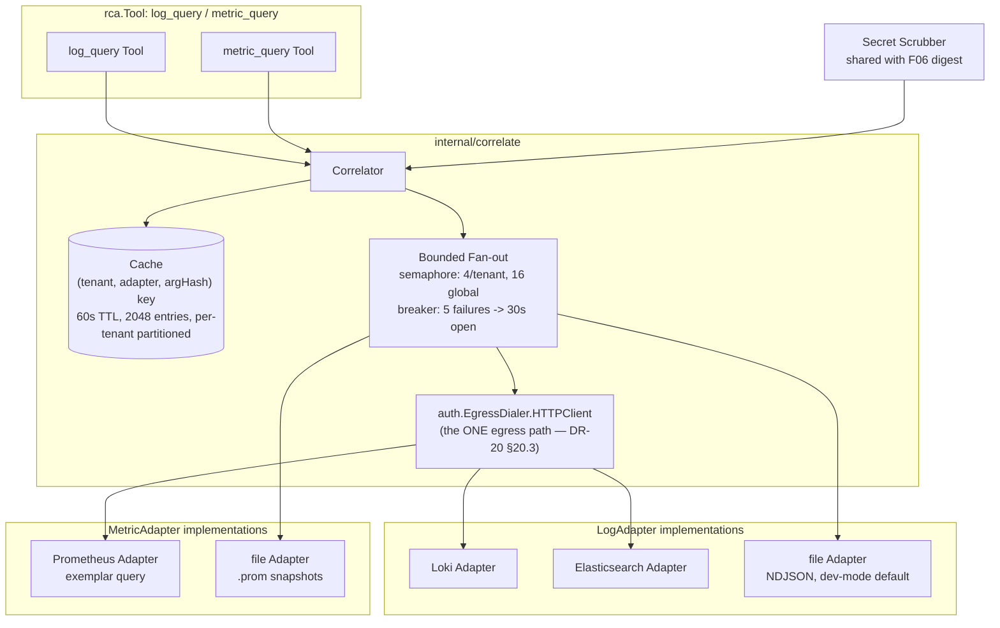
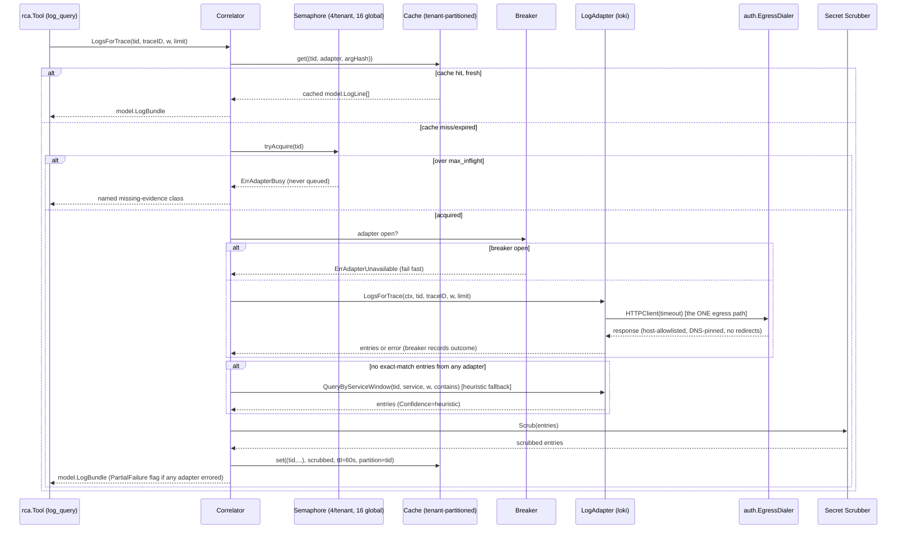

# F07 — Trace–Log–Metric Correlation

> Revision 3 — 2026-09-15 — applies DR-0, DR-2, DR-4, DR-5, DR-16, DR-20, DR-31, DR-38 (round-1 fixes)

## 1. Purpose

`internal/correlate` is the evidence bridge that lets `rca.Tool` implementations (`log_query`,
`metric_query`) answer "what else was happening" for a given trace or span. `correlate.Correlator`
joins a `trace_id` to logs via pluggable, **tenant-scoped** `LogAdapter`s (Loki, Elasticsearch, and a
first-class `file` adapter for dev/offline use) and joins a span to metrics via `MetricAdapter`
(Prometheus exemplars, or a `file` snapshot adapter). `correlate` never calls `store.GetTrace` — the
caller supplies the `model.Window` and the trace (DR-2 §2, DR-20 §20.1). Every outbound adapter call is
made through the **one** egress path, `auth.EgressDialer.HTTPClient` (DR-20 §20.3, DR-25), bounded in
fan-out (`golang.org/x/sync/semaphore`) and cached, so an RCA investigation calling these tools
repeatedly within its budget doesn't re-pay adapter latency, overload the backing systems, or leak a
tenant-A investigation's evidence into a tenant-B log line. Correlation is the single mechanism that
turns "trace-only" tooling (Jaeger, Zipkin as shipped) into a unified evidence view without requiring a
separate observability platform.

## 2. Compared-tool drawbacks addressed

| Drawback ID | Tool | Lagging feature | How TraceIQ fixes it (concrete mechanism in F07) |
|---|---|---|---|
| D-J3 | Jaeger | Traces only — logs and metrics live entirely outside the product; no in-product correlation. | `Correlator.LogsForTrace`/`MetricsForSpan` auto-join traces to logs (`trace_id`) and metrics (exemplars) at investigation time, producing one evidence bundle without the engineer manually pivoting between three UIs — and, unlike a hand-rolled join, every adapter call is tenant-scoped and egress-controlled by construction (DR-20). |
| D-Z4 | Zipkin | No alerting, analytics, RCA, or AI; basic search UI, no cross-signal correlation of any kind. | F07 gives Zipkin-class deployments the foundational cross-signal capability (log/metric join) that the product category lacks entirely — the prerequisite analytics layer under F06's evidence citations, with the `driver: file` adapter making it exercisable with zero external services (DR-20 §20.5). |

## 3. Requirements

### 3.1 Functional

| ID | Statement |
|---|---|
| FR-F07-1 | `Correlator.LogsForTrace(ctx, tid, traceID, w model.Window, limit int)` SHALL return `model.LogBundle` for log entries whose `trace_id` field matches, sourced from whichever `LogAdapter`(s) are configured, bounded to `limit` (default cap 500 entries). The caller (an `rca.Tool`) supplies `w`; `correlate` never derives it by calling `store.GetTrace` (DR-2, DR-20 §20.1). |
| FR-F07-2 | `Correlator.MetricsForSpan(ctx, tid, s model.Span, w model.Window)` SHALL return `model.MetricBundle` — exemplar-linked metric samples for the span's `(service, operation)` within the caller-supplied window, using Prometheus exemplar trace_id/span_id linkage. |
| FR-F07-3 | Adapters SHALL implement the common `LogAdapter`/`MetricAdapter` interfaces (DR-20 §20.1, tenant in every signature) so Loki, Elasticsearch, `file`, and Prometheus are pluggable without changing `Correlator` call sites; each adapter declares `Capabilities()` (`LogCapabilities{TenantScoped, TraceIDIndexed, MaxLookback}` / `MetricCapabilities`). |
| FR-F07-4 | The **`file` driver** SHALL be a first-class adapter (not a stub) and the **dev-profile default**, functioning with zero external services: NDJSON log lines (`{ts, trace_id, span_id, service, level, body, attrs}`) under `correlate.logs.path`, per-tenant subdirectories, `Capabilities{TenantScoped: true, TraceIDIndexed: true}`; Prometheus text-format metric snapshots (`<unix>.prom`) under `correlate.metrics.path`, with `Range` interpolating across snapshots at `stepSeconds` (DR-20 §20.5). |
| FR-F07-5 | When no adapter returns an exact `trace_id` match (legacy/uninstrumented services), `Correlator` SHALL fall back to best-effort `QueryByServiceWindow(service, window)` correlation with `Contains` matched as a **literal substring server-side after retrieval** — never interpolated into LogQL/ES DSL/any backend query language (DR-16 §16.2) — and SHALL mark the result `Confidence: heuristic` so downstream RCA evidence citations do not overweight it. |
| FR-F07-6 | *(New — DR-20 §20.2, Appendix C.)* **Tenant scoping is a startup requirement, not a convention.** `tenancy.enabled: true` with a correlate driver other than `none`/`file` and `tenant_mode: none` is refused at startup, exit 2, naming both keys — a shared backend credential with no tenant selector means a tenant-A investigation can retrieve tenant-B log lines. An adapter whose `Capabilities().TenantScoped` is false likewise refuses construction when tenancy is enabled. `tenant_mode: per_tenant_credential` resolves a credential through `auth.SecretSource` keyed by tenant; `tenant.Policy.CorrelationTenantID` maps a customer's external org-id to their TraceIQ tenant id when they differ. |
| FR-F07-7 | *(New — DR-20 §20.4, Appendix C.)* `Correlator` SHALL bound fan-out via `golang.org/x/sync/semaphore` to `correlate.max_inflight` (4) per tenant and `max_inflight_global` (16); over the limit a call returns `ErrAdapterBusy` immediately — recorded as a named missing-evidence class — and is **never queued unboundedly**. A circuit breaker opens an adapter for `breaker_open` (30 s) after `breaker_failures` (5) consecutive failures; while open, calls fail fast with `ErrAdapterUnavailable` and `traceiq_component_degraded{component="log_adapter"} = 1`, and `/readyz` is unaffected (DR-33). Results are cached, keyed `(tenant, adapter, sha256(canonical args))`, LRU, `max_entries` (2048) partitioned per tenant so one tenant cannot evict another's entries beyond its `max_entries / ntenants` share; a cache hit sets `FromCache = true` without weakening the result's content hash. |
| FR-F07-8 | *(New — DR-38 §38.1, Appendix C.)* A startup capability check SHALL sample the configured log adapter; if **< 50%** of sampled lines carry `trace_id`, `Correlator` SHALL set `traceiq_component_degraded{component="log_correlation"} = 1` and every affected report SHALL carry the named missing-evidence class *"logs are not trace-correlated"*. The heuristic fallback (FR-F07-5) survives in this state but is **always labelled**, never silently promoted. |

### 3.2 Non-functional

| Category | Target |
|---|---|
| Latency | p99 `LogsForTrace` < 500ms cache-hot; < 2s cache-cold against a single adapter, under the per-call timeout budget. Owning gate: `01 §10.3`; config keys `correlate.logs.timeout`/`correlate.metrics.timeout` (values owned by `01 §7`, DR-0). |
| Precision | Trace_id-tagged logs: 100% precision by construction (exact key match); heuristic-fallback results are explicitly labeled `Confidence: heuristic` and excluded from `Report.Evidence` unless no exact-match evidence exists. |
| Availability | A single adapter outage or an open breaker degrades result completeness, never request failure — `Correlator` always returns whatever succeeded within the overall timeout, and `/readyz` is unaffected (DR-33). |
| Resource bound | Fan-out bounded at `max_inflight` (4/tenant) and `max_inflight_global` (16) regardless of configured adapter count — this is what stops 2 concurrent investigations × 40 tool calls (DR-17) from becoming an outbound stampede. |
| Tenant isolation | An adapter refuses construction under `tenancy.enabled: true` unless `Capabilities().TenantScoped` — see FR-F07-6. This is a startup-time, not a runtime-tunable, guarantee. |
| Determinism | Cache TTL expiry and circuit-breaker open/close timing both read `model.Clock` (DR-31) — no `time.Now`/`time.After` inside `internal/correlate` outside the allowlisted exceptions, so `eval.VirtualClock` can drive correlation deterministically. |

## 4. Design

### 4.1 Component diagram



### 4.2 Data model

`model.LogLine`, `model.LogBundle`, `model.Series`, `model.Exemplar`, and `model.MetricBundle` are
canonical in `01 §4` and are **not** re-declared here (DR-0, DR-4). The local `correlate.TimeWindow`
type is **deleted** in favour of `model.Window` (DR-4's deletion table: `store.TimeWindow`,
`store.Window`, `topology.Window`, `correlate.TimeWindow` → one `model.Window`).

Adapter capability structs remain local to `internal/correlate` (DR-20 §20.1):

```go
package correlate

type LogCapabilities struct {
    TenantScoped   bool          // false => refuses construction when tenancy.enabled
    TraceIDIndexed bool          // false => QueryByServiceWindow heuristic is the only path; always labelled
    MaxLookback    time.Duration
}

type MetricCapabilities struct {
    TenantScoped bool
    // remaining fields mirror LogCapabilities's shape; canonical definition owned by 02 §3 (DR-20 §20.1)
}
```

**Local `file`-driver storage (DR-20 §20.5 — replaces the prior SQLite `local_logs` design).** Logs are
**NDJSON**, one object per line, per-tenant subdirectory under `correlate.logs.path`; there is no SQLite
table for the local log adapter. Metrics are a directory of Prometheus text-format snapshots named
`<unix>.prom` under `correlate.metrics.path`. Neither format requires a schema migration or an embedded
database — this is what makes `driver: file` zero-egress and trivially inspectable in dev.

### 4.3 Interfaces & APIs

**Canonical interfaces, with the tenant in every signature (DR-20 §20.1, replaces this section
wholesale):**

```go
package correlate

type LogAdapter interface {
    Name() string
    LogsForTrace(ctx context.Context, tid model.TenantID, traceID model.TraceID, w model.Window, limit int) ([]model.LogLine, error)
    QueryByServiceWindow(ctx context.Context, tid model.TenantID, service string, w model.Window, contains string, limit int) ([]model.LogLine, error)
    Capabilities() LogCapabilities
    Health(ctx context.Context) model.HealthReport
    Close() error
}

type MetricAdapter interface {
    Name() string
    Range(ctx context.Context, tid model.TenantID, templateID string, params map[string]string, w model.Window, stepSeconds int) (model.Series, error)
    ExemplarsFor(ctx context.Context, tid model.TenantID, service, operation string, w model.Window) ([]model.Exemplar, error)
    Capabilities() MetricCapabilities
    Health(ctx context.Context) model.HealthReport
    Close() error
}

type Correlator interface {
    LogsForTrace(ctx context.Context, tid model.TenantID, traceID model.TraceID, w model.Window, limit int) (model.LogBundle, error)
    MetricsForSpan(ctx context.Context, tid model.TenantID, s model.Span, w model.Window) (model.MetricBundle, error)
    Stats() Stats
}

// New constructs a Correlator with an injected clock (DR-31): cache TTL
// expiry and breaker open/close timing both read model.Clock rather than
// calling time.Now/time.After directly, so internal/archtest's time-ban
// check passes and eval.VirtualClock can drive correlation deterministically.
func New(cfg Config, clock model.Clock, logAdapters []LogAdapter, metricAdapters []MetricAdapter, dialer auth.EgressDialer) (Correlator, error)
```

`internal/archtest` fails the build on `http.DefaultClient`, `http.Get`, `http.Post`, `http.Head`,
`net.Dial`, `net.DialTimeout`, or an `http.Client{…}` composite literal anywhere under
`internal/correlate` (also `internal/llm`, `internal/k8s`, `internal/api/chat`) — **no adapter
constructs its own `http.Client`**; every outbound call is made with a client obtained from
`auth.EgressDialer.HTTPClient(timeout)`, which enforces `01 §8.7` in full: host allowlist, DNS pinned
per connection against rebinding, redirects **not** followed, `169.254.169.254` refused
**unconditionally in every mode** (DR-20 §20.3, DR-25).

**REST/MCP surface.** `internal/correlate` renders no REST path of its own — it is invoked internally
by `rca.Tool` (`log_query`/`metric_query`) and `internal/nl`. Its MCP exposure is
`traceiq_correlate_logs` / `traceiq_correlate_metrics`, owned by `01 §6.2`'s twelve-tool table
(DR-29 §29.2), role **viewer**.

Config key **paths** (values owned exclusively by `01 §7`, DR-0 — this doc cites paths, never numbers;
see DR-20 §20.2/§20.4 for the authoritative block): `correlate.logs.driver`, `.url`, `.path`,
`.timeout`, `.max_lines`, `.tenant_mode`, `.tenant_header`, `.tenant_label`, `correlate.metrics.driver`,
`.url`, `.path`, `.timeout`, `.step`, `.tenant_mode`, `correlate.egress_allowlist`,
`correlate.allow_private_networks` (**default flipped to `false`** — an in-cluster backend opts in
explicitly, logged at startup and surfaced on `GET /v1/config` as `egress_private_networks: true`),
`correlate.max_inflight`, `.max_inflight_global`, `.breaker_failures`, `.breaker_open`, `correlate.cache.enabled`,
`.max_entries`, `.ttl`.

### 4.4 Algorithms / decision logic

**`LogsForTrace` — cache + bounded fan-out + breaker + fallback (DR-20 §20.1, §20.4):**
```
function LogsForTrace(tid, traceID, w, limit):
    cacheKey = (tid, "*", sha256(canonical({traceID, w, limit})))
    if cache.has(cacheKey) and not cache.expired(cacheKey):
        return cache.get(cacheKey)

    if !semaphore.tryAcquire(tid):          // max_inflight (4/tenant), max_inflight_global (16)
        return ErrAdapterBusy                // never queued unboundedly — named missing-evidence class

    results, errors = {}, {}
    for adapter in configuredLogAdapters (parallel, each gated by ITS OWN breaker state):
        if breaker[adapter].open: errors[adapter.Name()] = ErrAdapterUnavailable; continue
        r, err = adapter.LogsForTrace(ctx, tid, traceID, w, limit)   // http.Client from auth.EgressDialer only
        if err != nil: breaker[adapter].recordFailure(); errors[adapter.Name()] = err
        else: breaker[adapter].recordSuccess(); results.append(r, Confidence=exact)

    if results is empty and errors is empty:  // no adapter had trace_id-tagged logs at all
        for adapter in configuredLogAdapters (same bounded shape):
            r, err = adapter.QueryByServiceWindow(ctx, tid, trace.RootService, w, contains="", limit)
            results.append(r, Confidence=heuristic)   // FR-F07-5; contains matched as a LITERAL, server-side

    results = truncate(results, limit)
    scrubbed = secretScrubber.Scrub(results)  // shared with F06 digest formatter
    cache.set(cacheKey, scrubbed, ttl, partition=tid)
    return model.LogBundle{scrubbed}, PartialFailure=len(errors)>0
```

**`MetricsForSpan` — same fan-out shape, keyed by span:**
```
function MetricsForSpan(tid, span, w):
    cacheKey = (tid, "*", sha256(canonical({span.SpanID, w})))
    if cached: return cached
    results, errors = boundedFanOut(tid, metricAdapters, adapter -> adapter.ExemplarsFor(ctx, tid, span.Service, span.Operation, w))
    cache.set(cacheKey, results, ttl, partition=tid)
    return model.MetricBundle{results}, PartialFailure=len(errors)>0
```

**Cache eviction (LRU with TTL check on read, per-tenant partitioned):**
```
function cache.get(key):
    entry = lru.get(key)
    if entry == nil or now() - entry.storedAt > ttl:
        lru.evict(key)
        return miss
    return entry.value

function cache.set(key, value, ttl, partition):
    if lru.sizeFor(partition) >= maxEntries/ntenants: lru.evictOldestFor(partition)
    lru.put(key, {value, storedAt: now()})
```

**Startup capability check (FR-F07-8, DR-38):**
```
function CapabilityCheck():
    sample = configuredLogAdapters[0].sampleRecentLines(n=100)
    ratio = countWithTraceID(sample) / len(sample)
    if ratio < 0.50:
        traceiq_component_degraded{component="log_correlation"} = 1
        every subsequent report SHALL carry missing-evidence class "logs are not trace-correlated"
```

### 4.5 Sequence diagram



## 5. Failure modes & mitigations

| Failure | Detection | Mitigation |
|---|---|---|
| Adapter down/unreachable (Loki/ES/Prometheus outage) | Per-call error, or breaker already open | Partial results returned with `AdapterErrors` populated; after `breaker_failures` (5) consecutive failures the adapter fails fast for `breaker_open` (30 s) with `traceiq_component_degraded{component="log_adapter"}=1`; `/readyz` is unaffected (DR-33). |
| Shared backend credential with no tenant selector (cross-tenant leak) | Startup validation | `tenancy.enabled: true` + a non-`none`/`file` driver + `tenant_mode: none`, or an adapter whose `Capabilities().TenantScoped` is false, refuses to start (exit 2, naming both keys) rather than risk a tenant-A investigation retrieving tenant-B log lines (FR-F07-6). |
| SSRF via a configured adapter URL (DNS rebinding, redirect, metadata endpoint, private range) | N/A — must be prevented, not detected | `auth.EgressDialer` is the only egress path: host allowlist, DNS pinned per connection, redirects never followed, `169.254.169.254` refused unconditionally in every mode; `allow_private_networks` defaults `false` (DR-20 §20.3). |
| Outbound stampede from concurrent investigations (2 × 40 tool calls) | Inflight counter saturation | Fan-out bounded to `max_inflight` (4/tenant) / `max_inflight_global` (16); over the limit, `ErrAdapterBusy` returns immediately rather than queuing unboundedly (DR-20 §20.4). |
| Clock skew between the tracing pipeline and the log/metric backend | Correlated results systematically miss real matches | Window is supplied by the caller (typically padded by RCA's own window logic, DR-16 §16.3); adapter-level skew tuning remains a per-deployment `01 §7` key. |
| No `trace_id` on log lines (legacy service, missing collector processor) | Zero exact-match results, or the startup capability-check ratio < 50% | Heuristic time+service fallback (FR-F07-5), explicitly labeled `Confidence: heuristic`; below the 50% threshold the component is marked degraded and every affected report names the missing-evidence class (FR-F07-8, DR-38). |
| Log/metric volume explosion during an incident (fan-out queries return huge result sets) | Adapter response size/row count | Row cap (`limit`, default 500) and byte cap enforced at the adapter boundary before results ever reach `Correlator` or the cache. |
| Cache staleness serving outdated evidence mid-investigation | TTL check on every read | 60 s TTL, tenant-partitioned LRU (2048 entries / n tenants each) — short relative to the investigation's wall-clock budget (DR-17). |
| Secrets embedded in log bodies (API keys, tokens accidentally logged) | N/A — must be prevented, not detected after the fact | Every `LogLine.Body` passes through the shared secret scrubber before leaving `Correlator`, prior to being cached or handed to F06's digest formatter. |

## 6. Security considerations

- **One egress path (DR-20 §20.3).** No adapter constructs its own `http.Client`; every outbound call
  goes through `auth.EgressDialer.HTTPClient(timeout)`, which enforces the host allowlist, per-connection
  DNS pinning against rebinding, no redirect-following, and an unconditional refusal of
  `169.254.169.254` in every mode. `internal/archtest` fails the build on any direct `net/http` client
  construction under `internal/correlate`.
- **Tenant scoping is enforced at startup, not documented as a convention** (FR-F07-6): a
  non-tenant-scoped adapter, or a shared credential with `tenant_mode: none`, refuses construction
  under `tenancy.enabled: true`.
- Adapter credentials (Loki/ES/Prometheus auth tokens) are sourced from `auth.SecretSource`
  (X-SEC), keyed by tenant when `tenant_mode: per_tenant_credential`; never embedded in config files
  checked into the repo.
- All adapter queries are read-only; no `LogAdapter`/`MetricAdapter` implementation exposes a write or
  delete path.
- `allow_private_networks` defaults **false**; an in-cluster backend opts in explicitly, and the opt-in
  is logged at startup and surfaced on `GET /v1/config` as `egress_private_networks: true`.
- The shared secret scrubber runs on every `LogLine.Body` and metric label before the result leaves
  `internal/correlate` — the last line of defense before content can reach F06's `llm` reasoner prompt
  (which independently wraps it as `<untrusted>`, DR-37).
- Heuristic-fallback results are never silently promoted to `Confidence: exact` anywhere downstream;
  the field is part of the persisted `model.Evidence` in F06 reports so a human reviewing a citation
  can see it was inferred, not matched.
- Cache entries are process-local (in-memory) and tenant-partitioned, not persisted to disk, avoiding
  an additional at-rest surface for potentially sensitive log content.
- `Contains` (FR-F07-5, DR-16 §16.2) is matched as a literal substring **server-side after retrieval**
  and is never interpolated into LogQL, ES DSL, or any backend query language — this closes the
  injection surface a naive pass-through filter would open.

**STRIDE (`X-SEC §4.4`, DR-37 §37.3):** `correlate` / F07 — Information disclosure (cross-tenant logs),
SSRF → mitigated by DR-20.

## 7. Test strategy & acceptance criteria

**Unit tests**
- `file` adapter: NDJSON trace_id indexing correctness (per-tenant subdirectory), `.prom` snapshot
  interpolation at `stepSeconds`, query-by-window.
- Mock Loki/Elasticsearch adapters (HTTP mock server behind a stub `EgressDialer`): request shaping,
  timeout handling, error mapping.
- Prometheus exemplar adapter: query construction, exemplar parsing against fixture responses.
- Bounded fan-out: semaphore acquisition/`ErrAdapterBusy` at `max_inflight`/`max_inflight_global`;
  breaker opens at `breaker_failures`, stays open for `breaker_open`, fails fast while open.
- Cache: TTL expiry, per-tenant-partitioned LRU eviction at capacity, key correctness including the
  adapter-argument hash component.
- Heuristic fallback: triggers only when zero exact-match results across all configured adapters;
  correctly labels `Confidence: heuristic`; `Contains` never reaches a backend query language unescaped.
- Startup capability check: < 50% trace_id-tagged sample sets `traceiq_component_degraded` and the
  missing-evidence class; ≥ 50% does not.
- Tenant-scoping startup validation: every disallowed `(driver, tenant_mode, TenantScoped)` combination
  exits 2 naming both keys.
- Secret scrubber: known secret patterns (API keys, JWTs, high-entropy tokens) redacted from
  `LogLine.Body` in returned results.
- Egress ban: `internal/archtest` fixture asserting no direct `http.Client`/`net.Dial` construction
  under `internal/correlate`.

**Integration tests**
- End-to-end: synthetic trace + synthetic Loki logs (via testcontainer or mock) sharing a `trace_id` →
  `LogsForTrace` returns exact-match set within the latency target.
- Adapter outage simulation: kill one of two configured adapters mid-request, assert partial results
  with correct `AdapterErrors`, no request-level failure, and breaker state transitions correctly.
- Cache behavior under repeated calls within one simulated RCA investigation (60 s window), including
  the per-tenant partition boundary under a second tenant's concurrent load.
- SSRF suite: DNS rebinding, an open redirect, the cloud metadata IP, and RFC 1918/link-local ranges —
  all refused regardless of `allow_private_networks`.

**Acceptance criteria**

| AC | Maps to | Criterion |
|---|---|---|
| AC-F07-1 | FR-F07-1, FR-F07-2 | Given a trace and matching log/metric fixtures with `trace_id`/exemplar tags, `Correlator` returns 100% of matching entries up to the cap, within the latency NFR, using the caller-supplied `model.Window`. |
| AC-F07-2 | FR-F07-3, FR-F07-4 | Swapping `correlate.logs.driver` between `file` and `loki` requires no caller code change; the `file` adapter passes its full test suite with zero external services running. |
| AC-F07-3 | FR-F07-7 | Simulated single-adapter failure (of 2+ configured) yields a non-error response containing the healthy adapter's results plus a populated `AdapterErrors` entry; 5 consecutive failures open the breaker for 30 s with `traceiq_component_degraded{component="log_adapter"}=1` and no `/readyz` impact. |
| AC-F07-4 | FR-F07-7 | A second call for the same arguments within 60 s is served from cache (zero adapter calls observed); cache size never exceeds `max_entries` under sustained load, and one tenant's entries never evict another tenant's beyond its partition share. |
| AC-F07-5 | FR-F07-5 | Logs lacking `trace_id` produce heuristic-labeled results only when no exact match exists anywhere; exact-match results are never mixed with unlabeled heuristic ones. |
| AC-F07-6 | FR-F07-6 | A tenant-A investigation against a shared, non-tenant-scoped adapter configuration is refused at startup (exit 2); against a correctly `tenant_mode`-configured adapter, a tenant-A query returns **zero** tenant-B lines. |
| AC-F07-7 | FR-F07-6, DR-20 §20.3 | SSRF suite passes: DNS rebinding, redirect-following, the metadata IP, and private ranges are all refused, independent of `allow_private_networks`. |
| AC-F07-8 | FR-F07-8 | A fixture log stream with < 50% `trace_id`-tagged lines sets `traceiq_component_degraded{component="log_correlation"}=1` and every affected report carries the "logs are not trace-correlated" missing-evidence class; a ≥ 50% stream does not. |

## 8. Open questions / risks

- Elasticsearch adapter query shape (which index pattern / field mapping convention to assume) is not
  pinned down here — likely needs a configurable field-mapping layer for teams with non-default ECS log
  schemas; still flagged for the F03 storage-tier ADR discussion, not resolved by round 1.
- Heuristic fallback's service+window matching precision at high request volume is inherently noisy; the
  DR-38 capability check (FR-F07-8) now gives an objective, mechanical trigger for when heuristic
  dominance should be surfaced as degraded, but weighting by request attributes (user id, request id)
  remains speculative beyond this document.
- Prometheus exemplar support requires the metrics backend to have exemplar storage enabled
  (`--enable-feature=exemplar-storage` or native histograms) — deployments without it degrade silently
  to zero `model.Exemplar` results; whether `Correlator` should surface an explicit capability-check
  warning (mirroring FR-F07-8's log-side mechanism) is an open UX question for F12.
- **Decided (round 1), DR-20 §20.2.** Cross-tenant correlation isolation, open in round 0, is now a
  startup-enforced property (FR-F07-6) rather than an assumption.
