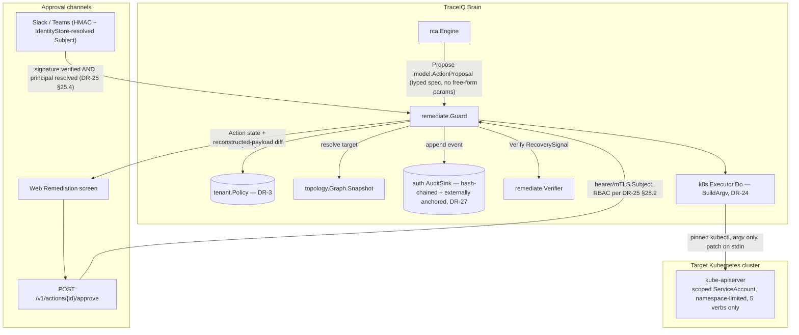

# F09 — Guarded Remediation

> Revision 2 — 2026-09-15 — applies DR-0, DR-3, DR-4, DR-5, DR-22, DR-23, DR-24, DR-25, DR-27, DR-29, DR-31, DR-37 (round-1 fixes)

## 1. Purpose

Every compared tool (OSS and commercial) stops at suggestion: an engineer reads a root-cause
narrative and takes action by hand. F09 closes that last gap safely. It gives TraceIQ's RCA
engine (F06) a bounded, auditable way to *act* — rollback a deployment, scale replicas, restart a
pod, toggle a feature flag, or remove an injected Istio fault — without ever becoming an
unsupervised agent with cluster-admin power. The design defaults to read-only
(`remediate.enabled: false`, `remediate.mode: dryrun`), requires a human holding the `approver`
(or `admin`) RBAC capability `remediation_action:approve` to authorize every action, enforces a
hard per-incident action budget that counts *attempted* mutations, and leaves a tamper-evident
record of exactly what was proposed, approved, executed, and verified. `internal/remediate` is
the sole write path from TraceIQ into customer infrastructure; no other package is permitted to
shell out or call a cluster API. The cluster write itself goes through `internal/k8s` (DR-24) — a
pinned `kubectl` binary invoked with an explicit argv, never `k8s.io/client-go` and never a shell.

**No model-authored string is ever passed to the cluster.** Every mutation payload is a closed,
typed spec (DR-22) that the Guard reconstructs itself from the proposal's typed fields plus a
pre-execution snapshot it fetched independently; the reasoner's `Rationale` is display-only and is
rendered beside the reconstructed payload with an explicit *untrusted, model-authored* marker
(DR-37).

## 2. Compared-tool drawbacks addressed

| Drawback ID | Tool | Lagging feature | How TraceIQ fixes it (concrete mechanism in F09) |
|---|---|---|
| D-X4 | All | Remediation stops at suggestion; no guardrail standards exist | `remediate.Guard` (DR-23 §23.1) implements the canonical **9-state machine** — `Proposed → Approved → Rejected/Executing → Verifying → Succeeded/Failed/RolledBack`, plus `Expired` — with exactly eleven legal transitions out of 81 possible pairs, enforced and exercised by `AC-F09-9`. Every action is (a) restricted to the closed five-member `model.ActionType` enum with a typed payload spec per type and **no free-form `Params` map** (DR-22 §22.1), (b) gated by `tenant.Policy.RemediationAllowlist`/`NamespaceAllowlist`/`TargetAllowlist` (DR-3), (c) blocked on `Approve()` from an `auth.Subject` holding capability `remediation_action:approve`, structurally distinct from `remediation_action:propose` so separation of duty holds even before the runtime check (DR-25 §25.2), (d) capped at `tenant.Policy.ActionBudgetPerIncident` (default **2**) *attempted* mutations per incident, counting `Failed` and `RolledBack` (DR-23 §23.6), (e) preceded by mandatory target re-resolution against live topology and the live cluster object (DR-22 §22.3), (f) followed by automatic post-execution verification via `remediate.Verifier` against a `RecoverySignal` declared inside `remediate` itself — no import of `anomaly` (DR-2, DR-23 §23.1) — and (g) recorded in an append-only, hash-chained, externally anchored audit log (`auth.AuditSink`, hash formula owned by `X-SEC §4.2`, DR-27) that any party can independently re-verify against a signed checkpoint the TraceIQ process cannot rewrite. No other compared tool codifies this as a reusable guardrail; TraceIQ ships it as the only path from RCA output to cluster mutation. |

## 3. Requirements

### 3.1 Functional (testable)

- **FR-F09-1**: The system MUST default every deployment to non-mutating: `remediate.enabled:
  false` and, when enabled, `remediate.mode: dryrun` / `remediate.executor: dryrun` until an
  operator explicitly sets `remediate.mode: execute` and `remediate.executor: kubectl`.
  `remediate.mode: execute` is refused at startup (exit 2) unless `require_approval: true`, a
  non-empty `allowlist`, a non-empty `target_allowlist`, `auth.mode != none`, **and**
  `server.profile: prod` all hold (DR-26 rule 9) — remediation execute is unreachable on the dev
  profile by construction.
- **FR-F09-2**: `Propose()` MUST reject (return `422`, no state persisted) any `model.ActionType`
  not present in `tenant.Policy.RemediationAllowlist` for the proposing tenant, evaluated before
  any store write.
- **FR-F09-3** *(replaced by DR-23 §23.4)*: `Approve(ctx, tid, id, by auth.Subject, req
  ApprovalRequest)` MUST reject `by.ID == action.ProposedBy` with `409 approver_must_differ` via
  the single implementation `auth.Authorizer.SeparationOfDuty(proposer, approver string) error`.
  Because the RBAC capability matrix (DR-25 §25.2) grants `approver` no
  `remediation_action:propose` capability, separation of duty is structural as well as checked;
  when the proposer is the engine (`ProposedBy = "rca:<investigationID>"`), any human approver
  satisfies the check.
- **FR-F09-4**: Approval MUST be obtainable through at least three channels — (a) a Slack/Teams
  interactive button or slash command, (b) `POST /v1/actions/{id}/approve` — all of which resolve
  to the same `Guard.Approve()` call with an `auth.Subject` resolved server-side, never trusted
  from the channel payload (DR-25 §25.4).
- **FR-F09-5** *(rewritten by DR-23 §23.6)*: `used(incident) = count(actions WHERE incident_id = ?
  AND state NOT IN (Rejected, Expired))` MUST be compared against
  `tenant.Policy.ActionBudgetPerIncident` (default **2**) on every `Approve()`; at or above budget
  the approval is `409 budget_exceeded` **unless** the approver holds `admin` **and**
  `ApprovalRequest.RequestBudgetOverride == true` **and** `len(OverrideJustification) >= 40`
  (a structurally distinct field — text appended to `Comment` does not count), itself audited as
  `budget_override` and broadcast to every `tenant.Policy.ChatBinding` approval channel. At most
  **one** override per incident (`remediate.max_budget_overrides_per_incident: 1`); a second is
  `409 override_limit` regardless of role.
- **FR-F09-6**: `Execute()` MUST, in order: (1) re-resolve the target against live topology and
  the live cluster object (FR-F09-16), (2) evaluate the allowlists, (3) call the snapshot read
  (`k8s.Executor.Do` with `VerbGet`) before any mutating call. If the snapshot read errors,
  `Execute()` MUST abort, leave the action in state `Approved` (not `Executing`), and emit audit
  event `snapshot_failed`.
- **FR-F09-7**: Within `remediate.verify_window` (default **10m** — canonical; a prior 5-minute
  value is deleted) after the mutating call succeeds, the Guard MUST call `Verifier.Verify` with a
  `RecoverySignal` (error-rate and p99 before/after, open-incident count) declared inside
  `remediate` itself. If recovered, the action transitions to `Succeeded`; if not recovered by
  timeout, it transitions to `Failed` and, when `remediate.auto_rollback: true`, the Guard MUST
  invoke `Rollback()` (FR-F09-23), which is pre-authorized by the original approval and consumes a
  budget slot.
- **FR-F09-8**: Every state transition MUST append exactly one `auth.AuditSink` event whose hash
  chain formula is owned and stated **once**, in `X-SEC §4.2` (DR-27); F09 cites it and states no
  formula of its own. `GET /v1/audit?verify=true` (role **admin**, DR-25 §25.2/DR-29) recomputes
  the chain against the last signed external anchor and detects any single-entry tamper or a
  full offline recompute.
- **FR-F09-9** *(rewritten by DR-24)*: The cluster executor MUST be `internal/k8s.Executor`, which
  invokes a pinned, digest-verified `kubectl` binary baked into the release image
  (`gcr.io/distroless/static-debian12:nonroot` + exactly that one file — **no
  `k8s.io/client-go`**, no shell, no package manager) via `exec.CommandContext` with an argv
  produced **only** by `k8s.BuildArgv` — never string concatenation, never `sh -c`. Every argv
  element is a compile-time constant or a value that passed `validateName`
  (`^[a-z0-9]([-a-z0-9.]{0,251}[a-z0-9])?$`, "/" rejected) or a bounds-checked `strconv`
  conversion; the kind is always a separate argv element. Patch bodies travel on **stdin**
  (`--patch-file=/dev/stdin`), never on the command line. `--namespace` is always explicit and
  drawn from `tenant.Policy.NamespaceAllowlist`. A **forbidden-flag denylist**
  (`--all-namespaces`, `-A`, `--kubeconfig`, `--server`, `--token`, `--as`, `--as-group`,
  `--as-uid`, `-f`, `--filename`, `--raw`, `--insecure-skip-tls-verify`, bare `--`) is checked
  after argv construction; a hit is `ErrForbiddenFlag` and raises a `Critical` incident. A
  validation failure MUST abort before the subprocess is spawned.
- **FR-F09-10**: Slack-sourced approvals MUST pass HMAC signature verification, **and then**
  resolve `(platform, workspace_id, platform_user_id)` through `auth.IdentityStore` to a
  provisioned `auth.Subject` — an unmapped user is `403 identity_not_bound` plus an audit row
  (DR-25 §25.4). A signature alone never reaches a handler (`AC-XSEC-7`). The channel must also
  be listed in `tenant.Policy.ChatBinding.ChannelIDs`.
- **FR-F09-11**: `Audit()`/`GET /v1/audit` MUST support filtering by `tenant_id`, `incident_id`,
  and time range, paginate with a default page size of 100 and a maximum of 1000, and is
  role **admin** only (DR-25 §25.2; corrects the prior "viewer redacted, admin full" split — a
  viewer-redacted projection may be added later only with a documented need).
- **FR-F09-15** *(new, DR-22 §22.1)*: `model.ActionProposal` MUST carry exactly one non-nil typed
  spec pointer matching its `Type` (`RollbackDeploymentSpec`, `ScaleReplicasSpec`,
  `RestartPodSpec`, `ToggleFeatureFlagSpec`, `RemoveIstioFaultSpec`); `Params map[string]string`,
  merge-patch strings, JSON-patch strings and every other free-form body are **absent from the
  data model**, not merely validated.
- **FR-F09-16** *(new, DR-22 §22.3)*: Before allowlist evaluation, `resolveTarget` MUST confirm
  the target exists in `topology.Graph.Snapshot(tid)` (else `422 target_not_resolvable`), fetch
  the live object and stamp `ResolvedUID`/`ResolvedVersion`, and `Execute` MUST re-resolve
  **inside the same transaction** as the `Approved → Executing` compare-and-set, requiring an
  unchanged `ResolvedUID` (else `409 target_replaced`, action `Failed`, audited).
- **FR-F09-17** *(new, DR-22 §22.2)*: The Guard MUST diff the payload it computed against the
  pre-execution snapshot and refuse (`422 payload_out_of_scope`, action `Failed`, audited) if the
  diff touches any path outside the per-type allowed path set (`/spec/replicas`, `/data/<Key>`,
  `/spec/http/*/fault`, `/metadata/annotations/kubectl.kubernetes.io/restartedAt`).
- **FR-F09-18** *(new, DR-23 §23.3)*: `Execute` MUST re-check `now < ExpiresAt`
  (`ApprovedAt + remediate.approval_ttl`, default **15m**) **inside the same `control.db`
  transaction** that performs the `Approved → Executing` compare-and-set on `(id, state,
  version)`. The 30 s `ExpireDue` poller is cleanup for display/metrics only and is never the
  enforcement path (TOCTOU).
- **FR-F09-19** *(new, DR-23 §23.4)*: See FR-F09-3 — restated here as its own AC-bearing ID per
  Appendix C; the requirement text is identical.
- **FR-F09-20** *(new, DR-23 §23.6)*: See FR-F09-5's budget invariant — restated here as its own
  AC-bearing ID per Appendix C; the requirement text is identical.
- **FR-F09-21** *(new, DR-23 §23.6)*: `remediation_action:budget_override` MUST be a capability
  structurally distinct from `remediation_action:approve` in the RBAC matrix (DR-25 §25.2),
  granted to `admin` only.
- **FR-F09-22** *(new, DR-23 §23.8)*: `Idempotency-Key` MUST be **required** on `POST
  /v1/actions`, `/approve`, `/reject`, `/execute`, `/rollback` (absent ⇒ `400
  idempotency_key_required`). A replay with the same key and the same `request_hash` returns the
  recorded response with `Idempotent-Replay: true`; the same key with a different hash is `409
  idempotency_key_reused`. The chat-derived key is `sha256(platform | team_id | message_ts |
  action_id | verb)`; `X-Slack-Request-Id` does not exist and MUST NOT be referenced.
- **FR-F09-23** *(new, DR-23 §23.9)*: `Rollback()` MUST refuse when the live object's
  `resourceVersion` differs from the snapshot's, setting `reason = concurrent_modification`,
  raising a `Critical` incident, and paging the tenant's approval channels immediately regardless
  of `alerting.min_severity`. A rollback consumes a budget slot and is pre-authorized by the
  original approval (no second human approval). A Kubernetes RBAC denial (`403`) sets `State =
  Failed`, `reason = scope_violation`, and raises a `Critical` incident.

### 3.2 Non-functional

NFR targets and gates are owned by `01 §10`; this table cites them and names the DR mechanism
that meets each one (DR-0).

- **Latency**: `Propose()` p99 remains a single-write, no-external-call path. `Execute()`
  end-to-end for `kubectl` actions, excluding the verify wait, remains bounded by
  `remediate.exec_timeout` (default **30s**, DR-23 §23.10), which also bounds the subprocess via
  `k8s.Executor.Do` (DR-24).
- **Durability**: the control-plane audit append is `fsync`-durable before the corresponding API
  call returns 2xx, on the dedicated control writer at **p99 ≤ 15 ms, independent of the
  telemetry batch interval** (`AC-XSEC-13`, DR-6 §6.2 writer budget).
- **Recoverability**: startup reconciliation aborts investigations orphaned by a crash
  (`rca.Journal.ListRunning`) and runs `Guard.ExpireDue` to expire stale approvals before
  receivers bind (DR-33 §33.2); an in-flight `Executing` action is left for restart reconciliation
  and is never cancelled mid-apply (DR-33 §33.2 step X8).
- **Security**: zero code paths may construct a shell command via string concatenation or `sh -c`;
  argv is produced exclusively by `k8s.BuildArgv` (DR-24); enforced by the CI static-analysis gate
  scoped to `internal/remediate/**` and `internal/k8s/**`.
- **Blast-radius bound**: default `ActionBudgetPerIncident=2`, default `dryrun` executor, and the
  attempted-mutation budget counting rule (DR-23 §23.6) bound the worst case of a single runaway
  incident, including failed and rolled-back attempts, not only successful ones.

## 4. Design

### 4.1 Component diagram



### 4.2 Data model

Canonical in `01 §4.1`/`§4.5` (DR-4, DR-22, DR-23); F09 declares no shared type of its own and
cites the shape below rather than re-declaring it (DR-0). `Params map[string]string` is
**deleted, not validated** — the closed spec types are the only representation.

```go
package model

type ActionType uint8
const (
    ActionRollbackDeployment ActionType = 1
    ActionScaleReplicas      ActionType = 2
    ActionRestartPod         ActionType = 3
    ActionToggleFeatureFlag  ActionType = 4
    ActionRemoveIstioFault   ActionType = 5
)
// CLOSED. A sixth action type is an architecture change (a new DR), never a config value.

type TargetKind uint8
const ( KindDeployment TargetKind = 1; KindStatefulSet TargetKind = 2; KindPod TargetKind = 3
        KindConfigMap TargetKind = 4; KindVirtualService TargetKind = 5 )

type ActionTarget struct {
    Cluster         string      // "" = the configured kubeconfig context; NEVER model-authored
    Namespace       string      // MUST be in tenant.Policy.NamespaceAllowlist
    Kind            TargetKind
    Name            string      // DNS-1123 subdomain. NO "/" — "deployment/checkout" form deleted
    ResolvedUID     string      // stamped by the Guard from the live cluster; never by the proposer
    ResolvedVersion string      // resourceVersion at resolve time
}

// Exactly one spec pointer is non-nil and it MUST match Type.
type ActionProposal struct {
    ID              string
    Tenant          TenantID
    IncidentID      string
    InvestigationID string
    Type            ActionType
    Target          ActionTarget
    RiskTier        uint8       // 1..3, from the fixed table in §4.4 — NOT proposer-supplied
    Rationale       string      // <= 2000 bytes. DISPLAY ONLY. Never reaches a tool, an argv or the cluster.
    ProposedBy      string      // auth.Subject.ID, or "rca:<investigationID>"
    ProposedAt      time.Time

    Rollback    *RollbackDeploymentSpec
    Scale       *ScaleReplicasSpec
    Restart     *RestartPodSpec
    FeatureFlag *ToggleFeatureFlagSpec
    IstioFault  *RemoveIstioFaultSpec
}

type RollbackDeploymentSpec struct { ToRevision int64 }         // 0 = previous; must exist in rollout history
type ScaleReplicasSpec     struct { Replicas int32 }            // 1..tenant.Policy.MaxReplicas (default 50);
                                                                 // and <= 3x the current replica count
type RestartPodSpec        struct { GracePeriodSeconds int32 }  // 0..300
type ToggleFeatureFlagSpec struct { Key string; Value bool }    // Key MUST be in tenant.Policy.FeatureFlags;
                                                                 // Value MUST be one of that key's allowed values
type RemoveIstioFaultSpec  struct { }                           // NO FIELDS. The Guard computes the patch.

// The 9-state machine (DR-23 §23.2), adopted verbatim; the prior 6-state enum is deleted.
type ActionState uint8
const (
    StateProposed   ActionState = 1
    StateApproved   ActionState = 2
    StateRejected   ActionState = 3
    StateExecuting  ActionState = 4
    StateVerifying  ActionState = 5
    StateSucceeded  ActionState = 6
    StateFailed     ActionState = 7
    StateRolledBack ActionState = 8
    StateExpired    ActionState = 9
)

type Action struct {
    ID, Tenant, IncidentID, InvestigationID string
    Proposal        ActionProposal
    State           ActionState
    ExpiresAt       time.Time   // ApprovedAt + approval_ttl, or ProposedAt + proposal_ttl
    ResolvedUID, ResolvedVersion string
    RiskTier        uint8
    AutoExecute     bool        // stamped false at RiskTier 3 regardless of config
    OverrideUsed    bool
    DryRunDiff      *Result     // k8s.Result from the single propose-time --dry-run=server call (DR-22 §22.4)
    Snapshot        *Snapshot
    Execution       *ExecutionResult
    Verification    *VerifyResult
}

// Snapshot gains the fields DR-23 §23.9 needs to refuse a concurrent-modification rollback.
type Snapshot struct {
    TakenAt        time.Time
    Kind           string
    Data           json.RawMessage
    ResourceVersion, Generation, UID string
    SHA256         string
}
```

Approver identity, capability checks and the audit event type are **not** locally declared;
they are `auth.Subject`, `auth.Authorizer.Can`/`SeparationOfDuty`, and `auth.AuditSink.Event`
respectively (DR-25). `tenant.Policy` (DR-3) — not a local `TenantPolicy` — is the sole
per-tenant record; F09 reads its `RemediationAllowlist`, `NamespaceAllowlist`, `TargetAllowlist`,
`ActionBudgetPerIncident`, `AutoExecuteAllowed`, `ChatBindings` fields and declares none of its
own.

### 4.3 Interfaces & APIs

```go
package remediate

// Guard is the sole entry point from RCA/API/chat into the state machine (DR-23 §23.1).
type Guard interface {
    Propose(ctx context.Context, tid model.TenantID, p model.ActionProposal, by auth.Subject, idem string) (model.Action, error)
    Approve(ctx context.Context, tid model.TenantID, id string, by auth.Subject, req ApprovalRequest) (model.Action, error)
    Reject(ctx context.Context, tid model.TenantID, id string, by auth.Subject, reason string) (model.Action, error)
    Execute(ctx context.Context, tid model.TenantID, id string, by auth.Subject, idem string) (model.Action, error)
    Verify(ctx context.Context, tid model.TenantID, id string) (model.VerifyResult, error)
    Rollback(ctx context.Context, tid model.TenantID, id string, by auth.Subject, reason string) (model.Action, error)
    Get(ctx context.Context, tid model.TenantID, id string) (model.Action, error)
    List(ctx context.Context, tid model.TenantID, f ActionFilter) ([]model.Action, string, error)
    ExpireDue(ctx context.Context, now time.Time) (int, error)   // CLEANUP ONLY — never the control
    Stats() Stats
}

type ApprovalRequest struct {
    Comment               string // <= 1000 bytes, display only
    OverrideJustification string // >= 40 bytes when RequestBudgetOverride is true; STRUCTURALLY DISTINCT field
    RequestBudgetOverride bool
}

// Declared HERE. remediate never imports anomaly (DR-2).
type RecoverySignal struct {
    Service, Operation string
    Window             model.Window
    ErrorRateBefore, ErrorRateAfter float64
    P99BeforeNanos, P99AfterNanos   uint64
    OpenIncidents      int
}
type Verifier interface {
    Verify(ctx context.Context, tid model.TenantID, a model.Action, s RecoverySignal) (model.VerifyResult, error)
}

type AuditFilter struct {
    TenantID   model.TenantID
    IncidentID string
    Since, Until time.Time
    Cursor     string
    Limit      int // default 100, max 1000
}
```

`Guard.Approve(id string, approver string)` (a bare string carrying no role and no tenant) is
**deleted** — a CI grep gate fails the build if `Approve(` is declared with a non-`auth.Subject`
approver (DR-23 §23.1).

The cluster executor is **`k8s.Executor`** (DR-24), not a `remediate`-local `Executor` with
`Validate`/`Snapshot`/`Apply`/`Rollback` methods — those steps are now Guard-orchestrated calls
against the single, minimal interface:

```go
package k8s   // imports model + stdlib only (DR-2)

type Verb uint8
const ( VerbGet Verb = 1; VerbScale Verb = 2; VerbRolloutUndo Verb = 3; VerbDeletePod Verb = 4; VerbPatch Verb = 5 )

type Request struct {
    Verb      Verb
    Namespace string
    Kind      model.TargetKind
    Name      string
    Argv      []string          // produced by BuildArgv ONLY; never assembled by a caller
    StdinJSON []byte            // patch bodies travel on STDIN, never on the command line
    DryRun    bool
    Timeout   time.Duration
}
type Result struct { ExitCode int; Stdout, Stderr []byte; Duration time.Duration }

type Executor interface {
    Do(ctx context.Context, r Request) (Result, error)
    Kind() string    // "kubectl" | "dryrun" | "fake"
}

func BuildArgv(r Request) ([]string, error)   // the ONLY argv constructor in the system
func MinimalEnv() []string                    // KUBECONFIG, HOME, PATH=/usr/local/bin — nothing else
```

**Target re-resolution (DR-22 §22.3)** — declared in `remediate`, called both at `Propose` (to
seed the baseline `ResolvedUID`/`ResolvedVersion` the dry-run diffs against) and again inside
`Execute`'s transaction (FR-F09-16):

```go
func (g *guard) resolveTarget(ctx context.Context, tid model.TenantID, t *model.ActionTarget) error
```

**`New` constructs a `Guard` with an injected clock (DR-31):** every timeout in this package
(`approval_ttl`, `proposal_ttl`, `verify_window`, `exec_timeout`, the `ExpireDue` poll interval)
reads `model.Clock` rather than calling `time.Now`/`time.After` directly, so
`internal/archtest`'s time-ban check passes and the eval harness's `VirtualClock` can drive
remediation deterministically (DR-36 §36.7 reuses the same `Guard`/`k8s.Executor`).

```go
func New(cfg Config, clock model.Clock, policy tenant.PolicyStore, topo topology.Graph,
    exec k8s.Executor, verifier Verifier, audit auth.AuditSink, authz auth.Authorizer) (Guard, error)
```

**REST endpoints** — defined in `01 §6.1`; this is a filtered view (DR-29 §29.1). Roles per the
RBAC matrix (DR-25 §25.2). `Idempotency-Key` is **required** on every row marked ✱.

| Method & path | Role | Notes |
|---|---|---|
| `POST /v1/actions` ✱ | operator (or `rca:<investigationID>` internal principal) | body = `model.ActionProposal`; `422` on an unresolvable target before any snapshot |
| `GET /v1/actions/{id}` | viewer | |
| `GET /v1/actions?incident_id=` | viewer | |
| `POST /v1/actions/{id}/approve` ✱ | approver, admin | rejects `by.ID == ProposedBy` with `409` |
| `POST /v1/actions/{id}/reject` ✱ | approver, admin | |
| `POST /v1/actions/{id}/execute` ✱ | approver, admin | re-resolves target in-transaction; `409 action_expired` past `approval_ttl` |
| `POST /v1/actions/{id}/rollback` ✱ | approver | new (DR-23 §23.1/DR-29); refused on `concurrent_modification` |
| `GET /v1/audit` | **admin** | paginated, corrects the prior viewer/admin split (DR-25 §25.2) |
| `GET /v1/audit?verify=true` | admin | chain verification against the last external anchor (DR-27) |

**Config keys** (canonical values and defaults owned by `01 §7` `remediate.*`, DR-23 §23.10 —
cited here, not restated, per DR-0): `remediate.enabled`, `remediate.mode`, `remediate.executor`,
`remediate.allowlist`, `remediate.target_allowlist`, `remediate.namespace_allowlist`,
`remediate.require_approval`, `remediate.approver_roles`, `remediate.auto_execute_on_approve`,
`remediate.action_budget_per_incident`, `remediate.max_budget_overrides_per_incident`,
`remediate.approval_ttl`, `remediate.proposal_ttl`, `remediate.verify_window`,
`remediate.auto_rollback`, `remediate.exec_timeout`, `remediate.kubeconfig`,
`remediate.snapshot_dir`.

### 4.4 Algorithms / decision logic

**Risk tiers (DR-22 §22.4) — set by the Guard from this table; a proposer-supplied value is ignored:**

| Type | RiskTier |
|---|---|
| `RestartPod` | 1 |
| `ScaleReplicas` | 1 |
| `RollbackDeployment` | 2 |
| `ToggleFeatureFlag` | 2 |
| `RemoveIstioFault` | 3 |

`auto_execute` is forced `false` at `RiskTier == 3` regardless of config.

**Dry-run stays at propose (DR-22 §22.4)** — the diff is what the approver reviews. Three
binding conditions, all enforced by the pseudocode below:
1. The dry-run runs **only** on the Guard-reconstructed payload, **after** target re-resolution
   (`resolveTarget`, §22.3) and the payload scope-diff check (`computePayload`, §22.2) have both
   passed — never on anything proposer- or model-supplied.
2. `--dry-run=server` executes the full admission chain, so mutating and validating webhooks
   observe the request; the executor `ServiceAccount` is scoped to exactly the five verbs on the
   five kinds and nothing more (`§6`).
3. **Exactly one** dry-run invocation per proposal (`AC-F09-8`).

```
function Propose(tid, p, by, idem):
    check Idempotency-Key present, else 400 idempotency_key_required
    policy = tenant.PolicyStore.Get(tid)
    if p.Type not in policy.RemediationAllowlist: return 422 ErrActionNotAllowlisted
    p.RiskTier = riskTierFor(p.Type)                         # never proposer-supplied
    err := resolveTarget(ctx, tid, &p.Target)                # §22.3 — topology + live object
    if err != nil: return 422 target_not_resolvable
    # p.Target.ResolvedUID/ResolvedVersion now stamped — this is the Action's baseline,
    # which Execute()'s re-resolution (FR-F09-16) later compares against.
    payload = computePayload(p)                              # §22.2 — typed fields + snapshot
    if diff(payload, snapshot) touches a path outside the allowed set: return 422 payload_out_of_scope
    dryRunResult = k8s.Executor.Do(ctx, buildMutatingRequest(p, payload, DryRun: true))  # exactly one invocation
    a = Action{..., State: Proposed, ExpiresAt: now()+policy.proposal_ttl,
               ResolvedUID: p.Target.ResolvedUID, ResolvedVersion: p.Target.ResolvedVersion,
               DryRunDiff: dryRunResult}
    Store.Save(a); Audit.Append("proposed", a)
    notify approvers on configured channels (chat + web queue), rendering the dry-run diff
    return a

function Approve(tid, id, by, req):
    a = Store.Get(tid, id)
    if a.State != Proposed: return error ErrInvalidTransition
    if err := auth.Authorizer.SeparationOfDuty(a.Proposal.ProposedBy, by.ID); err != nil:
        return 409 approver_must_differ
    if not auth.Authorizer.Can(by, "remediation_action:approve"): return 403
    n = used(a.IncidentID)   # count(state NOT IN {Rejected, Expired})
    if n >= policy.ActionBudgetPerIncident:
        if by has "remediation_action:budget_override" and req.RequestBudgetOverride and len(req.OverrideJustification) >= 40:
            if overridesUsed(a.IncidentID) >= policy.MaxBudgetOverridesPerIncident: return 409 override_limit
            Audit.Append("budget_override", a, by); a.OverrideUsed = true
        else:
            a.State = Rejected; Audit.Append("budget_exceeded", a); return a
    a.State = Approved; a.ExpiresAt = now() + policy.approval_ttl
    Store.Save(a); Audit.Append("approved", a)
    return a
    # NOTE: Approve() no longer tail-calls Execute() — auto_execute_on_approve is checked
    # only inside Execute()'s own call path, and only when RiskTier != 3 (DR-23 §23.5).

function Execute(tid, id, by, idem):
    check Idempotency-Key present, else 400
    a = Store.Get(tid, id)
    # single transaction: compare-and-set Approved -> Executing AND re-check expiry
    tx: if a.State != Approved or now() >= a.ExpiresAt: return 409 action_expired
        err := resolveTarget(ctx, tid, &a.Proposal.Target)      # §22.3 — topology + live object
        if err != nil: return 422 target_not_resolvable
        if a.Proposal.Target.ResolvedUID != a.ResolvedUID: return 409 target_replaced
        evaluate NamespaceAllowlist / TargetAllowlist            # only AFTER re-resolution
        a.State = Executing; commit
    Audit.Append("executing", a)
    snap, err = k8s.Executor.Do(ctx, Request{Verb: VerbGet, ...})
    if err != nil: Audit.Append("snapshot_failed", a); a.State = Approved (rollback tx); return err
    a.Snapshot = snap
    payload = computePayload(a.Proposal)                         # §22.2 — typed fields + snapshot
    if diff(payload, snap) touches a path outside the allowed set: return 422 payload_out_of_scope
    result, err = k8s.Executor.Do(ctx, buildMutatingRequest(a, payload))  # BuildArgv; patch on stdin
    a.Execution = result
    if err != nil: a.State = Failed; Audit.Append("failed", a); return a
    a.State = Verifying; Store.Save(a); Audit.Append("verifying", a)
    scheduleVerification(a, policy.verify_window)
    return a

function scheduleVerification(a, timeout):
    signal = buildRecoverySignal(a)                               # remediate.RecoverySignal
    result = Verifier.Verify(ctx, tid, a, signal)
    if result.Recovered: a.State = Succeeded
    else:
        a.State = Failed
        if policy.auto_rollback: Rollback(tid, a.ID, systemSubject, "auto: verify failed")
    Store.Save(a); Audit.Append(a.State, a)

function Rollback(tid, id, by, reason):
    a = Store.Get(tid, id)
    live = k8s.Executor.Do(ctx, Request{Verb: VerbGet, ...})
    if live.ResourceVersion != a.Snapshot.ResourceVersion:
        a.State = Failed; reason = "concurrent_modification"
        raise Critical incident "rollback_refused_concurrent_modification"; page immediately
        Audit.Append("rollback_refused", a); return a
    result = k8s.Executor.Do(ctx, buildRollbackRequest(a))         # restores a.Snapshot
    if k8s denies with 403: a.State = Failed; reason = "scope_violation"; raise Critical incident
    else: a.State = RolledBack
    # consumes a budget slot; pre-authorized by the original approval — no second human approval
    Store.Save(a); Audit.Append("rolled_back", a)
    return a

# payload construction — computed by the Guard, never by the proposer (DR-22 §22.2)
function computePayload(p):
    switch p.Type:
      case RollbackDeployment: return { verb: rollout_undo, toRevision: p.Rollback.ToRevision }
      case ScaleReplicas:      return { verb: scale, replicas: strconv(p.Scale.Replicas) }         # range-checked
      case RestartPod:         return { verb: delete_pod, gracePeriod: strconv(p.Restart.GracePeriodSeconds) }
      case ToggleFeatureFlag:  return mergePatch({"data": {p.FeatureFlag.Key: strconv.FormatBool(p.FeatureFlag.Value)}})
      case RemoveIstioFault:   patch = diff(snapshot.spec.http[*], snapshot.spec.http[*] minus .fault)
                                if patch is empty: return 422 nothing_to_remove
                                return jsonPatch(patch)   # only "remove /spec/http/<i>/fault" entries
```

**`k8s.BuildArgv` — the only argv constructor, invoked by `k8s.Executor.Do` (DR-24):**

```
function BuildArgv(r Request) ([]string, error):
    argv = []
    switch r.Verb:
      case VerbGet:         argv = ["get", kindName(r.Kind), validateName(r.Name), "-o=json"]
      case VerbRolloutUndo: argv = ["rollout", "undo", kindName(r.Kind), validateName(r.Name)]
                             if r has ToRevision: argv += ["--to-revision=" + strconv(n)]
      case VerbScale:       argv = ["scale", kindName(r.Kind), validateName(r.Name), "--replicas=" + strconv(n)]
      case VerbDeletePod:   argv = ["delete", "pod", validateName(r.Name), "--grace-period=" + strconv(n)]
      case VerbPatch:       argv = [kindName(r.Kind)+"-patch-op", validateName(r.Name), "--patch-file=/dev/stdin"]
                             # StdinJSON carries the body; never appended to argv
    argv = ["--namespace", validateNamespace(r.Namespace)] + argv      # always explicit, from NamespaceAllowlist
    if any element matches the forbidden-flag denylist: return nil, ErrForbiddenFlag
    return argv, nil

# exec.CommandContext(ctx, "/usr/local/bin/kubectl", argv...), cmd.Env = k8s.MinimalEnv()
# timeout = remediate.exec_timeout (30s); on cancellation the PROCESS GROUP is killed
```

`validateName` is `^[a-z0-9]([-a-z0-9.]{0,251}[a-z0-9])?$` (rejects `/`); `validateNamespace` is
the same grammar, checked against `tenant.Policy.NamespaceAllowlist`. There is no
`validateJSONPatch` on a caller-supplied string — the patch bytes are **computed** by the Guard
(`computePayload` above) and never accepted as caller input.

### 4.5 Sequence diagram

```mermaid
sequenceDiagram
    participant RCA as rca.Engine
    participant G as remediate.Guard
    participant CH as Slack/Web
    participant AP as auth.Subject (approver)
    participant TOPO as topology.Graph
    participant EX as k8s.Executor
    participant K8S as kube-apiserver
    participant VER as remediate.Verifier
    participant AU as auth.AuditSink

    RCA->>G: Propose(tid, model.ActionProposal, idem)
    G->>TOPO: resolveTarget (existence + live UID/version) — §22.3
    TOPO-->>G: ResolvedUID / ResolvedVersion
    G->>G: computePayload + scope-diff check (§22.2)
    G->>EX: Do(mutating Request, DryRun: true) — exactly one dry-run (§22.4)
    EX->>K8S: kubectl <verb> --dry-run=server (admission chain observes it)
    K8S-->>EX: dry-run result
    EX-->>G: DryRunDiff
    G->>AU: append "proposed"
    G->>CH: notify approval queue with dry-run diff
    CH->>AP: render Approve/Reject buttons
    AP->>G: Approve(tid, id, subject, ApprovalRequest)
    G->>G: SeparationOfDuty check, RBAC capability check, budget check
    G->>AU: append "approved"
    Note over G: Execute() — one transaction: expiry re-check + Approved->Executing CAS
    AP->>G: Execute(tid, id, subject, idem)
    G->>TOPO: resolveTarget (existence + live UID/version)
    TOPO-->>G: ResolvedUID / ResolvedVersion
    G->>EX: Do(VerbGet)  — snapshot read
    EX->>K8S: kubectl get ... -o=json (argv only)
    K8S-->>EX: current spec
    EX-->>G: Snapshot
    G->>G: computePayload + scope-diff check (§22.2)
    G->>AU: append "executing"
    G->>EX: Do(mutating Request; patch on stdin if any)
    EX->>K8S: kubectl <verb> (argv, no shell)
    K8S-->>EX: result
    EX-->>G: ExecutionResult
    G->>AU: append "verifying"
    G->>VER: Verify(RecoverySignal)
    VER-->>G: VerifyResult
    G->>AU: append "succeeded" | "failed"
    G->>CH: post outcome + audit link (rationale marked untrusted, payload diff shown)
```

## 5. Failure modes & mitigations

| Failure | Detection | Mitigation |
|---|---|---|
| `kubectl` subprocess hangs past a reasonable bound | `exec.CommandContext` with `remediate.exec_timeout` (default 30s) | Context cancellation kills the **process group**; action marked `Failed`, audited as `apply_timeout` |
| Approver identity spoofed via forged Slack payload | HMAC signature/timestamp check fails, or identity resolves to no bound `auth.Subject` | Request rejected `403 identity_not_bound` before `Approve()` runs; failure audited (DR-25 §25.4) |
| Snapshot read succeeds but the mutating call fails mid-apply | `k8s.Executor.Do` returns error after a partial K8s change | Action → `Failed`; `Snapshot` retained; approver (or `auto_rollback`) can call `Rollback()` |
| Target deleted and recreated between approval and execution | `ResolvedUID` re-check inside the `Execute` transaction differs | `409 target_replaced`; the new object is never mutated as if it were the original |
| Verify timeout ambiguous — recovery signal source itself unavailable | `Verifier.Verify` errors instead of returning recovered/not-recovered | Treated as "not recovered"; action → `Failed`; never silently assumed successful |
| Budget check race (two approvers approve concurrently) | Compare-and-set on `(id, state, version)` in `control.db` | Second `Approve()` fails and is retried by the caller against fresh state |
| Rollback attempted after a human edited the object mid-incident | Live `resourceVersion` differs from `Snapshot.ResourceVersion` | Rollback refused, `reason=concurrent_modification`, `Critical` incident, immediate page — restoring over a human edit is worse than not rolling back |
| Kubernetes RBAC denies the mutating or rollback call | `403` from the API server | `State=Failed`, `reason=scope_violation`, `Critical` incident |
| Audit chain tampered (entry edited at rest) | `GET /v1/audit?verify=true` recomputes the chain against the last signed external anchor | A same-process, same-file rewrite is detected because the anchor lives outside the process's write authority (DR-27 §27.3) |
| Brain crashes while action `Executing` | Startup reconciliation (`Guard.ExpireDue`, `rca.Journal.ListRunning`) | The in-flight action is left for restart reconciliation and never auto-cancelled mid-apply |
| Namespace allowlist misconfigured to a wildcard | Config load validation | Rejected — `NamespaceAllowlist` requires explicit enumeration, evaluated only after target re-resolution |
| Duplicate approve/execute (chat double-click, client retry) | `Idempotency-Key` + `request_hash` lookup | Same key + same hash → recorded response replayed (`Idempotent-Replay: true`); same key + different hash → `409 idempotency_key_reused` |

## 6. Security considerations

- **No model-authored string ever reaches the cluster.** The Guard reconstructs every mutation
  payload from `ActionProposal`'s typed spec plus the pre-execution snapshot it fetched itself;
  `Rationale` and every rendered narrative are display-only and carry an explicit *untrusted,
  model-authored* marker beside the Guard-reconstructed payload (DR-22 §22.1, DR-37 §37.1(6)).
- Scoped `ServiceAccount` for the `kubectl` executor: namespace-limited `RoleBinding`s only for
  the five verbs actually needed (`get`, `patch`, `delete pod`, `scale`, `rollback`) — never
  cluster-admin. `--dry-run=server` executes the full admission chain, so this scoping also
  bounds what mutating/validating webhooks may observe (DR-22 §22.4).
- The release image is `gcr.io/distroless/static-debian12:nonroot` plus exactly one additional
  file, a pinned, digest-verified `kubectl` — no shell, no package manager, and `k8s.io/*` stays
  on the deliberately-absent dependency list (DR-24, `05 §8.1`).
- `exec.Command` is invoked with an explicit `[]string` argv built only by `k8s.BuildArgv`, never
  `sh -c` string concatenation; patch bodies travel on stdin, never argv; enforced by the CI
  `no-shell-interpolation` gate (§3.2).
- Kubeconfig and any Istio/feature-flag credentials are resolved via `auth.SecretSource`
  (env/file, DR-25) and never written to logs or `ExecutionResult` verbatim (secrets redacted
  before persistence).
- Approval identity is always re-resolved server-side against `auth.Authorizer` and
  `auth.IdentityStore` — the RBAC role in a Slack button payload or API body is never trusted
  directly, and an HMAC signature is treated as authenticity only, never authorization (DR-25
  §25.4).
- Audit log is append-only at the storage layer, hash-chained (formula owned by `X-SEC §4.2`,
  DR-27 §27.1), and anchored outside the process's own write authority every
  `auth.audit.anchor_interval` (default 5m) — the defense-in-depth property this section
  previously claimed from append-only grants alone is now backed by an anchor a same-process
  attacker cannot forge.
- STRIDE: `k8s` / F09 executor — **Elevation (argv/flag injection)** — mitigated by DR-24
  (`X-SEC §4.4`).

## 7. Test strategy & acceptance criteria

**Unit tests**
- State machine: **all 81 transition pairs** asserted, exactly the eleven legal ones accepted
  (`AC-F09-9`, DR-23 §23.2).
- Budget enforcement: 2-action budget exhausted (counting `Failed`/`RolledBack`), admin override
  accepted only with `RequestBudgetOverride` **and** `OverrideJustification >= 40` bytes, a second
  override on the same incident rejected.
- `k8s.BuildArgv`: a 50-case argv injection/fuzz corpus rejected before `exec.Command` is
  constructed, extended with the forbidden-flag denylist (DR-24).
- Audit hash chain: single-entry tamper detected; an offline full-chain recompute detected via
  anchor mismatch (DR-27 §27.4).
- Snapshot failure leaves state `Approved`, not `Executing`.
- Target re-resolution: a plausible-but-nonexistent target is `422` before any snapshot call; a
  changed `ResolvedUID` between approval and execute is `409 target_replaced`.
- Payload-diff scope check: a computed payload touching a path outside the allowed set is `422
  payload_out_of_scope`.

**Integration tests**
- Full loop `propose → approve → execute → verify` against a `kind` cluster using the real
  `k8s.Executor` for each of the 5 `model.ActionType`s.
- Slack slash-command approval round-trip: (i) unmapped user → `403` + audit, (ii) mapped
  `viewer` → `403` + audit, (iii) mapped `approver` → `200` (`AC-XSEC-8`).
- Recovery scan: kill the Brain mid-`Executing`, restart, confirm the action is left for
  reconciliation, not auto-cancelled.
- Concurrent approval race on a shared incident budget.
- Idempotent replay: identical approve/execute request replayed 5× → exactly one state
  transition, one audit row, identical response; a Slack double-click produces one transition
  (`AC-F09-15`).

**Acceptance criteria**

| AC | Maps to | Statement |
|---|---|---|
| AC-F09-1 | FR-F09-1 | With `remediate.mode: dryrun` (the default), `Propose→Approve→Execute` produces zero cluster API calls, verified via a mock `kube-apiserver` call counter. |
| AC-F09-2 | FR-F09-5 / FR-F09-20 | 3rd approval attempt on an incident already at budget is `409 budget_exceeded` unless submitted by an `admin` with `RequestBudgetOverride=true` and a ≥40-char `OverrideJustification`. |
| AC-F09-3 | FR-F09-8 | `GET /v1/audit?verify=true` detects a manually corrupted audit entry in a seeded fixture, and detects an offline full-chain recompute via anchor mismatch. |
| AC-F09-4 | FR-F09-9 | A `Request` producing an argv element containing shell metacharacters or a forbidden flag is rejected pre-exec in 100% of a 50-case fuzz corpus. |
| AC-F09-5 | FR-F09-7 | Post-execute, when `Verifier.Verify` reports recovered within `verify_window`, action reaches `Succeeded`; when it doesn't, action reaches `Failed`. |
| AC-F09-6 | FR-F09-15 | Adversarial corpus: zero `ActionProposal`s carry operator-supplied patch text; every payload traces to a typed spec field. |
| AC-F09-7 | FR-F09-16 | An unresolvable target is `422 target_not_resolvable` **before** any `Snapshot()`/`Do(VerbGet)` call. |
| AC-F09-8 | FR-F09-9, §22.4 | Exactly one dry-run invocation per proposal; the dry-run payload matches the reconstructed-payload property, asserted against a recording admission webhook. |
| AC-F09-9 | FR-F09-19 (via DR-23 §23.2) | All 81 `(from, to)` state pairs exercised; exactly the eleven legal transitions succeed, the other seventy are rejected. |
| AC-F09-10 | FR-F09-18 | Approve, advance a fake clock past `approval_ttl`, call `Execute` → `409 action_expired`, audit row written, executor call count **0**. |
| AC-F09-11 | FR-F09-20 | Two actions executed and failed on one incident ⇒ a third approval is `409 budget_exceeded`. |
| AC-F09-12 | FR-F09-20 | An auto-rollback consumes a budget slot. |
| AC-F09-13 | FR-F09-5 | A 20-character `Comment` with an empty `OverrideJustification` is rejected (not treated as an override). |
| AC-F09-14 | FR-F09-5 | A second budget override on the same incident is rejected with `409 override_limit`. |
| AC-F09-15 | FR-F09-22 | An identical approve/execute request replayed 5× produces exactly one state transition, one audit row, and an identical response; a Slack double-click produces one transition. |

## 8. Open questions / risks

- **Decided (round 1), DR-23 §23.6.** The budget counts **attempted and pending** mutations —
  `Proposed`/`Approved`/`Executing`/`Verifying`/`Succeeded`/`Failed`/`RolledBack`, excluding only
  `Rejected` and `Expired` — not only successful ones. This closes the prior open question and
  SR-5(i): an action that fails mid-mutation no longer frees its slot.
- **Decided (round 1), DR-23 §23.9.** Auto-rollback on verify failure **consumes a budget slot**
  and is **pre-authorized by the original approval** — no second human approval — because
  requiring approval to undo a mutation is the wrong failure mode during an incident.
- Multi-cluster targets (an action whose `Target.Cluster` differs from the incident's originating
  cluster) remain out of scope for v1; `ActionTarget.Cluster` is currently informational only for
  the `k8s.Executor`, which uses a single tenant-scoped kubeconfig. Not addressed by any DR in
  this register — still open.
