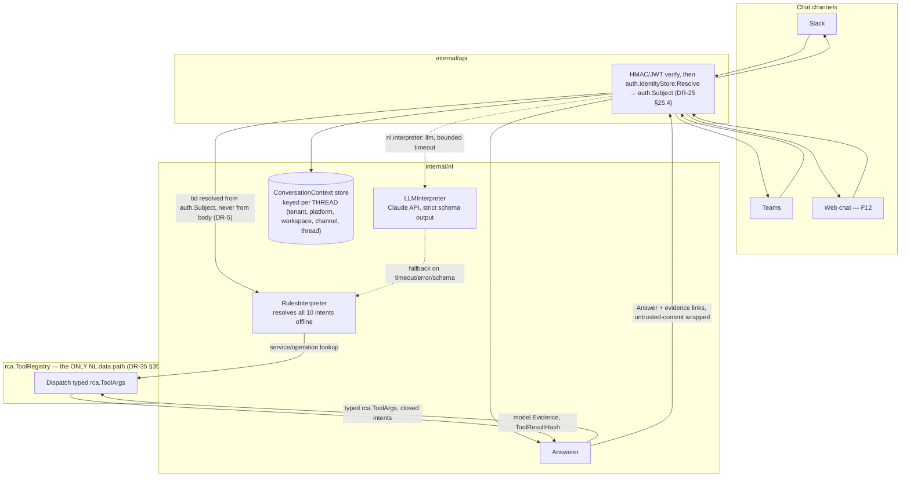
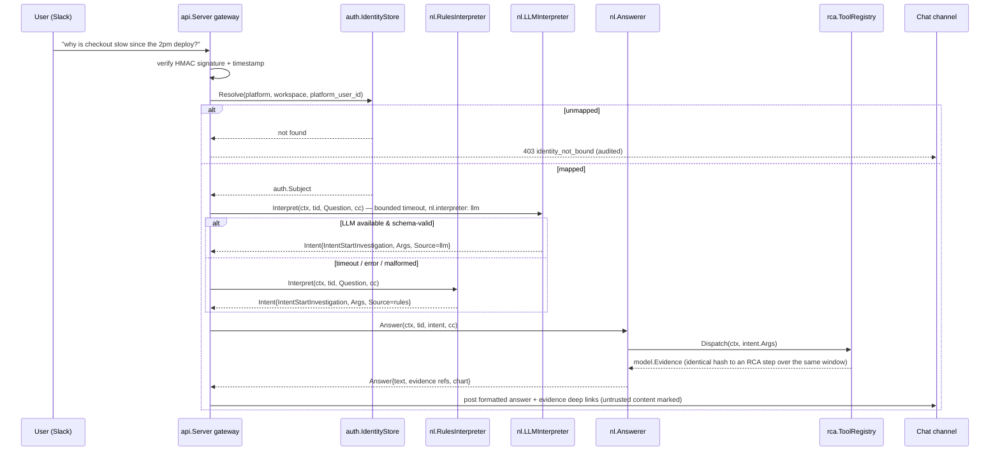

# F10 — Natural-Language Interface

> Revision 2 — 2026-09-15 — applies DR-0, DR-5, DR-16, DR-25, DR-29, DR-31, DR-35, DR-37 (round-1 fixes)

## 1. Purpose

Dynatrace hides its power behind DQL, Smartscape, and a "Gen-3 UI" that requires real training;
Jaeger, Zipkin, and Tempo require even the basics to be expressed as structural queries. F10 gives
TraceIQ a chat-first interface — "why is checkout slow since the 2pm deploy?" — that classifies
free text into one of the **ten closed `nl.IntentKind` values** (DR-35 §35.1; a new intent is a
new DR, never a config value), extracts entities into the **same typed `rca.ToolArgs`** the RCA
loop uses, dispatches every data access through **`rca.ToolRegistry.Dispatch`** — never a second
query path — and returns an answer that cites concrete evidence rather than asserting
conclusions. `internal/nl` is deliberately two-tiered: a deterministic, regex/grammar-based
interpreter that resolves **all ten intents** fully offline, and an optional LLM interpreter that
improves recall on phrasing the rules don't anticipate — the system must never depend on the LLM
being reachable to answer a question, and `nl.interpreter: rules` is a fully supported
configuration, not a degraded one (DR-35 §35.4).

## 2. Compared-tool drawbacks addressed

| Drawback ID | Tool | Lagging feature | How TraceIQ fixes it (concrete mechanism in F10) |
|---|---|---|---|
| D-Y3 | Dynatrace | Steep learning curve (DQL, Smartscape, Gen-3 UI) — real training investment required | `nl.Interpreter` accepts plain English across all ten `nl.IntentKind` values (DR-35 §35.1); no query language is required to get value. TraceQL/SQL-equivalent power access (F12 Traces screen) remains available to experts, but is never the only path. |
| D-X3 | All | No natural-language tracing UX exists on the open-source stack | `internal/nl` + chat channels (Slack/Teams/web, F12) are shipped as a core, non-optional package — not a bolt-on integration — and work with `nl.interpreter: rules` and zero network access, so the capability exists even for air-gapped OSS deployments where no compared tool offers anything comparable (DR-35 §35.4). |

## 3. Requirements

### 3.1 Functional (testable)

- **FR-F10-1**: `Interpret()` MUST classify input text into exactly one of the ten
  `nl.IntentKind` values or `IntentUnknown`, within 50 ms p99 using `RulesInterpreter` alone
  (fully offline path, no network call).
- **FR-F10-2**: Service-name entity extraction MUST match against the *live* `topology.Graph`
  service catalog snapshot (case-insensitive, Levenshtein distance ≤ 2 fuzzy match) rather than a
  static configured list, so newly-observed services are recognized without a config change;
  operation names must be present in `span` for the current tenant. Extracted entities populate
  the appropriate typed field of `rca.ToolArgs` (DR-16 §16.2) directly — there is no untyped
  intermediate `Entity` map that reaches a tool call.
- **FR-F10-3**: Time-range entity extraction MUST support, at minimum, the closed grammar of DR-35
  §35.4: `last <n> <unit>`, `since <time>`, `between <t1> and <t2>`, `yesterday`, `today`,
  ISO-8601, and deploy-marker references ("since the checkout-svc deploy") resolved via
  `anomaly.DeployIndex` (DR-14 §14.6). Anything unmatched becomes `IntentUnknown` with a
  clarifying question rather than a guess (DR-35 §35.4) — never a silently wrong window.
- **FR-F10-4**: When `nl.interpreter: auto` and no resolvable Anthropic API key is configured, the
  system MUST silently select `rules`, logged at INFO — **never an error, never a dead feature**
  (DR-35 §35.4). When `nl.interpreter: llm`, the system MUST attempt the LLM interpreter first
  with a bounded timeout; on timeout, error, malformed structured output, or LLM unavailability it
  MUST fall back to `RulesInterpreter`, set `Intent.Source="rules"` (`nl.Interpreter.Kind() ==
  "rules"`), and cap confidence at the rule-path's own value. With `nl.interpreter: rules` and no
  network access, **100% of the ten intents MUST remain resolvable** (offline requirement,
  DR-35 §35.4).
- **FR-F10-5**: Every `Answer` for `IntentTraceSearch`, `IntentExplainTrace`,
  `IntentStartInvestigation`, `IntentInvestigationAsk`, and `IntentCompareWindows` MUST include
  ≥ 1 `EvidenceRef` backed by a `model.Evidence`/`model.ToolResult` object; `Answer.Text` MUST NOT
  state a root cause or metric value that is not backed by an `EvidenceRef`.
- **FR-F10-6**: `IntentRemediate` MUST NOT execute a remediation action directly. It renders a
  proposal form, requires the chat user's resolved `auth.Subject` to hold
  `remediation_action:propose`, and `Answerer` MUST translate it into a
  `remediate.Guard.Propose()` call (F09) routed through the resolved subject — NL is a proposer,
  never an executor, and never bypasses F09's independent RBAC/budget checks (DR-35 §35.3).
- **FR-F10-7**: Every inbound chat request MUST pass HMAC/JWT signature verification **and then**
  resolve `(platform, workspace_id, platform_user_id)` through `auth.IdentityStore` to a
  provisioned `auth.Subject` before `Interpret()` is invoked; an unmapped user is `403
  identity_not_bound` plus an audit row, never merely `401` on signature failure (DR-25 §25.4). A
  signature alone never reaches a handler — the string "signature-verified, no RBAC role" appears
  nowhere in this document (DR-25 §25.4, DR-29 §29.1).
- **FR-F10-8**: `ConversationContext` MUST retain the last `nl.context_turns` (default **5**) turns
  keyed **per thread** — `ConversationKey{Tenant, Platform, WorkspaceID, ChannelID, ThreadID}`,
  **not** per channel (DR-35 §35.2/§35.8 — this closes the open question in § 8 below) — to
  resolve follow-ups ("what about the last hour instead?"); context expires after 30 minutes idle.
- **FR-F10-9** *(new, DR-35 §35.4)*: `nl.RulesInterpreter` MUST resolve **all ten intents** from a
  deterministic pattern table with **no network call**; published gate: **≥ 85% intent accuracy
  on the F11 NL scenario set with `interpreter: rules`** (`AC-F10-9`). The eval harness drives NL
  through `rules` only (DR-36), so this number is reproducible and cost-free in CI.
- **FR-F10-10** *(new, DR-35 §35.3)*: **Every NL data access MUST go through
  `rca.ToolRegistry.Dispatch`.** `nl` keeps its imports of `store`, `topology`, `anomaly` (DR-2)
  for type references only; no NL code path may call `store.HotIndex`, `topology.Graph` or
  `anomaly.Grouper` directly to answer a question. Consequence: an NL `IntentServiceHealth` answer
  and an RCA `metric_query` step over the same window produce `model.Evidence` with **identical
  `Query` and `ToolResultHash`** (`AC-F10-10`, D-X3).
- **FR-F10-11** *(renumbered from a pre-round-1 FR-F10-9 — content unchanged; freed to avoid
  colliding with Appendix C's mandated FR-F10-9/-10 above)*: When 2+ rules match input text with a
  confidence delta < `nl.ambiguity_threshold` (default 0.15), the interpreter MUST return
  `IntentUnknown` with the top-2 candidate `IntentKind`s attached, and `Answerer` MUST render a
  clarifying question rather than silently picking one.

### 3.2 Non-functional

NFR targets and gates are owned by `01 §10`; this table cites them and names the DR mechanism
that meets each one (DR-0).

- **Latency**: rule-only path p99 < 50 ms end-to-end (`Interpret`, FR-F10-1); LLM path bounded by
  `01 §7`'s configured LLM timeout plus dispatch/processing overhead.
- **Cost control**: LLM interpreter calls are bounded by `rca.budget`'s per-call token ceilings
  (DR-17 §17.1, cited not restated); per-subject rate limit `LimitNL` (`01 §8.4`, DR-26 §26.4 —
  **20/min, burst 5**) additionally bounds worst-case LLM spend from chat abuse.
- **Availability**: 100% intent coverage with `nl.interpreter: rules` and zero outbound network
  access (offline mode is a hard requirement, not degraded-mode behavior — DR-35 §35.4).
- **Accuracy**: published gate is **`FR-F10-9`/`AC-F10-9`: ≥ 85% intent accuracy on the F11 NL
  scenario set with `interpreter: rules`** (DR-35 §35.4) — the only accuracy number this document
  asserts; a hybrid/LLM-path figure is not separately gated because the eval harness drives NL
  through `rules` only (DR-36 §36.1) for cost-free, reproducible CI measurement.

## 4. Design

### 4.1 Component diagram



### 4.2 Data model

Canonical taxonomy and context types are `nl.IntentKind`/`nl.ConversationContext` (DR-35 §35.1,
§35.2); F10 declares no shadow enum. `Intent.Args` is the **same** typed `rca.ToolArgs` the RCA
loop dispatches (DR-16 §16.2) — there is no separate, untyped NL query representation.

```go
package nl

// IntentKind — CLOSED. A new intent is a DR, never a config value (DR-35 §35.1).
type IntentKind uint8
const (
    IntentUnknown            IntentKind = 0
    IntentTraceSearch        IntentKind = 1
    IntentServiceHealth      IntentKind = 2
    IntentTopologyQuestion   IntentKind = 3
    IntentIncidentStatus     IntentKind = 4
    IntentInvestigationAsk   IntentKind = 5
    IntentMemoryLookup       IntentKind = 6
    IntentStartInvestigation IntentKind = 7
    IntentCompareWindows     IntentKind = 8
    IntentExplainTrace       IntentKind = 9
    IntentRemediate          IntentKind = 10
)

type Question struct {
    Text    string          // <= nl.max_question_bytes (4096)
    Subject auth.Subject    // resolved server-side; tenant comes from here (DR-5), never from the body
    Chat    *ChatContext    // per-request identity: platform, workspace, channel, thread, user
    AskedAt time.Time
}

// ChatContext is per-request identity (who is asking, right now).
type ChatContext struct {
    Platform, WorkspaceID, ChannelID, ThreadID, UserID string
}

// ConversationKey and ConversationContext are DIFFERENT from ChatContext: this is
// multi-turn state, keyed per THREAD (DR-35 §35.2, §35.8 — closes the § 8 open question below).
type ConversationKey struct {
    Tenant                                      model.TenantID
    Platform, WorkspaceID, ChannelID, ThreadID string
}

type ConversationContext struct {
    TenantID  model.TenantID   // ALWAYS present (DR-5)
    Key       ConversationKey
    Turns     []Turn           // ring of <= nl.context_turns (5)
    Focus     Focus            // last incident / investigation / service / trace referenced
    UpdatedAt time.Time
}

type Turn struct {
    Question Question
    Intent   Intent
    AnsweredAt time.Time
}

type Focus struct {
    IncidentID, InvestigationID, Service, TraceID string
}

// Intent — Args is the SAME typed args the RCA loop uses (DR-16 §16.2); Raw is
// retained for the audit row only, never re-parsed or re-interpolated (DR-37).
type Intent struct {
    Kind       IntentKind
    Args       rca.ToolArgs
    Raw        string
    Confidence float64
    Candidates []IntentKind // populated only when ambiguous (FR-F10-11)
}

type EvidenceRef struct {
    Kind  string // "trace" | "span" | "metric" | "log" | "investigation_step"
    ID    string
    Label string
    URL   string // deep link into the web UI (F12)
}

type ChartRef struct {
    Kind string // "waterfall" | "red_sparkline" | "topology_snapshot"
    Data json.RawMessage
}

type Answer struct {
    Text        string // markdown; every model-authored fragment is rendered inert (DR-37)
    Evidence    []EvidenceRef
    Charts      []ChartRef
    FollowUps   []string
    IntentKind  IntentKind
    Clarifying  bool // true when Answerer returned a disambiguation question instead of a result
}
```

### 4.3 Interfaces & APIs

```go
package nl

type Interpreter interface {
    Kind() string    // "rules" | "llm"
    Interpret(ctx context.Context, tid model.TenantID, q Question, cc ConversationContext) (Intent, error)
}

type Answerer interface {
    Answer(ctx context.Context, tid model.TenantID, in Intent, cc ConversationContext) (Answer, error)
}

// RulesInterpreter is the mandatory, always-available offline path (DR-35 §35.4).
// It resolves ALL TEN intents; nl.interpreter: rules is a fully supported
// configuration, never a degraded one.
type RulesInterpreter struct {
    Patterns       []Rule                                          // >= 4 surface forms per intent
    ServiceCatalog func(ctx context.Context, tid model.TenantID) ([]string, error)  // topology.Graph snapshot
    Clock          model.Clock                                     // DR-31 — never time.Now directly
}

type Rule struct {
    Intent   IntentKind
    Pattern  *regexp.Regexp
    Priority int
}

// LLMInterpreter wraps internal/llm.Client (DR-34) behind rca.SchemaValidator
// output validation; never used for remediation without Guard re-validation.
type LLMInterpreter struct {
    Client      llm.Client
    Validate    rca.SchemaValidator
    Timeout     time.Duration
}

// New constructs an Interpreter set with an injected clock (DR-31): the LLM
// timeout and ConversationContext TTL both read model.Clock rather than
// time.Now/time.After, so internal/archtest's time-ban check passes and the
// eval harness's VirtualClock can drive NL deterministically (DR-36).
func New(cfg Config, clock model.Clock, registry rca.ToolRegistry, ident auth.IdentityStore,
    sanitizer rca.Sanitizer) (Interpreter, Answerer, error)
```

**REST / webhook endpoints** — defined in `01 §6.1`; this is a **filtered view** (DR-29 §29.1).
Roles per the RBAC capability matrix (DR-25 §25.2) — the string "signature-verified, no RBAC
role" appears nowhere in this document set.

| Method & path | Role | Notes |
|---|---|---|
| `POST /v1/nl/query` | viewer (capability `nl:ask`) | body = `{text}`. **No `tenant` field** — a body or query tenant is `400 tenant_not_accepted`, never an override (DR-5). Tenant comes from the authenticated principal. |
| `POST /v1/chat/slack/commands` | HMAC-verified **and** principal-resolved; RBAC per `25.2` | inbound slash command |
| `POST /v1/chat/slack/events` | HMAC-verified **and** principal-resolved | inbound @mention events |
| `POST /v1/chat/teams/messages` | bot-framework JWT verified **and** principal-resolved | inbound Teams activity |

**Config keys** (canonical values and defaults owned by `01 §7` `nl.*` — cited here, not
restated, per DR-0): `nl.enabled`, `nl.interpreter` (`auto`\|`llm`\|`rules`, `auto` resolves to
`rules` without a key — DR-35 §35.4), `nl.context_turns` (new, default **5**, DR-35 §35.2),
`nl.max_question_bytes` (default 4096), `nl.answer_evidence_limit` (default 10),
`nl.ambiguity_threshold`, `nl.slack.*`, `nl.teams.*`.

### 4.4 Algorithms / decision logic

**Binding: every data access goes through `rca.ToolRegistry.Dispatch` (FR-F10-10, DR-35 §35.3).**
The pattern table below is published per DR-35 §35.4: ≥ 4 surface forms per intent; entity
extraction restricted to service names present in the topology snapshot and operations present in
`span` for the tenant; time phrases from the closed grammar (FR-F10-3); anything unmatched becomes
`IntentUnknown` with a clarifying question.

```
function RulesInterpreter.Interpret(ctx, tid, q, cc):
    candidates = []
    for rule in Patterns sorted by Priority desc:
        if rule.Pattern.Match(q.Text):
            candidates.append({rule.Intent, confidence: staticConfidence(rule)})
    if len(candidates) == 0:
        return Intent{Kind: IntentUnknown, Confidence: 0}
    catalog = ServiceCatalog(ctx, tid)                              # topology.Graph.Snapshot(tid)
    args = extractToolArgs(q.Text, catalog, cc.Focus)                # builds rca.ToolArgs directly
    args = mergeFollowUpArgs(args, cc.Turns)   # carry forward missing fields from the last turn,
                                                # keyed per THREAD (cc.Key), never per channel
    top, second = topTwo(candidates)
    if second != nil and (top.confidence - second.confidence) < AmbiguityThreshold:
        return Intent{Kind: IntentUnknown, Candidates: [top.Intent, second.Intent], Args: args}
    return Intent{Kind: top.Intent, Confidence: top.confidence, Args: args, Raw: q.Text}

function extractToolArgs(text, services, focus):
    args = rca.ToolArgs{}
    # service/operation entities populate the typed field for whichever tool the
    # matched intent implies (TraceQueryArgs.Service, MetricQueryArgs.RED.Service, ...);
    # NEVER a free-form string field (DR-16 §16.2) — there is no map[string]any here.
    for token/ngram in text:
        if fuzzyMatch(token, services, maxDistance=2): populate the relevant *Args.Service
    populate Start/End from the closed time grammar (FR-F10-3), default to focus's window
    populate ErrorSigID/PathSignature/TraceID when the text matches those literal shapes
    return args

function LLMInterpreter.Interpret(ctx, tid, q, cc):
    q = rca.Sanitizer.Wrap(model.UntrustedUserQuestion, q.Text)      # DR-37 — same wrapping as telemetry
    raw = llm.Client.Complete(ctx, buildPrompt(q, cc))
    intent, err = rca.SchemaValidator.ValidateReasonerOutput(raw)    # strict; unknown field = error
    if err != nil: return Intent{}, err                              # caller falls back to rules
    return intent

function FallbackDispatch(ctx, tid, q, cc, primary, secondary):
    if nl.interpreter == "rules": return secondary.Interpret(ctx, tid, q, cc)
    result, err = withTimeout(llmTimeout, primary.Interpret(ctx, tid, q, cc))
    if err != nil or result.Kind == IntentUnknown with no candidates:
        log "llm_fallback_triggered", reason=err
        return secondary.Interpret(ctx, tid, q, cc)   // Source = "rules" (Kind() on the Interpreter)
    return result

function Answerer.Answer(ctx, tid, intent, cc):
    if intent.Kind == IntentUnknown:
        return Answer{Clarifying: true, Text: renderClarifyingQuestion(intent.Candidates)}
    if intent.Kind == IntentStartInvestigation: require capability "incident:investigate"
    if intent.Kind == IntentRemediate: require capability "remediation_action:propose"
    result, err = rca.ToolRegistry.Dispatch(ctx, intent.Args)         # THE data path (FR-F10-10)
    switch intent.Kind:
      case IntentTraceSearch, IntentExplainTrace:      return renderTraceAnswer(result)
      case IntentServiceHealth:                        return renderHealthAnswer(result)
      case IntentTopologyQuestion:                      return renderTopologyAnswer(result)
      case IntentIncidentStatus:                        incidents = anomaly.Grouper.ActiveIncidents(ctx, tid)
                                                          return renderStatusAnswer(incidents)
      case IntentInvestigationAsk:                       return renderInvestigationAnswer(result)
      case IntentMemoryLookup:                           return renderMemoryAnswer(result)
      case IntentStartInvestigation:                     inv = rca.Engine.Investigate(ctx, tid, buildIncidentFrom(intent))
                                                           return renderInvestigationAnswer(inv)
      case IntentCompareWindows:                          a, b = result.A, result.B
                                                           return renderDiffAnswer(a, b)
      case IntentRemediate:                               action = remediate.Guard.Propose(ctx, tid,
                                                              buildProposedAction(intent), cc's resolved auth.Subject, idem)
                                                           return renderApprovalRequestAnswer(action)   // never Execute()
    every render* function MUST attach >=1 EvidenceRef for TraceSearch/ExplainTrace/
    StartInvestigation/InvestigationAsk/CompareWindows (FR-F10-5), each citing the same
    Query/ToolResultHash the underlying rca.ToolResult carries (FR-F10-10, AC-F10-10)
```

### 4.5 Sequence diagram



## 5. Failure modes & mitigations

| Failure | Detection | Mitigation |
|---|---|---|
| Ambiguous intent (2 rules match closely) | Confidence delta < `nl.ambiguity_threshold` | Return `IntentUnknown` with top-2 candidates; `Answerer` asks a clarifying question instead of guessing (FR-F10-11) |
| LLM interpreter times out or is unreachable | `context.DeadlineExceeded` | Automatic fallback to `RulesInterpreter`; `Source="rules"`; logged as `llm_fallback_triggered` |
| LLM returns malformed/non-schema JSON | `rca.SchemaValidator.ValidateReasonerOutput` rejects it | Treated identically to a timeout — fallback, never partially trusted |
| `nl.interpreter: auto` with no API key | Startup config check | Silently selects `rules`, logged at INFO — never an error, never a dead feature (DR-35 §35.4) |
| Fuzzy service-name match picks the wrong service | Levenshtein match returns a low-but-passing score | `Answer` includes the matched service name inline with a "did you mean `payment-svc`?" caveat rather than silently assuming intent |
| Chat identity unmapped | `auth.IdentityStore.Resolve` returns not-found | `403 identity_not_bound` before `Interpret()` runs, plus an audit row (DR-25 §25.4) |
| Signature replay attack | Timestamp beyond the platform's tolerance window | Request rejected before identity resolution; not counted as a user query |
| Conversation context grows unbounded | N/A — capped by design | Ring buffer capped at `nl.context_turns` per **thread** key; TTL eviction at 30 min idle |
| `remediate` intent used to try to bypass approval | N/A — architectural | `Answerer` for `IntentRemediate` only ever calls `Guard.Propose()` with the resolved subject, never `Execute()`; F09's independent RBAC/budget checks apply regardless of NL confidence |
| Cross-tenant question via a crafted body field | `POST /v1/nl/query` with a `tenant` field | `400 tenant_not_accepted` — tenant is never read from the body (DR-5) |

## 6. Security considerations

- **Prompt injection (DR-37).** The user's question is wrapped by `rca.Sanitizer.Wrap` exactly as
  telemetry is (`model.UntrustedUserQuestion`), before it ever reaches `LLMInterpreter`; the
  LLM's structured output is validated by `rca.SchemaValidator` into the closed `Intent` type
  above, so a free-form query string never exists on this path — no raw dumps, no string
  concatenation into a prompt, strict output schema with no unknown fields accepted.
- `IntentRemediate` cannot skip F09's guardrails under any circumstance — this is enforced by
  `Answerer` only ever calling `Guard.Propose()` with the resolved `auth.Subject`, which
  independently re-checks the tenant allowlist and RBAC capability of the eventual approver
  (DR-23 §23.7, DR-35 §35.3).
- **Chat identity is authentication, not authorization (DR-25 §25.4).** An HMAC/JWT signature
  proves the message is genuine; it never substitutes for `auth.IdentityStore.Resolve` finding a
  provisioned `auth.Subject`. Inbound payloads are signature/JWT-verified **and** identity-resolved
  before any interpreter sees the text (FR-F10-7); an unmapped user gets `403 identity_not_bound`,
  never a silent pass-through.
- **Tenant is never client-supplied (DR-5).** `POST /v1/nl/query`'s body carries no `tenant`
  field; a tenant value there is `400 tenant_not_accepted`. The tenant is
  `tenant.Resolver.FromSubject(auth.Subject.Tenant)`, full stop.
- **Single data path (DR-35 §35.3).** Every NL answer's evidence traces back through
  `rca.ToolRegistry.Dispatch`, which enforces DR-16's semantic validation (topology existence,
  window clamping, the closed attribute-key allowlist) — so NL inherits every RCA-loop injection
  and abuse mitigation for free, rather than re-implementing (and potentially under-implementing)
  them on a second path.
- LLM API keys resolved via `auth.SecretSource` (X-SEC), never embedded in code or logs.

## 7. Test strategy & acceptance criteria

**Unit tests**
- Golden pattern table: each of the ten `IntentKind` values matched by ≥ 4 representative
  surface forms, entirely offline (DR-35 §35.4).
- Entity extraction edge cases: fuzzy service match at distance 0/1/2/3 (3 must fail), the closed
  time grammar's five forms, valid/invalid trace-ID shapes — each populating the correct
  `rca.ToolArgs` field, never a free-form string.
- `FallbackDispatch` behavior under simulated LLM timeout, LLM error, and malformed-JSON
  responses — asserts fallback triggers and `Interpreter.Kind()` is set correctly in every case.
- Ambiguity threshold: two near-tied rules produce `IntentUnknown` + candidates (FR-F10-11).
- `ConversationContext` TTL eviction and `nl.context_turns` cap, keyed per **thread**.
- `auto` interpreter with no API key resolves to `rules` at startup, logged at INFO, not an error.

**Integration tests**
- Chat slash-command round-trip against a test signing secret (valid, invalid, and replayed
  signature cases), **plus** identity-binding cases: (i) unmapped user → `403` + audit, (ii)
  mapped `viewer` → answers read-only intents, (iii) mapped user attempting `IntentRemediate`
  without `remediation_action:propose` → `403`.
- Hybrid interpreter against a mocked LLM client returning malformed JSON — end-to-end confirms
  the user still receives a valid `Answer` via rules fallback.
- `IntentStartInvestigation` against fixture trace/log/metric data producing an `Answer` with ≥ 1
  `EvidenceRef` whose `Query`/`ToolResultHash` is identical to an RCA step run over the same
  window through `rca.ToolRegistry.Dispatch` (shared fixture set with F11's eval harness).
- Offline mode: full test suite run with `nl.interpreter: rules` and network egress blocked — all
  ten intents still resolve.
- `POST /v1/nl/query` with a `tenant` body field → `400 tenant_not_accepted`.

**Acceptance criteria**

| AC | Maps to | Statement |
|---|---|---|
| AC-F10-1 | FR-F10-1 | Rule-only `Interpret()` returns within 50 ms p99 over a 1000-query benchmark. |
| AC-F10-4 | FR-F10-4 | With network egress blocked and `nl.interpreter: rules`, all ten `IntentKind` values are resolvable in the fixture corpus. |
| AC-F10-5 | FR-F10-5 | 100% of `TraceSearch`/`ExplainTrace`/`StartInvestigation`/`InvestigationAsk`/`CompareWindows` answers in the eval corpus carry ≥ 1 `EvidenceRef`. |
| AC-F10-6 | FR-F10-6 | A `remediate`-intent query never results in a `remediate.Guard.Execute()` call without a separate, independently-authorized `Approve()`; a subject lacking `remediation_action:propose` is refused before `Propose()` runs. |
| AC-F10-9 | FR-F10-9 | Intent-classification accuracy on the F11 NL scenario set with `nl.interpreter: rules` is **≥ 85%** (DR-35 §35.4). |
| AC-F10-10 | FR-F10-10 | An `IntentServiceHealth` NL answer and an RCA `metric_query` step run over the identical window produce `model.Evidence` with identical `Query` and `ToolResultHash` (D-X3). |
| AC-F10-11 | FR-F10-11 | Seeded ambiguous-phrasing corpus (≥ 20 cases) returns a clarifying question, not a guessed intent, in 100% of cases. |

## 8. Open questions / risks

- **Decided (round 1), DR-35 §35.2/§35.8.** `ConversationContext` is keyed **per thread**
  (`ConversationKey{Tenant, Platform, WorkspaceID, ChannelID, ThreadID}`), not per channel. This
  closes the prior open question: a per-channel key let `mergeFollowUpArgs` misattribute context
  across unrelated consecutive questions in a busy shared channel; the per-thread key removes the
  ambiguity structurally rather than by heuristic.
- LLM provider swap risk: `LLMInterpreter` is built against `internal/llm.Client` (DR-34), which
  has exactly one v1 provider value; the fallback design means provider outages degrade accuracy,
  not availability. A local/offline model is an explicit Phase 3 deferral (`00`, DR-34).
- Multi-language input is out of scope for v1 (`RulesInterpreter`'s grammar is English-only).
- Voice input / transcription is out of scope for v1.
