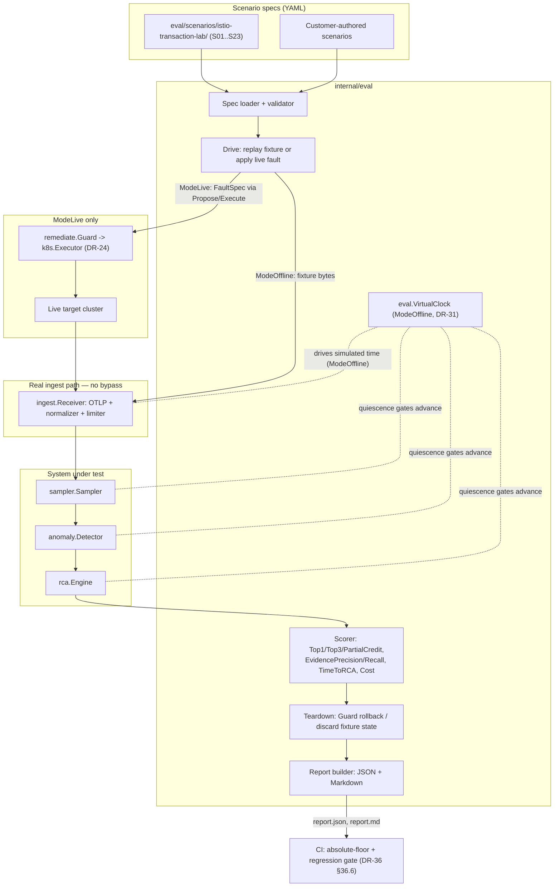
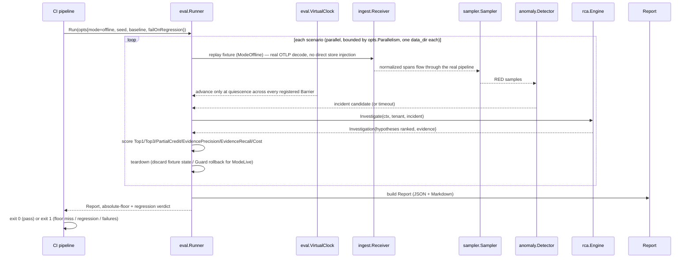

# F11 — Eval Harness

> Revision 2 — 2026-09-15 — applies DR-0, DR-5, DR-15, DR-21, DR-24, DR-31, DR-36, DR-38 (round-1 fixes)

## 1. Purpose

Datadog's own engineering blog has documented silent eval-quality regressions in its agentic AI —
accuracy claims that are neither published nor independently re-runnable by customers. F11 makes
TraceIQ's RCA accuracy a first-class, testable artifact instead of a marketing claim: a
fault-injection scenario format (YAML), a runner that replays every fixture through the **real**
ingest pipeline (no bypass — DR-36) against either a live TraceIQ + target cluster or a virtual-clock
fixture replay, and a scoring pipeline that produces top-1/top-3 root-cause accuracy (against
`rca`/`model`'s own types, no shadow structs — DR-15/DR-36), time-to-RCA, evidence precision/recall,
and cost — published as JSON and Markdown, gated in CI by both absolute floors and relative
regression thresholds. The Istio transaction-lab scenario catalog (S01–S23) ships as the first
suite, giving TraceIQ an internal SREBench equivalent from day one.

## 2. Compared-tool drawbacks addressed

| Drawback ID | Tool | Lagging feature | How TraceIQ fixes it (concrete mechanism in F11) |
|---|---|---|---|
| D-D5 | Datadog | Agentic AI (Bits AI SRE) tied to the paid platform; Datadog's own blog documented silent eval-quality regressions with no independent way for customers to verify accuracy | `eval.Runner` is shipped as an open, re-runnable package: any customer can run the same S01–S23 suite (plus their own `ScenarioSpec` files) against their own deployment, get a `Report` with `Top1Accuracy`/`Top3Accuracy`/`MeanTimeToRCA`/`MeanEvidencePrecision`/`MeanEvidenceRecall`, and diff it against a stored baseline. CI's absolute-floor **and** `FailOnRegression` gates (DR-36 §36.6) mean an accuracy regression is caught automatically, not discovered by customers in production — the opposite of a silent regression. Screen 7 (Eval — DR-30) publishes the same numbers in the UI. |

## 3. Requirements

### 3.1 Functional (testable)

- **FR-F11-1**: `ScenarioSpec` MUST be expressible as YAML with, at minimum, the fields `id`,
  `title`, `tenant`, `fixture` (span bundle plus optional log/metric bundles for the file
  adapters), `baseline_warmup` (fixture segment or inline `BaselineSnapshot`), `clock`
  (`start`/`fault_at`/`end`, all virtual), `faults` (`ModeLive` only), and `expect`
  (`incident_within`, `epicenter_service`, `root_cause_category`, `root_cause_component`,
  `expected_evidence` — a closed `EvidenceCategory` enum, `max_cost_micro_usd`, `must_not_page`).
- **FR-F11-2** *(rewritten — DR-36 §36.2)*: `Runner.Run()` with `RunOptions.Mode = ModeOffline`
  (the default, and the **only** mode CI runs) MUST replay each scenario's fixture through the
  real `ingest.Receiver` path — the real OTLP receiver, normalizer, limiter, sampler, and
  detectors — and MUST NOT inject spans/logs/metrics directly into the store. `eval.VirtualClock`
  (DR-31) drives simulated time, advancing only when every registered `model.Barrier` reports
  `Pending() == 0`, so a 30-minute scenario completes in seconds and is bit-reproducible.
- **FR-F11-3**: **Deleted (DR-24, DR-36 §36.7).** The direct `istioctl`/`kubectl` live-mode fault
  path is removed. `ModeLive` fault application and teardown instead go exclusively through
  `remediate.Guard` (see §4.4, §6) — there is no second cluster-write path anywhere in the system.
- **FR-F11-4** *(rewritten — DR-36 §36.5)*: For every scenario, the runner MUST record
  `RootCauseTop1` (true iff `investigation.Hypotheses[0].Category == Expect.RootCauseCategory`
  **and** `.Component == Expect.RootCauseComponent`, over the real `rca.Hypothesis`/`model`
  types — no shadow `ServiceOrComponent`/`Narrative` fields) and `RootCauseTop3` (true iff a match
  occurs within the top 3 hypotheses by `PostScore`). `PartialCredit = 0.5` is recorded for a
  category-only match within the top 3.
- **FR-F11-5**: `TimeToRCAMillis` MUST be measured from the timestamp the injected fault's first
  anomalous span/log/metric is observable in the store to the timestamp the RCA engine emits its
  final (non-iterating) investigation report.
- **FR-F11-6** *(term resolved — DR-38 §38.3)*: `EvidencePrecision`/`EvidenceRecall` MUST be
  computed over `Investigation.Steps[].EvidenceIDs → Evidence.Category` against
  `Expect.ExpectedEvidence`, a **closed** `EvidenceCategory` enum (§4.2) — "expected evidence
  categories" is no longer a heuristic inferred from keywords.
- **FR-F11-7**: The Istio transaction-lab suite (`eval/scenarios/istio-transaction-lab/`) MUST
  contain 23 `ScenarioSpec` files (`S01.yaml` … `S23.yaml`), each independently runnable and
  independently scorable.
- **FR-F11-8**: `Run()` MUST emit a `Report` serializable to both JSON (`report.json`, machine
  consumable) and Markdown (`report.md`, human-readable summary table) without re-running
  scenarios.
- **FR-F11-9**: When `RunOptions.RegressionBaseline` is supplied and `FailOnRegression=true`,
  `Run()` MUST return a non-nil error (and the CI wrapper MUST exit non-zero) if `Top1Accuracy`
  drops by more than 5 percentage points, or `MeanTimeToRCA` increases by more than 25%, relative
  to the baseline (§4.4, §7 AC-F11-4).
- **FR-F11-10**: Each `ScenarioResult` MUST retain the `InvestigationID` produced by `rca.Engine`,
  so a failed scenario's full replayable investigation log (F06, DR-18) can be inspected without
  re-running.
- **FR-F11-11** *(new — DR-36 §36.6)*: Independent of any baseline, `Run()` MUST fail (non-zero CI
  exit) when the active `RunOptions.Reasoner`'s Top-1 accuracy falls below its absolute floor
  (`llm`: 70%, `rules`: 40%), mean time-to-RCA exceeds 180 s, or median/max cost per investigation
  exceeds $0.08/$0.50 (values owned by `01 §10.3`).
- **FR-F11-12** *(new — DR-36 §36.6)*: Two `ModeOffline` runs with the same `RunOptions.Seed`
  against the same scenario set MUST produce bit-identical `Top1`, `Top3`, `EvidencePrecision`
  and `EvidenceRecall` for every scenario.
- **FR-F11-13** *(new — DR-36 §36.2)*: A test hook MUST assert that every span processed during a
  `ModeOffline` run entered through `ingest.Receiver`, so a regression that reintroduces a direct
  store-injection bypass is caught mechanically rather than by inspection.

### 3.2 Non-functional

Performance/accuracy gate values below are owned by `01 §10.3` (DR-0); this table cites them.

- **Reproducibility**: formalized as FR-F11-12. `ModeOffline` scenarios MUST produce
  bit-identical scoring outcomes across repeated runs against the same fixture bundle, the same
  `RunOptions.Seed`, and the same reasoner/model version (rule-based reasoner: fully
  deterministic; LLM reasoner: `temperature=0` and a pinned `ModelVersion` recorded in the
  `Report`).
- **Runtime budget** *(re-derived — DR-36 §36.3)*: with `eval.VirtualClock` installed, per-scenario
  virtual-clock wall time is ≤ 35 s (dominated by fixture decode, not simulated time); the derived
  23-scenario suite wall time is 6 waves × 35 s ≈ 3.5 min, **published as ≤ 4 min** on CI standard
  runners (was ≤ 10 min under the old wall-clock-driven timers). `RunOptions.Parallelism` defaults
  to 4 under `Isolation = IsolationProcess`.
- **Isolation** *(rewritten — DR-36 §36.3, §36.7)*: `IsolationProcess` (the default) gives each
  scenario its own `data_dir`, `traceiq.db`, `control.db`, topology graph, baseline store and
  memory store; `IsolationShared` exists only for a single-scenario debug run and **refuses
  `Parallelism > 1`**, since concurrent scenarios sharing one grouper would merge events across
  scenarios within 2 topology hops. `ModeLive` fault application/teardown is scoped to
  `tenant.Policy.EvalNamespaceAllowlist`, **disjoint from** the production `NamespaceAllowlist` —
  eval fault injection is architecturally separate from F09's guarded production remediation even
  though both now share the same `remediate.Guard`/`k8s.Executor` code path.
- **Cost**: LLM-reasoner scenario runs are subject to the same per-investigation token budget as
  production (F06); cost-per-investigation gates (median ≤ $0.08, max ≤ $0.50) are enforced per
  FR-F11-11 and owned by `01 §10.3`.

## 4. Design

### 4.1 Component diagram



### 4.2 Data model

Reproduced from DR-36 §36.1/§36.4; the scorer compiles against `rca`/`model` directly — **no
shadow structs** (DR-15, DR-36 §36.5).

```go
package eval

type Mode uint8
const ( ModeOffline Mode = 1; ModeLive Mode = 2 )

type Isolation uint8
const ( IsolationProcess Isolation = 1; IsolationShared Isolation = 2 )

type RunOptions struct {
	Tenant             model.TenantID
	ScenariosDir       string
	Select             []string           // scenario ids; empty = all
	Mode               Mode               // ModeOffline is the default and the only mode CI runs
	Isolation          Isolation          // IsolationProcess default; Shared refuses Parallelism > 1
	Parallelism        int                // default 4 with IsolationProcess
	Seed               int64              // seeds every *rand.Rand and every Investigation.ReplaySeed
	Clock              model.Clock        // eval.VirtualClock in ModeOffline (DR-31)
	Reasoner           model.ReasonerKind // "rules" in CI; "llm" for published accuracy runs
	RegressionBaseline string             // path to a stored Report
	FailOnRegression   bool
	OutputDir          string
	Timeout            time.Duration
}

type FixtureRef struct {
	SpanBundle   string // OTLP/NDJSON span bundle
	LogBundle    string // optional
	MetricBundle string // optional
}

type ClockSpec struct {
	Start   time.Time
	FaultAt time.Duration
	End     time.Duration
}

// FaultSpec (ModeLive only) is applied through remediate.Guard using the existing
// five model.ActionType values — eval.ScenarioSpec does not extend model.ActionType.
type FaultSpec struct {
	Type     model.ActionType
	Target   model.ActionTarget
	Spec     model.ActionSpec
	AtSecond int
}

type EvidenceCategory uint8   // CLOSED — what makes EvidenceRecall computable (DR-38 §38.3)
const (
	EvTraceExemplar  EvidenceCategory = 1
	EvErrorSignature EvidenceCategory = 2
	EvLogLine        EvidenceCategory = 3
	EvMetricSeries   EvidenceCategory = 4
	EvTopologyEdge   EvidenceCategory = 5
	EvDeployMarker   EvidenceCategory = 6
	EvREDSeries      EvidenceCategory = 7
	EvMemoryRecord   EvidenceCategory = 8
)

type Expectation struct {
	IncidentWithin     time.Duration
	EpicenterService   string
	RootCauseCategory  model.HypothesisCategory // DR-15's closed enum
	RootCauseComponent string
	ExpectedEvidence   []EvidenceCategory
	MaxCostMicroUSD    int64
	MustNotPage        bool
}

type ScenarioSpec struct {
	ID, Title, Description string
	Tenant         model.TenantID
	Fixture        FixtureRef
	BaselineWarmup *FixtureRef // or an inline BaselineSnapshot
	Clock          ClockSpec   // all virtual
	Faults         []FaultSpec // ModeLive only
	Expect         Expectation
}

type ScenarioResult struct {
	ScenarioID        string
	Passed            bool
	RootCauseTop1     bool
	RootCauseTop3     bool
	PartialCredit     float64
	TimeToRCAMillis   int64
	EvidencePrecision float64
	EvidenceRecall    float64
	CostMicroUSD      int64
	ReasonerKind      model.ReasonerKind
	InvestigationID   string
	Errors            []string
}

type ReportSummary struct {
	Total                 int
	Passed                int
	Top1Accuracy          float64
	Top3Accuracy          float64
	MeanTimeToRCA         time.Duration
	P95TimeToRCA          time.Duration
	MeanEvidencePrecision float64
	MeanEvidenceRecall    float64
	LLMTokenSpend         int
}

type Report struct {
	RunID        string
	StartedAt    time.Time
	FinishedAt   time.Time
	GitCommit    string
	ModelVersion string // reasoner/LLM version tag, for reproducibility auditing
	Seed         int64
	Results      []ScenarioResult
	Summary      ReportSummary
}
```

`01 §5.1`'s `eval_result` table carries the same additions (`top3`, `evidence_precision`,
`evidence_recall`, `partial_credit`, `time_to_rca_millis`, `cost_micro_usd`, `reasoner_kind`) —
this doc cites, does not restate, the DDL (DR-0).

### 4.3 Interfaces & APIs

```go
package eval

type Runner interface {
	Run(ctx context.Context, opts RunOptions) (Report, error)
	List(ctx context.Context, dir string) ([]ScenarioSpec, error)
	Stats() Stats
}
```

`RunOptions.Tenant` carries tenant scoping for this package (DR-5 lists `eval` among the packages
whose tenant-scoped operations are tenant-parameterized; here that parameter travels on
`RunOptions` rather than as a second positional argument, since a single `Run` call may cover
scenarios spanning the eval tenant's own `EvalNamespaceAllowlist`).

**CLI / CI surface**: `traceiq eval run --scenarios-dir=eval/scenarios/istio-transaction-lab
--mode=offline --baseline=eval/baselines/latest.json --fail-on-regression` — exit code 0/1 drives
CI pass/fail; `traceiq eval run --mode=live --kubeconfig=... --scenarios-dir=...` for scheduled
live-cluster runs (§6 gating conditions apply).

**Config keys** — owned by `01 §7`'s `eval.*` block (DR-0); this doc cites key paths only:
`eval.enabled`, `eval.scenarios_dir`, `eval.output_dir`, `eval.mode`, `eval.parallelism`,
`eval.isolation`, `eval.seed`, `eval.reasoner`, `eval.regression_baseline`,
`eval.fail_on_regression`, `eval.live.enabled`, `eval.live.confirm`, `eval.live.kubeconfig`,
`eval.live.context_allowlist`. The full defaults (`parallelism: 4`, `isolation: process`, etc.) are
defined once in `01 §7`, generated into `docs/architecture/defaults.md`, and diffed in CI (DR-38
§38.4) — no value is restated here.

### 4.4 Algorithms / decision logic

```
function Run(ctx, opts):
    scenarios = LoadOrSelect(opts.ScenariosDir, opts.Select)
    clock = opts.Clock                          // eval.VirtualClock in ModeOffline (DR-31)
    results = []
    pool = worker pool of size opts.Parallelism  // IsolationShared refuses Parallelism > 1
    for scenario in scenarios (dispatched to pool; each gets its own data_dir under IsolationProcess):
        results.append(runOne(scenario, opts, clock))
    report = buildReport(results, opts)

    // Absolute floors — independent of any baseline (FR-F11-11)
    if report.Summary.Top1Accuracy < absoluteFloor(opts.Reasoner):      return report, ErrBelowAbsoluteFloor
    if report.Summary.MeanTimeToRCA > 180*time.Second:                 return report, ErrBelowAbsoluteFloor

    // Relative regression (FR-F11-9)
    if opts.RegressionBaseline != "" and opts.FailOnRegression:
        baseline = loadReport(opts.RegressionBaseline)
        if report.Summary.Top1Accuracy < baseline.Summary.Top1Accuracy - 0.05:
            return report, ErrRegressionTop1Accuracy
        if report.Summary.MeanTimeToRCA > baseline.Summary.MeanTimeToRCA * 1.25:
            return report, ErrRegressionTimeToRCA
    return report, nil

function runOne(scenario, opts, clock):
    barrier = clock.Register(newScenarioBarrier(scenario.ID))
    defer teardown(scenario, opts)

    if len(scenario.Faults) > 0:   // ModeLive only
        for fs in scenario.Faults ordered by AtSecond:
            clock.AwaitQuiescence(ctx)   // or real wall time in ModeLive
            proposal = buildActionProposal(fs)                          // one of the five model.ActionType values
            action, _ = remediate.Guard.Propose(ctx, scenario.Tenant, proposal, by=auth.Subject{ID: "eval:" + opts.RunID}, idem)
            remediate.Guard.Execute(ctx, scenario.Tenant, action.ID, by, idem)  // scoped to EvalNamespaceAllowlist only
    else:   // ModeOffline — the only path CI runs
        replayThroughReceiver(scenario.Fixture, ingest.Receiver, clock)  // real OTLP decode, normalizer, limiter, sampler
                                                                           // FR-F11-13's test hook asserts entry here

    incident = awaitIncidentCandidate(scenario.Expect.IncidentWithin, clock)  // anomaly.Grouper output, quiescence-driven
    if incident == nil:
        return ScenarioResult{ScenarioID: scenario.ID, Passed: false, Errors: ["no incident candidate within Expect.IncidentWithin"]}

    investigation = rca.Engine.Investigate(ctx, scenario.Tenant, incident)

    top1 = matchRootCause(investigation.Hypotheses[0], scenario.Expect)
    top3 = any(matchRootCause(h, scenario.Expect) for h in investigation.Hypotheses[:3])
    partial = 1.0 if top1 else (0.5 if any(h.Category == scenario.Expect.RootCauseCategory for h in investigation.Hypotheses[:3]) else 0.0)

    precision, recall = scoreEvidence(investigation.Steps, scenario.Expect.ExpectedEvidence)  // Steps[].EvidenceIDs -> Evidence.Category

    return ScenarioResult{
        ScenarioID: scenario.ID, Passed: top1,
        RootCauseTop1: top1, RootCauseTop3: top3, PartialCredit: partial,
        TimeToRCAMillis: investigation.CompletedAt.Sub(incident.FirstAnomalousSignalAt).Milliseconds(),
        EvidencePrecision: precision, EvidenceRecall: recall,
        CostMicroUSD: investigation.Spend.CostMicroUSD, ReasonerKind: investigation.ReasonerKind,
        InvestigationID: investigation.ID,
    }

function matchRootCause(hypothesis, expect):
    return hypothesis.Category == expect.RootCauseCategory
       AND hypothesis.Component == expect.RootCauseComponent
```

Deleted per DR-36 §36.5: the old `hypothesis.ServiceOrComponent`/`.Narrative` shadow fields and
`keywordOverlap` fuzzy matching — the scorer reads `rca.Hypothesis.Category`/`.Component`
directly, both populated deterministically by `F06`'s rule catalogue and by the LLM reasoner
alike (DR-15).

### 4.5 Sequence diagram



**Istio transaction-lab suite — illustrative scenario taxonomy** (the canonical S01–S23 definitions
live in `eval/scenarios/istio-transaction-lab/*.yaml`; the categories below illustrate the fault-type
× root-cause-category coverage the suite is designed to span, not a literal enumeration):

| Scenario range | Fault category | Example expected root-cause category |
|---|---|---|
| S01–S05 | Latency injection on a single hop | `latency` |
| S06–S10 | Error injection / dependency failure | `error`, `dependency_failure` |
| S11–S14 | Resource exhaustion (pod CPU/memory throttle, DB connection pool exhaustion) | `resource_exhaustion` |
| S15–S18 | Config drift (bad feature flag, misrouted routing rule) | `config` |
| S19–S23 | Cascading multi-hop failure (compound faults across 2+ services) | mixed / `dependency_failure` |

Fault categories map onto `model.ActionType`/`FaultSpec` (§4.2); a fault not expressible as one of
the five `model.ActionType` values (e.g. direct `istioctl` fault injection, CPU throttling outside
`k8s.Executor`'s verbs) is a **Phase 3 deferral**, not a v1 capability (DR-36 §36.7).

## 5. Failure modes & mitigations

| Failure | Detection | Mitigation |
|---|---|---|
| `remediate.Guard` refuses a `ModeLive` fault (RBAC denial, scope violation, forbidden-flag denylist hit) | `Guard.Execute` returns a non-nil error / `Action.State = Failed` | Scenario marked `Passed=false`, `Errors=["fault action failed: ..."]`; teardown still runs |
| No incident candidate ever forms (anomaly detector too insensitive for the injected fault) | `awaitIncidentCandidate` times out at `Expect.IncidentWithin` | Result recorded as a failure with a distinct error code, distinguishable in the report from a wrong-root-cause failure — feeds back into F05 tuning, not just F06 |
| Non-determinism between two `ModeOffline` runs with the same `Seed` | FR-F11-12 / AC-F11-6 byte-comparison fails | `temperature=0` pinned for the LLM reasoner; `eval.VirtualClock` removes wall-clock timing nondeterminism; any drift is itself a CI failure, not masked |
| A `ModeOffline` run bypasses `ingest.Receiver` (regression reintroducing direct store injection) | FR-F11-13's test hook | CI fails immediately; published accuracy numbers never ship from a bypassed run |
| Teardown leaves a `ModeLive` fault active after a crashed run | `defer teardown` plus a post-suite reconciliation pass (`traceiq eval verify-clean`) | AC-F11-8: CI step fails loudly rather than leaving a poisoned cluster for the next run |
| Regression baseline stale (compares against an outdated model/reasoner version) | `Report.ModelVersion` mismatch check against baseline's `ModelVersion` | Warn (not silently compare) when `ModelVersion` differs; regression gate still runs but flags the mismatch in output |
| `ModeLive` eval fault injection accidentally reaches production remediation scope | `tenant.Policy.EvalNamespaceAllowlist` overlapping `NamespaceAllowlist` | Startup error — a namespace listed in both is refused at boot, never at run time |

## 6. Security considerations

*(rewritten — DR-24, DR-36 §36.7)*

- `ModeLive` fault application and teardown go **exclusively through `remediate.Guard`**
  (`ProposedBy = "eval:<runID>"`), using the same five `model.ActionType` values and the same
  `k8s.Executor`/`BuildArgv` (DR-24) as production remediation — there is no second cluster-write
  path anywhere in the system. `model.ActionType` is **not** extended for eval's benefit.
- Scope is `tenant.Policy.EvalNamespaceAllowlist`, **disjoint from** the production
  `NamespaceAllowlist`; a namespace configured in both is a startup error, not a runtime one.
- `ModeLive` requires **all** of: `eval.live.enabled: true`,
  `eval.live.confirm: "i-know-this-mutates-a-cluster"`, an `eval.live.kubeconfig` **distinct from**
  `remediate.kubeconfig`, a context name matching `eval.live.context_allowlist`, and
  `server.profile != prod`. Any missing condition is `400 eval_live_refused`, audited.
- Every fault application and teardown writes to the same hash-chained audit log as production
  remediation (DR-27); teardown is verified even on scenario panic via `defer` plus the
  post-suite reconciliation pass (AC-F11-8).
- Fixture bundles (`ModeOffline`) may contain realistic-looking service names/attributes; they
  MUST be treated as synthetic test data and are excluded from the production `memory.Store`
  retrieval path (tagged `synthetic=true`) so eval runs never pollute real investigation memory
  used in production RCA.
- `Report` JSON/Markdown artifacts are safe to publish externally (no secrets); any LLM prompt/
  response logs captured during eval runs for debugging follow the same secret-redaction and
  prompt-injection-defense rules as production (X-SEC, DR-37).

## 7. Test strategy & acceptance criteria

**Unit tests**
- YAML `ScenarioSpec` parsing: valid spec round-trips; missing required fields rejected with a
  clear validation error.
- Scoring functions: `matchRootCause`, `scoreEvidence` — table-driven against hand-constructed
  `rca.Hypothesis`/`model.Evidence` fixtures with known expected scores (no shadow types).
- Absolute-floor and regression-gate arithmetic: threshold boundary cases (exactly at 5pp drop
  passes; 5.01pp fails; exactly at the 40%/70% floor passes; one point below fails).

**Integration tests**
- Full `ModeOffline` run of the 23-scenario Istio suite against committed fixture bundles in CI,
  asserting the run completes within the ≤ 4 min budget and produces both `report.json` and
  `report.md`.
- One `ModeLive` smoke scenario against a `kind` cluster, driven entirely through
  `remediate.Guard`, run nightly (not on every PR) given live-mode cost/time.
- Regression-gate and absolute-floor end-to-end: a deliberately degraded fixture reasoner (mocked
  to under-perform) triggers both gate types and a non-zero CI exit.
- Receiver-entry assertion (FR-F11-13): a deliberately patched runner that injects directly into
  the store is caught by the test hook.

**Acceptance criteria**

| AC | Maps to | Statement |
|---|---|---|
| AC-F11-1 | FR-F11-2, NFR runtime | `traceiq eval run --mode=offline --scenarios-dir=eval/scenarios/istio-transaction-lab` completes in ≤ 4 min with every span passing through `ingest.Receiver`. |
| AC-F11-2 | FR-F11-4 | For a fixture with a known injected fault, `RootCauseTop1` is `true` when the rule-based reasoner (deterministic) is used, verified byte-for-byte across 3 repeated runs with the same `Seed`. |
| AC-F11-3 | FR-F11-7 | `eval/scenarios/istio-transaction-lab/` contains exactly 23 valid `ScenarioSpec` YAML files, each independently loadable via `List`. |
| AC-F11-4 | FR-F11-9 | A synthetic baseline with `Top1Accuracy=0.90` and a current run scoring `0.83` (7pp drop) causes `Run()` to return `ErrRegressionTop1Accuracy` and CI to exit non-zero. |
| AC-F11-5 | FR-F11-11 | A rules-reasoner run scoring `Top1Accuracy=0.35` (below the 40% absolute floor) fails CI independent of any baseline comparison. |
| AC-F11-6 | FR-F11-12 | Two `ModeOffline` runs with the same `Seed` against the same scenario set produce bit-identical `Top1`/`Top3`/`EvidencePrecision`/`EvidenceRecall` for every scenario. |
| AC-F11-7 | FR-F11-13 | A build with the receiver-entry test hook fails when any span in a `ModeOffline` run did not pass through `ingest.Receiver`. |
| AC-F11-8 | §6 | A scenario that panics mid-run still results in its `ModeLive` fault being rolled back, verified by the post-suite reconciliation pass. |

**Shared ownership:** `AC-F12-10` — alert precision ≥ 80% actionable, ≤ 1 page per genuine
incident — is **measured on this suite**; F11 owns the measurement, F12 owns the mechanism
(`api.AlertRouter`, DR-21).

## 8. Open questions / risks

- The canonical content of S01–S23 (exact fault parameters and expected root causes) is an
  existing external artifact referenced by the PRD ("the existing Istio transaction-lab
  failure-scenario catalog") but not present in this repository; this design assumes it will be
  authored/imported as `eval/scenarios/istio-transaction-lab/S01.yaml`…`S23.yaml` conforming to
  the `ScenarioSpec` schema above — flagged for the lead architect to confirm the source of truth.
- ~~`EvidenceRecall` requires a notion of "expected evidence categories"~~ — **Resolved (DR-38
  §38.3):** `Expect.ExpectedEvidence` is a closed `EvidenceCategory` enum; the heuristic
  keyword-based inference is deleted.
- ~~Live-mode fault injection direct `istioctl` path~~ — **Resolved (DR-24, DR-36 §36.7):**
  `ModeLive` goes exclusively through `remediate.Guard`; faults not expressible as one of the five
  `model.ActionType` values are a Phase 3 deferral, not a v1 gap.
- LLM-reasoner evaluation cost at scale (23 scenarios × multiple model versions × CI frequency) is
  bounded by the new absolute cost floor (FR-F11-11, median ≤ $0.08/investigation) but the
  aggregate nightly/release-cadence budget across model versions is not yet itemized; recommend
  keeping PR-gate runs on the deterministic rule-based reasoner only, per `eval.reasoner: rules`
  default.
