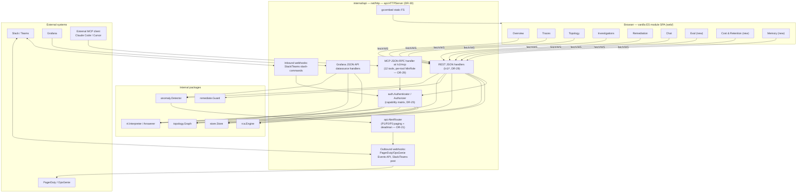
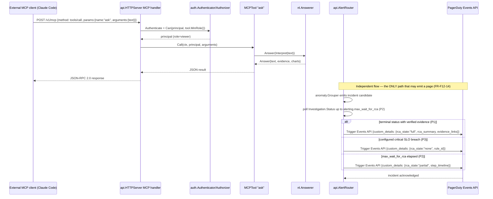

# F12 — Web UI + API + Integrations

> Revision 2 — 2026-09-15 — applies DR-0, DR-18, DR-21, DR-23, DR-25, DR-26, DR-27, DR-29, DR-30, DR-36, DR-37, DR-38 (round-1 fixes)

## 1. Purpose

Tempo ships no standalone UI at all (Grafana-dependent); Jaeger and Zipkin ship a basic
trace-search UI with no alerting, RCA, or topology intelligence surfaced. F12 is TraceIQ's face:
a single Go binary (`api.HTTPServer`, DR-30) that serves a static SPA (no build step, no Node
toolchain required to run — vanilla ES modules + CSS, embedded via `go:embed`), a REST/JSON API
under `/v1` (DR-29), an MCP server at `/v1/mcp` exposing twelve tools so other agents (Claude Code,
Cursor) can query TraceIQ programmatically, and outbound integrations (Slack/Teams,
PagerDuty/OpsGenie, Grafana datasource) so TraceIQ meets engineers in the tools they already use
rather than requiring a new one. `internal/api` owns the HTTP surface; `web/` owns the embedded
SPA source.

## 2. Compared-tool drawbacks addressed

| Drawback ID | Tool | Lagging feature | How TraceIQ fixes it (concrete mechanism in F12) |
|---|---|---|---|
| D-J5 | Jaeger | Self-operated Cassandra/ES storage burden; basic trace-centric UI | `api.HTTPServer` embeds the entire UI via `go:embed` — a single binary with no separate UI deployment, and 9 purpose-built screens (Overview, Traces, Topology, Investigations, Remediation, Chat, Eval, Cost & Retention, Memory — DR-30) go well beyond Jaeger's search-and-waterfall-only UI. |
| D-T2 | Tempo | Grafana-dependent; no standalone UI; no built-in alerting/RCA | TraceIQ is self-contained (chat-first UI + standalone web SPA + API) while *also* implementing the Grafana JSON API datasource contract (§4.3), so existing Tempo/Grafana users keep their dashboards without TraceIQ requiring Grafana to function. |
| D-Z4 | Zipkin | No alerting, analytics, RCA, or AI; basic search UI | The Investigations screen (replayable step timeline, recorded/live-diff replay, corrections history — DR-18) and Remediation screen (approval queue + budget/override + hash-chained audit — DR-23) surface F06/F09's intelligence directly in the UI — capabilities that do not exist anywhere in Zipkin's UI surface. |

## 3. Requirements

### 3.1 Functional (testable)

- **FR-F12-1**: The compiled binary MUST serve the complete web UI (HTML/JS/CSS/assets) from an
  embedded `fs.FS` (`go:embed`) with zero external file dependencies and zero runtime network
  fetch of UI assets (fonts, JS libraries included).
- **FR-F12-2** *(9 screens — DR-30)*: Each of the 9 screens (Overview, Traces, Topology,
  Investigations, Remediation, Chat, Eval, Cost & Retention, Memory) MUST be reachable via a
  distinct client-side route (History API) and MUST render its primary content within 1.5 s p95
  on a cold load against a dev-mode instance with ≤ 10k traces indexed.
- **FR-F12-3**: The Traces screen search MUST support filtering by service, operation, status,
  min/max duration, time range, and free-text attribute search, returning results via
  `GET /v1/traces` within 500 ms p95 against the hot-index path.
- **FR-F12-4** *(extended — DR-18, DR-30)*: The Investigations screen MUST render the full
  replayable step timeline (hypothesis, query, evidence, verdict per step) for any completed
  investigation, with every evidence citation deep-linking to its source trace/span/metric/log;
  it MUST additionally render a **replay diff view** (`recorded`/`live-diff`, per step: tool,
  stored arguments, result hash, drift badge, original verdict beside replay verdict) and a
  **corrections history**.
- **FR-F12-5**: The Remediation screen's approval queue MUST list all actions in state `Proposed`
  for the caller's tenant, and MUST render Approve/Reject controls only when the logged-in
  principal holds capability `remediation_action:approve` (DR-25 §25.2 capability matrix — a
  linear role hierarchy is not the source of truth) (controls absent, not merely disabled, for
  principals lacking it).
- **FR-F12-6** *(rewritten — DR-29 §29.2)*: The MCP endpoint (`POST /v1/mcp`) MUST expose exactly
  the twelve tools of §4.3's table via JSON-RPC 2.0 over HTTP, each validating its parameters
  against a published JSON Schema before dispatch, and each gated by its own `MinRole`
  (`api.MCPTool.MinRole`) rather than a single endpoint-level role. **`traceiq_propose_action` is
  not exposed over MCP in v1** — an approval must name a person, and that reasoning applies
  equally to a proposal whose author is an MCP token. An MCP token defaults to `viewer` scope;
  `operator` is an explicit property of the token.
- **FR-F12-7**: The Grafana datasource contract MUST implement the JSON API plugin contract:
  `GET /grafana` returns `200 OK` (health check), `GET /grafana/search` returns queryable
  target/metric names, `POST /grafana/query` accepts `{targets, range}` and returns time-series or
  table data for topology and RED metrics, `GET /grafana/annotations` returns incident/deploy
  markers as annotations.
- **FR-F12-8** *(rewritten — DR-21 §21.5)*: Paging is implemented by `api.AlertRouter` and fires
  for an incident when, and only when, one of the three conditions owned by `01 §7`/`01 §9`'s
  D-D4 row holds: **P1** a terminal investigation status with at least one `Verdict == ok`
  evidence record (page carries the full RCA); **P2** `alerting.max_wait_for_rca` (default 5 m)
  elapsed since the incident reached `rca.min_incident_score` (page fires with the **partial**
  investigation attached, `custom_details.rca_state = "partial"`); **P3** a configured
  `alerting.critical_slo_breaches` match (page fires immediately, `custom_details.rca_state =
  "none"`, the matched rule ID named). **There is no severity-derived bypass** and
  `model.ServiceMeta.Tier` is never a paging input. A page never carries an empty RCA section.
- **FR-F12-9**: Dark/light theme MUST switch without a page reload, persist per-browser via
  `localStorage`, and every screen MUST meet WCAG 2.1 AA contrast (≥ 4.5:1 normal text, ≥ 3:1
  large text/UI components) in both themes.
- **FR-F12-10**: All interactive controls MUST be reachable and operable via keyboard alone
  (Tab/Shift+Tab/Enter/Space/Esc) with a visible focus indicator ≥ 2 px, verified by an automated
  axe-core scan in CI with zero critical/serious violations.
- **FR-F12-11** *(idempotency mechanism corrected — DR-23 §23.8)*: Inbound Slack slash-command and
  PagerDuty/OpsGenie webhook endpoints MUST be idempotent under retry (duplicate delivery of the
  same signed payload within 5 min MUST NOT double-execute the underlying action), keyed by
  `sha256(platform | team_id | message_ts | action_id | verb)` for chat-derived actions —
  **`X-Slack-Request-Id` does not exist** and is not used as a dedupe key; Slack's real retry
  headers (`X-Slack-Retry-Num`, `X-Slack-Retry-Reason`) are logged only.
- **FR-F12-12** *(new — DR-18)*: `POST /v1/investigations/{id}/replay?mode=recorded|live-diff`
  MUST return `202` with the new investigation ID; role **operator**; `mode` defaults to
  `recorded`; an unknown `mode` is `400`.
- **FR-F12-13** *(new — DR-18)*: The Investigations screen MUST render a replay diff view: per
  step, the tool, the stored arguments, the result hash, a drift badge, and the original verdict
  beside the replay verdict (folded into FR-F12-4 above; listed separately per Appendix C).
- **FR-F12-14** *(new — DR-21 §21.5)*: The three paging conditions (P1/P2/P3) MUST be implemented
  exclusively in `api.AlertRouter`; no other code path may emit a page.
- **FR-F12-15** *(new — DR-21 §21.5)*: A deadman check, owned by the **`api` role** (never
  `brain`), MUST page directly through the configured sinks when no `anomaly.Grouper` detection
  tick completes within `alerting.deadman.interval` (default 10 m), independent of any LLM,
  reasoner or leader lease.
- **FR-F12-16** *(new — DR-30)*: An **Eval** screen MUST render eval runs, per-scenario results,
  top-1/top-3 accuracy, evidence precision/recall, time-to-RCA, cost, and the baseline diff and
  regression verdict (F11, DR-36); role viewer (run: admin).
- **FR-F12-17** *(new — DR-30)*: A **Cost & Retention** screen MUST render the disk budget and
  watermark, tier occupancy T0–T6, keep rate by `model.KeepReason`, shed events,
  `store_hot_index_ratio`, LLM spend per tenant per day, erasure SLA, and a Sampler panel (active
  interest predicates, `NarrowLevel`, `Hits`); role viewer.
- **FR-F12-18** *(new — DR-30)*: A **Memory** screen MUST render memory search, record detail with
  provenance and weight, runbook import, export, and correction history; role viewer (import/
  delete: admin).
- **FR-F12-19** *(new — DR-37 §37.2, FR-XSEC-15)*: Every model-authored narrative rendered on the
  Remediation screen MUST carry an explicit **untrusted, model-authored** marker and MUST be
  displayed beside the `remediate.Guard`-reconstructed payload — the model's rationale is never
  the operative payload.

### 3.2 Non-functional

Values below are owned by `01 §10` (DR-0); this table cites them.

- **Bundle size**: total JS + CSS served for the SPA MUST be < 500 KB gzipped (vanilla ES modules,
  no framework) to keep the single-binary cold-load fast.
- **Latency**: API p99 < 300 ms for read endpoints against the hot index; MCP tool-call p99 <
  1.5 s (bounded by underlying RCA/store calls).
- **Concurrency**: a single `api.HTTPServer` instance MUST sustain ≥ 500 concurrent chat
  (WebSocket/SSE) connections without read/write endpoint p99 degrading beyond the targets above.
- **Availability**: `/healthz` and `/readyz` respond even when the UI's embedded FS or a
  downstream dependency is degraded, so orchestrators can distinguish "process alive" from
  "fully ready."

## 4. Design

### 4.1 Component diagram



### 4.2 Data model

```go
package api

// HTTPServer is the single-binary impl; Server (below) is the interface 02 §4 declares.
// Renamed from `Server` to resolve the `api.Server` interface/struct name collision (DR-30, CC-24).
type HTTPServer struct {
	Deps
	Mux *http.ServeMux
}

type Deps struct {
	Auth      auth.Authenticator
	AuthZ     auth.Authorizer
	Store     store.Store
	Topology  topology.Graph
	RCA       rca.Engine
	Remediate remediate.Guard
	NL        nl.Interpreter
	NLAnswer  nl.Answerer
	Anomaly   anomaly.Detector
	StaticFS  fs.FS // go:embed'd web/dist content
	MCP       *MCPHandler
	Grafana   *GrafanaHandler
	Webhooks  *WebhookHandler
	Alerts    *AlertRouter // DR-21
}

type MCPTool interface {
	Name() string
	Schema() json.RawMessage  // JSON Schema for params
	MinRole() auth.Role       // per-tool gate (DR-29 §29.2); F12 previously omitted this
	Call(ctx context.Context, principal auth.Subject, params json.RawMessage) (json.RawMessage, error)
}

type MCPHandler struct {
	Tools map[string]MCPTool // the twelve of §4.3, minus traceiq_propose_action
}

type JSONRPCRequest struct {
	JSONRPC string          `json:"jsonrpc"`
	ID      json.RawMessage `json:"id"`
	Method  string          `json:"method"` // "tools/list" | "tools/call"
	Params  json.RawMessage `json:"params"`
}

type JSONRPCResponse struct {
	JSONRPC string          `json:"jsonrpc"`
	ID      json.RawMessage `json:"id"`
	Result  json.RawMessage `json:"result,omitempty"`
	Error   *JSONRPCError   `json:"error,omitempty"`
}

type GrafanaQueryRequest struct {
	Targets []GrafanaTarget `json:"targets"`
	Range   GrafanaRange    `json:"range"`
}

// AlertRouter is the ONLY path that may emit a page (FR-F12-14). It polls
// Investigation.Status per 02 §4 rather than calling the nonexistent
// rca.Engine.PreliminaryReport/.FinalReport methods (deleted — DR-36 §36.5).
type AlertRouter struct {
	RCA          rca.Engine
	MaxWait      time.Duration // alerting.max_wait_for_rca, default 5m (P2)
	SLOBreaches  []model.CriticalSLOBreach // alerting.critical_slo_breaches (P3)
	Deadman      DeadmanConfig             // FR-F12-15
}

type WebhookHandler struct {
	SlackSigningSecret auth.SecretSource
	IdentityStore      auth.IdentityStore // chat identity binding, DR-25 §25.4 — HMAC is authenticity, not authorization
	IdempotencyStore   IdempotencyStore   // dedupes retried deliveries; chat-derived key, 5min TTL (DR-23 §23.8)
}
```

### 4.3 Interfaces & APIs

```go
package api

type Server interface {
	ListenAndServe(addr string, tlsConfig *tls.Config) error
	Routes() *http.ServeMux // for testability via httptest
}
```

**REST API endpoint table** — owned by `01 §6.1` (DR-29 §29.1); this is a **filtered view** headed
"defined in `01 §6.1`". Roles are per the `auth` **capability matrix** (DR-25 §25.2) — `admin ⊇
approver ⊇ operator ⊇ viewer` is **not** the model; a role name below is shorthand for "holds the
capability this row requires."

| Method & path | Role | Screen / consumer |
|---|---|---|
| `GET /v1/overview` | viewer | Overview |
| `GET /v1/traces` | viewer | Traces (search) |
| `GET /v1/traces/{id}` | viewer | Traces (waterfall) |
| `GET /v1/topology` | viewer | Topology |
| `GET /v1/topology/snapshot?window=` | viewer | Topology |
| `GET /v1/incidents` | viewer | Overview |
| `GET /v1/investigations/{id}` | viewer | Investigations |
| `POST /v1/investigations/{id}/replay?mode=` | operator | Investigations (DR-18) |
| `POST /v1/investigations/{id}/steps/{stepID}/correct` | operator or approver | Investigations (feedback → memory.Store; step-scoped only — the investigation-level `/correct` is deleted, DR-29) |
| `GET /v1/remediation/actions` | viewer | Remediation |
| `POST /v1/actions` | operator (`remediation_action:propose`) | Remediation / RCA |
| `POST /v1/actions/{id}/approve` | approver | Remediation |
| `POST /v1/actions/{id}/rollback` | approver | Remediation (DR-23, DR-29 — new) |
| `GET /v1/audit?verify=` | **admin** (was viewer — corrected, DR-25/DR-29) | Remediation |
| `POST /v1/nl/query` | viewer | Chat |
| `POST /v1/mcp` | per-tool `MinRole` (viewer default; operator explicit) | External agents (DR-29 §29.2) |
| `GET /grafana`, `GET /grafana/search`, `POST /grafana/query`, `GET /grafana/annotations` | viewer | Grafana plugin |
| `POST /v1/integrations/slack/commands` | **HMAC and principal-resolved (DR-25 §25.4); RBAC per capability matrix** — "no RBAC role" appears nowhere in this doc | Slack |
| `POST /v1/integrations/pagerduty/test` | admin | Ops verification |
| `POST /v1/identities`, `GET /v1/identities`, `DELETE /v1/identities/{id}` | admin | Chat identity binding (DR-25 §25.4) |
| `GET /v1/eval/runs`, `GET /v1/eval/runs/{id}` | viewer (run: admin, via `POST /v1/eval/runs`) | Eval (DR-30) |
| `GET /v1/store/budget`, `GET /v1/sampler/stats`, `GET /v1/sampler/interest` | viewer | Cost & Retention (DR-30) |
| `GET /v1/tenants/{id}/erasure` | admin | Cost & Retention (DR-30) |
| `GET /metrics` | operator (or unauthenticated on a separate internal-only port) | Prometheus (X-OPS) |
| `GET /healthz`, `GET /readyz` | unauthenticated | Orchestrator probes |

`Idempotency-Key` is **required** on `POST /v1/actions`, `/approve`, `/reject`, `/execute`,
`/rollback`, and on `POST /v1/webhooks/deploy` (DR-23 §23.8); absent ⇒ `400
idempotency_key_required`.

**MCP tool set — twelve tools, gated per tool** (`/v1/mcp`, DR-29 §29.2):

| Tool | Backing call | MinRole |
|---|---|---|
| `traceiq_search_traces` | `store.SearchSpans` | viewer |
| `traceiq_get_trace` | `store.GetTrace` | viewer |
| `traceiq_query_red` | `store.QueryRED` | viewer |
| `traceiq_topology_neighbors` | `topology.Neighbors` | viewer |
| `traceiq_topology_edges` | `topology.Edges` | viewer |
| `traceiq_list_incidents` | incident query | viewer |
| `traceiq_get_investigation` | investigation + steps + evidence | viewer |
| `traceiq_search_memory` | `memory.Similar` | viewer |
| `traceiq_correlate_logs` | `correlate.LogsForTrace` | viewer |
| `traceiq_correlate_metrics` | `correlate.MetricsForSpan` | viewer |
| `traceiq_ask` | `nl.Answerer` | viewer |
| `traceiq_start_investigation` | `rca.Engine.Investigate` | **operator** |

**`traceiq_propose_action` is withheld from MCP in v1** (FR-F12-6). No MCP tool approves,
executes, rejects, imports memory, writes config or mutates a tenant.

**Config keys** — owned by `01 §7` (DR-0); this doc cites key paths and the canonical names only
(DR-26 §26.5 corrected the historical aliases): `api.endpoint` (**not** `api.listen_addr`),
`auth.tls.min_version` (**not** `auth.tls_min_version`), `api.mcp_path` (`/v1/mcp`),
`api.mcp.enabled`, `api.grafana_datasource.enabled`, `api.cors_allowed_origins`,
`api.static_ui.embed`, `api.webhook.idempotency_ttl` (default `5m`), `alerting.max_wait_for_rca`,
`alerting.critical_slo_breaches`, `alerting.deadman.*`, `auth.audit.*`. No default value is
restated here; see `01 §7` (generated into `docs/architecture/defaults.md` and diffed in CI —
DR-38 §38.4).

**UI screens** (all client-side routes under the SPA, `web/src/`) — nine screens, DR-30:

| Screen | Route | Primary data sources | Key widgets | Min role |
|---|---|---|---|---|
| Overview | `/` | `/v1/overview`, `/v1/incidents`, `/v1/anomalies`, `/v1/baselines` | RED tiles, active-incident cards, below-threshold candidates panel, deadman status | viewer |
| Traces | `/traces` | `/v1/traces`, `/v1/traces/{id}` | Filter bar, results table, waterfall (SVG), `AnsweredFrom=hot\|cold` badge | viewer |
| Topology | `/topology` | `/v1/topology`, WS live updates | Force-directed graph (Canvas), export | viewer |
| Investigations | `/investigations/:id` | `/v1/investigations*` | Replayable step timeline, evidence deep links, replay diff view, corrections history | viewer (replay/correct: operator) |
| Remediation | `/remediation` | `/v1/actions*`, `/v1/audit?verify=true` | Approval queue, Guard-reconstructed payload beside untrusted-marked model rationale (FR-F12-19), TTL countdown, budget/overrides, chain-verified audit | viewer (approve/execute: approver; audit: admin) |
| Chat | `/chat` | `/v1/nl/query`, WS | Message thread, evidence cards, mini-waterfalls | viewer |
| **Eval** *(new)* | `/eval` | `/v1/eval/runs*` | Runs, per-scenario results, top-1/top-3, evidence precision/recall, time-to-RCA, cost, baseline diff | viewer (run: admin) |
| **Cost & Retention** *(new)* | `/cost` | `/v1/store/budget`, `/v1/sampler/stats`, `/v1/sampler/interest`, `/v1/tenants/{id}/erasure` | Disk budget/watermark, tier occupancy T0–T6, keep rate, shed events, `store_hot_index_ratio`, LLM spend, erasure SLA, Sampler panel | viewer |
| **Memory** *(new)* | `/memory` | `/v1/memory*` | Search, record detail with provenance/weight, runbook import, export, correction history | viewer (import/delete: admin) |

## 4.4 Algorithms / decision logic

```
function MCPHandler.ServeHTTP(w, r):
    req = parseJSONRPCRequest(r.Body)
    principal = Auth.Authenticate(r)
    switch req.Method:
      case "tools/list":
        return respond(w, req.ID, listToolSchemas(Tools))
      case "tools/call":
        call = parseToolCallParams(req.Params)  // {name, arguments}
        tool = Tools[call.name]
        if tool == nil: return jsonrpcError(w, req.ID, -32601, "method not found")
        if err := validateAgainstSchema(call.arguments, tool.Schema()): return jsonrpcError(w, req.ID, -32602, err)
        if err := AuthZ.Can(ctx, principal, tool.MinRole()-derived capability, Resource{}): return jsonrpcError(w, req.ID, -32000, "forbidden")
        result, err = tool.Call(ctx, principal, call.arguments)
        if err != nil: return jsonrpcError(w, req.ID, -32000, err.Error())
        return respond(w, req.ID, result)

// AlertRouter implements FR-F12-8/-14 — the ONLY path that may emit a page.
// Polls Investigation.Status (02 §4); does NOT call rca.Engine.PreliminaryReport/.FinalReport,
// which do not exist on the rca.Engine interface (deleted — DR-36 §36.5).
function AlertRouter.OnIncidentCandidate(incident):
    deadline = now() + config.alerting.max_wait_for_rca   // P2, default 5m
    loop until terminal or deadline:
        inv = RCA.Get(ctx, incident.Tenant, incident.InvestigationID)
        if isTerminal(inv.Status) and hasVerifiedEvidence(inv):          // P1
            return firePage(incident, inv, rcaState="full")
        if matchesConfiguredSLOBreach(incident, config.alerting.critical_slo_breaches):  // P3
            return firePage(incident, nil, rcaState="none")
        sleep(pollInterval)
    return firePage(incident, latestPartialInvestigation(inv), rcaState="partial")  // P2 hard ceiling

function AlertRouter.Deadman():   // FR-F12-15 — owned by the `api` role, never `brain`
    if now() - Anomaly.Stats().LastTickAt > config.alerting.deadman.interval:
        pageDirectly(reason="no detection tick")

function WebhookHandler.HandleSlackCommand(r):
    if not verifySlackSignature(r, SlackSigningSecret): return 401   // authenticity only
    principal, err = IdentityStore.Resolve(ctx, "slack", r.TeamID, r.UserID)
    if err != nil: return 403 identity_not_bound  // audited — DR-25 §25.4: HMAC is never authorization
    dedupeKey = sha256(platform | team_id | message_ts | action_id | verb)  // chat-derived; NOT X-Slack-Request-Id (DR-23 §23.8)
    if IdempotencyStore.SeenRecently(dedupeKey, ttl=5m): return 200 (no-op, already processed)
    IdempotencyStore.Mark(dedupeKey)
    intent = nl.Interpret(r.FormValue("text"), contextFor(r, principal))
    answer = nl.Answer(intent)
    return respondSlackFormatted(answer)
```

### 4.5 Sequence diagram



## 5. Failure modes & mitigations

| Failure | Detection | Mitigation |
|---|---|---|
| Embedded FS asset missing at build time | Boot-time self-check enumerates required paths (`index.html`, entrypoint JS) | Process fails fast (non-zero exit) rather than serving a broken UI; caught by a `traceiq eval verify-clean`-style CI smoke test |
| Grafana datasource query timeout on a large window | Handler-level context timeout (default 10s) | Return partial/degraded data with a `X-TraceIQ-Partial: true` header rather than hanging the Grafana panel |
| Malformed MCP JSON-RPC request | JSON-RPC parse/schema validation fails | Standard JSON-RPC error object returned (`-32700`/`-32602`), connection stays open for retry |
| Slack webhook retried due to timeout on TraceIQ's side | `X-Slack-Retry-Num` header present (logged only, not the dedupe key) | `IdempotencyStore` dedupes on the chat-derived key (`sha256(platform\|team_id\|message_ts\|action_id\|verb)`) within 5 min TTL; second delivery returns 200 without re-executing (DR-23 §23.8) |
| Signed Slack request from an unmapped or under-privileged user | `auth.IdentityStore.Resolve` fails, or the resolved `Subject` lacks the required capability | `403 identity_not_bound` (unmapped) or `403` (insufficient capability), both audited — a signature alone never authorizes (DR-25 §25.4) |
| PagerDuty API unreachable when paging | Outbound call error/timeout | Retry with exponential backoff (bounded, e.g. 5 attempts); on exhaustion, escalate via a secondary channel (Slack post + `page_delivery_failed` metric/log) so a paging failure is never silent |
| Chat WebSocket connection storm exceeds concurrency budget | Connection count metric crosses threshold | New connections beyond the budget receive a graceful 503 with `Retry-After`; existing connections unaffected |
| Detection loop stalls (brain unavailable/saturated) | `AlertRouter.Deadman()` finds `LastTickAt` stale beyond `alerting.deadman.interval` | Deadman pages directly through configured sinks, owned by the `api` role — independent of `brain`, any LLM, or leader lease (FR-F12-15) |

## 6. Security considerations

- Full authn/authz detail lives in X-SEC; F12-specific notes: the SPA uses short-lived,
  `HttpOnly`+`Secure`+`SameSite=Strict` session cookies for browser use and separate bearer tokens
  for API/MCP clients — cookie auth and bearer auth are never accepted interchangeably on the same
  endpoint without an explicit CSRF token check on the cookie path.
- **RBAC is a capability matrix, not a hierarchy** (DR-25 §25.2): `admin ⊇ approver ⊇ operator ⊇
  viewer` is deleted from this document set. An **approver cannot propose** a remediation action
  (separation of duty is structural, not just checked); an **operator cannot approve or execute**.
  `audit:read`/`audit:verify` require **admin** (corrected from viewer).
- **Chat identity binding is authorization; the HMAC signature is authenticity only** (DR-25
  §25.4). An inbound chat request is authorized only after `(platform, workspace_id,
  platform_user_id)` resolves through `auth.IdentityStore` to a provisioned `Subject`; an unmapped
  user gets `403 identity_not_bound` plus an audit row. Every row in this document that used to
  read "signature-verified, no RBAC role" now reads "HMAC and principal-resolved; RBAC per the
  capability matrix" — the string "no RBAC role" appears nowhere in this document.
- Content-Security-Policy: `default-src 'self'; script-src 'self'; style-src 'self'` — no inline
  `<script>`, no `eval`, no third-party CDN script (vanilla-JS-no-build-step constraint also
  happens to simplify CSP to same-origin-only).
- TLS **1.3** minimum on every non-loopback listener (`auth.tls.min_version`); a non-loopback
  listener without TLS and without `auth.mode != none` is a startup **exit 2** (DR-26 §26.3).
- Inbound webhook endpoints (Slack/Teams slash-commands, PagerDuty/OpsGenie test hooks) are
  signature/secret-verified **and** principal-resolved before touching `nl.Interpreter` or any
  state-changing handler (shared verification path with F10 FR-F10-7, DR-25 §25.4).
- MCP bearer tokens are scoped separately from browser session tokens, default to **viewer**
  scope, and are individually revocable — a revoked token is `401` on the **next** request, not
  at TTL expiry (DR-25 §25.3).
- **Untrusted, model-authored narrative marker** (FR-F12-19, DR-37 FR-XSEC-15): every model-
  authored rationale rendered on the Remediation screen is visually marked untrusted and shown
  beside the `remediate.Guard`-reconstructed payload — the operative payload is always the
  reconstructed one, never the model's prose.
- The audit chain (`GET /v1/audit?verify=true`, admin-only) is hash-chained and externally
  anchored (DR-27); a non-leader `api` replica that cannot forward an append **refuses the
  operation** rather than writing an unordered entry (fail-closed).

## 7. Test strategy & acceptance criteria

**Unit tests**
- Each MCP tool's JSON Schema validation (valid/invalid argument shapes for all twelve tools) and
  per-tool `MinRole` enforcement.
- Route handler tests via `httptest` for every endpoint in the table (§4.3), asserting correct
  capability enforcement (401 unauthenticated, 403 missing capability, 200 with the capability).
- Grafana contract conformance: `/grafana/search` and `/grafana/query` response shapes match the
  JSON API plugin's expected schema exactly (golden-file comparison).
- Webhook idempotency: duplicate signed payload within TTL (chat-derived key) is a no-op; after
  TTL, re-processed.
- `AlertRouter`: each of P1/P2/P3 fires exactly once per qualifying incident; no code path from
  `ServiceMeta.Tier` to the router (shared with `AC-F05-16`).

**Integration tests**
- Full binary boot with `go:embed`, load each of the 9 SPA routes, assert 200 + expected root
  element present.
- MCP client round-trip using a JSON-RPC test client mirroring Claude Code's MCP usage pattern,
  including a refused `traceiq_start_investigation` call from a viewer-scoped token.
- Slack slash-command simulation (valid signature + mapped identity → answer posted; valid
  signature + unmapped identity → 403; invalid signature → 401; replayed request → idempotent
  no-op).
- PagerDuty sandbox Events API integration test verifying all three paging conditions (P1/P2/P3,
  FR-F12-8) and the deadman path (FR-F12-15).
- Replay endpoint: `recorded` and `live-diff` modes against the fixtures in `AC-F06-15`/`-16`.
- Accessibility: automated axe-core scan of all 9 screens in both light and dark themes, zero
  critical/serious violations; keyboard-only Playwright walk of each screen's primary workflow.

**Acceptance criteria**

| AC | Maps to | Statement |
|---|---|---|
| AC-F12-1 | FR-F12-1 | A release binary run with no network access and no adjacent files serves all 9 UI routes correctly. |
| AC-F12-2 | FR-F12-5 | A principal without `remediation_action:approve` loading `/remediation` sees the approval queue but no Approve/Reject controls in the rendered DOM (not merely `disabled`). |
| AC-F12-3 | FR-F12-6 | `tools/list` on `/v1/mcp` returns exactly the twelve named tools (`traceiq_propose_action` absent); a viewer-scoped token is refused `traceiq_start_investigation` with JSON-RPC `-32000` before touching business logic. |
| AC-F12-4 | FR-F12-8 | In a simulated incident satisfying P1 within 90s (< 5 min ceiling), the PagerDuty payload's `custom_details.rca_state="full"` and `rca_summary` is non-empty on the first `Trigger()` call. In a simulated incident with no terminal status by the ceiling, `Trigger()` fires at 5 min with `rca_state="partial"` and a non-empty step timeline (P2). A configured `critical_slo_breaches` match fires immediately with `rca_state="none"` (P3). |
| AC-F12-5 | FR-F12-10 | axe-core scan across all 9 screens × 2 themes reports zero critical/serious violations. |
| AC-F12-6 | FR-F12-12 | `POST /v1/investigations/{id}/replay` enforces the operator role and the `202` contract; an unknown `mode` is `400`. |
| AC-F12-7 | FR-F12-13 | The replay diff view renders `data_drifted` for the mutated step in `AC-F06-16`'s fixture. |
| AC-F12-8 | FR-F12-14 | Kill the brain, inject a `Critical` incident → a page arrives within `max_wait_for_rca` with `rca_state="partial"` and a non-empty step timeline. |
| AC-F12-9 | FR-F12-15 | Stop the detection loop → a deadman page fires within `alerting.deadman.interval`. |
| AC-F12-10 | §7 (shared with F11) | Alert precision ≥ 80% actionable and ≤ 1 page per genuine incident, measured on the F11 suite — F11 owns the measurement, F12 owns the mechanism (`api.AlertRouter`). |
| AC-F12-11 | FR-F12-19 | Every model-authored rationale on the Remediation screen renders the untrusted marker beside the Guard-reconstructed payload, verified across the approval-surface component test suite. |

## 8. Open questions / risks

- WebSocket vs Server-Sent Events for the Chat screen's live updates is not yet decided; SSE is
  simpler and sufficient for one-directional push (answers, incident updates) and avoids
  WebSocket's extra CSRF/origin-check surface — leaning SSE, flagged for confirmation.
- The Grafana JSON API plugin contract has multiple community variants (simple-json vs
  yesoreyeram/grafana-infinity-datasource conventions); this doc assumes the simpler simple-json
  shape — needs validation against whichever plugin the target Grafana deployments actually use.
- Teams integration depth (adaptive cards for approval buttons vs. plain text) is not fully
  specified; Slack is assumed as the reference implementation with Teams as a follow-on parity
  target.
- ~~`rca.Engine.PreliminaryReport`/`.FinalReport`~~ — **Resolved (DR-36 §36.5):** these methods do
  not exist on the `rca.Engine` interface (DR-15); `api.AlertRouter` polls `Investigation.Status`
  instead. Any prior design referencing them is superseded.
