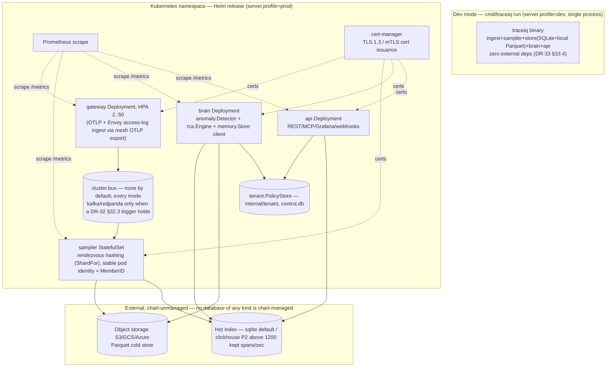
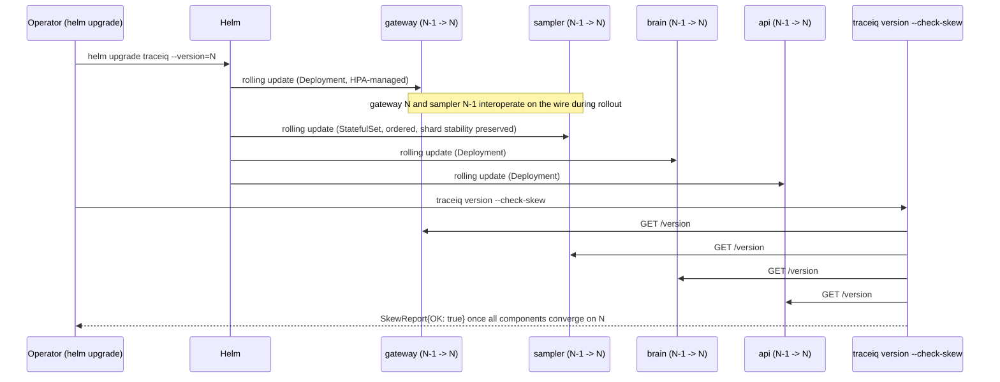

# X-OPS — Cross-Cutting Deployment & Operations

> **DRs applied:** DR-0, DR-1, DR-2, DR-3, DR-5, DR-24, DR-25, DR-26, DR-32, DR-33 (register: `docs/architecture/06-decision-register.md`).

## 1. Purpose

X-OPS defines how TraceIQ actually gets run: a zero-dependency single-binary dev mode (embedded
SQLite + local Parquet directory) for evaluation and small teams, and a Helm-chart production
topology (`gateway` Deployment with HPA, `sampler` StatefulSet sharded by rendezvous hashing,
`brain` Deployment, `api` Deployment, external object storage — **no chart-managed database of
any kind**) for scale. `server.mode` is the only mode/role axis (`single | gateway | sampler |
brain | api`); `server.profile` (`dev | prod`) is a separate, safety-gating-only axis (DR-26
§26.1). It also owns tenant policy (via `internal/tenant`, DR-3 — **there is no `internal/ops`
package**), self-observability (`/metrics`, `/healthz`, `/readyz`), graceful shutdown, backup/
restore, upgrade/version skew, and a capacity planning table anyone can recompute from five
published formulas. `cmd/traceiq` is the single binary's entrypoint; `deploy/` holds the Helm
chart and reference manifests. `traceiq backup snapshot`, `traceiq restore --from=<id>` and
`traceiq version --check-skew` are `cmd/traceiq` subcommands, not interfaces (DR-3 rejected
`ops.BackupManager`/`ops.VersionChecker`, and DR-2 records that `internal/ops` never existed and
must not be created).

## 2. Compared-tool drawbacks addressed (indirect support)

X-OPS carries no drawback ID of its own; it is the operational substrate that makes self-hosting
TraceIQ practical enough that the drawbacks other features fix don't get reintroduced as "now you
need a platform team to run TraceIQ itself."

| Drawback ID | Tool | Lagging feature | How X-OPS supports the fix (indirect) |
|---|---|---|---|
| D-J5 | Jaeger | Self-operated Cassandra/ES storage burden | X-OPS's dev-mode single binary (embedded SQLite + local Parquet, FR-XOPS-1) and self-observability (`/metrics`, `/readyz` dependency checks, FR-XOPS-4) mean small teams never operate a Cassandra/ES cluster at all, and larger teams get the same operational visibility into TraceIQ's own storage tier that F03 gives them into trace data — the burden Jaeger pushes onto the customer is bounded and observable rather than open-ended. |
| D-Y2 | Dynatrace | Cost (~$58/host/mo), metered queries, enterprise-only | The capacity planning table (§4.4) gives concrete, non-metered sizing (fixed infra, not per-query billing), and multi-tenancy (§4.2) lets one deployment amortize infra cost across many teams — the opposite of Dynatrace's per-host/per-query metering model. |
| D-D1 | Datadog | Cost unpredictability / bill shock | Capacity planning table converts ingest-rate → infrastructure sizing directly, so cost scales with infra provisioned (predictable, budgeted in advance) rather than with span/host/SKU counts discovered on the bill; backup/restore and upgrade procedures are similarly fixed-cost operational runbooks, not metered services. |

## 3. Requirements

### 3.1 Functional (testable)

- **FR-XOPS-1**: `traceiq run` at `server.profile: dev` (the config default) MUST start a fully
  functional single process with **zero
  external dependencies** (no Kafka/ClickHouse required, and no Postgres — there never was one,
  DR-32 §32.1): `api.endpoint 127.0.0.1:8443` with a generated self-signed certificate;
  `auth.mode: token` with a bootstrap admin token printed once to stderr on first start;
  `tenancy.enabled: false`; `store.hot.driver: sqlite`; `store.cold.driver: parquet_local`;
  `cluster.bus.driver: none`; `rca.reasoner: auto` (⇒ `rules`, no API key needed);
  `correlate.logs.driver: file`, `correlate.metrics.driver: file`; `memory.embeddings.driver:
  lexical`; `remediate.enabled: false`; `eval.enabled: false`; `selfobs.metrics_endpoint
  127.0.0.1:9464`; alert sinks disabled but the deadman enabled and logging rather than paging
  (DR-33 §33.4). `AC-XOPS-9`: with no config file, it starts, serves the UI, accepts OTLP on
  loopback, assembles a trace, detects an anomaly and produces a `rules`-reasoner investigation —
  with no network egress and no external service.
- **FR-XOPS-2**: The Helm chart MUST deploy 4 independently scalable component kinds under
  `server.mode`: `gateway` (**Deployment with HPA 2..50** — the DaemonSet is deleted; Envoy access
  logs reach TraceIQ over OTLP from the mesh's own exporter, FR-F04-10, so node-local collection is
  not required), `sampler` (StatefulSet; stable pod identity **is** the shard `MemberID` for
  `sampler.ShardFor`'s rendezvous hashing, DR-8), `brain` (Deployment, stateless, horizontally
  scalable), `api` (Deployment, stateless). Object storage MUST be external
  (S3/GCS/Azure-compatible) and MUST NOT be chart-managed; **no database of any kind is
  chart-managed** — there is no `PGV` box (DR-32 §32.1).
- **FR-XOPS-3**: **Deleted in full (DR-5 §5.2).** Tenant resolution is never header-based. The
  tenant is derived from the authenticated principal and from nothing else:
  `auth.Subject.Tenant` → `tenant.Resolver.FromSubject` → the `model.TenantID` parameter on every
  call. The `X-TraceIQ-Tenant` header fallback is deleted from this document; `tenancy.header` is
  removed from `01 §7`. The sole exception is `tenant.Resolver.FromDevDefault`, legal only when
  `server.profile: dev` **and** the listener is loopback **and** `auth.mode: none` — it returns
  `tenancy.default_tenant`, never a request value. A body or query tenant is `400
  tenant_not_accepted`; a webhook with `X-TraceIQ-Tenant: B` and no principal is `401`.
- **FR-XOPS-4** (rewritten, DR-33 §33.1): `/healthz` returns 200 iff the process is alive and
  config is loaded — no dependency checks, ever. `/readyz` returns 200 **iff all** of: every stage
  required by `server.mode` reached `Ready`; migrations applied; receivers bound (in modes that
  receive); a write probe on both `traceiq.db` and `control.db` succeeded within the last 30 s;
  disk below `store.budget.high_watermark` (only when `action_on_full: stop_ingest`); shutdown has
  not begun. **`/readyz` never probes object storage, Kafka lag, the hot-index cluster, the LLM, or
  the log/metric adapters** — those move to `/readyz?verbose=true` and
  `traceiq_component_degraded{component=...}` gauges, because a probe that can fail on every
  replica at once (an S3 partial outage) must not gate Service membership. `/metrics` exposes
  Prometheus-format counters/histograms for at least: ingest spans/sec, sampler keep-rate %, store
  write p99 latency, anomaly events/min, RCA investigations/min + LLM token spend, remediation
  actions by state.
- **FR-XOPS-5** (rewritten, DR-33 §33.3): `control.db` (irreplaceable state) is snapshotted via
  `VACUUM INTO` every `ops.backup.control_interval` (**5 m**); `traceiq.db` every
  `ops.backup.telemetry_interval` (**6 h**), plus continuous cold-WAL shipping
  (`ops.backup.cold_wal_ship: true`). RPO is stated **per file**: `control.db` ≤ 5 min;
  `traceiq.db` ≤ 6 h, with the gap covered by cold-WAL replay — a naive "< 10% overhead via
  incremental WAL shipping" claim is deleted, because `wal_autocheckpoint` continuously truncates
  the WAL and makes that unsound; a 9 GiB `VACUUM INTO` every 5 minutes is not feasible and is not
  attempted. `traceiq backup snapshot` and `traceiq restore --from=<id>` are `cmd/traceiq`
  subcommands (not an interface, DR-3). Each `VACUUM INTO` output is reopened and
  `integrity_check`'d (`ops.backup.verify_on_write: true`).
- **FR-XOPS-6**: Component upgrades MUST support N and N-1 minor versions interoperating on the
  wire (`gateway`→`sampler`→`brain`→`api`) for the duration of a rolling upgrade. `traceiq version
  --check-skew` (a `cmd/traceiq` subcommand, not a `VersionChecker` interface — DR-3 rejected that
  interface) MUST report a non-zero exit if any two live components differ by more than 1 minor
  version.
- **FR-XOPS-7**: The capacity planning table (§4.4, owned by `01 §10.1`; this document cites it)
  MUST give, for at least 4 ingest-rate bands, sizing numbers reproducible from the five published
  formulas — kept spans/sec, hot GiB/day, cold GB/day, shard count, gateway pod count — sufficient
  to provision a deployment without a support engagement. `AC-XOPS-7` validates at least the
  10 000-band storage-growth column against a real run.
- **FR-XOPS-8**: Per-tenant policy (retention days, sampling floor, remediation allowlist, RBAC
  bindings — consumed by F03/F02/F09/X-SEC respectively) is centrally defined in **one**
  `tenant.Policy` record (`internal/tenant`, DR-3 — **not** an `ops.TenantPolicy` or
  `remediate.TenantPolicy`, both deleted), resolvable by every component from `tenant.PolicyStore`,
  so a policy change takes effect for all components without a redeploy (`Watch`, push model).

### 3.2 Non-functional

- **Footprint**: dev-mode binary < 150 MB; dev-mode idle memory < 1 GiB.
- **Backup overhead**: the "< 10% storage overhead via incremental WAL shipping" NFR is **deleted**
  (DR-33 §33.3) — `wal_autocheckpoint` makes naive WAL shipping unsound, so the two-interval
  `VACUUM INTO` + cold-WAL-shipping method (FR-XOPS-5) replaces it; there is no single overhead
  percentage to target.
- **Throughput planning accuracy**: capacity table sizing figures (§4.4, owned by `01 §10.1`) MUST
  be validated against at least one load-tested reference deployment per band; `AC-XOPS-7` is the
  mechanized form of this NFR for the 10 000-spans/sec band.
- **Upgrade safety**: a rolling upgrade of a prod topology MUST NOT drop ingested spans (verified
  via a span-count reconciliation check across the upgrade window).
- **Readiness NFR**: no single dependency outage may take every replica out of the Service at once
  (DR-33 §33.1) — this is now a structural property of `/readyz`'s probe list, not a tuning target.

## 4. Design

### 4.1 Component / deployment diagram



`memory.Store` is `store`-backed (`memory.HybridStore`), not an external vector database by
default — the prior `Postgres+pgvector` box is deleted (DR-32 §32.1); `pgvector`, `lib/pq` and
`pgx` join the deliberately-absent dependency list.

### 4.2 Data model

**`internal/ops` never existed and must not be created (DR-2 §2, DR-3, DR-24 §D-13 supersession
note).** The two mode/role axes, the tenant policy record, and the resolver all live where the
register places them; this section cites, not re-declares (DR-0).

```go
package config   // 01 §7 owns every default; cited here, not restated

// server.mode — what this process runs. server.profile — dev|prod, safety gating only (DR-26 §26.1).
```

`tenant.Policy` (`internal/tenant`, DR-3 §3) is the **single** record consumed by F02 (sampling
floor), F03 (retention, byte budget), F06 (LLM spend), F09 (remediation allowlist) and X-SEC
(RBAC) — replacing this document's prior `ops.TenantPolicy`/`remediate.TenantPolicy`/
`TenantResolutionConfig` in full, all deleted:

```go
package tenant

type Policy struct {
    TenantID                model.TenantID
    DisplayName             string
    RetentionAnomalousDays  int     // default 30
    RetentionHealthyDays    int     // default 7
    RetentionHotSpanHours   int     // default 24 (dev) / 72 (prod)
    ByteBudgetBytes         int64   // 0 = inherit store.budget.max_disk_bytes share
    SamplingFloor           float64 // default 0.01
    MaxKeepRate             float64 // default 0.25
    LLMCostMicroUSDPerDay   int64   // default 20_000_000 ($20)
    RemediationAllowlist    []model.ActionType
    NamespaceAllowlist      []string
    TargetAllowlist         []string
    ActionBudgetPerIncident int      // default 2
    AutoExecuteAllowed      bool     // default false
    FeatureFlags            map[string][]string
    RBACBindings            map[string][]string // subjectID -> role names
    ChatBindings            []ChatBinding
    UpdatedAt               time.Time
    Version                 int64    // optimistic concurrency
}
```

Backing store: `control.db` table `tenant(id, display_name, policy_json, version, created_at,
updated_at)` — no new datastore (DR-3).

### 4.3 Interfaces & APIs

```go
package tenant

// Resolver is the ONLY tenant resolution path in the system (DR-3, DR-5). There is no header
// fallback anywhere in this document set.
type Resolver interface {
    FromSubject(ctx context.Context, subjectTenant model.TenantID) (model.TenantID, error)
    // Legal ONLY when server.profile == "dev" AND the listener is loopback AND auth.mode == "none".
    FromDevDefault(ctx context.Context) (model.TenantID, error)
}

type PolicyStore interface {
    Get(ctx context.Context, tid model.TenantID) (Policy, error)
    Set(ctx context.Context, p Policy, by string) (Policy, error) // admin only, audited (X-SEC)
    List(ctx context.Context) ([]Policy, error)
    Watch(ctx context.Context, tid model.TenantID) (<-chan Policy, error)
}
```

**`ops.BackupManager` and `ops.VersionChecker` are rejected as interfaces (DR-3, CC-8).** Backup,
restore and version-skew checking are `cmd/traceiq` subcommands, not components another package
calls through an interface:

**CLI surface**: `traceiq run` (`--profile=dev|prod` via config, not a boolean role flag),
`traceiq backup snapshot`, `traceiq restore --from=<snapshot-id>`, `traceiq version
--check-skew`, `traceiq policy get/set --tenant=<id>`.

**Config keys** (`01 §7` is the sole owner; cited here, never restated): `server.mode`,
`server.profile`, `ops.shutdown_grace` (**45 s**), `ops.backup.enabled`, `ops.backup.dir`,
`ops.backup.control_interval` (**5 m**), `ops.backup.telemetry_interval` (**6 h**),
`ops.backup.cold_wal_ship`, `ops.backup.retain` (**7 d**), `ops.backup.verify_on_write`,
`selfobs.metrics_endpoint` (**not** `MetricsAddr`/`:9090` — DR-26 §26.5 key-name reconciliation).
`ops.mode`, `ops.role`, `ops.tenant_header_name` and `ops.policy_store_path` are **deleted**
(DR-26 §26.1, DR-5).

### 4.4 Algorithms / decision logic — tenant resolution & capacity planning

```
function Resolver.FromSubject(ctx, subjectTenant):
    // There is no header fallback anywhere in this path (DR-5 §5.2). The tenant is a property
    // of the authenticated principal, full stop.
    return subjectTenant, nil

function Resolver.FromDevDefault(ctx):
    if not (server.profile == "dev" and listenerIsLoopback() and auth.mode == "none"):
        return "", ErrDevDefaultNotPermitted
    return tenancy.default_tenant, nil

function periodicBackup():
    every ops.backup.control_interval (5m): VACUUM INTO control.db snapshot; integrity_check if verify_on_write
    every ops.backup.telemetry_interval (6h): VACUUM INTO traceiq.db snapshot; integrity_check if verify_on_write
    continuously: ship cold-store WAL segments (ops.backup.cold_wal_ship)

function VersionChecker.CheckSkew():  // cmd/traceiq subcommand body, not an interface method
    versions = queryVersionEndpointOnEachComponent()  // gateway, sampler, brain, api
    minV, maxV = minMax(versions)
    if minorVersion(maxV) - minorVersion(minV) > MaxSkewMinor:
        return SkewReport{OK: false, Detail: "..."}, ErrSkewExceeded
    return SkewReport{OK: true}, nil
```

### The capacity table — owned by `01 §10.1`, cited here (DR-32 §32.4)

This document states no numbers of its own; every cell below is reproducible from five formulas
published in `01 §10.1`:

```
kept_spans_per_sec = ingest_spans_per_sec × effective_keep_rate        # keep rate per DR-10; 0.04 at the dev profile
hot_bytes_per_day  = kept_spans_per_sec × 86400 × 750 B                # 750 B/kept span, DR-6 §6.4
cold_bytes_per_day = kept_spans_per_sec × 86400 × 512 B ÷ compression  # compression >= 8, 01 §10.2
shards_needed      = ceil(ingest_spans_per_sec ÷ 20000)                # per_shard_assembly_rate, F02 §3.2
gateway_pods       = ceil(ingest_spans_per_sec ÷ (45000 × cores))      # per-core decode rate, 01 §10.1
```

| Band (spans/s) | kept/s | hot GiB/day | cold GB/day | shards | gateway pods (8 cores) |
|---:|---:|---:|---:|---:|---:|
| 1 000 | 40 | 2.4 | 0.22 | 1 | 1 |
| 10 000 | 400 | 24.1 | 2.2 | 1 | 1 |
| 50 000 | 2 000 | 120.7 | 11.1 | 3 | 2 |
| 200 000 | 8 000 | 482.8 | 44.2 | 10 | 6 |

The prior `50–150 GB/day` and `1–4 TB/day` object-storage rows are **deleted** — they were 25–90×
above what the system's own keep rate and compression target produce, and no operator could have
reconciled them against `01 §10.1`. The prior methodology line "no single shard exceeds ~2 000
spans/sec" is deleted and replaced by `per_shard_assembly_rate = 20 000` (`F02 §3.2`'s own number,
which reproduces the table's own top row). `AC-XOPS-7` validates at least the 10 000-band
storage-growth column against a real run, not only the ingest rate. Every cell must remain
reproducible with a calculator from the five formulas above — that is the rule, not the numbers.

### 4.5 Sequence diagrams

**Rolling upgrade with version-skew guard**



**Backup / restore drill (DR-33 §33.3)**

```mermaid
sequenceDiagram
    participant CRON as Backup scheduler
    participant CTRL as control.db
    participant TEL as traceiq.db
    participant COLD as Cold store (WAL)
    participant OBJ as Object storage
    participant OP as Operator
    participant NEW as Fresh instance

    loop every ops.backup.control_interval (5m)
        CRON->>CTRL: VACUUM INTO snapshot; integrity_check
        CRON->>OBJ: upload snapshot
    end
    loop every ops.backup.telemetry_interval (6h)
        CRON->>TEL: VACUUM INTO snapshot; integrity_check
        CRON->>OBJ: upload snapshot
    end
    loop continuously
        CRON->>COLD: ship cold-store WAL segments
        CRON->>OBJ: upload WAL segments
    end
    Note over OP: Disaster — hot index lost
    OP->>NEW: traceiq restore --from=<snapshot-id>
    NEW->>OBJ: fetch control.db snapshot (RPO <= 5min) + traceiq.db snapshot (RPO <= 6h)
    OBJ-->>NEW: snapshots + cold-WAL segments since base
    NEW->>NEW: reopen snapshots, replay cold-WAL for the gap
    NEW-->>OP: ready (RTO target documented per file, not a single number)
```

### 4.6 Graceful shutdown order (DR-33 §33.2, normative; budget `ops.shutdown_grace: 45s`)

| Step | Action |
|---|---|
| X1 | `/readyz` starts failing; 5 s drain window for load balancers |
| X2 | receivers stop accepting; in-flight requests finish within `api.write_timeout` |
| X3 | close `spanBatchCh`; decode workers drain and exit |
| X4 | `sampler.FlushAll` — force-complete every open trace with `KeepReason = KeepShed`, emit decisions and RED; then truncate the sampler WAL segments |
| X5 | `topology.Flush` — flush open edge buckets through `EdgeSink` |
| X6 | `anomaly.BaselineStore.Checkpoint` — final dirty-key checkpoint |
| X7 | `rca` — abort in-flight investigations with `Status = Aborted`, `reason = shutdown`; every completed step is already journalled |
| X8 | `remediate` — no new transitions; an in-flight `Executing` action is left for restart reconciliation, never cancelled mid-apply |
| X9 | cold store — seal open blocks, or spill to `store.cold.wal_dir`; run `HotIndex.BindColdBlock` for anything sealed |
| X10 | control writer drains, then telemetry writer drains; `wal_checkpoint(TRUNCATE)` on both files |
| X11 | audit `process.shutdown` appended; **final anchor written** (X-SEC §4.2/DR-27); chain closed |
| X12 | listeners closed; **exit 0** |

Grace exceeded ⇒ force path: spill open Parquet buffers to the cold WAL, one 5 s checkpoint
attempt, log `shutdown_forced` naming the stalled stage, **exit 1**.

**Startup reconciliation is the mirror image**: `rca.Journal.ListRunning` aborts investigations
orphaned by a crash; `Guard.ExpireDue` expires stale approvals; `ColdStore.ReplayWAL` and
`HotIndex.BindColdBlock` run before receivers bind; `sampler.ReplayWAL` runs before receivers bind.

## 5. Failure modes & mitigations

| Failure | Detection | Mitigation |
|---|---|---|
| Dev mode fails to start with external deps missing | `traceiq run` self-check on boot | FR-XOPS-1 guarantees zero external deps at `server.profile: dev` — boot failure in this mode is treated as a build/config bug, gated by `AC-XOPS-9`'s CI smoke test |
| Sampler StatefulSet pod loses stable identity (e.g. PVC/hostname reassignment) | Shard-membership consistency check on sampler startup | StatefulSet ordinal + headless service guarantees stable network identity, which **is** the `ShardFor` `MemberID` (DR-8); startup validates its shard position before accepting trace-ID assignments |
| A client attempts to claim another tenant via a request field | Contract test: tenant-A token supplying `{"tenant":"B"}` | There is no header or body override path to spoof — the tenant is exclusively `auth.Subject.Tenant` resolved server-side (FR-XOPS-3, DR-5); a body/query tenant is `400 tenant_not_accepted`, a header with no principal is `401` |
| `/readyz` reports ready while object storage is actually degraded | N/A by design — object storage is never probed by `/readyz` | `AC-XOPS-11`: fault-inject object-storage unavailability — `/readyz` stays 200, ingest continues, `traceiq_component_degraded{component="cold_store"}=1`, WAL spill occurs (FR-XOPS-4, DR-33 §33.1) |
| A hot-store write actually fails | Write probe on `traceiq.db`/`control.db` within 30 s | `AC-XOPS-12`: `/readyz` fails, `/healthz` stays 200 — Kubernetes does not restart a pod that would fail identically |
| Backup falls behind RPO (control or telemetry snapshot interval missed) | Backup lag metric crosses the per-file RPO (5 min for `control.db`, 6 h for `traceiq.db`) | Alert before RPO target is at risk; cold-WAL shipping continues independently and covers the gap on restore (DR-33 §33.3) |
| Rolling upgrade skew exceeds supported window (operator pauses mid-rollout) | `traceiq version --check-skew` run as a post-upgrade gate | Non-zero exit blocks the deployment pipeline from declaring success; operator alerted to resume/complete the rollout |
| Multi-tenant policy store becomes a single point of contention under high tenant-config churn | Policy store write latency metric | `tenant.PolicyStore.Watch` push model means components cache the last-known-good policy and don't block ingest/API paths on a live read per request |
| Shutdown exceeds `ops.shutdown_grace` (45 s) mid-stage | Stage timer per DR-33 §33.2 step | Force path: spill open Parquet buffers to cold WAL, one 5 s checkpoint attempt, `shutdown_forced` logged naming the stalled stage, exit 1 |

## 6. Security considerations

- Tenant resolution has exactly one path — `auth.Subject.Tenant` via `tenant.Resolver.FromSubject`
  — and this is itself the primary defense against a compromised or malicious client claiming
  another tenant's data; there is no header to spoof because there is no header fallback
  (FR-XOPS-3, DR-5), and this is covered jointly with X-SEC's `Authorizer.Can` cross-tenant check.
- Backup artifacts (`control.db`/`traceiq.db` snapshots and cold-WAL segments in object storage)
  contain the same sensitive telemetry as the live store and MUST inherit the same
  encryption-at-rest and access-control policy as the primary object storage bucket — not a
  separately-secured location.
- The Helm chart's default `ServiceAccount`s for `gateway`/`sampler`/`brain`/`api` follow
  least-privilege: only `api` (specifically `remediate`'s `internal/k8s` executor path, F09,
  DR-24) is granted any write RBAC against the target cluster, and only the five verbs on the five
  kinds the executor uses — `gateway`/`sampler`/`brain` never touch the Kubernetes API.
- `/metrics` is served on a separate port/address (`selfobs.metrics_endpoint`, default
  `127.0.0.1:9464`) from the authenticated API. Binding it to a routable address **requires**
  auth (DR-26 §26.3 rule 1). Metric labels are tenant-sensitive (service names, keep rates, LLM
  spend, action states) and must not be exposed cross-tenant; `AC-XOPS-10` asserts no per-tenant
  series on a shared or routable endpoint without auth.

- **Image contents (DR-1, DR-24).** The runtime image is `gcr.io/distroless/static-debian12:nonroot`
  (`05 §8.2`) with exactly two binaries layered on top: the statically-linked `traceiq` binary
  (`CGO_ENABLED=0`, `-trimpath`) and the pinned `kubectl` executable at the version and
  build-time-computed digest recorded in `05 §D-13` (used only by `remediate`'s `internal/k8s`
  executor path). No shell, package manager, or other tooling is present — a compromised `api`
  process cannot pivot to arbitrary command execution because there is no interpreter to reach.

## 7. Test strategy & acceptance criteria

**Unit tests**
- Tenant resolution has a single path: a contract test exercises `FromSubject` (the only
  production path) and `FromDevDefault` under its three-condition gate (`dev` **and** loopback
  **and** `auth.mode: none`); a tenant-A token supplying `{"tenant":"B"}` is answered as A; a
  webhook with `X-TraceIQ-Tenant: B` and no principal returns 401 (DR-5 §5.4).
- `tenant.Policy` parsing/validation and `tenant.PolicyStore.Watch` propagation to a mock consumer.
- `VersionChecker.CheckSkew` boundary: exactly `MaxSkewMinor` passes, `+1` fails.
- Capacity table numbers exposed as a machine-readable fixture, cross-checked against the five
  `01 §10.1` formulas (kept-rate, hot/cold bytes, shard count, gateway pods) in a table-driven
  test — this is what `docs/architecture/defaults.md`'s generated-and-diffed CI check verifies
  (DR-38 §38.4).
- Readiness rule unit test: each of the six `/readyz` conditions independently gates 200/non-200;
  object storage, Kafka lag, the LLM and the log/metric adapters are asserted **absent** from the
  probe list (DR-33 §33.1).

**Integration tests**
- Dev-mode smoke test in CI: start the binary, send one OTLP span batch via `net/http`, query it
  back via the API, confirm `/readyz` transitions correctly around startup.
- Helm chart lint (`helm lint`) + install into a `kind` cluster, asserting all 4 component kinds
  reach ready state and `/readyz` on each reflects real dependency health.
- Backup/restore drill: seed `control.db` and `traceiq.db`, run `traceiq backup snapshot`, delete
  both, run `traceiq restore --from=<id>`, verify data parity and measure restore time against the
  per-file RPO (control 5 min, telemetry 6 h via cold-WAL replay).
- Rolling upgrade simulation: run N-1 and N component builds concurrently with `cluster.bus.driver:
  none` (the default in every mode, including Kubernetes — Kafka/Redpanda only when a DR-32 §32.3
  trigger holds) and against a shared object store, confirm no span loss (reconciliation count
  check) and confirm `check-skew` correctly reports skew mid-rollout and clean post-rollout.
- `AC-XOPS-11`/`AC-XOPS-12` fault-injection: object-storage unavailability leaves `/readyz` at 200
  with `traceiq_component_degraded{component="cold_store"}=1`; a hot-store write failure fails
  `/readyz` while `/healthz` stays 200.

**Acceptance criteria**

| AC | Maps to | Statement |
|---|---|---|
| AC-XOPS-1 | FR-XOPS-1 | `traceiq run` at `server.profile: dev` on a 2 vCPU/4 GiB machine reaches `/readyz` 200 within 5 s with no external services running. |
| AC-XOPS-3 | FR-XOPS-3 | A body or query tenant field is `400 tenant_not_accepted`; a webhook carrying `X-TraceIQ-Tenant: B` with no authenticated principal is `401`; a tenant-A token supplying `{"tenant":"B"}` is answered as A. |
| AC-XOPS-9 | FR-XOPS-1 | `traceiq run` with no config file starts, serves the UI, accepts OTLP on loopback, assembles a trace, detects an anomaly and produces a `rules`-reasoner investigation, with no network egress and no external service (DR-33 §33.4). |
| AC-XOPS-10 | §6 | No per-tenant metric series is exposed on a shared or routable `/metrics` endpoint without auth (DR-26 §26.5). |
| AC-XOPS-11 | FR-XOPS-4 | Fault-inject object-storage unavailability: `/readyz` stays 200, ingest continues, `traceiq_component_degraded{component="cold_store"}=1`, WAL spill occurs. |
| AC-XOPS-12 | FR-XOPS-4 | Fault-inject a hot-store write failure: `/readyz` fails, `/healthz` stays 200. |
| AC-XOPS-6 | FR-XOPS-6 | `check-skew` exits non-zero when component versions differ by 2+ minor versions and exits 0 at 0 or 1 minor version difference. |
| AC-XOPS-7 | FR-XOPS-7 | Capacity table sizing for the 10 000-spans/sec band, when provisioned as specified, is validated against a real run for at least the storage-growth column (DR-32 §32.4). |

**Decided (round 1), recorded per DR-33 §33 and DR-32 §32.3:** the in-process ring
(`cluster.bus.driver: none`) is the default bus in every mode, including Kubernetes; Kafka/Redpanda
is enabled only when one of `05 D-5`'s three triggers holds — Kafka is never mandatory because the
deployment is Kubernetes.

## 8. Open questions / risks

- The capacity planning table's numbers (§4.4, owned by `01 §10.1`) are derived from the five
  published formulas rather than a full load-test matrix — `AC-XOPS-7` validates at least the
  10 000-band storage-growth column against a real run; the remaining bands are flagged as
  pre-GA validation work, not yet done.
- `tenant.PolicyStore`'s own storage backend is `control.db` (SQLite), settled by DR-3 §3
  ("Backing store") — this is no longer an open question.
- Gateway placement (Deployment + HPA, not one-per-node) removes the prior DaemonSet
  over-provisioning question at very large node counts; Envoy access-log locality is handled by
  the mesh's own OTLP export to the gateway (FR-F04-10), not by node-local collection.
