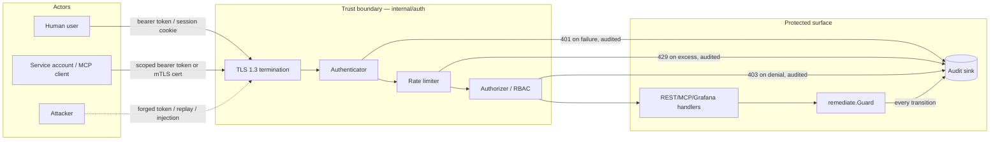
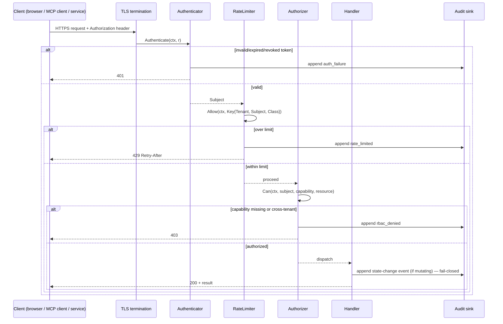

# X-SEC — Cross-Cutting Security

> **DRs applied:** DR-0, DR-3, DR-5, DR-20, DR-22, DR-23, DR-24, DR-25, DR-26, DR-27, DR-29, DR-37, DR-38 (register: `docs/architecture/06-decision-register.md`).

## 1. Purpose

X-SEC is not a feature engineers directly invoke; it is the trust boundary every other feature
sits inside. It defines TLS/mTLS posture, the bearer-token + RBAC model (`viewer` / `operator` /
`approver` / `admin`), where secrets may come from, the input-validation limits every ingest and
API path must enforce, rate limiting, the audit-event contract, prompt-injection defenses for the
LLM-driven RCA/NL loops, dependency supply-chain policy, and a STRIDE threat model. Because
TraceIQ's differentiator is an agent that can both read sensitive telemetry (F06/F07) and — with
approval — mutate customer infrastructure (F09), its security posture has to be load-bearing, not
decorative: every other feature doc in this catalog assumes `internal/auth` is enforced in front
of it.

## 2. Compared-tool drawbacks addressed (indirect support)

X-SEC does not close a feature gap on its own; it is the control layer that makes the gap-closing
features in F09/F06/F10 *trustworthy enough to actually turn on*. The catalog assigns it no direct
drawback ID; the drawbacks below are the ones whose fixes (owned by other features) would be
unsafe or incomplete without X-SEC's mechanisms.

| Drawback ID | Tool | Lagging feature | How X-SEC supports the fix (indirect) |
|---|---|---|---|
| D-X4 | All | Remediation stops at suggestion; no guardrail standards | F09's `approver`-only `Approve()` gate and hash-chained audit log are only as trustworthy as the identity behind "approver" — X-SEC's `Authorizer` independently re-resolves RBAC role server-side (never trusting a client-supplied role claim) and its `AuditEvent` sink is the same tamper-evident append-only mechanism F09 relies on. Without X-SEC, F09's guardrail is a UI convention, not a security boundary. |
| D-Y1 | Dynatrace | Black-box AI (Davis decisions not inspectable/tunable) | F06's transparency claim ("every hypothesis, query, and result is replayable") depends on the audit/log integrity guarantees X-SEC defines (append-only storage, hash-chaining pattern shared with F09) — an inspectable log that can be silently edited is not actually transparent. |
| D-D5 | Datadog | Agentic AI tied to the paid platform; silent eval-quality regressions | X-SEC's prompt-injection defenses (§4.4) and independent re-validation of any LLM-proposed action (never trusting model output as authorization) are what make F06/F10's LLM loop safe to run against real customer data and real remediation actions — without them, an agentic loop is an unbounded liability, not a feature. |
| D-D4 | Datadog | Alert noise out of the box | X-SEC's per-principal rate limiting on the NL chat and webhook-outbound paths (§3.1) bounds worst-case notification/paging volume from a misbehaving integration or automation loop, complementing F05's investigation-gated alerting design goal. |

## 3. Requirements

### 3.1 Functional (testable)

- **FR-XSEC-1**: All network listeners default to TLS **1.3** minimum; 1.2 is permitted only via
  an explicit per-listener `min_version: "1.2"` override, logged at WARN at startup and surfaced
  on `GET /v1/config`. Any listener bound to a non-loopback address MUST require TLS **and**
  `auth.mode != none`; violation is a startup `exit 2` (`01 §7`/`§8.1`, DR-26 §26.3 rule 1 — this
  is the rule that makes cleartext bearer tokens on a routable listener unrepresentable as a valid
  config, not merely undocumented).
- **FR-XSEC-2**: Every REST/MCP request other than `/healthz`, `/readyz`, and (optionally)
  `/metrics` MUST carry a valid bearer token or a verified mTLS client certificate. Requests
  failing authentication MUST receive `401` within 50 ms without invoking any business-logic
  handler. `AC-XSEC-1` (extended by DR-29 §29.3): the live route set equals `01 §6.1`'s table
  exactly, and every route resolves a principal before its handler runs.
- **FR-XSEC-3**: RBAC is a **capability matrix, not a hierarchy** (§4.4/§25.2 of the register);
  `admin ⊇ approver ⊇ operator ⊇ viewer` is deleted — a linear order silently gave every
  `approver` the `propose` capability, defeating separation of duty. Capability checks are
  evaluated by `auth.Authorizer.Can` from the server-resolved `auth.Subject`, never from a
  client-supplied field. **Who may execute a remediation action: `approver` or `admin`** — this
  settles the three-way split among `01 §8.2` (operator), the prior `F09 §4.3` (approver-or-admin)
  and this doc's prior `≥ approver` wording (DR-23 §23.5); `approver` holds no `propose`
  capability, so proposer and approver are structurally always different subjects.
- **FR-XSEC-4**: Secrets (LLM API key, kubeconfig, Slack signing secret, PagerDuty/OpsGenie key,
  audit anchor key, MCP token signing key) MUST be resolvable from at least `env` and `file`
  sources via the common `auth.SecretSource` interface, MUST never appear in logs or audit
  payloads, and MUST support rotation without a process restart (visible within 60 s).
- **FR-XSEC-5**: Request/ingest body size, spans-per-batch, span size, attribute count/size, and
  event/link count are governed by the single limits table owned by `01 §8.4` (DR-26 §26.4); this
  document declares no values of its own and cites that table.
- **FR-XSEC-6**: Rate limiting is per-`(tenant, subject, LimitClass)` via `auth.RateLimiter`,
  bounded to at most `auth.rate_limit.max_keys` (**65 536**) LRU-evicted buckets; per-class rates
  (API, ingest, NL, webhook, chat, MCP) are the single table owned by `01 §8.4` (DR-26 §26.4);
  this document cites it and declares no values of its own. Over-limit returns `429` with
  `Retry-After` (or JSON-RPC `-32000` for MCP).
- **FR-XSEC-7**: Content not authored by TraceIQ's own code — telemetry, logs, chat, stored
  memory, imported runbooks, deploy metadata — is delimited as `<untrusted k="{class}"
  c="{canary}">…</untrusted …>` before it reaches a prompt (`01 §8.6`, normative; DR-37 §37.1),
  never concatenated into the system/instruction role. A canary appearing in model output outside
  a legal position discards the output and, after two violations in one investigation, swaps the
  reasoner to `rules` (DR-34). Any LLM-proposed remediation action MUST be re-validated by
  `remediate.Guard`'s independent allowlist/RBAC/budget checks and re-resolved against live
  topology (F09, DR-22 §22.3) regardless of what the model output claims about its own
  authorization; no model-authored string ever reaches the cluster (DR-22 §22.1).
- **FR-XSEC-8**: Every RBAC denial, authentication failure, secret rotation, tenant-config change,
  and remediation state transition MUST emit an `AuditEvent` to `auth.AuditSink.Append`, which is
  **fail-closed**: an append error refuses the triggering operation, never merely logs it. The
  chain is hash-linked per `§4.2`'s formula (DR-27 §27.1) and retained per the tenant's audit
  policy — default **2555 d**, per-tenant override no lower than **365 d** (DR-25 §25.3; the prior
  365 d default is deleted).
- **FR-XSEC-9**: CI MUST run `govulncheck` (rebuilt under `go1.27.1`, ≥ `v1.1.4`) and
  dependency license/SBOM checks on every merge to `main`/release branches; a build with any
  reachable vulnerability in a *direct* dependency MUST fail the pipeline — there is no
  expiring-allowlist suppression path (DR-1).
- **FR-XSEC-10**: Inbound webhook endpoints (Slack/Teams slash-commands, PagerDuty/OpsGenie test
  hooks) MUST verify the source-specific signature/secret (Slack: `X-Slack-Signature` +
  timestamp ≤ 300 s; Teams: bot-framework JWT; PagerDuty/OpsGenie: shared webhook secret) **and**
  then resolve `(platform, workspace_id, platform_user_id)` through `auth.IdentityStore` to a
  provisioned `Subject` before any downstream handler executes — an HMAC signature is an
  authenticity control, never an authorization control (DR-25 §25.4). An unmapped user gets
  `403 identity_not_bound` and an audit row.
- **FR-XSEC-11**: For a corpus of ≥ 40 injected payloads, zero tool calls differ in their
  arguments from the same investigation run over a sanitized copy of the same telemetry
  (DR-37 §37.2; `AC-XSEC-4a`).
- **FR-XSEC-12**: Zero `ActionProposal`s differ in `Type`, `Target` or the typed spec between the
  injected and sanitized runs (DR-37 §37.2; `AC-XSEC-4b`).
- **FR-XSEC-13**: Zero canary leaks; a deliberately leaking stub reasoner is detected and swaps
  the reasoner to `rules` (DR-37 §37.2; `AC-XSEC-4c`).
- **FR-XSEC-14**: An injection persisted into memory in investigation A is provenance-tagged,
  re-wrapped on retrieval in investigation B, and cannot by itself move `Confidence` to
  `rca.confidence_threshold` (DR-37 §37.2, DR-19 §19.5; `AC-XSEC-4d`).
- **FR-XSEC-15**: Every model-authored narrative rendered in an approval surface carries an
  explicit *untrusted, model-authored* marker and is displayed beside the Guard-reconstructed
  payload, never the reverse (DR-37 §37.2; `AC-F12-11`).

### 3.2 Non-functional

- **Performance**: authentication + authorization overhead adds < 1 ms p50 to request latency
  (in-process opaque-token lookup / cached mTLS chain validation; no synchronous external call on
  the hot path for token validation). `01 §8`'s opaque `tiq_<tokenID>_<secret>` token, argon2id
  at rest, is canonical — there is no JWT model (DR-25 §25.3).
- **Memory bound**: `auth.RateLimiter`'s per-key token-bucket state is an LRU of at most
  `auth.rate_limit.max_keys` (**65 536**) `golang.org/x/time/rate.Limiter` values, with
  `traceiq_auth_ratelimit_keys_evicted_total` (DR-25 §25.5), so it cannot be used as a
  memory-exhaustion vector.
- **Auditability**: audit sink write is durable (`fsync`) before the triggering API call returns
  2xx for any state-changing endpoint.
- **Supply chain**: 100% of direct dependencies pinned to exact versions; SBOM (CycloneDX or
  SPDX) generated per release artifact.

## 4. Design

### 4.1 Component diagram

```mermaid
flowchart TB
    subgraph Edge["Every network entrypoint"]
        API[api.Server REST/MCP/Grafana]
        WH[Inbound webhooks: Slack/Teams/PagerDuty]
        ING[ingest.Receiver OTLP/Jaeger/Zipkin]
    end

    subgraph AuthPkg["internal/auth"]
        AUTHN[Authenticator<br/>opaque bearer token / mTLS / webhook signature + principal]
        AUTHZ[Authorizer<br/>RBAC role hierarchy check]
        SECSRC[SecretSource<br/>env | file | K8s Secret]
        RL[Rate limiter<br/>per-principal token bucket]
        AUDIT[Audit sink<br/>append-only, hash-chained]
    end

    subgraph Consumers["Every other feature package"]
        REMEDIATE[remediate.Guard — F09]
        RCA[rca.Engine — F06]
        NL[nl.Interpreter/Answerer — F10]
        STORE[store.Store — F03]
    end

    API --> AUTHN --> AUTHZ
    WH --> AUTHN
    ING --> RL
    API --> RL
    AUTHN --> SECSRC
    AUTHZ --> AUDIT
    REMEDIATE --> AUDIT
    RCA -->|prompt-injection guarded tool calls| NL
    NL --> AUTHZ
    STORE --> RL
```

### 4.2 Data model

Per-package interfaces and shared types are owned by the register (DR-25 §25.1), mirrored into
`02 §4`; this section cites them verbatim rather than re-declaring. Copied verbatim from
`06-decision-register.md` DR-25 §25.1:

```go
package auth

type Role string
const ( RoleViewer Role = "viewer"; RoleOperator Role = "operator"; RoleApprover Role = "approver"; RoleAdmin Role = "admin" )

type SubjectKind uint8
const ( SubjToken SubjectKind = 1; SubjOIDC = 2; SubjMTLS = 3; SubjChat = 4; SubjInternal = 5 )

type Subject struct {
    ID        string          // "tok_<id>" | "oidc:<sub>" | "mtls:<cn>" | "rca:<investigationID>"
    Tenant    model.TenantID
    Roles     []Role
    Scopes    []string        // "ingest" is a SCOPE, never a role
    Kind      SubjectKind
    ChatRef   *ChatIdentity
    IssuedAt, ExpiresAt time.Time
}
type Principal = Subject       // X-SEC's auth.Principal becomes an alias for one release, then is deleted

type LimitClass uint8
const ( LimitIngest LimitClass = 1; LimitAPI = 2; LimitNL = 3; LimitWebhook = 4; LimitChat = 5; LimitMCP = 6 )
type Key struct { Tenant model.TenantID; Subject string; Class LimitClass }

type ChatIdentity struct { Platform, WorkspaceID, PlatformUserID string }
type IdentityBinding struct {
    Platform, WorkspaceID, PlatformUserID string
    SubjectID string
    Tenant    model.TenantID
    CreatedBy string
    CreatedAt time.Time
    Disabled  bool
}
```

`Resource` becomes `ResourceRef` (kind, tenant, id), passed to `Authorizer.Can`, not `Allow`
(§4.3). The prior `Principal.Roles`-as-hierarchy comment and the `roleRank` map are **deleted**:
RBAC is the capability matrix in §4.4, not a linear order (DR-25 §25.2).

**Audit event and hash chain — owned by this document (DR-27 §27.1), verbatim:**

```
LP(x)  = uint32be(len(x)) ‖ x
H(0)   = SHA256( "traceiq.audit.v1" ‖ LP("genesis") ‖ LP(tenantID) )
H(n)   = SHA256( "traceiq.audit.v1" ‖ LP(H(n−1)) ‖ LP(uint64be(seq)) ‖ LP(uint64be(tsUnixNano)) ‖ LP(canonicalJSON(row_without_hash)) )
canonicalJSON = RFC 8785 (JCS)
```

The actor, event type, subject, tenant, resource and outcome are **inside `row_without_hash`**,
covered directly by the hash. The prior separate `PayloadHash` preimage — whose canonicalisation
was undefined — is **deleted**; length-prefixing removes the collision ambiguity of bare `‖`
concatenation. `01 §5.1` and `F09 §4.2` cite this formula and declare no formula of their own.

```sql
CREATE TABLE audit_anchor (
  tenant_id TEXT NOT NULL, seq INTEGER NOT NULL, hash TEXT NOT NULL,
  at INTEGER NOT NULL, signature BLOB NOT NULL, sink TEXT NOT NULL,
  PRIMARY KEY (tenant_id, seq)
) WITHOUT ROWID;
```

Every `auth.audit.anchor_interval` (**5 m**) and at shutdown, the appender writes a **signed
checkpoint** `{tenant, seq, hash, at}` — Ed25519, key from `auth.SecretSource` — to a destination
the TraceIQ process cannot rewrite (`file` | `object_lock` | `syslog`; `file` is dev-only and a
`prod`-profile startup **warning**, surfaced as `audit_anchor_weak: true` on `GET /v1/config`).
`VerifyChain` compares the live chain against the last anchor, so an offline full-chain recompute
is detected — an unkeyed chain alone is a corruption detector, not an anti-tamper one (DR-27 §27.3).

### 4.3 Interfaces & APIs

Copied verbatim from DR-25 §25.1 (the sole owner; mirrored into `02 §4`):

```go
package auth

type Authenticator interface {
    Authenticate(ctx context.Context, r *http.Request) (Subject, error)
    AuthenticateChat(ctx context.Context, p ChatRequest) (Subject, error)
    Close() error
}

type Authorizer interface {
    Can(ctx context.Context, s Subject, c Capability, res ResourceRef) error
    SeparationOfDuty(proposer, approver string) error
    Roles(s Subject) []Role
}

type RateLimiter interface {
    Allow(ctx context.Context, k Key) (Decision, error)
    Close() error
}

type AuditSink interface {
    Append(ctx context.Context, e Event) (Receipt, error)   // FAIL-CLOSED: an error refuses the operation
    Query(ctx context.Context, tid model.TenantID, f Filter) ([]Event, string, error)
    VerifyChain(ctx context.Context, tid model.TenantID, from, to int64) (VerifyReport, error)
    Anchor(ctx context.Context, tid model.TenantID) (Anchor, error)   // DR-27
}
type AuditLog = AuditSink       // 02's name; X-SEC's AuditSink and F09's private chain are the same component

type SecretSource interface {
    Get(ctx context.Context, ref string) ([]byte, error)              // "env:NAME" | "file:/path"
    Watch(ctx context.Context, ref string) (<-chan []byte, error)     // rotation visible within 60s
}

type EgressDialer interface {
    DialContext(ctx context.Context, network, addr string) (net.Conn, error)
    HTTPClient(timeout time.Duration) *http.Client                    // the ONLY http.Client factory (DR-20)
}

type IdentityStore interface {
    Resolve(ctx context.Context, platform, workspaceID, platformUserID string) (Subject, error)
    Put(ctx context.Context, b IdentityBinding, by Subject) error
    List(ctx context.Context, tid model.TenantID) ([]IdentityBinding, error)
    Delete(ctx context.Context, tid model.TenantID, platform, workspaceID, platformUserID string, by Subject) error
}
```

`EgressDialer.HTTPClient` is the **only** `http.Client` factory in the system (DR-20 §20.3): no
adapter under `internal/correlate`, `internal/llm`, `internal/k8s` or `internal/api/chat`
constructs its own client — `internal/archtest` fails the build on `http.DefaultClient`,
`http.Get/Post/Head`, `net.Dial(Timeout)`, or an `http.Client{…}` composite literal in those
packages. It enforces `01 §8.7` in full: host allowlist, DNS pinned per connection against
rebinding, redirects not followed, and `169.254.169.254` refused unconditionally in every mode.

**Config keys** (`01 §7` is the sole owner; this document cites key paths, not values):
`auth.tls.min_version`, `auth.rate_limit.max_keys`, `auth.audit.enabled`, `auth.audit.path`,
`auth.audit.hash_chain`, `auth.audit.anchor_interval`, `auth.audit.anchor_sink`,
`auth.audit.anchor_dir`, `auth.audit.anchor_object_prefix`, `auth.audit.anchor_key_ref`,
`auth.audit.retention_days`. The opaque bearer token model (`tiq_<tokenID>_<secret>`,
`expires_at`, `revoked_at`) replaces the prior short-TTL JWT model and `auth.token_ttl` in full
(DR-25 §25.3); a revoked token is `401` on the **next** request, not at TTL expiry.

### 4.4 The RBAC matrix — the single table every document cites

Roles are a **capability matrix, not a hierarchy** (DR-25 §25.2). Copied verbatim:

| Capability | viewer | operator | approver | admin |
|---|:--:|:--:|:--:|:--:|
| `telemetry:read` (traces, spans, RED, topology, services) | ✅ | ✅ | ✅ | ✅ |
| `incident:read` | ✅ | ✅ | ✅ | ✅ |
| `incident:investigate` | — | ✅ | — | ✅ |
| `incident:suppress` | — | ✅ | — | ✅ |
| `investigation:read` (steps, evidence, export) | ✅ | ✅ | ✅ | ✅ |
| `investigation:replay` | — | ✅ | — | ✅ |
| `investigation:correct` | — | ✅ | ✅ | ✅ |
| `investigation:abort` | — | ✅ | — | ✅ |
| `memory:read`, `memory:export` | ✅ | ✅ | ✅ | ✅ |
| `memory:write` (import, delete) | — | — | — | ✅ |
| `sampler:interest:write` | — | ✅ | — | ✅ |
| `remediation_action:propose` | — | ✅ | **—** | ✅ |
| `remediation_action:approve`, `:reject` | — | — | ✅ | ✅ |
| `remediation_action:execute` | — | — | ✅ | ✅ |
| `remediation_action:budget_override` | — | — | — | ✅ |
| `audit:read`, `audit:verify` | — | — | — | ✅ |
| `config:read` | — | — | — | ✅ |
| `tenant:read`, `tenant:write` | — | — | — | ✅ |
| `identity:bind` | — | — | — | ✅ |
| `eval:run` | — | — | — | ✅ |
| `eval:read` | ✅ | ✅ | ✅ | ✅ |
| `nl:ask` | ✅ | ✅ | ✅ | ✅ |
| `mcp:connect` | ✅ | ✅ | ✅ | ✅ |

Consequences recorded explicitly (DR-25 §25.2): an **approver cannot propose**, so separation of
duty is structural; an **operator cannot approve or execute**; **`audit:read` is admin**. A
"viewer-redacted audit projection" may be added later only with a documented need.

### 4.5 Algorithms / decision logic

**Authentication + authorization dispatch (applied by every handler in F12's `api.Server`)**

```
function Middleware(next):
    return handler(w, r):
        subject, err = Authenticator.Authenticate(ctx, r)
        if err != nil:
            AuditSink.Append(Event{Type: "auth_failure", Detail: {path: r.URL.Path, method: authMethodAttempted(r)}})
            return 401
        decision, err = RateLimiter.Allow(ctx, Key{Tenant: subject.Tenant, Subject: subject.ID, Class: classForRoute(r)})
        if err != nil or not decision.Allowed:
            w.Header["Retry-After"] = decision.RetryAfter
            return 429
        capability = routeToCapability(r.Method, r.URL.Path)  // e.g. "remediation_action:approve"
        if err = Authorizer.Can(ctx, subject, capability, resourceFromRequest(r)):
            AuditSink.Append(Event{Type: "rbac_denied", ActorID: subject.ID, Detail: {capability}})
            return 403
        r.Context = withSubject(r.Context, subject)
        return next(w, r)

function Authorizer.Can(ctx, s, c, res):
    if s.Tenant != res.TenantID and res.TenantID != "": return ErrCrossTenant
    if !matrix[c].allows(s.Roles): return ErrForbidden   // §4.4's capability matrix, not a rank comparison
    return nil
```

### 4.6 Chat identity binding (DR-25 §25.4, normative)

> **An HMAC signature is an authenticity control, never an authorization control.**

An inbound chat request is authenticated only after `(platform, workspace_id, platform_user_id)`
resolves through `auth.IdentityStore` to a provisioned `Subject`. An unmapped user gets
**`403 identity_not_bound`** and an audit row. Approval-capable interactions are further
restricted to the channel IDs in `tenant.Policy.ChatBinding`.

```sql
CREATE TABLE identity_binding (
  tenant_id TEXT NOT NULL, platform TEXT NOT NULL, workspace_id TEXT NOT NULL,
  platform_user_id TEXT NOT NULL, subject_id TEXT NOT NULL,
  created_by TEXT NOT NULL, created_at INTEGER NOT NULL, disabled INTEGER NOT NULL DEFAULT 0,
  PRIMARY KEY (tenant_id, platform, workspace_id, platform_user_id)
) WITHOUT ROWID;
```

Admin endpoints `POST /v1/identities`, `GET /v1/identities`, `DELETE /v1/identities/{id}`
(`01 §6.1`, DR-29). Every row elsewhere in the document set reading "signature-verified, no RBAC
role" becomes **"signature-verified and principal-resolved; RBAC per §4.4"** — that string
appears nowhere in this document set.

**`AC-XSEC-7`** — route enumeration asserts no endpoint reaches a handler on signature alone.
**`AC-XSEC-8`** — a signed Slack approve from (i) an unmapped user → `403` + audit, (ii) a
mapped `viewer` → `403` + audit, (iii) a mapped `approver` → `200`.

### 4.7 Prompt-injection defense (DR-37 §37.1, normative in `01 §8.6`; this section cites it)

`01 §8.6` is the sole owner of the mechanism; `F06 §4.4` cites it too. Every string not authored
by TraceIQ's own code — telemetry, logs, chat, stored memory, imported runbooks, deploy metadata —
is wrapped, never merely placed in a `tool_result` role:

```
type UntrustedKind uint8
const ( UntrustedTelemetry UntrustedKind = 1; UntrustedLog = 2; UntrustedMemory = 3
        UntrustedUserQuestion = 4; UntrustedRunbook = 5; UntrustedDeployMetadata = 6 )
```

`<untrusted k="{class}" c="{canary}"> … escaped … </untrusted k="{class}" c="{canary}">`, where
`{canary}` is 16 random hex bytes per investigation and the escaping neutralises `<`, `>` and any
literal occurrence of the canary inside the payload. A canary appearing in model output outside a
legal position discards the output (`Verdict = schema_error`, `traceiq_rca_canary_violation_total`
increments); two violations in one investigation swap the reasoner to `rules` (DR-34).
`rca.SchemaValidator` rejects unknown fields, extra keys and any value outside a closed enum —
there is no best-effort parse.

```
function buildLLMRequest(systemInstructions, toolResults, userText):
    messages = [
        {role: "system", content: systemInstructions},          // fixed, never includes external content
        {role: "user", content: wrapUntrusted(userText, UntrustedUserQuestion, canary)},
    ]
    for tr in toolResults:
        messages.append({role: "tool_result", content: wrapUntrusted(tr.Data, tr.Kind, canary), tool_call_id: tr.ID})
    return messages

function afterLLMResponse(response, canary):
    if canaryLeaked(response, canary): swapReasonerToRules(); return fallback()
    parsed, err = SchemaValidator.Validate(response.StructuredOutput)  // strict, closed schema
    if err != nil: return fallback()  // never execute on unvalidated output
    if parsed contains a remediation action proposal:
        # the LLM can only ever *propose* a model.ActionProposal — the Guard reconstructs the
        # cluster-bound payload itself from typed fields (DR-22); no model-authored string ever
        # reaches the cluster, and the proposal narrative is display-only
        remediate.Guard.Propose(ctx, tid, toActionProposal(parsed), subject, idempotencyKey)
    return renderInertMarkdown(parsed.Narrative, untrustedMarker=true)  // never re-parsed as commands
```

### 4.4a STRIDE threat model — per-component detail

| Component | Spoofing | Tampering | Repudiation | Info. Disclosure | DoS | Elevation of Privilege |
|---|---|---|---|---|---|---|
| Ingest (`internal/ingest`) | Forged OTLP source | Span attribute injection to poison downstream RCA | No per-span provenance by default | Sensitive data in span attributes over-retained | Oversized/high-rate batch flood | N/A (no auth escalation surface) | 
| — mitigation | mTLS/token per collector agent, `ingest.auth.mode` (DR-26) | attribute cap + span/batch caps, owned by `01 §8.4` (FR-XSEC-5) | optional span-level source tagging (tenant + ingest-token id) | attribute redaction policy + retention tiers (F03) | rate limiter (FR-XSEC-6) + `MaxBytesReader`, owned by `01 §8.4` | — |
| API/MCP (`internal/api`) | Stolen/forged bearer token | Request body tamper (network) | Missing audit trail for a state change | Over-broad `viewer` read scope | Connection-count exhaustion | RBAC bypass via client-supplied role claim |
| — mitigation | opaque token + `expires_at`/`revoked_at`, mTLS option (FR-XSEC-1/2) | TLS 1.3 in transit; server-side re-validation of all state (FR-XSEC-3) | FR-XSEC-8 audit-on-every-mutation, fail-closed | tenant-scoped queries enforced in `Authorizer.Can` cross-tenant check | connection-budget 503 (F12 §5) | server-resolved `Subject.Roles` against the §4.4 capability matrix, never trusts client input |
| Remediation (`internal/remediate`) | Forged approver identity (Slack/API) | Kubeconfig/action param injection | Audit entry deleted/edited to hide an action | Snapshot data disclosure (may contain secrets) | Budget-exhaustion DoS against legitimate incidents | LLM output treated as self-authorizing |
| — mitigation | Slack signature + `IdentityStore` principal resolution (DR-25 §25.4) | argv-array exec, per-type param regex, no shell (F09, DR-24) | hash-chained append-only audit (§4.2, shared with F09) | Snapshot secret redaction before persistence (F09 §6) | per-incident budget counting attempted mutations + `admin`-only override (DR-23 §23.6) | Guard independently re-validates every proposal, re-resolves the target (FR-XSEC-7, DR-22 §22.3) |
| LLM reasoning loop (F06/F10) | Impersonated tool result | Prompt injection via span/log/chat content | Non-replayable reasoning | Raw span dump leaked into model context | Runaway loop (token/time) | Model-originated "authorize" claim accepted at face value |
| — mitigation | delimited-untrusted wrapping with per-investigation canary (§4.7) | closed tool set, typed arguments, semantic validation (DR-16); canary + schema validation (§4.7) | F06 replayable investigation log (shared audit approach, DR-18) | structured tool-calling only, no raw span dumps, closed `project` allowlist (DR-16) | per-investigation token/time/cost budget (DR-17) | independent Guard re-validation, no model-authored payload reaches the cluster (FR-XSEC-7, DR-22) |

### 4.4b STRIDE — one row per feature package (DR-37 §37.3, mandatory; a doc without this row fails docs CI, DR-38 §38.4)

| Package / surface | Threat | Mitigation |
|---|---|---|
| `store` / F03 | Information disclosure (cross-tenant read), Tampering (retention bypass), DoS (disk exhaustion) | DR-5, DR-6, DR-7, DR-12 |
| `sampler` / F02 | DoS (rare-path retention amplification, predicate abuse) | DR-10, DR-11 |
| `memory` / F08 | Tampering (memory poisoning) | DR-19 §19.5 |
| `correlate` / F07 | Information disclosure (cross-tenant logs), SSRF | DR-20 |
| `eval` / F11 | Elevation (unguarded cluster mutation) | DR-36 §36.7 |
| Deploy webhook | Spoofing (forged deploy markers steering RCA and the deploy rule) | DR-25 (HMAC + principal), DR-29 (idempotency) |
| `topology` / F04 | DoS (edge-table cardinality exhaustion) | DR-13 |
| Chat identity | Spoofing / Elevation (signature treated as authorization) | DR-25 §25.4 |
| `k8s` / F09 executor | Elevation (argv/flag injection) | DR-24 |
| `rca` / F06 | Tampering (prompt injection), DoS (cost) | DR-16, DR-17, DR-37 |

### 4.8 Threat model & auth flow diagrams





## 5. Failure modes & mitigations

| Failure | Detection | Mitigation |
|---|---|---|
| Secret rotation misses a running process | `SecretSource.Watch` channel silent / stale value used past rotation | Rotation visible within 60 s even if `Watch` is unsupported by a given source; health check flags "secret age" beyond a threshold |
| Rate limiter memory unbounded under a distributed-identity flood | Active-key count metric crosses cap | LRU eviction beyond `auth.rate_limit.max_keys` (**65 536**, DR-25 §25.5); `traceiq_auth_ratelimit_keys_evicted_total`; evicted keys re-enter cold (safe, just less precise short-term) |
| Audit sink itself becomes unavailable | `AuditSink.Append` returns error | State-changing handlers MUST fail closed (return 5xx, not proceed) if the audit write fails — no mutation without an audit record (DR-27) |
| Cross-tenant data leak via a missing tenant check on a new endpoint | Contract test asserting every handler's `ResourceRef.TenantID` is set | CI test enumerates all registered routes and asserts each calls `Authorizer.Can` with a non-empty tenant for tenant-scoped resource kinds (`internal/archtest`, DR-5) |
| Dependency CVE lands between releases | `govulncheck` scheduled nightly in addition to per-merge, rebuilt under `go1.27.1` | Nightly run opens a tracked issue automatically; per-merge gate blocks new code from shipping on top of a known-exploitable direct dependency — no suppression allowlist exists (DR-1) |
| Prompt-injection payload embedded in a log line reaches the LLM despite truncation | Eval harness (F11) adversarial-payload regression scenarios | Delimited-untrusted wrapping + canary + schema-validated output (§4.7) means even a payload that survives the attribute cap can't change tool-call content or leak a canary undetected |
| An unmapped chat user attempts an approval | Every chat interaction resolves through `IdentityStore` before dispatch | `403 identity_not_bound` + audit row; no fallback to signature-only trust (DR-25 §25.4) |

## 6. Security considerations

(This document *is* the security-considerations layer for the rest of the catalog; the notes below
cover X-SEC's own residual risks.)

- The opaque bearer token (`tiq_<tokenID>_<secret>`, argon2id at rest) is the canonical identity
  credential; there is no signing key to rotate because there is no JWT (DR-25 §25.3). Revocation
  is `revoked_at`, checked on every request — a revoked token is `401` on the **next** request, not
  at TTL expiry.
- mTLS client certificate validation checks the full chain against a configured CA bundle and
  checks revocation (CRL or OCSP) where the deployment's CA supports it; certs are not accepted on
  expiry or subject-name mismatch alone being "close enough."
- The STRIDE table (§4.4a/§4.4b) is a **mechanical CI gate**, not a review-process promise: a
  feature doc with no `X-SEC §4.4` row fails the docs build (DR-37 §37.3, DR-38 §38.4). The
  control had already been violated by features that landed alongside the original prose version
  of this promise, which is why it is now enforced mechanically.

## 7. Test strategy & acceptance criteria

**Unit tests**
- RBAC matrix: every `(role, capability)` pair in §4.4's table asserted allow/deny correctly —
  there is no rank comparison to test at a boundary, since the matrix has none.
- Input validation boundaries: cited from `01 §8.4`'s limits table (owned there); this doc's own
  test is that its documented values match the generated `defaults.md` fixture (DR-38 §38.4).
- `SecretSource` fallback and rotation: value changes propagate within 60 s across `env` and
  `file` implementations.
- Prompt-injection content-equivalence corpus (DR-37 §37.2): ≥ 40 adversarial payloads produce
  zero tool-call argument differences (`AC-XSEC-4a`) and zero `ActionProposal` differences
  (`AC-XSEC-4b`) versus a sanitized-copy run; zero canary leaks (`AC-XSEC-4c`).
- Audit hash-chain verification: single-entry tamper detected at exactly that `seq`; an offline
  full-chain recompute is detected via anchor mismatch; 4 writers × 1 000 appends produce a
  strictly monotonic `seq` with no forks (DR-27 §27.4).

**Integration tests**
- mTLS handshake against a test CA (valid cert accepted, expired/wrong-SAN cert rejected).
- Slack signature verification: valid, invalid, and replayed (stale timestamp) requests; identity
  resolution for mapped vs. unmapped users (`AC-XSEC-8`).
- Rate-limit 429 behavior under sustained load exceeding the configured bucket, per `LimitClass`.
- Cross-tenant isolation: subject from tenant A requesting tenant B's resource ID returns 403 in
  100% of endpoint contract tests.
- `govulncheck`/SBOM CI gate: a deliberately vulnerable pinned dependency fails the pipeline in a
  controlled test repo.
- Route enumeration: the live route set equals `01 §6.1` exactly, and no route is reachable on an
  HMAC signature alone (`AC-XSEC-1`, `AC-XSEC-14`).

**Acceptance criteria**

| AC | Maps to | Statement |
|---|---|---|
| AC-XSEC-1 | FR-XSEC-2 | Every non-exempt endpoint returns 401 for a missing/invalid token, and the live route set equals `01 §6.1` exactly, in a full-route enumeration test. |
| AC-XSEC-2 | FR-XSEC-3 | Capability matrix test (role × capability) passes for all defined capabilities with zero false-allows; an approver cannot propose. |
| AC-XSEC-3 | FR-XSEC-5 | Boundary fuzz corpus (body size, span count, attribute length) is rejected/truncated exactly at `01 §8.4`'s documented limits. |
| AC-XSEC-4a–d | FR-XSEC-11…14 | Prompt-injection content-equivalence corpus (≥ 40 payloads): zero tool-call arg diffs, zero `ActionProposal` diffs, zero canary leaks, cross-investigation memory poisoning cannot move `Confidence` past threshold. |
| AC-XSEC-5 | FR-XSEC-9 | CI pipeline fails when a direct dependency with a known-exploitable CVE is introduced in a test branch. |
| AC-XSEC-6 | — (DR-29 §29.3) | A viewer-scoped MCP token calls every read tool successfully and is refused `traceiq_start_investigation` with JSON-RPC `-32000`. |
| AC-XSEC-7 | FR-XSEC-10 | Route enumeration asserts no endpoint reaches a handler on signature alone. |
| AC-XSEC-8 | FR-XSEC-10 | A signed Slack approve from an unmapped user, a mapped viewer, and a mapped approver returns `403`, `403`, `200` respectively. |
| AC-XSEC-9…12 | FR-XSEC-8 | Audit chain: tamper detected at exact `seq`; offline rewrite detected via anchor mismatch; concurrent-writer monotonic `seq`; viewer gets `403` on `/v1/audit`. |
| AC-XSEC-13 | FR-XSEC-8 | Control writer: ≥ 200 tx/s, p99 audit append ≤ 15ms, independent of `store.hot.sqlite.batch_interval` (DR-6 §6.2 writer budget; formerly cited as the undefined `AC-XSEC-11` — defined here, beside the other audit-chain criteria). |
| AC-XSEC-14 | FR-XSEC-2 | No endpoint is reachable on an HMAC signature alone. |

## 8. Open questions / risks

- OCSP/CRL availability varies by customer CA infrastructure; mTLS revocation checking may need to
  degrade gracefully (log + alert) rather than hard-fail when the revocation endpoint itself is
  unreachable — policy not yet finalized.

(Token revocation before natural TTL expiry is deleted as an open question: `01 §8`'s opaque
`tiq_<tokenID>_<secret>` model already carries an explicit `revoked_at`, checked on every
request — DR-25 §25.3. The STRIDE-completeness question is likewise closed: §4.4b now carries the
mandatory one-row-per-package table, and a doc missing it fails docs CI rather than relying on a
tracked follow-up — DR-37 §37.3, DR-38 §38.4.)
